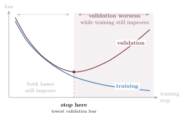

# Print revisions carried into the HTML edition (ledger of 2026-10-05)

The Springer print edition's language revisions, read from the print workspace's
`reports/html-ledger.json` and carried into this edition on branch `print-revisions-2026-10`.
Part 1 lists every changed passage between `9e35241` and `7aeab7d`, original beside new, from the
real diff. **Source** names the commit that wrote the new text (a chapter's unit, the notation
commit, the cross-chapter consistency commit, or the house-rules commit) and the unit's applied
ledger entries whose replacement shares a five-word run with the row; rows from code cells are
marked *code* (comments and drawn figure labels only). Part 2 gives every ledger entry's
decision and reason. The house rules the pass applied are VOICE.md D12.

575 rows in Part 1. Ledger decisions: 538 applied, 19 superseded, 43 declined, 3 needs-author, 1 done-on-main, 581 n/a.

## Part 1: every changed passage

### Preface and front matter (9)

`index.qmd`

| Where | Original | Now | Source |
|---|---|---|---|
| Why now | The ingredients of this book are decades old: linear maps, nonlinear bends, gradient descent, and likelihood-based losses. Three things changed around them. 1. **Scale became a design decision.** Across the regimes measured so far, the same architecture given more parameters, data, and compute improves predictably, and it sometimes acquires behaviors nobody programmed. Engineered systems rarely behave that way, which is why scaling laws are an architectural topic in this book rather than an operational footnote. 2. **We stopped training from scratch.** A representation is pretrained once on broad data and then adapted cheaply, many times. 3. **One representation space serves many senses.** Text, images, and audio are mapped into shared vector spaces and compared with the same geometric operations. None of this required a new kind of mathematics. It required a small set of moves, and hardware that makes one of them very fast: the batched general matrix multiplication (GEMM). A dense layer applied to a batch of $B$ examples is one GEMM followed by an elementwise bend: $$ \matr{Z} = \featurepart{\matr{X}}\,\parameterpart{\matr{W}}^{\top} + \vect{1}\,\parameterpart{\vect{b}}^{\top}, \qquad \matr{H} = \sigma(\matr{Z}), $$ where $\featurepart{\matr{X}}\in\R^{B\times D_{\mathrm{in}}}$ holds one example per row and $\parameterpart{\matr{W}}\in\R^{D_{\mathrm{out}}\times D_{\mathrm{in}}}$ is stored the way PyTorch stores it. From convolution to attention, most of the arithmetic in this book's models is spent in products like this one. The systems in the headlines are not an adjacent subject: they are this subject, scaled. | For many readers trained in statistics, the foundational lesson was to keep the model small relative to the data. Too many adjustable parameters would fit noise as readily as signal, and high-dimensional estimation demanded defensive care. Deep learning steps squarely into the regime classical intuition warned against: overparameterized models with millions or billions of parameters, optimized across vast, non-convex loss landscapes. Yet on unseen data, these models routinely generalize. Hardware specialized for matrix multiplication makes this regime accessible. Linear algebra organizes the computation into operations that accelerators execute with high efficiency, while backpropagation computes exact gradients for all those parameters in a single reverse sweep. The deeper surprise, however, is that additional capacity can improve out-of-sample prediction. In many measured regimes, increasing parameters, data, and compute in a balanced ratio produces continuing power-law reductions in held-out loss. Generalization need not collapse when a network interpolates its training sample. Architecture, data distribution, and training dynamics still govern success, but parameter count alone no longer marks where useful learning must stop. We will encounter this surprise in @sec-06-generalization-inductive-bias and fit its empirical scaling laws in @sec-16-vit-scaling. A complete theoretical accounting of why high-dimensional learners generalize remains an active research frontier. Our task here is to understand the mechanics: how to design the architecture, how to wire the computation, and how to audit what it has learned. As my math PhD advisor used to remind me: *sometimes you just have to follow your nose.* When a model or an objective feels overwhelming, you do not wait for an epiphany. You pick up a pencil, work through the derivations line by line, check the shapes, and trust the mathematical mechanics to carry you forward. The intuition is earned through the work, not before it. Understanding the computation should make its success more interesting, not make that success seem inevitable. | preface, cross-chapter consistency |
| Open the hood | - **Forward, left to right.** Data flows through linear maps, one batched GEMM per layer, each followed by a nonlinear bend. - **Backward, right to left.** Reverse-mode differentiation carries the loss's sensitivity back to every parameter, one vector–Jacobian product per layer. - **The design goal.** As much representational power as possible from as few parameters as possible, obtained by building the data's known structure into the architecture. | - **Forward, left to right.** Data flows through linear maps, one batched matrix multiplication (GEMM) per layer, each followed by a nonlinear bend. - **Backward, right to left.** Reverse-mode differentiation carries the loss's sensitivity back to every parameter, one vector–Jacobian product per layer. - **The design goal.** As much representational power as possible from as few parameters as possible, obtained by building the data's known structure into the architecture. | preface |
| Who this book is for | *(deleted)* | ## Who this book is for {.unnumbered} This book is for builders and auditors: engineers[, students,]{.content-hidden when-profile="press"} and researchers who want to understand deep learning well enough to implement it from scratch, diagnose why it fails, and evaluate its claims with clear eyes. You do not need previous deep learning experience, but working fluency with multivariable calculus, linear algebra, basic probability, and standard Python will let you focus on the architecture rather than the background math. The opening chapters revisit the necessary optimization and loss mechanics, while the appendices provide self-contained reference contracts: linear algebra and the SVD ([Appendix A](chapters/appendices/a1-linear-algebra.qmd)), tensors and PyTorch layout ([Appendix B](chapters/appendices/a2-tensors.qmd)), numerical precision and the Roofline model ([Appendix C](chapters/appendices/a3-precision-performance.qmd)), notation ([Appendix D](chapters/appendices/a4-notation.qmd)), and statistical learning contracts ([Appendix E](chapters/appendices/a5-statistical-learning.qmd)). While our executable code uses PyTorch, the principles are strictly framework-independent. Tensor shapes, vector–Jacobian products, memory hierarchies, and broadcasting rules apply identically whether you write PyTorch, JAX, or TensorFlow. (And should you prefer another dialect, modern AI coding assistants are remarkably adept at translating clean syntax.) | preface |
| How to read this book | Every chapter follows one loop: | Use the same loop throughout: | preface |
| How to read this book | Before running a cell, write down the direction, shape, or trend you expect. After running it, audit the code and its output the way you would review a colleague's pull request, or an AI assistant's. Assistants now write plausible PyTorch in seconds, so syntax is no longer the bottleneck; auditing is. Five questions cover most audits: 1. **Function class.** What family of functions does the code implement, and what structure does it build in: locality, weight sharing, order, causality? 2. **Objective.** What does the loss reward? When it is a negative log-likelihood, what noise model does it assume: Gaussian, Bernoulli, or categorical? 3. **Estimator.** What does each batch estimate? [Chapter 4](chapters/part1/04-training-loss-sgd.qmd#sec-04-estimator-cases) separates three cases: a decomposable per-example mean, a nonlinear functional of an aggregate, and a batch-defined objective. 4. **Visibility.** What can the model see? | Before executing an example, write down the shape, direction, or trend you expect. Then compare the result with your prediction. When they disagree, reduce the problem to one batch or one example and find where your mental model of the computation broke down. Five questions organize every audit: 1. **Function class.** What family of functions does the code implement, and what structure is built in (locality, weight sharing, order, causality)? 2. **Objective.** What does the loss reward, and which conditional noise model justifies it? 3. **Estimator.** What does each batch actually estimate, i.e., an unbiased per-example mean, a biased plug-in of an aggregate, or an objective defined by the batch itself? [Chapter 4](chapters/part1/04-training-loss-sgd.qmd#sec-04-estimator-cases) separates the three cases. 4. **Visibility.** What information can the model see? | preface |
| How to read this book | **Claim.** What does the output actually support, and which tempting conclusion does it leave unproven? An assistant that writes code you cannot audit has cost you the competence you came here for. The standard throughout is that you own every line you run. | **Claim.** What does the experiment actually establish, and which tempting conclusions remain unproven? Apply these questions whether you wrote the code by hand, borrowed it from a repository, or generated it with an AI assistant. Assistants now write plausible PyTorch in seconds, so syntax is no longer the bottleneck → **auditing is**. An assistant that writes code you cannot audit costs you the very competence you came here to build. | preface |
| How to read this book | [If you are taking the course, the [lecture videos](https://www.youtube.com/playlist?list=PLwZv_wzaKu3vzW88m6ASKemCTb70ukycH) and [course-site self-checks](https://shakeri-lab.github.io/dl-course-site/) complement this loop.]{.content-hidden when-profile="press"} | [If you are taking the course, the [lecture videos](https://www.youtube.com/playlist?list=PLwZv_wzaKu3vzW88m6ASKemCTb70ukycH) and [course-site self-checks](https://shakeri-lab.github.io/dl-course-site/) complement this loop.]{.content-hidden when-profile="press"} For a first pass, read the opening problem, study the figures, run the single cell that tests the central claim, and answer the *Check yourself* prompts without looking back. Then return for the derivations, code, and exercises. The *Trap* and tip boxes help diagnose common bugs. When you encounter an unfamiliar architecture in a newly published paper, you should be able to identify what it changes, trace its computation, and design a decisive test of its claims. That is the fluency this book asks you to build. | preface |
| The route at a glance | Learning the Filters](chapters/parts/p2-vision.qmd) \| hand-designed local filters \| detector weights \| a one-shot fixed-width code cannot process an arbitrary-length stream \| \| [III · Sequences: | Learning the Filters](chapters/parts/p2-vision.qmd) \| hand-designed local filters \| detector weights \| a one-shot fixed-width code supplies no rule for updating it as a sequence arrives \| \| [III · Sequences: | cross-chapter consistency |
| Rolling build · October 5, 2026 · The print edition's revisions | *(deleted)* | ### Rolling build · October 5, 2026 · The print edition's revisions {.unnumbered .unlisted} The author's revisions to the Springer print edition now appear here too, chapter by chapter: plainer setups, claims scoped to the runs that support them, and the corrections to claims, equations and headings that the print review found. Chapter 7 is now titled "Interlude: Learning by Experiment" and Chapter 21 "Instruction Tuning and Preference Learning"; retitled sections keep their old web addresses. Figures 7.1, 8.1, 12.3, 17.1 and 17.2 were redrawn from their unchanged data. No printed result changed. | cross-chapter consistency |

### Chapter 1: Linear Regression, the Mother Model (30)

`chapters/part1/01-linear-regression.qmd`

| Where | Original | Now | Source |
|---|---|---|---|
| Learning from examples | $$ \predictionpart{f(\featurepart{\vect{x}_i})} \approx \targetpart{y_i} \quad \text{and, crucially, } f \text{ generalizes to unseen data.} $$ That second clause is the whole game. We do not care how well $f$ recites the training examples; we care how it behaves on a new $\featurepart{\vect{x}}$ it has never seen, one drawn from the same distribution as the training data. | $$ \predictionpart{f(\featurepart{\vect{x}_i})} \approx \targetpart{y_i} \quad \text{and } f \text{ generalizes to unseen data.} $$ That second clause is the whole game. We do not care how well $f$ recites the training examples; we care how it behaves on a new input $\featurepart{\vect{x}}$ drawn from the same data-generating distribution, $P$, that produced the training set. | ch01: ch01-author-02 |
| Learning from examples | $$ \widehat R_{\mathcal D}(\parameterpart{\theta}) = \frac{1}{n}\sum_{i=1}^{n} \ell\!\left( \predictionpart{f_{\parameterpart{\theta}}(\featurepart{\vect{x}_i})}, \targetpart{y_i} \right), $$ | $$ \hat R_{\mathcal D}(\parameterpart{\theta}) = \frac{1}{n}\sum_{i=1}^{n} \ell\!\left( \predictionpart{f_{\parameterpart{\theta}}(\featurepart{\vect{x}_i})}, \targetpart{y_i} \right), $$ | notation commit (Q11) |
| Supervised learning, three flavors | The range of $y$ decides the task and, as we will see, the natural loss: | The range of $y$ determines the task and, as we will see, the natural loss: | ch01: ch01-author-03 |
| Why is this hard? | The key to modern deep learning is to use a flexible model and fight overfitting with data, regularization, and inductive biases matched to the task. That last idea gets its own chapter (@sec-06-generalization-inductive-bias). | The key to modern deep learning is to use a flexible model that fights overfitting with data, regularization, and inductive biases matched to the task. That last principle is the subject of @sec-06-generalization-inductive-bias. | ch01: ch01-author-04 |
| The linear model and its geometry | Now we can name what the figure shows: | This reveals the geometric principle behind @fig-linear-response: | ch01: ch01-author-06 |
| The linear model and its geometry | $\parameterpart{\vect{w}}$ is a template whose direction and scale both matter. In Part II, an image filter will slide this same dot product across an image. In Part IV, attention will build learned similarities between queries and keys from the same primitive. For compact matrix notation, we will absorb $\parameterpart{b}$ into the weights.^[Append a column of ones to $\featurepart{\matr{X}}$ and append $\parameterpart{b}$ to $\parameterpart{\vect{w}}$. | $\parameterpart{\vect{w}}$ is a template whose direction and scale both matter.^[In Part II, an image filter will slide this same dot product across an image. In Part IV, attention will build learned similarities between queries and keys from the same primitive.] For compact matrix notation, we will absorb $\parameterpart{b}$ into the weights.^[Append a column of ones to $\featurepart{\matr{X}}$ and append $\parameterpart{b}$ to $\parameterpart{\vect{w}}$. | ch01: ch01-author-07 |
| The linear model and its geometry | It is bookkeeping, not a new learning principle. A formula or software layer without an explicit bias may instead be deliberately constraining $\parameterpart{b}=0$.] Then | Geometrically, lifting the problem to $\R^{d+1}$ anchors the hyperplane to the origin. Every adjustment of the model now reduces to rotating and rescaling one weight vector about the origin of this augmented feature space: operations that we learn thoroughly in linear algebra and that are much easier to picture geometrically than tracking separate rotations and translations.] Then | ch01: ch01-author-07 |
| The linear model and its geometry | *(deleted)* | With the bias absorbed, $d$ counts the constant feature as well. | ch01: ch01-author-07 |
| The loss: what makes a hyperplane "bad"? | The dark red residual $\residualpart{\vect{e}}$ names each miss; squaring and averaging those misses produces one neutral scalar. | The dark red residual $\residualpart{\vect{e}}$ itemizes each miss; squaring and averaging those misses produces one neutral scalar. | ch01: ch01-author-08 |
| The loss: what makes a hyperplane "bad"? | With two parameters, $(w,b)$, this scalar becomes a surface over the parameter plane. | In the simplest problem we can visualize, with one weight and one bias $\parameterpart{\vect{w}} = (w,b)$, this scalar becomes a surface over the parameter plane. | ch01: ch01-author-08 |
| Finding the best weights, method 1: solve it exactly | Before computing the solution, we need to check rank, conditioning, and cost. The rank-aware least-squares routine in Take 1 below handles rank and conditioning; cost is why we will soon stop solving exactly. - **Full column rank: one solution.** When $\operatorname{rank}(\featurepart{\matr{X}})=d$, the matrix $\featurepart{\matr{X}}^{\top}\featurepart{\matr{X}}$ is invertible and the minimizer is unique. Only then may we write $\parameterpart{\hat{\vect{w}}} =(\featurepart{\matr{X}}^{\top}\featurepart{\matr{X}})^{-1} \featurepart{\matr{X}}^{\top}\targetpart{\vect{y}}$. Writing the inverse is notation, not an algorithm. - **Rank deficiency: one prediction, many weights.** When $\operatorname{rank}(\featurepart{\matr{X}})<d$, which is guaranteed when $d>n$ and also happens when features are collinear, infinitely many weight vectors reach the same minimum error. The fitted prediction is still unique; the weights are not. The standard choice is the minimum-norm solution $\parameterpart{\hat{\vect{w}}_{\min}} =\featurepart{\matr{X}^{+}}\targetpart{\vect{y}}$, where $\featurepart{\matr{X}^{+}}$ is the Moore--Penrose pseudoinverse. Classical regression treated $d>n$ as a pathology; in deep learning, overparameterization is the default regime. - **Conditioning: factor $\featurepart{\matr{X}}$, do not form $\featurepart{\matr{X}}^{\top}\featurepart{\matr{X}}$.** Forming the normal equations squares the spectral condition number, $\kappa_2(\featurepart{\matr{X}}^{\top}\featurepart{\matr{X}}) =\kappa_2(\featurepart{\matr{X}})^2$, which doubles the number of significant digits that rounding can destroy. Robust solvers therefore factor the rectangular $\featurepart{\matr{X}}$ itself, by QR with column pivoting or by the SVD. - **Cost: a $d\times d$ wall.** For a tall dense matrix ($n\gg d$), forming $\featurepart{\matr{X}}^{\top}\featurepart{\matr{X}}$ costs $O(nd^2)$ operations and factoring it about $O(d^3)$ more, while its storage grows as $d^2$. With a million parameters, that matrix alone would hold $10^{12}$ entries. | Solving this system directly in closed form is seductive on paper, but in practice it is tricky, fragile, and limited to special situations. Writing $(\featurepart{\matr{X}}^\top\featurepart{\matr{X}})^{-1}$ is mathematical shorthand, not a robust algorithm. Most importantly, direct inversion requires full column rank ($n \ge d$, with no redundant features). When parameters outnumber training examples ($d > n$), the matrix $\featurepart{\matr{X}}^\top\featurepart{\matr{X}}$ is singular, and infinitely many weight vectors achieve the exact same minimum error. Classical statistics treated $d > n$ as a pathology; in deep learning, overparameterization is the default regime.^[Two additional numerical hurdles make forming and inverting $\featurepart{\matr{X}}^\top\featurepart{\matr{X}}$ impractical in software, though you can safely skip these details without missing the conceptual thread. First, forming $\featurepart{\matr{X}}^\top\featurepart{\matr{X}}$ explicitly squares the condition number, doubling the digits of precision that rounding can destroy (@sec-a1-linear-algebra and @sec-a3-precision-performance). Second, exact inversion scales cubically as $O(d^3)$ and storing the square matrix takes $O(d^2)$ memory. At a million parameters, that matrix alone would hold a trillion entries. Robust numerical libraries therefore bypass the normal equations and factor rectangular data directly, as in Take 1 below.] Yet even if direct inversion is impractical at scale, setting the gradient to zero gives us an indispensable geometric picture to anchor our intuition. As the next subsection shows, the normal equations describe an orthogonal projection, and reading that projection from two different angles reveals the core mechanics of both linear models and attention. | ch01: ch01-author-09 |
| Two sides of the same projection | *(deleted)* | Here $\featurepart{\matr{X}^{+}}$ is the Moore--Penrose pseudoinverse of $\featurepart{\matr{X}}$: it equals $(\featurepart{\matr{X}}^\top\featurepart{\matr{X}})^{-1}\featurepart{\matr{X}}^\top$ when $\featurepart{\matr{X}}$ has full column rank, and in general it is $\matr{V}\matr{\Sigma}^{+}\matr{U}^\top$, where $\featurepart{\matr{X}}=\matr{U}\matr{\Sigma}\matr{V}^\top$ is the SVD of $\featurepart{\matr{X}}$ (@sec-a1-linear-algebra) and $\matr{\Sigma}^{+}$ inverts the nonzero singular values and keeps the zero ones. | ch01: ch01-author-10, ch01-author-26 |
| Two sides of the same projection | Read entry by entry, **every prediction is a weighted combination of the training targets** $\targetpart{y_j}$. Here those weights are fixed globally by least squares, and some can be negative. Part IV keeps this target-mixing form but changes the weights: they become nonnegative, sum to one, and depend on how similar a new input is to each training input. That is the step to attention. The exact characterization does not survive the move to deep networks. Once a nonlinearity sits between layers, setting the gradient to zero gives a system of nonlinear equations with, in general, no closed-form solution. And with millions or billions of parameters, even the linear case hits the $d\times d$ wall above. We trade the one-shot solve for an iterative search: start with a guess, measure how bad it is, and make a local correction. | Read entry by entry, **every prediction is a weighted combination of the training targets** $\targetpart{y_j}$.^[The same reading holds for kernel ridge regression in a reproducing-kernel Hilbert space: each prediction is again a fixed weighted combination of the training targets, and, as in least squares, some of those weights can be negative.] This dual perspective is fundamental. The first equation predicts by combining learned feature weights. This second equation predicts by retrieving and mixing observed past outcomes, with weights determined by how each training input $\featurepart{\vect{x}_j}$ aligns with the input $\featurepart{\vect{x}_i}$ at which we predict, through the inner product $\featurepart{\vect{x}_i^\top(\matr{X}^\top\matr{X})^{-1}\vect{x}_j}$ under full column rank.^[In ordinary least squares, these mixing weights are fixed globally, and some can be negative. In Part IV (@sec-12-kernel-regression and @sec-interlude-test-time-regression), we reopen this exact target-mixing equation. Replacing this rigid projection with a localized, positive similarity score connects linear regression directly to Nadaraya--Watson kernel regression and the modern attention mechanism, which forces the mixing weights to be nonnegative and sum to one.] The normal equations define the optimal destination. What they do not provide is a scalable way to get there. Jumping to the minimum in a single closed-form leap is a luxury of small linear models. To train modern models, we trade the one-shot solve for an iterative search: start with an initial guess, measure how bad it is, and take a local step downhill. | ch01: ch01-author-10 |
| Finding the best weights, method 2: walk downhill | The mathematical form of this hill-descending intuition is **gradient descent**: | The mathematical expression of this procedure is **gradient descent**: | ch01: ch01-author-11 |
| Finding the best weights, method 2: walk downhill | For the MSE loss the gradient has a clean closed form. With $\featurepart{\matr{X}}\in\R^{n\times d}$, $\parameterpart{\vect{w}}\in\R^d$, and $\targetpart{\vect{y}}\in\R^n$: | Recall from our derivation of the normal equations that the gradient of the MSE loss is already in hand. With $\featurepart{\matr{X}}\in\R^{n\times d}$, $\parameterpart{\vect{w}}\in\R^d$, and $\targetpart{\vect{y}}\in\R^n$, the gradient is | ch01: ch01-author-12 |
| [3] | This iterative loop (predict $\rightarrow$ measure the loss $\rightarrow$ feel the gradient $\rightarrow$ step) is exactly what modern deep learning frameworks automate, at billion-parameter scale. When the dataset itself is huge we will not even use all of it per step: a small random *batch* gives a good-enough gradient. That refinement (stochastic gradient descent) is the subject of @sec-04-training-loss-sgd. | This iterative loop (predict $\rightarrow$ measure the loss $\rightarrow$ feel the gradient $\rightarrow$ step) is what modern deep learning frameworks automate, at billion-parameter scale. When the dataset is huge, we will not even evaluate all of it per step: a small random *batch* provides an unbiased gradient estimate that is plenty accurate to make steady progress. That refinement, stochastic gradient descent, is the subject of @sec-04-training-loss-sgd. | ch01: ch01-author-14 |
| Build the complete model three ways | The two-parameter loop above illustrated gradient descent with two parameters and drew the loss landscape and the update path. | The loop above illustrated gradient descent with two parameters and drew the loss landscape and the update path. | ch01: ch01-author-14 |
| [3] | Two lines, and we recover the truth up to the noise floor. | These two lines recover the truth up to the noise floor. | ch01: ch01-author-15 |
| [3] | Now for the method that extends to nonlinear models. | *(deleted)* | ch01 |
| Take 2: gradient descent, from scratch | No autograd yet; we want to feel the mechanics once with our own hands. | (No autograd yet; we want to feel the mechanics once with our own hands.) | ch01: ch01-author-15 |
| Take 3: the framework way | Finally, the idiom you will use for every model from here on: `nn.Linear` holds the knobs, autograd feels the slope for us, and the optimizer takes the step. | Finally, we adopt the idiom you will use for every model from here on: `nn.Linear` holds the knobs, autograd computes the slope for us, and the optimizer takes the step. | ch01: ch01-author-16 |
| [3] | The next chapter will keep this entire circuit and add one operation after its output. That small addition will change what the model can represent without changing the weighted-sum machinery underneath. | *(deleted)* | ch01 |
| A first look at bias and variance | Its center can miss the black data-generating curve, and fresh outcomes still vary around that curve even if the prediction were perfect. Keep the output axis fixed between the first two panels: the middle panel is a literal vertical slice through the left one. | Its center can miss the black data-generating curve, and fresh outcomes would still vary around that curve even if the prediction were perfect. The left and middle panels of @fig-bias-variance share the output axis: the middle panel is a vertical slice through the left one. | ch01: ch01-author-19 |
| A first look at bias and variance | Now we can name what the picture separated. | Now we can formalize what the figure untangled. | ch01: ch01-author-20 |
| A first look at bias and variance | This is why we split data into training, validation, and test: the model sees the training set, the validation set referees the bias–variance trade-off, and the test set stays untouched until the end. | This is why we split data into training, validation, and test: we fit the model on the training set; the validation set is an independent sample from $P$, so its average loss estimates each fitted model's population risk $R_P$ and referees the bias–variance trade-off; and the test set stays untouched until the end. | ch01: ch01-author-21 |
| Regularization, briefly | One lever we can pull right now: penalize complexity in the loss itself. | One lever is available right now: we can penalize complexity in the loss itself. | ch01: ch01-author-22 |
| Regularization, briefly | In this regime variance explodes and regularization shines: | In this regime the least-squares estimate has large variance, and regularization reduces it: | ch01: ch01-author-23 |
| [3] | OLS, with all its freedom and almost no data to discipline it, assigns large, confident, *wrong* weights to the 15 noise features. | With 20 weights to fit and only 25 examples, OLS assigns large, *wrong* weights to the 15 noise features. | ch01: ch01-author-24 |
| Okay, so: the smallest model tells the whole story | And one reframing that will carry the whole book: linear regression is a single neuron with the identity activation, | One reframing will carry the whole book: linear regression is a single neuron with the identity activation, | ch01: ch01-author-25 |
| Exercises | Then state what becomes unique when $\matr{X}$ has full column rank and what remains unique when it is rank deficient. 2. | Then state what becomes unique when $\matr{X}$ has full column rank and what remains unique when it is rank deficient (rank below $d$, as when $d > n$). 2. | ch01: ch01-author-10, ch01-author-26 |

### Chapter 2: Linear Models that Classify: Logistic and Softmax (10)

`chapters/part1/02-logistic-softmax.qmd`

| Where | Original | Now | Source |
|---|---|---|---|
| [1] | `#\| fig-cap: "The sigmoid maps any real score to $(0,1)$, crossing $\\tfrac{1}{2}$ exactly at $o=0$ (left). In input space (right), that single score is the straight line $\\mathbf{w}^\\top\\mathbf{x}+b=0$ between the circles and the squares; the dashed contours $\\hat p = 0.1$ and $0.9$ are parallel to it. Confidence grows with distance from the line, and the line itself never bends. The model's uncertainty lives near the boundary; its confident regions saturate far from it."` | `#\| fig-cap: "The sigmoid maps any real score to $(0,1)$, crossing $\\tfrac{1}{2}$ exactly at $o=0$ (left). In input space (right), that single score is the straight line $\\mathbf{w}^\\top\\mathbf{x}+b=0$ between the circles and the squares; the dashed contours $\\hat p = 0.1$ and $0.9$ are parallel to it. Confidence grows with distance from the line, and the line itself never bends. Near the boundary $\\hat p$ stays close to $\\tfrac{1}{2}$; far from it, $\\hat p$ saturates toward 0 or 1."` | ch02: ch02-author-01 · code |
| The loss: cross-entropy from maximum likelihood | If the label is a coin flip with $P(y{=}1 \mid \vect{x}) = \hat{p}$, the likelihood of the dataset is $\prod_i \hat{p}_i^{\,y_i}(1-\hat{p}_i)^{1-y_i}$; taking the negative log gives the **binary cross-entropy**: | If the labels are independent coin flips with $P(y{=}1 \mid \vect{x}) = \hat{p}$, the likelihood of the dataset is $\prod_i \hat{p}_i^{\,y_i}(1-\hat{p}_i)^{1-y_i}$; taking the negative log gives the **binary cross-entropy**: | ch02: ch02-rule-001 |
| The gradient with respect to the logit | ### The beautiful gradient | ### The gradient with respect to the logit {#the-beautiful-gradient} | ch02: ch02-author-02 |
| The gradient with respect to the logit | The gradient is *literally the prediction error*, the same form MSE gave us for regression. | The gradient is *the prediction error*, the same form MSE gave us for regression. | ch02: ch02-author-03 |
| Cross-entropy, multiclass edition | This recurrence is no coincidence: sigmoid/BCE and softmax/CE are both members of the exponential family paired with their natural losses, and that pairing always collapses the gradient to the error. | This recurrence is no coincidence. The Bernoulli and categorical distributions belong to the exponential family, the logits are their natural parameters, and sigmoid and softmax, the inverses of their canonical links, map the logits back to the mean. Whenever a distribution of this family is paired with its canonical link, the model's score is the natural parameter, and the gradient of the negative log-likelihood with respect to that score is the mean minus the observation, which is the prediction error. | ch02: ch02-author-04 |
| One numerical landmine | Computing $e^{o_j}$ overflows once a logit reaches the high eighties in float32 (about 700 in float64), a scale training easily reaches. The fix exploits shift invariance: subtract the max logit before exponentiating (the *log-sum-exp trick*), which changes nothing mathematically and everything numerically. We will use it in the code below; the deeper story of floating-point limits lives in @sec-a3-precision-performance. | Computing $e^{o_j}$ overflows once a logit exceeds roughly 88.7 in float32 (about 709 in float64), a scale training easily reaches. The fix exploits shift invariance: subtracting the maximum logit before exponentiating forces every exponent to be at most zero, which completely prevents overflow. This safeguard (the core of the *log-sum-exp trick*) changes nothing mathematically and everything numerically. We put it to work from scratch in the code below; @sec-a3-precision-performance examines floating-point limits and hardware representations in depth. | ch02: ch02-author-05 |
| Build it: three classes, from scratch | It has four pieces, all of which you have already met: three templates (one per class), the stable softmax, the cross-entropy loss, and the gradient. | It has four pieces, all introduced in the preceding sections: three templates (one per class), the stable softmax, the cross-entropy loss, and the gradient. | ch02: ch02-author-05 |
| [2] | The framework version is two lines, with one trap worth a warning. Its loss object is the only new framework tool introduced here: it scores logits against labels, while the manual loop above still supplies the gradient. | Replacing our manual loss with a framework's built-in module takes just two lines, but conceals a classic trap. That loss object is the only new high-level tool introduced here: it scores logits against labels, while the manual loop above still supplies the parameter updates. | ch02: ch02-author-06 |
| Okay, so: classification is regression plus a normalizer | **The geometry survived**: logits are still template similarities $\vect{w}^\top\vect{x} + b$, boundaries are still hyperplanes. Sigmoid and softmax grade confidence; they do not bend anything. In the vocabulary of later chapters, this whole model is a single classification head. 2. | **The linear geometry holds**: logits are still template similarities $\vect{w}^\top\vect{x} + b$, boundaries are still hyperplanes. Sigmoid and softmax grade confidence; here they act only on the output, not as nonlinear activations between layers. Applying an order-preserving function to the scores rescales certainty without folding space: every decision boundary remains an unyielding, rigid hyperplane. In the backbone-and-head vocabulary of [the multiclass section](#multiclass-classification-softmax), this whole model is a single classification head. 2. | ch02: ch02-author-08 |
| Okay, so: classification is regression plus a normalizer | @sec-03-nonlinearity-mlp stacks these linear units into a backbone beneath the same head, and discovers why a bend between them is not optional. | @sec-03-nonlinearity-mlp stacks these linear units into a backbone beneath the same head, and discovers why a nonlinear activation between them is not optional. | ch02: ch02-author-09 |

### Chapter 3: Nonlinearity and the MLP (33)

`chapters/part1/03-nonlinearity-mlp.qmd`

| Where | Original | Now | Source |
|---|---|---|---|
| The four points a hyperplane cannot separate | ## The four points no hyperplane can separate You do not need real-world data to expose the linear ceiling. Four points suffice. | ## The four points a hyperplane cannot separate {#the-four-points-no-hyperplane-can-separate} You do not need messy real-world data to find the limits of a linear model. Four points on a flat plane suffice. | ch03: ch03-author-01 |
| The four points a hyperplane cannot separate | Why is a linear model blind here? | Why does a linear model fail here? | ch03: ch03-author-02 |
| The four points a hyperplane cannot separate | The label lives entirely in the *interaction* of the two inputs. A linear score $\vect{w}^\top\vect{x} + b$ adds up the inputs' separate contributions, so it has no term that could capture one. ::: {.callout-note} ## A historical scar: credit assignment, not only geometry This is not a toy observation. In 1969 Marvin Minsky and Seymour Papert published *Perceptrons*, a rigorous analysis of what single-layer perceptrons can and cannot compute, with XOR as the simplest emblem of linear inseparability. The folklore says *Perceptrons* exposed a blind spot and killed the field. The history is subtler. Networks with a layer of hidden units could already represent functions like XOR; the open problem was how to *train* them. With no targets for the hidden units, how should a learning rule decide which hidden weight to blame for an error at the output? Minsky had described this **credit assignment problem** in 1961, and he and Papert conjectured that extending the perceptron to multilayer machines would prove unrewarding. That doubt, together with limited compute and data and cuts in research funding, contributed to a long lull in neural-network research, though no single cause explains it. The obstacle was never representation; it was the lack of an efficient learning rule. | The label depends only on the *interaction* of the two inputs. A linear score $\vect{w}^\top\vect{x} + b$ adds up the inputs' separate contributions, so it has no term that could capture one. ::: {.callout-note} ## A historical scar: credit assignment, not just geometry In 1969, Marvin Minsky and Seymour Papert published *Perceptrons*, proving that single-layer models cannot solve XOR. Folklore claims this mathematical limit killed early neural research, but the reality is subtler. Multilayer networks could already represent XOR; the open challenge was how to *train* them. Without target labels for intermediate layers, how does an algorithm decide which hidden weight to blame for an output error? This is the **credit assignment problem**. Skepticism that it could be solved, alongside primitive hardware and funding cuts, stalled the field for over a decade. The barrier was never representation: it was the lack of an efficient learning rule. | ch03: ch03-author-02 |
| The four points a hyperplane cannot separate | Now confirm the ceiling empirically: train a linear model and a small MLP on the four points. | We confirm the linear model's limit empirically: we train a linear model and a small MLP on the four points. | ch03: ch03-author-02 |
| [4] | The cross-entropy optimum for this symmetric XOR dataset assigns probability $0.5$ to all four points, with loss $\log 2 \approx 0.693$. Turning those exact ties into hard labels with a floating-point threshold can report 25%, 50%, or 75% because of tiny rounding differences; that number is not evidence about the classifier. Geometrically, a hard linear boundary can classify at most three of the four points (75%), while the little network with a bend is perfect. | The trained linear model converges to the cross-entropy optimum for this symmetric dataset: it assigns a probability of exactly 0.5 to all four points, yielding a loss of $\log 2 \approx 0.693$. The linear model's logits differ from zero only by floating-point rounding, so thresholding them at 0 can report an apparent accuracy of 25%, 50%, or 75%; that number is a numerical artifact, not evidence of learning. Geometrically, any flat linear boundary can separate at most three of the four points (75%), whereas the four-unit ReLU network achieves 100%. | ch03: ch03-author-02 |
| [2] | :::: ## The neuron: a threshold with a bend Return once more to @fig-linear-circuit. A neuron keeps that weighted-sum circuit and places a bend after its output. The artificial neuron takes its inspiration from biology: a neuron receives signals, and it *fires* only when the accumulated stimulus crosses a threshold. The modern, computationally friendly version of that thresholding is the **rectified linear unit**: | :::: ## The neuron: a threshold with a hinge {#the-neuron-a-threshold-with-a-bend} Return once more to @fig-linear-circuit. A neuron keeps that weighted-sum circuit and places a hinge directly at its output. The artificial neuron takes its conceptual inspiration from biology: a cell integrates incoming signals and fires only when the accumulated stimulus crosses a threshold. Early models formalized this as a hard step function, but step functions have zero derivatives almost everywhere, which halts gradient descent. The modern, computationally friendly relaxation of that threshold is the **rectified linear unit**: | ch03: ch03-author-03 |
| The neuron: a threshold with a hinge | The weighted input $\vect{w}^\top\vect{x} + b$ is the stimulus, and recall from @sec-01-linear-regression that it is a *similarity score* against the template $\vect{w}$. Below threshold, the neuron is silent (output 0); above it, the neuron fires with intensity proportional to the stimulus. | The affine combination $\vect{w}^\top\vect{x} + b$ is the stimulus. Recall from @sec-01-linear-regression that it measures the similarity between the input and the template $\vect{w}$, shifted by the bias $b$. Below threshold, the neuron remains silent with an output of zero; above threshold, it fires with an intensity directly proportional to the stimulus. | ch03: ch03-author-03 |
| [2] | `#\| fig-cap: "One neuron, two views. Left: ReLU bends a scalar stimulus at zero: silent on one side, proportional response on the other. Right: the same bend creates a threshold line in the input plane; the weight vector is perpendicular to it, and activation grows as inputs move across the line."` | `#\| fig-cap: "One neuron, two views. Left: the ReLU activation introduces a hinge at zero: silent on the negative half-line, linearly responsive on the positive side. Right: in the input plane, this cutoff defines a threshold hyperplane perpendicular to $\\vect{w}$; activation increases linearly as inputs advance into the active half-space."` | ch03: ch03-author-03 · code |
| [2] | In one dimension a single neuron turns a line into a **hinge**, and in two dimensions it draws a line through the plane: an OFF region and an ON region, with $\vect{w}$ perpendicular to the boundary. That boundary is the fundamental unit of computation in everything that follows. (What about the sharp corner at $z=0$, where the derivative is undefined? Libraries choose a subgradient convention, commonly 0. Exact zeros can occur systematically with zero biases, sparse activations, or symmetric inputs, so the convention is not merely academic. The gradient story of this open-or-shut gate, including when it helps and when a unit goes dead, is told in @sec-05-backpropagation.) | In one dimension, a single neuron turns a straight line into a **hinge**. In two dimensions, it divides the plane into a flat zero-floor and a rising ramp separated by a crease: an inactive half-space where the neuron stays silent, and an active half-space where it fires, with $\vect{w}$ standing perpendicular to the dividing boundary. That threshold boundary is the elementary building block of everything that follows. At the sharp corner $z = 0$, the classical derivative is undefined. In theory, any slope in the subgradient interval $[0, 1]$ is valid. In practice, frameworks settle on a definitive convention by setting the derivative at zero to 0. Because exact zeros occur systematically with zero-initialized biases, sparse activations, and symmetric data, this choice is not a purely academic detail: it determines whether a unit at exactly $z = 0$ receives any gradient. We analyze the gradient through this gate in @sec-05-backpropagation; Exercise 3 inspects units that stay permanently silent. | ch03: ch03-author-03 |
| Layers of hinges: bumps and polytopes | The simplest compact constructive example lives in 1D. | The simplest compact constructive example is one-dimensional. | ch03: ch03-author-04 |
| [1] | Four linear pieces $\rightarrow$ one compact bump. | Four linear pieces yield one compact bump. | ch03: ch03-author-05 |
| The universal approximation theorem | If you can make one bump, you can make many, at any position and height $\rightarrow$ with enough hidden units you can *tile* any continuous function, the way an artist paints a shape with brush strokes. That is the intuition behind the **universal approximation theorem**: a network with a single hidden layer can, in principle, approximate any continuous function on a bounded region to any desired accuracy. | If you can make one bump, you can make many, at any position and height: with enough hidden units you can *tile* any continuous function, the way an artist paints a shape with brush strokes. That is the intuition behind the **universal approximation theorem**: a network with a single hidden layer can, in principle, approximate any continuous function on a closed and bounded region to any desired accuracy. | ch03: ch03-author-05, ch03-author-15 |
| The universal approximation theorem | `#\| fig-cap: "One hidden ReLU layer approximating a continuous curved target. Width 2 is too rigid; width 8 catches the shape; width 64 follows it closely. Width buys more hinge locations, but the theorem itself does not tell the optimizer where to place them."` | `#\| fig-cap: "One hidden ReLU layer approximating a continuous curved target. Width 2 is too rigid; width 8 catches the shape; width 64 follows it closely. Width buys more hinge locations, but the theorem itself says nothing about where the optimizer places them."` | ch03: ch03-author-06 · code |
| Trap: universal approximation is not a training guarantee | In its usual uniform-approximation form, it speaks of **continuous functions on bounded regions** and says nothing about how the fit behaves *between* or *beyond* your samples. | In its usual uniform-approximation form, it speaks of **continuous functions on closed and bounded regions** and says nothing about how the fit behaves *between* or *beyond* your samples. | ch03: ch03-author-07 |
| Trap: universal approximation is not a training guarantee | Approximation is still not generalization; that distinction gets its own chapter (@sec-06-generalization-inductive-bias). ::: | Approximation is still not generalization; that distinction is the subject of @sec-06-generalization-inductive-bias. ::: | ch03: ch03-rule-005, ch03-author-07 |
| Why depth: boundaries that bend | A second hidden layer receives, as its inputs, the piecewise-linear outputs of the first $\rightarrow$ its boundaries are no longer straight lines. They *bend* wherever the first layer's boundaries cut the space. | A second hidden layer receives, as its inputs, the piecewise-linear outputs of the first; its boundaries are no longer straight lines. They fold wherever the first layer's boundaries cut the space. | ch03: ch03-author-08 |
| Why depth: boundaries that bend | This bending compounds through repeated folding, and one dimension already shows how. | This folding compounds through repeated composition, and one dimension already shows how. | ch03: ch03-author-09 |
| Your first real MLP | Time to build the model properly as a reusable class. | We now build the model as a reusable class. | ch03: ch03-author-10 |
| Coding hygiene: the house and its foundation | Forget it and PyTorch fails loudly, so the mistake is easy to find. ::: | Forget it and PyTorch raises an immediate exception, so the mistake is easy to find. ::: | ch03: ch03-author-10 |
| [3] | `#\| fig-cap: "Two moons: the linear model does what it can with one line (about 90% here); the MLP bends its boundary through the gap and separates the classes completely."` | `#\| fig-cap: "Two moons: the linear model does what it can with one line (about 90% here); the MLP weaves its boundary through the gap and separates the classes completely."` | ch03 · code |
| [3] | Where did the curve go? Nowhere, and that is the chapter's deepest point. | What happened to the curve? Nothing: the linear readout never had one. That distinction is the chapter's central insight. | ch03: ch03-author-13 |
| [3] | Its readout is still a linear model, $\vect{w}^\top \phi_\theta(x) + b$: project the hidden activations onto the readout direction $\hat{\vect{w}} = \vect{w}/\lVert\vect{w}\rVert$ and the decision boundary sits at the exact coordinate $-b/\lVert\vect{w}\rVert$, a straight line. | Its readout is still a linear model, $\vect{w}^\top \phi_\theta(\vect{x}) + b$: project the hidden activations onto the readout direction $\hat{\vect{w}} = \vect{w}/\lVert\vect{w}\rVert$ and the decision boundary sits at the exact coordinate $-b/\lVert\vect{w}\rVert$, a straight line. | ch03: ch03-author-13 |
| [3] | @fig-feature-space draws the preface's linear readout on learned nonlinear features, with the moons plotted in the backbone's coordinates: | @fig-feature-space visualizes this exact division: a linear readout operating on learned nonlinear features, with the moons plotted in the backbone's coordinates. | ch03: ch03-author-13 |
| [2] | `#\| fig-cap: "The learned feature space, on the trained moons MLP from the previous figure. Left: the scalar feature $\\hat{w}\\cdot\\phi_\\theta(x)$ over the input plane; the dashed contour is the decision boundary, kinked wherever hidden units switch on or off. Right: the same points with coordinates (readout direction, top orthogonal principal component of $\\phi_\\theta$): the classes separate, and the boundary is the exact vertical line $\\hat{w}\\cdot\\phi = -b/\\lVert w \\rVert$. The network learns nonlinear features until a linear readout suffices."` | `#\| fig-cap: "The learned feature space, on the trained moons MLP from the previous figure. Left: the scalar feature $\\hat{\\vect{w}}\\cdot\\phi_\\theta(\\vect{x})$ over the input plane; the dashed contour is the decision boundary, kinked wherever hidden units switch on or off. Right: the same points with coordinates (readout direction, top orthogonal principal component of $\\phi_\\theta$): the classes separate, and the boundary is the exact vertical line $\\hat{\\vect{w}}\\cdot\\phi = -b/\\lVert\\vect{w}\\rVert$. The network learns nonlinear features until a linear readout suffices."` | ch03: ch03-author-14 · code |
| [2] | For the XOR network, *two* hidden units suffice in principle, but such minimal networks are temperamental; across random seeds they frequently get stuck at 50% accuracy with silent units (you will verify this in Exercise 3). | For the XOR network, *two* hidden units suffice in principle, but such minimal networks are fragile; across random seeds they frequently get stuck at 50% accuracy with silent units (you will verify this in Exercise 3). | ch03: ch03-author-14 |
| A cautionary tale: representation without structure | There is a seductive story about the hidden layers of a neural network: the first layer detects edges, the next combines them into textures and parts, and the next assembles objects, a tidy hierarchy of increasingly abstract features. | Take image classification as an example. There is a seductive story often told about the hidden layers of a deep network: the first layer detects edges, the next combines them into textures and parts, and the next assembles objects, forming a tidy hierarchy of increasingly abstract features. | ch03: ch03-author-14 |
| A cautionary tale: representation without structure | To a dense weight matrix, neighboring pixels are no closer than pixels in opposite corners of the frame: the architecture has no notion of two-dimensional geometry or of locality, and nothing in it encourages a local-to-global hierarchy. | In a dense weight matrix, neighboring pixels are no closer than pixels in opposite corners of the frame: the architecture encodes neither two-dimensional geometry nor locality, and nothing in it encourages a local-to-global hierarchy. | ch03: ch03-author-14 |
| A cautionary tale: representation without structure | We now hold real expressive power: networks that can, in principle, approximate any continuous function on a bounded domain. | We now hold real expressive power: networks that can, in principle, approximate any continuous function on a closed and bounded domain. | ch03: ch03-author-05, ch03-author-15 |
| A cautionary tale: representation without structure | What happens when an unconstrained model meets high-dimensional data whose geometry it cannot see? | What happens when an unconstrained model meets high-dimensional data whose geometry its architecture does not encode? | ch03: ch03-author-15 |
| Check yourself | Close the book for one minute and explain the bend. | Close the book for one minute and explain the hinge. | ch03: ch03-author-15 |
| Okay, so: one hinge changed everything | ## Okay, so: one bend changed everything 1. | ## Okay, so: one hinge changed everything {#okay-so-one-bend-changed-everything} 1. | ch03 |
| Okay, so: one hinge changed everything | One neuron $\rightarrow$ one boundary; a layer $\rightarrow$ a polyhedral partition; three hinges $\rightarrow$ a compact bump. 3. | One neuron yields one boundary; a layer forms a polyhedral partition; three hinges make a compact bump. 3. | ch03: ch03-author-17 |
| Okay, so: one hinge changed everything | **Depth bends boundaries**: suitable deep constructions can create region counts that grow exponentially with depth, yielding large efficiency gaps relative to comparable shallow constructions. 5. | **Depth folds boundaries**: suitable deep constructions can create region counts that grow exponentially with depth, yielding large efficiency gaps relative to comparable shallow constructions. 5. | ch03: ch03-author-17 |

### Chapter 4: Training: Loss and Stochastic Gradient Descent (30)

`chapters/part1/04-training-loss-sgd.qmd`

| Where | Original | Now | Source |
|---|---|---|---|
| Training: Loss and Stochastic Gradient Descent | The mathematical pieces are in place: models worth training (Chapters [-@sec-01-linear-regression]–[-@sec-03-nonlinearity-mlp]), losses that quantify failure, and calculus assuring us that the negative gradient points downhill. The friction is scale. How, exactly, do you run that descent when the dataset has a million examples, the model has millions of knobs, and the loss landscape is no longer a friendly bowl? The answer is stochastic gradient descent, with a small set of refinements: step size, minibatch noise, momentum, and adaptive per-parameter scaling. Together they train essentially every model in this book. | We now have models ready for practical tasks: linear regressors (@sec-01-linear-regression), classifiers (@sec-02-logistic-softmax), and multilayer perceptrons (@sec-03-nonlinearity-mlp). We have losses that score their predictions against truth, and we know the direction of improvement is the negative gradient. What remains is the central engineering challenge: *how, exactly, do you execute the descent* when the dataset has a million examples, the model has millions of parameters, and the loss landscape is no longer a friendly bowl? The standard engine is stochastic gradient descent, strengthened by a handful of essential mechanisms: minibatching, momentum, and adaptive per-parameter scaling. These refinements turn a simple theoretical concept into the practical algorithm that trains every network in this book. | ch04: ch04-author-01 |
| Where losses come from, one more time | The loss is how we tell the model it is doing badly, so choosing it well is not a detail: the loss is the supervision itself. With the loss fixed, training is one line: | The loss is how we define and penalize error, so choosing it well is no mere detail: the loss is the supervision itself. With the loss fixed, training minimizes the average loss: | ch04: ch04-author-02 |
| Where losses come from, one more time | Everything that follows is about minimizing this average when $n$ is enormous. | The rest of this chapter addresses how to minimize this objective when $n$ is massive: making rapid, reliable progress without evaluating every term at every step. | ch04: ch04-author-02 |
| The computational bottleneck | One exact gradient per step is a luxury we cannot afford $\rightarrow$ we need to change strategy to scale up. | One exact gradient per step is a luxury we cannot afford: scaling up demands a different strategy. | ch04: ch04-author-03 |
| Stochastic gradient descent | Instead of the expensive sum over all $n$ examples, average over a small random **minibatch** $\mathcal{B}$: think 32 examples against a million: | Instead of the expensive sum over all $n$ examples, average over a small random **minibatch** $\mathcal{B}$, e.g., 32 examples against a million: | ch04: ch04-author-03 |
| Stochastic gradient descent | This statement holds for independent draws with replacement and also for one uniformly chosen subset without replacement. In expectation, that cheap gradient points where the expensive gradient points. Each estimate is noisy; its average direction is right. | Here the expectation is over the random draw of the minibatch from the fixed training set. The identity holds for independent draws with replacement and also for one uniformly chosen subset without replacement.^[At a fixed $\vect{w}$, a subset of size $B$ drawn without replacement is unbiased, and its variance is the with-replacement variance times the finite-population correction $(n-B)/(n-1)$, which reaches zero at $B=n$. Across an epoch, however, reshuffled batches create path dependence between iterates; dedicated random-reshuffling theory handles that sequence.] In expectation, that cheap gradient points where the expensive gradient points. | ch04: ch04-rule-001, ch04-author-04 |
| Stochastic gradient descent | The hardware that trains networks is built around batched matrix multiplication, the GEMM of the Preface. | The hardware that trains networks is built around batched general matrix multiplication (GEMM). | ch04: ch04-rule-002 |
| Stochastic gradient descent | In practice the algorithm is: | In practice the algorithm runs as follows: | ch04: ch04-author-05 |
| Stochastic gradient descent | ::: {.callout-note} ## Sampling without replacement There are two different facts hiding under the word "without replacement." A single uniform subset, evaluated at a fixed $\vect{w}$, is still unbiased and has *less* variance than with-replacement sampling. Its variance includes the finite-population correction $(n-B)/(n-1)$, which reaches zero at $B=n$. Random reshuffling is subtler. After the first batch changes $\vect{w}$, the next batch comes from the remaining examples and is statistically tied to the earlier path. It is not an independent unbiased draw of the full gradient at this *new* iterate. Dedicated random-reshuffling theory handles that dependence; the one-line proof in @eq-unbiased does not. Keep the caveat in mind; keep using the shuffle. ::: | *(deleted)* | ch04 |
| The two zones of SGD | At any parameter vector, split the minibatch gradient into the full gradient plus zero-mean sampling noise; the zero mean is @eq-unbiased, which holds because the batch is drawn at the same parameter vector where the gradient is evaluated: | At any parameter vector, split the minibatch gradient into the full gradient plus a noise vector $\vect{\xi}_{\mathcal{B}}$ whose mean is zero by the unbiasedness in @eq-unbiased: | ch04: ch04-author-06 |
| The two zones of SGD | - **Far from the optimum, signal dominates.** The full gradient is large relative to the batch noise, so most batch directions make useful progress, and their mean is the full descent direction. - **Near the optimum, noise dominates.** The full gradient shrinks toward zero, but individual batches still disagree ("go left", "go right") because different examples pull in different directions. | - **Far from the optimum, signal dominates.** The full gradient is large relative to the batch noise, so most batch directions make useful progress, and their mean is the full descent direction. - **Near the optimum, noise dominates.** The full gradient shrinks toward zero (recall @fig-gd-path), but individual batches still disagree ("go left", "go right") because different examples pull in different directions. | ch04: ch04-author-07 |
| [4] | @sec-06-generalization-inductive-bias returns to that evidence. | *(deleted)* | ch04 |
| The learning rate | One knob dominates all others. | No hyperparameter matters more. | ch04 |
| Practical rule of thumb | Read the training curves: crawling $\rightarrow$ consider raising it; oscillating or exploding $\rightarrow$ lower it. | Read the training curves: if the loss crawls, consider raising it; if it oscillates or explodes, lower it. | ch04: ch04-author-09 |
| Practical rule of thumb | We will return to it when training Transformers in @sec-14-self-attention-transformer. ::: | Recipes for training Transformers (@sec-14-self-attention-transformer) commonly begin with warmup. ::: | ch04 |
| The batch size | The batch size $B$ sets where you live on the noise–efficiency trade-off: | The batch size $B$ sets the operating point on the noise–efficiency trade-off: | ch04: ch04-author-10 |
| What a batch may estimate, and what it may not | Cross-entropy, squared error, and every loss in Parts I–III are Case 1. | Cross-entropy, squared error, and every loss in Parts I–III are Case 1, except where BatchNorm in training mode (@sec-09-modern-cnns-transfer) makes each example's term depend on its batch. | ch04: ch04-N01-batchnorm-case |
| What a batch may estimate, and what it may not | Log-of-mean, KL between *aggregate* distributions, and correlation-style diagnostics live here. | Log-of-mean, KL between *aggregate* distributions, and correlation-style diagnostics belong to this case. | ch04: ch04-author-11 |
| What a batch may estimate, and what it may not | Whenever a loss line reduces over anything, name the target, the estimator, the reduction axes, the case, and the boundary where that case stops applying. @sec-a5-statistical-learning places these cases beside the population quantity, distribution, and uncertainty that a statistical claim must also name. | A call to `.mean()` specifies a computation, not its statistical meaning. Depending on how the loss is constructed and the batch is sampled, changing $B$ can alter the sampling noise, the bias of a plug-in estimate, or the objective itself. Before choosing batch size for speed, write down what the batch calculation estimates or defines, and check the assumptions it requires. @sec-a5-statistical-learning connects these distinctions to population risk and statistical uncertainty. | ch04: ch04-author-12 |
| Momentum: give the ball some mass | Vanilla SGD has exactly one control, $\alpha$, and in narrow, curved valleys that is not enough: the iterate zigzags across the steep direction while inching along the shallow one. | Vanilla SGD has one control, $\alpha$, and in narrow, curved valleys that is not enough: the iterate zigzags across the steep direction while inching along the shallow one. | ch04: ch04-author-12 |
| Momentum: give the ball some mass | The ball is literal physics. | The ball analogy can be made precise. | ch04: ch04-author-13 |
| Adam: adaptive per-parameter steps | ## Adam: adaptive steps per knob Momentum treats every parameter alike, but some knobs sit on steep cliffs while others sit on plains. | ## Adam: adaptive per-parameter steps {#adam-adaptive-steps-per-knob} Momentum treats every parameter alike, but some parameters sit on steep cliffs while others sit on plains. | ch04: ch04-author-14 |
| Adam: adaptive per-parameter steps | Adam adds bias-corrected first moments and names RMSProp directly.] momentum (accumulate past gradients), per-parameter adaptive learning rates (scale each knob's step by its own gradient history), and bias correction (account for both accumulators starting at zero). Formally, with elementwise operations: | Adam adds bias-corrected first moments and names RMSProp directly.] momentum (accumulate past gradients), per-parameter adaptive learning rates (scale each parameter's step by its own gradient history), and bias correction (account for both accumulators starting at zero). Formally, Adam applies these elementwise updates: | ch04: ch04-author-14 |
| Adam: adaptive per-parameter steps | where $\hat{\vect{m}}, \hat{\vect{s}}$ are the bias-corrected accumulators. When to use what: **SGD with momentum** is simple, reliable, and strong for large models; **Adam** is a good default that works out of the box. | where $\vect{g}^{(t)} = \nabla \loss_{\mathcal{B}}(\vect{w}^{(t)})$ is the minibatch gradient at step $t$, and the bias-corrected accumulators are $$ \hat{\vect{m}}^{(t)} = \frac{\vect{m}^{(t)}}{1 - \beta_1^t}, \qquad \hat{\vect{s}}^{(t)} = \frac{\vect{s}^{(t)}}{1 - \beta_2^t}. $$ Because $\vect{m}^{(0)} = \vect{0}$ and $\vect{s}^{(0)} = \vect{0}$, dividing by $1 - \beta_1^t$ and $1 - \beta_2^t$ corrects the cold-start bias toward zero in early steps; the correction fades away as $t \to \infty$. **SGD with momentum** is lightweight, robust, and often reaches superior generalization when tuned well; **Adam** provides a versatile default that trains reliably across diverse architectures without intensive tuning. | ch04: ch04-author-15 |
| [4] | <!-- NOVEL: needs sign-off --> ## Three regularizers that live inside training Regularization can act on the update, the hidden computation, or the duration of training. Ridge from @sec-01-linear-regression returns as weight decay on the update; dropout and early stopping act on the other two. ### Weight decay: intervening on the update Under plain SGD, adding an $L_2$ penalty is equivalent (up to whether the coefficient is written as $\lambda$ or $\lambda/2$) to one extra shrinkage term: $\vect{w} \leftarrow (1 - \alpha\lambda)\vect{w} - \alpha\nabla\loss$. This is the ridge connection from @sec-01-linear-regression. Many PyTorch optimizers expose a `weight_decay` argument, but the equivalence stops at plain SGD. Under Adam, the $L_2$ term $\lambda\vect{w}$ joins the gradient, passes through Adam's moment estimates, and is divided by the coordinate-wise scale $\sqrt{\hat{\vect{s}}^{(t)}} + \epsilon$ of @eq-adam, so weights with a large gradient history are shrunk less. **AdamW** decouples the two: it applies $\vect{w} \leftarrow (1 - \alpha\lambda)\vect{w}$ directly to the parameters, outside the adaptive step. Also, training recipes often exempt bias and normalization parameters rather than shrinking every parameter indiscriminately. ### Dropout: intervening on the architecture <!-- NOVEL: needs sign-off --> Weight decay changes the update. Dropout changes the network that receives the update. Let $h_i$ be one hidden activation, let $p$ be its drop probability, and write $q=1-p$ for the probability that it survives. During training, **inverted dropout** draws an independent mask $r_i\sim\operatorname{Bernoulli}(q)$ and sends $$ \widetilde{h}_i = \frac{r_i}{q}h_i $$ {#eq-inverted-dropout} to the next layer. A dropped activation becomes zero; a surviving activation is scaled by $1/q$. The scaling is not cosmetic. Conditional on the unmasked activation, | <!-- NOVEL: needs sign-off --> ## Regularization during training {#three-regularizers-that-live-inside-training} Weight decay, dropout, and early stopping regularize training in different ways. Weight decay modifies parameter updates, dropout randomly masks activations, and early stopping uses validation performance to determine training duration. ### Weight decay {#weight-decay-intervening-on-the-update} Under plain SGD, adding an $L_2$ penalty $\frac{\lambda}{2}\\|\vect{w}\\|_2^2$ to the loss gives $$ \vect{w} \leftarrow (1-\alpha\lambda)\vect{w} - \alpha\nabla\loss. $$ The penalty introduces a shrinkage term, connecting weight decay to the ridge regression of @sec-01-linear-regression. Many PyTorch optimizers expose a `weight_decay` argument, but its implementation matters. Under Adam, an $L_2$ penalty contributes $\lambda\vect{w}$ to the gradient. This contribution is processed through the moment estimates and the coordinate-wise scaling of @eq-adam, so it does not produce the same uniform shrinkage. **AdamW** applies $\vect{w} \leftarrow (1-\alpha\lambda)\vect{w}$ separately from the adaptive gradient update. Training recipes often exclude bias and normalization parameters from this decay. ### Dropout {#dropout-intervening-on-the-architecture} <!-- NOVEL: needs sign-off --> Dropout randomly sets activations to zero during training. Let $h_i$ be one hidden activation, $p$ its drop probability, and $q=1-p$ the probability that it is retained. With **inverted dropout**, an independent mask $r_i\sim\operatorname{Bernoulli}(q)$ gives $$ \widetilde{h}_i = \frac{r_i}{q}h_i. $$ {#eq-inverted-dropout} A masked activation becomes zero; a retained activation is multiplied by $1/q$. This scaling preserves the conditional mean: | ch04: ch04-author-16 |
| Dropout | The training-time signal therefore has the same first moment as the full signal, while each step sees a different thinned network. At evaluation time we remove the masks and use $h_i$ itself. PyTorch's `nn.Dropout(p)` implements exactly this convention; `model.train()` turns masking on and `model.eval()` turns it off throughout the model. This train/evaluation asymmetry is part of dropout's definition, not an optional speed setting. | At evaluation time, dropout is disabled and the activation remains $h_i$, with no rescaling. PyTorch's `nn.Dropout(p)` uses this convention: `model.train()` enables its masking, and `model.eval()` disables it. The choice changes the computation, not just its execution speed. | ch04: ch04-author-17 |
| [3] | There is a useful **ensemble intuition** here. Training shares weights across many masked subnetworks; evaluation uses one full network whose activation scale matches their mean. That can resemble averaging many related predictors. It is not an exact ensemble identity, because nonlinear layers and shared weights prevent the output of the full network from being the literal average of all masked-network outputs: nonlinearities do not commute with expectations, and in general $\E[\sigma(\vect{z})] \ne \sigma(\E[\vect{z}])$. ### Early stopping: intervening on training duration Track the validation loss during training and stop when it turns upward, even though the training loss is still falling: {#fig-early-stop width=76% fig-alt="A clean schematic plots training and validation loss against training step. Both fall initially. A dashed line marks the minimum validation loss; after it, a lightly shaded region shows validation worsening while training loss continues downward."} <!-- NOVEL: needs sign-off --> All three are cheap relative to training the model, widely used, and work from inside the training loop by constraining or randomizing the fit. | Dropout also has an approximate **ensemble interpretation**. Training uses many masked subnetworks with shared weights, while evaluation uses the full network. Preserving the conditional mean of each masked activation does not make the full network's prediction equal to the average prediction of those subnetworks. Nonlinear transformations generally do not commute with expectation: $$ \E[\sigma(\vect{z})] \ne \sigma(\E[\vect{z}]). $$ ### Early stopping {#early-stopping-intervening-on-training-duration} Monitor validation loss during training. Early stopping limits training when validation performance stops improving, even if training loss continues to decrease. Retain the checkpoint with the lowest validation loss. @fig-early-stop illustrates this choice along one training trajectory. {#fig-early-stop width=76% fig-alt="Training and validation loss are plotted against training step. Both decrease initially. A dashed line marks the minimum validation loss; beyond it, validation loss increases while training loss continues to decrease."} | ch04: ch04-author-17 |
| Check yourself | Close the book for one minute and reconstruct one update. - Why is a minibatch gradient correct in expectation but noisy in any one draw? - What do momentum and Adam retain from earlier gradients? - Why does an $L_2$ penalty not shrink weights uniformly under Adam, and what does AdamW change? - Why does inverted dropout need no rescaling at evaluation time, and what goes wrong if `model.train()` is left active during validation? ::: | Write one parameter update, then answer the following questions. - Under what sampling assumptions is a minibatch gradient unbiased, and why does it vary between batches? - What information from earlier gradients is used by momentum and Adam? - Why is an $L_2$ penalty under Adam different from uniform weight decay, and what does AdamW change? - Why does inverted dropout need no rescaling at evaluation time, and how does leaving dropout active change validation predictions? ::: | ch04: ch04-author-17 |
| Okay, so: the training loop | And the loss line is a Case 1 estimator: a per-example objective averaged over a shuffled minibatch is an unbiased estimate of the full-data loss, which is precisely why the minibatch size is a compute knob rather than a correctness knob (@sec-04-estimator-cases). One box in that loop is still magic: "backward pass for the gradients." Computing millions of partial derivatives at the cost of roughly one extra forward pass is the subject of @sec-05-backpropagation. | And the loss line is a Case 1 estimator: a per-example objective averaged over a shuffled minibatch is an unbiased estimate of the full-data loss, which is why the minibatch size is a compute-and-noise dial, not a correctness dial (@sec-04-estimator-cases). One step in that loop is still a black box: the backward pass for the gradients. Computing millions of partial derivatives for about twice the arithmetic of one forward pass is the subject of @sec-05-backpropagation. | ch04: ch04-N05-backprop-cost, ch04-author-18 |
| Sources and further reading | A Method for Stochastic Optimization” (2015)](https://arxiv.org/abs/1412.6980) gives the algorithm, bias corrections, and motivation for adaptive moment estimates. - [Loshchilov and Hutter, “Decoupled Weight Decay Regularization” (2019)](https://openreview.net/forum?id=Bkg6RiCqY7) explains precisely why coupled $L_2$ regularization and weight decay separate under adaptive optimizers. - [Srivastava et al., “Dropout: | A Method for Stochastic Optimization” (2015)](https://arxiv.org/abs/1412.6980) gives the algorithm, bias corrections, and motivation for adaptive moment estimates. - [Loshchilov and Hutter, “Decoupled Weight Decay Regularization” (2019)](https://openreview.net/forum?id=Bkg6RiCqY7) explains why coupled $L_2$ regularization and weight decay separate under adaptive optimizers. - [Srivastava et al., “Dropout: | ch04: ch04-author-19 |

### Chapter 5: Backpropagation (34)

`chapters/part1/05-backpropagation.qmd`

| Where | Original | Now | Source |
|---|---|---|---|
| Backpropagation | Backpropagation answers it exactly. It computes *all* the partial derivatives in one backward sweep whose cost is a small constant multiple of the graph's elementary operations. It is not a new kind of calculus. It is the chain rule, *organized*. We will derive it as a recursion on sensitivities, implement it by hand on a batch, count what it costs in arithmetic and in memory, and check that `torch.autograd` agrees with us to machine precision. | Backpropagation provides the exact algorithmic solution. It computes *all* the partial derivatives in one backward sweep whose cost is a small constant multiple of the forward graph's operations. It is simply the multivariable chain rule in calculus but organized for computational reuse. We will derive it as a recursion on sensitivities, implement it from scratch on a batch, and analyze its arithmetic and memory costs. | ch05: ch05-author-02, ch05-author-04 |
| (x centre, width, role, formula, cached value, colour) | **The backward pass reuses.** Each edge contributes one *local* derivative, and the derivative of $L$ with respect to anything is the product of local derivatives along the path back to it. Nothing is recomputed, so the whole sweep costs a small constant multiple of one forward pass; for matrix-multiply layers the multiple is about two, as the batched code below makes visible. | **The backward pass reuses.** It uses cached values, multiplying local derivatives along each path and summing contributions from multiple paths. The whole sweep costs a small constant multiple of one forward pass; for matrix-multiply layers the multiple is about two, as the batched code below makes visible. | ch05: ch05-author-02, ch05-author-04 |
| The layer sensitivity | Entry $j$ answers a first-order question: if $z^{(l)}_j$ moved by a small $\varepsilon$, the loss would move by about $\delta^{(l)}_j\,\varepsilon$. | Entry $j$ has a first-order meaning: if $z^{(l)}_j$ moved by a small $\varepsilon$, the loss would move by about $\delta^{(l)}_j\,\varepsilon$. | ch05: ch05-author-05 |
| The layer sensitivity | Everything now unfolds in four short equations. With $\odot$ denoting elementwise (Hadamard) product: | For fully connected layers with elementwise activation functions, backpropagation takes the following four forms. Here $\odot$ denotes the elementwise (Hadamard) product. | ch05: ch05-author-05 |
| [2] | With $m$ neurons in layer $l$ and $k$ in layer $l-1$: $\delta^{(l)}$ is $(m \times 1)$, and $(\vect{a}^{(l-1)})^\top$ is $(1 \times k)$. | With $m$ neurons in layer $l$ and $k$ in layer $l-1$, $\delta^{(l)}$ is $(m \times 1)$, and $(\vect{a}^{(l-1)})^\top$ is $(1 \times k)$. | ch05: ch05-author-07 |
| [1] | No messy summations: the matrix form performs them all at once, and it maps directly onto the parallel matrix multiplies GPUs are built for. The same four equations govern a toy network and a billion-parameter model; only the matrix sizes change. ## Build it, then check it against autograd Let us implement the four equations on a two-layer network, with no autograd anywhere, and then ask `torch.autograd` to differentiate the same network. If our algebra is right, the two answers must agree to machine precision. | The matrix form needs no explicit summations, and it maps directly onto the parallel matrix multiplies that GPUs are built for. The same reverse-mode principle applies to larger models, using the local derivative of each operation. ## Manual implementation and autograd verification {#build-it-then-check-it-against-autograd} We implement the four equations on a two-layer network using basic tensor operations, with no autograd involved, and then run PyTorch's autograd on the same network. If the derivation and tensor shapes are correct, the two sets of gradients agree to machine precision. | ch05: ch05-author-09 |
| [1] | One change of layout before the code: it processes $n$ examples at once, stored as rows as in @sec-01-linear-regression. | The code makes one change of layout: it processes $n$ examples at once, stored as rows as in @sec-01-linear-regression. | ch05: ch05-author-09 |
| [1] | which is the code's `delta2.T @ A1`; and @eq-bp2, transposed row by row, becomes `delta1 = (delta2 @ W2) * sig_prime`. The mean's $1/n$ already sits inside `delta2`, so the sum is the batch average. | and @eq-bp2, transposed row by row, becomes $\matr{\Delta}^{(l)} = \bigl(\matr{\Delta}^{(l+1)}\matr{W}^{(l+1)}\bigr) \odot \sigma'(\matr{Z}^{(l)})$, with the pre-activations stacked into $\matr{Z}^{(l)}$ in the same way. The mean's $1/n$ already sits inside $\matr{\Delta}^{(2)}$, so the sum is the batch average. | ch05: ch05-author-10 |
| [4] | The four equations *are* what autograd computes; the framework simply builds the computation graph for us as we go and then walks it backward, caching and reusing exactly as we did. **Two products backward for each product forward.** The forward pass computed the output layer with one matrix product, `A1 @ W2.T`. | The four equations *are* what autograd computes; the framework simply builds the computation graph for us as we go and then walks it backward, caching and reusing as we did. **Two products backward for each product forward.** The forward pass computed the output layer with one matrix product, $\matr{A}^{(1)}(\matr{W}^{(2)})^\top$. | ch05: ch05-author-12 |
| [4] | `delta2 @ W2` carries the sensitivity to the layer's input, and `delta2.T @ A1` forms the weight gradient. | $\matr{\Delta}^{(2)}\matr{W}^{(2)}$ carries the sensitivity to the layer's input, and $(\matr{\Delta}^{(2)})^\top\matr{A}^{(1)}$ forms the weight gradient. | ch05: ch05-author-12 |
| [4] | That is the small constant multiple promised at the start. (The first layer needs no input gradient, because nothing upstream of `X` is trained; our code never forms one.) **Caching costs memory.** The backward pass read `A1`, for `sig_prime` and the `W2` gradient, and `X`, for the `W1` gradient, so both had to survive the forward pass. Here `A1` alone holds $32 \times 8 = 256$ numbers, more than all $57$ parameters of the network, and it grows with the batch size while the parameter count does not. | That is the small constant multiple stated at the start of the chapter. (The first layer needs no input gradient, because nothing upstream of the input $\matr{X}$ is trained; our code never forms one.) **Caching costs memory.** The backward pass read the hidden activations $\matr{A}^{(1)}$, for the gate $\sigma'(\matr{Z}^{(1)})$ and the gradient of $\matr{W}^{(2)}$, and the input $\matr{X}$, for the gradient of $\matr{W}^{(1)}$, so both had to survive the forward pass. Here $\matr{A}^{(1)}$ alone holds $32 \times 8 = 256$ numbers, more than all $57$ parameters of the network, and it grows with the batch size while the parameter count does not. | ch05: ch05-rule-009, ch05-author-12 |
| [4] | Recomputing some activations during the backward pass instead of storing them, *gradient checkpointing*, trades extra arithmetic for memory (Chen et al., 2016). ## Order and accumulation: a scalar autograd engine The four equations assume a chain of layers. A program is a graph: one value can feed several later operations, and the backward pass must visit nodes in an order that respects every dependency. Two rules make any graph work, and a small engine shows both. | Recomputing some activations during the backward pass instead of storing them, *gradient checkpointing*, trades extra arithmetic for memory (Chen et al., 2016). ## Order and accumulation: how autograd traverses graphs {#order-and-accumulation-a-scalar-autograd-engine} The four layerwise equations derived above assume a strictly sequential network, where each layer feeds exactly one successor. Real computational workflows form directed acyclic graphs (DAGs): a single intermediate value may branch into multiple downstream operations. Extending reverse-mode differentiation to arbitrary DAGs requires two rules: 1. **Reverse topological ordering.** The backward sweep must visit nodes in reverse topological order, ensuring every downstream consumer of an intermediate tensor has finished propagating its sensitivity before that tensor sends its own gradient upstream. 2. **Gradient accumulation.** When an intermediate variable branches into multiple operations, the multivariable chain rule dictates that its total sensitivity is the sum of the sensitivities along each path. Autograd engines therefore accumulate adjoint contributions using addition rather than overwriting. A small engine shows both rules. | ch05: ch05-author-12 |
| [4] | Then `backward()`: 1. sorts the recorded nodes topologically and visits them in reverse, so that every consumer of a node has contributed before the node's own rule runs; and 2. *adds* each contribution with `+=`, so a value used twice receives the sum over both paths. | *(deleted)* | ch05 |
| PyTorch autograd in practice: five rules | ## `torch.autograd` in practice: five rules | ## PyTorch autograd in practice: five rules {#torch.autograd-in-practice-five-rules} | ch05 |
| PyTorch autograd in practice: five rules | (a) After `backward()`, the leaf `w` holds its gradient; the non-leaf `y_hat` used its gradient and released it. (b) A second `backward()` adds into `w.grad` until `optimizer.zero_grad()` resets it. (c) Of four ways to write an update, only the in-place one under `torch.no_grad()` keeps `w` a trainable leaf. (d) A loss stored from a pass that never reaches `backward()` keeps its graph and cached activations alive; | (a) After the backward pass, the leaf `w` holds its gradient; the non-leaf `y_hat` used its gradient and released it. (b) A second backward pass adds into `w.grad` until `optimizer.zero_grad()` resets it. (c) Of four ways to write an update, only the in-place one with recording paused keeps `w` a trainable leaf. (d) A loss stored from a forward pass that is never backpropagated keeps its graph and cached activations alive; | ch05: ch05-author-12, ch05-author-14 |
| PyTorch autograd in practice: five rules | After `backward()`, leaves have `.grad` populated while intermediate gradients are used and released. Call `.retain_grad()` on a non-leaf before `backward()` only when you explicitly need its gradient for inspection. **Rule 2: gradients accumulate.** `backward()` *adds* into `.grad`. Zero them before each step (`optimizer.zero_grad()`), or every update uses the sum of all past gradients. | After the backward pass, each leaf holds its gradient in the attribute `.grad`, while intermediate gradients are used and released. Call `.retain_grad()` on a non-leaf before the backward pass only when you explicitly need its gradient for inspection. **Rule 2: gradients accumulate.** Each backward pass *adds* into the gradient attribute. Zero the gradients before each step (`optimizer.zero_grad()`), or every update uses the sum of all past gradients. | ch05: ch05-author-13 |
| [3] | `torch.no_grad()` keeps the step itself off the graph, and the in-place `-=` changes the values of the existing leaf, so `w` remains the same trainable tensor that the optimizer and the next `backward()` refer to. Drop either half and the update breaks (@fig-autograd-rules, panel c): the rebinding `w = w - lr * w.grad` creates a new non-leaf whose `.grad` stays `None` on the next pass; an in-place update with recording on raises an error; and a rebinding under `no_grad()` yields a tensor that no longer requires gradients, so learning silently stops. Assigning a plain tensor over a registered `nn.Parameter` fails loudly instead. | Pausing the recording keeps the step itself off the graph, and the in-place subtraction changes the values of the existing leaf, so `w` remains the same trainable tensor that the optimizer and the next backward pass refer to. Drop either half and the update breaks (@fig-autograd-rules, panel c): the rebinding `w = w - lr * w.grad` creates a new non-leaf whose gradient is not populated on the next pass; an in-place update with recording on raises an error; and a rebinding with recording paused yields a tensor that no longer requires gradients, so learning silently stops. Assigning a plain tensor to a registered module parameter fails loudly instead. | ch05: ch05-author-13, ch05-author-14 |
| [3] | They are safe in parameter updates inside `no_grad()`; anywhere else, prefer creating a new tensor. **Rule 5: a graph lives as long as something refers to it.** Every forward pass builds a fresh graph, and `backward()` frees the activations that graph cached. A tensor you keep, say `loss` appended to a list for plotting, still holds its `grad_fn` history; one kept from a pass that never reaches `backward()` (an evaluation loop outside `torch.no_grad()`, for example) holds every cached activation as well. Store `loss.item()` (a plain float) or `loss.detach()` instead: `detach()` returns the same value with the history cut. | They are safe in parameter updates with recording paused; anywhere else, prefer creating a new tensor. **Rule 5: stored tensors can retain computation graphs.** Every forward pass builds a fresh graph, and the backward pass frees the activations that graph cached. A tensor you keep, say the loss appended to a list for plotting, still holds a reference to the graph that produced it; one kept from a forward pass that is never backpropagated (an evaluation loop that leaves recording on, for example) holds every cached activation as well. Store `loss.item()` (a plain float) or `loss.detach()` instead: the detached tensor has the same value and no reference to the graph. | ch05: ch05-author-12, ch05-author-14 |
| Keep updates outside the graph | `w -= lr * w.grad` inside `with torch.no_grad():`, then clear `w.grad` (Rule 2) before the next `backward()`. | `w -= lr * w.grad` inside `with torch.no_grad():`, then clear the leaf's gradient (Rule 2) before the next backward pass. | ch05: ch05-author-13, ch05-author-14 |
| The gate, and the problem with deep chains | That derivative acts as a **gate** on the sensitivity: wide open, and the signal passes; nearly closed, and it dies. | That derivative acts as a **gate** on the sensitivity: a value near one preserves its scale, while a value near zero attenuates it. | ch05: ch05-author-14 |
| [1] | For every neuron that was active in the forward pass, the activation derivative contributes a factor of exactly one. The surrounding weight matrices can still scale the full signal, but the active ReLU does not shrink it: a **gradient superhighway** through the network. This, more than anything, is why ReLU and its variants are the default in deep networks. | On positive inputs, ReLU has an activation derivative of one. Its derivative therefore introduces no attenuation at those units, although the surrounding weight matrices can still amplify or attenuate the full sensitivity. | ch05: ch05-author-16, ch05-author-21 |
| [4] | ReLU is not magic, but its open gates make the signal usable in this matched experiment. Underflow and a rounded-away update are separate representation failures, and @sec-a3-precision-performance names both: a gradient entry can stay nonzero in float32 while the update it produces rounds away when subtracted from a larger stored weight. ## Initialization: setting the signal's energy The weights also scale the signal at each layer, so their starting scale is a second lever. Think of the network as a pipeline and the variance of the signal as its *energy*. If each layer multiplies the variance by more than one, activations explode after enough layers; by less than one, they vanish, and by @eq-bp2 the gradients follow. A good initialization keeps the energy roughly constant in both directions. The analysis is one line. | In this matched experiment, ReLU leaves gradients large enough for a float32 update to change every first-layer weight. Underflow and a rounded-away update are separate representation failures, and @sec-a3-precision-performance names both: a gradient entry can stay nonzero in float32 while the update it produces rounds away when subtracted from a larger stored weight. ## Initialization and signal scale {#initialization-setting-the-signals-energy} The weights also scale the signal at each layer, so their starting scale is a second lever. If each layer multiplies the variance of the signal by more than one, activations explode after enough layers; by less than one, they vanish, and by @eq-bp2 the gradients follow. A good initialization keeps the variance roughly constant in both directions. The variance scales predictably through the dot product. | ch05: ch05-author-18 |
| [4] | Keeping $\var(z) = \var(x)$ demands | Keeping $\var(z) = \var(x)$ demands the first condition below. On the backward pass, each input unit collects a sum over the units it fed, so keeping the variance of the sensitivities constant demands the second: | ch05: ch05-rule-008, ch05-author-18 |
| Initialization and signal scale | **Xavier initialization** splits the difference for symmetric activations like tanh and sigmoid, $\var(w) = 2/(n_{\text{in}} + n_{\text{out}})$. | **Xavier initialization** balances the forward and backward variance criteria, $\var(w) = 2/(n_{\text{in}} + n_{\text{out}})$. | ch05: ch05-author-18 |
| Initialization and signal scale | PyTorch applies sensible defaults for you; the difference between a good and a careless choice is smooth training versus a dead or exploding network: | A PyTorch linear layer follows neither recipe by default: it draws its weights uniformly with variance $1/(3n_{\text{in}})$, a sixth of the He value $2/n_{\text{in}}$, so a deep ReLU stack without normalization needs an explicit choice. The difference between a good and a careless choice is smooth training versus a dead or exploding network: | ch05: ch05-author-18 |
| Initialization and signal scale | `#\| fig-cap: "Signal energy through 40 ReLU layers. Careless scales lose or amplify the signal exponentially; He initialization holds it steady."` | `#\| fig-cap: "Activation standard deviation through 40 ReLU layers. The two fixed weight scales produce rapid attenuation or growth; the He-initialized trace remains roughly level in this run."` | ch05 · code |
| [4] | Initialization gives a stable *start*. Keeping the signal stable *during* training, as the weights move, is the job of normalization layers. For very deep networks even that is not enough, and gradients get an architectural bypass: skip connections that add a block's input straight to its output. | Initialization determines the starting scale of the weights. During training, normalization layers rescale intermediate computations, while skip connections provide additive paths through a network. | ch05: ch05-author-19 |
| [4] | All three serve one invariant: *keep the signal, forward and backward, at constant energy*. | Initialization, normalization, and skip connections help control activation and gradient scales through different mechanisms. | ch05: ch05-author-19, ch05-author-21 |
| Okay, so: the chain rule, organized | **The graph.** Any network is a computation graph; the forward pass computes and caches, the backward pass multiplies local derivatives in reverse. 2. | **The graph.** Any network is a computation graph; the forward pass computes and caches, while the backward pass multiplies local derivatives in reverse and sums contributions from multiple paths. 2. | ch05: ch05-author-20 |
| Okay, so: the chain rule, organized | **We verified it**: our hand-built equations match `torch.autograd` to $10^{-8}$, and a scalar `Value` engine exposes the two rules any graph needs: reverse topological order and accumulation with `+=`. 4. **The gate rules the depth.** The sigmoid-derivative product along a path is bounded above by $0.25^k$ after $k$ gates; ReLU's open gate is a gradient superhighway. Initialization sets the signal's energy so neither direction explodes or dies at the start. | **We verified it**: our hand-built equations match PyTorch's autograd to $10^{-8}$. The scalar engine illustrates reverse topological order and adjoint accumulation by addition. 4. **Activation derivatives and depth.** The sigmoid-derivative product along a path is bounded above by $0.25^k$ after $k$ gates. ReLU has an activation derivative of one on positive inputs. Initialization helps control activation and gradient scales at the start of training. | ch05: ch05-author-16, ch05-author-19, ch05-author-21 |
| Okay, so: the chain rule, organized | *is the gradient reaching the early layers? what is gating it? what is its energy?* | *is the gradient reaching the early layers? what is gating it? what is its scale?* | ch05: ch05-author-21 |
| Exercises | Confirm that your $\delta^{(2)}$ matches the `delta2` line in the code. 2. | Confirm that your $\delta^{(2)}$ matches the one that cell computes. 2. | ch05: ch05-author-22 |
| Exercises | Then check that the batched form `(delta2 @ W2) * sig_prime` has consistent shapes too. 3. | Then check that the batched form $\bigl(\matr{\Delta}^{(2)}\matr{W}^{(2)}\bigr) \odot \sigma'(\matr{Z}^{(1)})$ in our verification cell has consistent shapes too. 3. | ch05: ch05-author-22 |
| Exercises | Explain it with one sentence about `.grad` accumulation. 6. | Explain it with one sentence about gradient accumulation. 6. | ch05: ch05-author-23 |

### Chapter 6: When It Fails: Generalization in Pictures, and Inductive Bias (36)

`chapters/part1/06-generalization-inductive-bias.qmd`

| Where | Original | Now | Source |
|---|---|---|---|
| When It Fails: Generalization in Pictures, and Inductive Bias | We can now build [models with universal expressive power](03-nonlinearity-mlp.qmd#sec-03-nonlinearity-mlp), train them with [losses grounded in maximum likelihood](02-logistic-softmax.qmd#sec-02-logistic-softmax) and [an optimizer that scales](04-training-loss-sgd.qmd#sec-04-training-loss-sgd), and compute [their gradients automatically](05-backpropagation.qmd#sec-05-backpropagation). On Fashion-MNIST, this machinery reaches respectable validation accuracy in seconds. Yet high validation accuracy can hide that the model has learned no spatial structure. Probe the fitted model with simple geometric transformations, and a basic limitation of unconstrained models appears: flexibility without a spatial inductive bias memorizes pixel coordinates instead of learning image structure. You will see the memorized coordinates in the first-layer templates themselves, each one stretched across the whole frame; the fix is two constraints, locality and translation structure, and Part II is built from them. | We now have [expressive models](03-nonlinearity-mlp.qmd#sec-03-nonlinearity-mlp), [likelihood-based losses](02-logistic-softmax.qmd#sec-02-logistic-softmax), [an optimizer that scales](04-training-loss-sgd.qmd#sec-04-training-loss-sgd), and [a way to compute the gradients](05-backpropagation.qmd#sec-05-backpropagation). Applied to Fashion-MNIST, this machinery reaches respectable validation accuracy in seconds. A validation score describes performance on one distribution. It does not tell us which changes to an image the classifier will tolerate. A small shift should preserve the garment's class, provided the garment remains recognizable. A complete pixel scramble destroys its spatial arrangement, so preserving the original decision is not a requirement. Useful invariance is selective. We compare these transformations under two protocols: evaluating an already trained model and retraining on transformed data. The distinction separates the behavior of a fitted model from the properties of its architecture. It also motivates the locality and weight sharing developed in Part II. | ch06: ch06-author-01 |
| The baseline fit: empirical risk and clean validation | The data is a subset of Fashion-MNIST, a classic benchmark: 28×28 grayscale images of clothing in ten classes. The model and training loop hold no surprises: an MLP from @sec-03-nonlinearity-mlp, trained exactly as in @sec-04-training-loss-sgd: | We use a subset of Fashion-MNIST, a classic benchmark of 28×28 grayscale images of clothing in ten classes. The model and training loop hold no surprises: we train an MLP from @sec-03-nonlinearity-mlp exactly as in @sec-04-training-loss-sgd: | ch06: ch06-rule-001 |
| [4] | Seventy-six percent on held-out validation images, from one thousand fitting examples and a few seconds of CPU. The split was fixed before any experiment, and the separate test set remains sealed until the end of the chapter. By every metric we have learned to compute, we might be done. The rest of this chapter is about why we are not. | The model makes useful predictions on held-out images from the same distribution as its fitting data. We fixed the split before any experiment, and the separate test set remains sealed until the end of the chapter. What the validation score does not establish is whether those predictions respond appropriately when the spatial arrangement changes. | ch06: ch06-rule-002, ch06-author-04 |
| Experiment 1: shift every image two pixels | Nothing about any garment changes: a coat is a coat, wherever it hangs in the frame. Any human would call the original and shifted batches equivalent for classification. Before you run the cell, commit to a number: the model scores 76% in place; what do you expect at two pixels? | This is a change in position that should preserve the class of a recognizable garment. Because shifting within a finite frame can also crop the image, we will check that effect separately. Before you run the cell, predict the accuracy: the model scores 76% on the original images; what do you expect after the shift? | ch06: ch06-author-05 |
| [2] | Two pixels, and the accuracy falls from 76.0% to 46.5%. | After the two-pixel shift, the accuracy falls from 76.0% to 46.5%. | ch06: ch06-author-05 |
| [3] | About a third of the images lose some ink, but only a sliver of it, and removing that sliver in place costs two points. The rest of the collapse comes from moving the garment, not from cropping it. This is the distinction from @sec-01-linear-regression: validation data drawn from $P$ estimates performance under $P$, not automatically under a transformed distribution. | Removing those columns in place costs two percentage points, far less than the full shift. The crop-only control therefore does not account for the much larger loss after displacement. This is the distinction from @sec-01-linear-regression: validation data drawn from the data-generating distribution $P$ estimates performance under $P$, not automatically under a transformed distribution. | ch06: ch06-rule-004, ch06-author-06 |
| [3] | where $T_\#P$ is the distribution obtained by transforming inputs drawn from $P$. | where $T_\#P$ is the distribution obtained by transforming inputs drawn from $P$ while retaining their labels. | ch06: ch06-author-07 |
| [3] | Push the shift further, and the collapse completes: | As the validation images move right by 0 to 4 pixels, @fig-shift-cliff follows the same fixed network. We call the resulting drop in accuracy the shift cliff. | ch06: ch06-author-08 |
| [3] | `#\| fig-cap: "The validation cliff. Each pixel of horizontal shift destroys accuracy although the garments themselves never changed. By four pixels the model is approaching guesswork."` | `#\| fig-cap: "Validation accuracy of the clean-trained network under rightward shifts of the validation images. The network is not retrained, and the original labels are retained. The dotted line marks the ten-class chance level; accuracy approaches it by four pixels of shift."` | ch06 · code |
| Experiment 2: permute the pixel coordinates | Now a stranger experiment. Choose one fixed random permutation of the 784 pixel positions and apply it to *every* image, fit and validation alike. The displayed arrays are not recognizable pictures anymore: the ordinary grid adjacency has been destroyed. Retrain the same MLP on this scrambled world, and predict first: does the destroyed geometry cost this model five points, twenty, or nothing? | Choose one fixed random permutation of the 784 pixel positions and apply it to *every* image, fitting and validation alike. Keep the original labels attached to the examples. The displayed arrays are no longer recognizable garments: the ordinary grid adjacency has been destroyed. Unlike a small shift, this is not a transformation under which we require the clean-trained classifier to preserve its decision. A changed prediction after scrambling is not, by itself, a robustness failure. Nor does the scramble specify a different correct garment class. Instead, we ask a separate question: can a fresh model learn the original labels from this consistently re-encoded dataset? The permutation is invertible, so it changes where information is stored without removing it. Predict before retraining: does the altered arrangement cost this MLP five points, twenty, or almost nothing? | ch06: ch06-author-08 |
| [3] | That is not an uncertainty estimate, but it is enough for the structural point: after retraining, an invertible relabeling of pixel coordinates costs this MLP no visible accuracy. | This is not an uncertainty estimate; it shows that the training recipe can learn a useful classifier in the scrambled representation. | ch06: ch06-author-08 |
| [3] | Experiment 1 kept the clean model and changed only the validation images; Experiment 2 changed the whole world, training and validation images alike, and retrained. | Experiment 1 kept the clean-trained model and changed only the validation images. Experiment 2 transformed both the fitting and validation images and retrained. | ch06: ch06-author-08 |
| [3] | ::: {.callout-note appearance="simple"} ## Diagnostic protocol: zero-shot robustness versus representation Validation accuracy for the four combinations of transformation and protocol; the clean model scores 76.0% on untouched validation images. The four cells separate two questions that a single experiment would blur. \| Protocol \| Two-pixel shift \| Fixed pixel scramble \| \|---\|---\|---\| \| **Zero-shot:** trained clean, tested transformed \| 46.5% \| 8.0%, chance level \| \| **Retrained:** trained and tested in the transformed world \| 76.5% \| 77.0% \| The top row shows that the fitted model has no built-in tolerance for either transformation. The bottom row shows that shifted images are no harder to learn than the originals, and neither are scrambled ones. The MLP does not fail Experiment 1 because shifted data is unlearnable, and it does not pass Experiment 2 because it understands scrambled images. Both retrained results hold because a dense layer treats every fixed arrangement of the 784 coordinates alike, and apart from the two columns it crops, a two-pixel shift is one more such arrangement. ::: ## Inside the weights: full-frame matched filters Why does a two-pixel shift break the trained model when spatial scrambling costs it nothing upon retraining? Look at the first layer's weights. Each row $\vect{w}_j^\top$ of the first-layer matrix $\matr{W}_1 \in \mathbb{R}^{256\times784}$ is a 784-vector, which means we can reshape it into a 28×28 image and look at it.^[Looking at first-layer weights as images is a long-standing diagnostic; the inspection below applies it to our own model.] And we know from @sec-01-linear-regression what such a row *is*: a **template**, a matched filter scored against the input by the inner product $\langle \vect{w}_j, \vect{x}\rangle$. | ::: {.callout-note appearance="simple"} ## Diagnostic protocol: a fixed model versus retraining Validation accuracy for the four combinations of transformation and protocol; the clean-trained model scores 76.0% on untouched validation images. All scores use the original labels, including those attached to the scrambled inputs. \| Protocol \| Two-pixel shift \| Fixed pixel scramble \| \|---\|---\|---\| \| **Fixed model:** trained clean, evaluated transformed \| 46.5% \| 8.0% \| \| **Retrained:** trained and evaluated on transformed data \| 76.5% \| 77.0% \| The first row has two different interpretations. The shift result shows a failure of the desired tolerance to small position changes. The scramble result shows sensitivity to a much larger change in spatial organization, for which we did not require invariance. These are not two instances of the same robustness failure. The second row shows that retraining recovers similar accuracy in both transformed datasets under this recipe. For the fixed scramble, the next section gives an exact coordinate-permutation argument. A zero-filled shift also discards boundary pixels, so its retrained result is empirical, not a consequence of that invertible symmetry. ::: ## Inside the weights: full-frame templates {#inside-the-weights-full-frame-matched-filters} The distinction between a fitted model and its model family is explicit in the first layer. Write the fixed scramble as a permutation matrix $\matr{P}$, so a scrambled image is $\matr{P}\vect{x}$. For any first-layer matrix $\matr{W}_1$, set $\matr{W}_1' = \matr{W}_1\matr{P}^\top$. Then $$ \matr{W}_1'(\matr{P}\vect{x}) = \matr{W}_1\matr{P}^\top\matr{P}\vect{x} = \matr{W}_1\vect{x}, $$ {#eq-permutation-symmetry} because $\matr{P}^\top\matr{P} = \matr{I}$. With the bias and later layers unchanged, the entire network produces the same output. Every function this MLP can compute in the original coordinates has a corresponding parameterization in the scrambled coordinates. This is a property of the **model family**, not invariance of one fitted model. The equation changes the first-layer weights along with the inputs; keeping the weights fixed does not give the same identity. The initialization is exchangeable across input coordinates, and Adam applies the same coordinate-wise rule, so the training procedures correspond in distribution under a fixed permutation (Exercise 1). Resetting the seed does not itself permute the initial weights, so the two particular runs need not have identical accuracies. The dense parameterization therefore gives no built-in preference to the original pixel adjacency over another ordering. It can still learn spatial regularities from data; it simply does not impose locality or translation invariance. We can inspect that parameterization directly. Each row $\vect{w}_j^\top$ of $\matr{W}_1\in\mathbb{R}^{256\times784}$ assigns a separate coefficient to every input pixel. As in @sec-01-linear-regression, it is a **template** scored by the inner product $\langle\vect{w}_j,\vect{x}\rangle$. Reshaping the row into a 28×28 image shows its coordinate weights. | ch06: ch06-author-08, ch06-author-15, ch06-author-17, ch06-author-20 |
| [1] | `#\| fig-cap: "Sixteen first-layer templates, reshaped into images. The labeled scale runs from negative weights at the blue end through pale zero to positive weights at the red end; magnitude grows darker away from zero. Each template is a global, full-frame pattern, and many are diffuse rather than recognizable garment detectors. A template that spans the whole frame changes its score when the input pattern moves."` | `#\| fig-cap: "Sixteen first-layer weight rows with the largest norms, reshaped into images. The labeled scale runs from negative weights at the blue end through pale zero to positive weights at the red end. Each map shows a separate coefficient for every input pixel; its appearance alone does not establish what the full network recognizes or how robustly it does so."` | ch06: ch06-author-08, ch06-author-17 · code |
| [1] | Every template is **global**: a pattern stretched across the entire frame, tuned to where garments sat in the training images. That is the expected outcome of fitting a flattened input, not an optimization accident. The gradient for row $j$ is a weighted sum of whole training images, $\sum_i \delta_{ij}\,\vect{x}_i$ (@eq-bp3 in batch form: sensitivity out times signal in), so every step adds full-frame patterns to a full-frame random initialization. Adam rescales each coordinate separately, but nothing in the loss, the optimizer, or the initialization rewards a compact template or relates a pixel to its neighbors. Shift the input two pixels and every pixel of every template now scores against the wrong part of the garment; hundreds of learned template scores change at once. The fixed permutation is different in kind. Write it as a permutation matrix $\matr{P}$, so a scrambled image is $\matr{P}\vect{x}$. For any first layer $\matr{W}_1$, the layer $\matr{W}_1' = \matr{W}_1\matr{P}^\top$ computes $$ \matr{W}_1'(\matr{P}\vect{x}) = \matr{W}_1\matr{P}^\top\matr{P}\vect{x} = \matr{W}_1\vect{x}, $$ {#eq-permutation-symmetry} because $\matr{P}^\top\matr{P} = \matr{I}$. Every function the MLP can compute on images it can also compute on scrambled images, and training treats the two worlds alike: the initialization draws every weight independently, and Adam updates every coordinate by the same rule. The hypothesis class is closed under all $784!$ permutations of the input coordinates. Images single out a tiny subset of those rearrangements, the translations of the pixel grid, and a dense layer has no way to prefer that subset. None of this makes a trained model invariant to permutations: the clean model scored 8.0% on scrambled images. The scramble is free only after retraining, which is what the two-by-two design showed. Capacity was never the issue. By @sec-03-nonlinearity-mlp's universal approximation theorem, this network *can represent* a perfectly shift-tolerant classifier. It has no reason to find one: nothing in its architecture, loss, or data ever told it that position is a nuisance and adjacency is meaningful. | The maps need not resemble an object or edge that a person would name. Their role here is to show the full-frame parameterization, not to replace the transformation tests. For the pre-activation $z_j(\vect{x})=\vect{w}_j^\top\vect{x}+b_j$, a transformation changes the score by $$ z_j(T(\vect{x}))-z_j(\vect{x}) =\vect{w}_j^\top\bigl(T(\vect{x})-\vect{x}\bigr). $$ A dense layer does not constrain this difference to vanish for translations; the classifier's output tolerance must still be assessed at the output, not inferred from one hidden score. The gradient for row $j$ is a weighted sum of the input images, $\sum_i\delta_{ij}\,\vect{x}_i$, from the batched form of @eq-bp3. Adam rescales the coordinates separately, but neither that update nor the parameterization enforces a compact template or shared coefficients across positions. Expressive power alone does not supply the particular invariances we want. The next comparison examines how clean performance changes with capacity. | ch06: ch06-author-08 |
| [2] | The left side of the cartoon is emphatically real: too little capacity underfits badly. | The left side of the cartoon appears in both curves: too little capacity underfits badly. | ch06: ch06-author-10 |
| [2] | So **our model does not fail for having too much capacity. It fails for having no knowledge.** No point on either curve survives a two-pixel shift. | This sweep describes **clean validation performance**, not shift robustness. It does not establish that reducing parameter count would repair the baseline's sensitivity to position. Capacity and the response to a transformation require separate measurements. | ch06: ch06-author-10, ch06-author-11 |
| Geometry: the curse of dimensionality | Could we fix everything with data alone, just by showing the model garments at every position? Count what that costs. Our images live in 784 dimensions; a small color image (32×32×3) needs 3,072 numbers, a one-megapixel photo three million, an ImageNet input 150,528. And covering a $d$-dimensional space densely requires exponentially many examples: if 9 points cover a 1-D interval at some resolution, matching that density takes $9^2$ points in 2-D and $9^d$ in $d$ dimensions. For $d = 784$, there are not enough atoms in the universe. High dimensionality also breaks the very idea of "similar examples": | How informative is distance in the raw pixel coordinates? Our images use 784 numbers; a small color image (32×32×3) uses 3,072, a one-megapixel color photo three million, and a 224×224×3 input uses 150,528. Covering every combination of pixel values would be expensive: a grid with 9 values per coordinate contains $9^2$ points in two dimensions and $9^d$ in $d$ dimensions. High dimension also changes the contrast between near and far points: | ch06: ch06-author-10 |
| [2] | In the uniform cube, the nearest and farthest neighbors become almost equally distant as the ambient dimension grows, so brute-force interpolation runs out of genuinely near neighbors. Natural images are highly structured and may concentrate near a much lower-dimensional set, so this experiment is not their empirical distance distribution. It shows the price of trying to cover an *unconstrained* 784-dimensional space and why useful structure must enter through data, representation, or architecture. The same geometry explains why more clean data cannot rescue the shift. In pixel space, how far does a two-pixel shift carry an image, compared with its distance to the nearest training image? | In this uniform-cube experiment, nearest and farthest distances become similar as ambient dimension grows. Natural images are structured and may concentrate near a much lower-dimensional set, so this is not their empirical distance distribution. Nor is the $9^d$ grid count a bound on the number of examples needed for translation tolerance: translations vary position, not every pixel independently. We can measure the pixel geometry of the actual images separately. How far does a two-pixel shift carry an image, compared with its distance to the nearest training image? | ch06: ch06-author-11 |
| [2] | To any rule that compares images coordinate by coordinate, a garment moved two pixels is usually farther from itself than from a different training garment. Tolerance by data alone would require every garment at every position the classifier must accept, multiplying a sample size that the $9^d$ covering count already puts out of reach. A template shared across positions needs none of those copies: it scores the shifted garment with the same weights it used before the shift. | A large pixel distance can therefore accompany a change that should preserve the label. This diagnoses a mismatch between raw pixel distance and the desired tolerance; it does not establish that more data or augmentation cannot improve robustness. We next consider how to express the relevant structure in training and in the architecture. | ch06: ch06-author-10, ch06-author-11 |
| Inductive bias: constraints as knowledge | Recall the term from @sec-01-linear-regression: **inductive bias**, the nudge that steers a learner toward the functions we want, among the infinitely many that fit. Our MLP's failure is not a capacity problem, and not a data problem that more data could feasibly fix. It is a *knowledge* problem: we knew things about images that we never told the model. Say the two principles out loud: 1. **Locality.** Nearby pixels are related; a pixel and its neighbor jointly form edges, textures, parts. Distant pixels, far less so. (The shuffle experiment proved our MLP holds no such belief.) 2. **Translation structure.** A local detector's response should move with the feature (**equivariance**), while a classifier's final verdict should tolerate or ignore small changes in position (**invariance**). The shift experiment showed that our fitted MLP did neither reliably. <!-- NOVEL: needs sign-off --> ### Data augmentation: put the belief in the examples | Recall **inductive bias** from @sec-01-linear-regression: the assumptions and preferences that distinguish fitted solutions beyond their agreement with the training sample. Here we have prior knowledge about image structure and about which position changes should preserve the label. Two principles suggest how to use it: 1. **Locality.** Nearby pixels jointly form edges, textures, and parts. Local connectivity gives these relationships a structural role that the dense parameterization does not assign them. 2. **Translation structure.** A local detector's response should move with the feature (**equivariance**), while a classifier's final prediction should tolerate or ignore small changes in position (**invariance**). The shift experiment tests this desired tolerance at the classifier's output. <!-- NOVEL: needs sign-off --> ### Data augmentation: specifying label-preserving transformations {#data-augmentation-put-the-belief-in-the-examples} | ch06: ch06-author-11, ch06-author-12 |
| Data augmentation: specifying label-preserving transformations | *(deleted)* | This is an assumption about the task: complete pixel scrambling is not included in that invariance requirement. Retraining on one fixed scramble instead changes the encoding of the whole dataset. | ch06: ch06-author-13 |
| Data augmentation: specifying label-preserving transformations | Exercise 2 asks you to put that belief into the training batches and measure both what it buys on the shift curve and what it costs on clean images. | Exercise 2 asks you to include those shifts in the training batches and measure both what the augmentation buys on the shift curve and what it costs on clean images. | ch06: ch06-author-13 |
| Data augmentation: specifying label-preserving transformations | Augmentation teaches an MLP translation tolerance by making it fit shifted copies. In a dense architecture that tolerance costs capacity: no weight is shared across positions, so a pattern the network must recognize at several positions has to be represented separately at each of them, in different first-layer weights (Exercise 2 measures what that costs). Augmentation gets tolerance from the data; Part II builds translation equivariance into the architecture. | Augmentation encourages translation tolerance by training on shifted examples. It does not tie parameters across positions: a dense network still assigns them separate coefficients. Weight sharing imposes that relation directly. Exercise 2 measures the effect of augmentation with the current MLP; Part II develops the architectural alternative. | ch06: ch06-author-13 |
| Data augmentation: specifying label-preserving transformations | Weight penalties, dropout, and early stopping from @sec-04-training-loss-sgd live here. 3. **Data-side bias** changes the examples the learner is asked to agree on. | Weight penalties, dropout, and early stopping from @sec-04-training-loss-sgd are examples; the minibatch noise discussed there may also bias which solution training reaches. 3. **Data-side bias** changes the examples the model is fitted to. | ch06: ch06-author-14 |
| Data augmentation: specifying label-preserving transformations | Then *share* that template across every position, so the detection rule itself does not depend on where a pattern appears. Two constraints, and both pathologies are attacked at their root: blindness to adjacency and sensitivity to shifts. | Then *share* that template across every position, so the local detection rule uses the same parameters throughout the image. These constraints supply locality and sharing; the full classifier's shift tolerance will still need to be evaluated. | ch06: ch06-author-15 |
| Why a constraint can add knowledge | A constraint looks like a *reduction* in power: the constrained model is a strict subset of the MLP. That is exactly the point. Through @sec-01-linear-regression's bias–variance lens, we are accepting bias (assumptions we are confident of) to collapse the search space onto functions that respect the structure of images, slashing variance and sample complexity. Inductive bias is not merely a limitation of a model; done right, it is what you know about the world, cast into architecture, objective, training procedure, or data. The amount of bias is a choice: give a weakly biased model enough data and it can win again, as Vision Transformers do at scale in @sec-16-vit-scaling. ::: | Local connectivity and weight sharing constrain a corresponding dense network with the same layer sizes. Through @sec-01-linear-regression's bias–variance lens, we accept assumptions about image structure to reduce the space of solutions considered. When those assumptions are appropriate, the restriction can improve data efficiency. The choice remains task-dependent: we want tolerance to small position changes, not indifference to arbitrary rearrangements of the pixels. With sufficient data and a suitable training recipe, architectures with weaker spatial constraints can also perform well, as Vision Transformers illustrate in @sec-16-vit-scaling. ::: | ch06: ch06-N08-subset, ch06-author-08, ch06-author-15 |
| Toward local, shared detectors | Look once more at the templates figure. The fix is almost visible in it: the templates should not span the frame. They should be **small and local**, and they should **slide**, scoring every neighborhood of the image with the same little pattern, so that a sleeve found anywhere is the same sleeve. A local template, slid across the image, scoring each position by dot product. That machine has a name; it predates deep learning by decades, and Part II opens by building it by hand, then asking: | The dense templates of @fig-templates assign separate coefficients across the whole image. Our next model will instead use **small, local** templates and apply the **same weights at each position**. Learning a local detection rule will then determine how that rule is applied elsewhere in the image. Sliding a local template across the image and scoring each position by an inner product is a classical operation, decades older than deep learning. Part II opens by building this operation by hand and then poses the following question: | ch06: ch06-author-15 |
| One sealed test check | The architecture, optimizer, shift size, and reported metrics are now fixed. | We have now fixed the architecture, optimizer, shift size, and reported metrics. | ch06: ch06-rule-007 |
| Check yourself | - Which two experiments, under which protocols, reveal that the MLP learned coordinates rather than image structure? - Where can inductive bias enter: architecture, objective, or data? | - Why do we require tolerance to a small shift but not to complete pixel scrambling? What separate question does retraining on a fixed scramble answer? - Where can inductive bias enter: architecture, objective, or data? | ch06: ch06-author-16 |
| Okay, so: the missing ingredient is inductive bias | **Every metric can say yes while the model has learned the wrong thing.** Our MLP scored well on clean held-out data while its hypothesis class showed no adjacency preference (fixed shuffle) and its fitted predictions were hypersensitive to a nuisance shift. 2. **The weights show why**: full-frame templates tied to pixel positions, and a dense layer closed under every permutation of its input coordinates (@eq-permutation-symmetry), so adjacency is invisible to it. 3. **Capacity is not the culprit in this experiment.** The U-curve barely appears in one seeded sweep, while the uniform-cube example shows why covering an unconstrained 784-dimensional space becomes expensive. 4. **The remedy is inductive bias**: encode knowledge through architecture, objective, training procedure, or data. Part II chooses locality and translation structure as architectural constraints; augmentation is the data-side alternative and companion. | **Clean accuracy and shift robustness are different claims.** The MLP predicts well on clean held-out images but loses accuracy after a small, label-preserving displacement. 2. **Invariance must match the task.** A complete scramble changes the spatial organization and need not preserve a clean-trained model's decision. Retraining on that fixed permutation tests learning in a different encoding, not invariance of the original classifier. 3. **The model family has a coordinate symmetry.** The reparameterization in @eq-permutation-symmetry explains why a dense architecture gives no built-in preference to the original pixel ordering. The weight maps display its coordinate-specific coefficients; appearance alone does not establish robustness or its cause. 4. **Capacity and ambient dimension do not settle the diagnosis.** The width sweep describes one clean-data regime, and the uniform-cube example illustrates distance concentration under its own distribution. Neither gives a general limit on what structured data or augmentation can achieve. 5. **Inductive bias specifies useful structure.** It can enter through architecture, objectives, training procedures, or data. Part II develops locality and weight sharing; augmentation is a complementary way to specify which transformations should preserve the label. | ch06: ch06-author-08, ch06-author-17 |
| For the curious: memorization, confidence, and double descent | **Confident far from the data.** A trained ReLU network is piecewise affine: its input space splits into polyhedral regions, and on each one the logits $o_k = \vect{w}_k^\top\vect{x} + b_k$ are affine in $\vect{x}$. Along almost every ray leaving the data, the logits therefore grow linearly, the largest one pulls away, and the softmax probability of one class approaches 1. Hein, Andriushchenko, and Bitterwolf prove this for ReLU classifiers, which is why confident predictions on inputs far from the training data, noise included, are a structural property rather than a quirk of one model. **The bias–variance picture, updated.** Our flattened U-curve is a mild case of a broader phenomenon: with modern training, test error can even *descend again* beyond the interpolation point: "double descent." The cartoon survives as intuition for the underfit regime; the overparameterized regime plays by subtler rules. | **Confident far from the data.** A trained ReLU network is piecewise affine: its input space splits into polyhedral regions, and on each one the logits $o_k=\vect{w}_k^\top\vect{x}+b_k$ are affine in $\vect{x}$. Along a ray that remains in one such region, if one logit has a strictly larger slope than the others, its softmax probability approaches 1 as the distance increases. Hein, Andriushchenko, and Bitterwolf analyze this behavior for ReLU classifiers. High softmax confidence therefore need not indicate that an input resembles the training data. This is a separate question from the label-preserving shift test. **The bias–variance picture, updated.** Test error can sometimes *descend again* beyond the interpolation threshold, where the model first becomes able to fit the training sample exactly: "double descent." The width sweep above does not establish that pattern. It illustrates why a classical U-shaped curve should not be assumed in every training regime. | ch06: ch06-author-18 |
| Sources and further reading | - [Xiao, Rasul, and Vollgraf, *Fashion-MNIST: a Novel Image Dataset for Benchmarking Machine Learning Algorithms*](https://arxiv.org/abs/1708.07747): the benchmark dataset used throughout this chapter and several later mechanism studies. - [Geirhos et al., *Shortcut Learning in Deep Neural Networks*](https://www.nature.com/articles/s42256-020-00257-z): a framework for recognizing decision rules that succeed on the benchmark but fail at the intended task. - [Koh et al., *WILDS: | - [Grant Sanderson, *Analyzing Our Neural Network*](https://www.3blue1brown.com/lessons/neural-network-analysis/) (3Blue1Brown, 2017; text adaptation by Josh Pullen): a related visual examination of first-layer weights and the limits of a trained digit classifier. The transformation comparisons here use the Fashion-MNIST model and protocols specified in this chapter. - [Xiao, Rasul, and Vollgraf, *Fashion-MNIST: a Novel Image Dataset for Benchmarking Machine Learning Algorithms*](https://arxiv.org/abs/1708.07747): the benchmark dataset used throughout this chapter and several later mechanism studies. - [Geirhos et al., *Shortcut Learning in Deep Neural Networks*](https://www.nature.com/articles/s42256-020-00257-z): a framework for recognizing decision rules that succeed on the benchmark but fail at the intended task. - [Koh et al., *WILDS: | ch06: ch06-author-19 |
| Exercises | (a) Write the zero-fill two-pixel shift as a $784\times784$ matrix $\matr{S}$ and show that it is a *partial* permutation: which rows are zero, and why can no $\matr{W}_1'$ satisfy $\matr{W}_1'\matr{S}\vect{x} = \matr{W}_1\vect{x}$ for every image? | (a) Write the zero-fill two-pixel shift as a $784\times784$ matrix $\matr{S}$ and show that it is a *partial* permutation: which rows are zero, and why, for a general $\matr{W}_1$, can no $\matr{W}_1'$ satisfy $\matr{W}_1'\matr{S}\vect{x} = \matr{W}_1\vect{x}$ for every image? | ch06: ch06-author-20 |
| Exercises | Why, then, does the seeded run print 77.0% rather than exactly 76.0%? 2. | With the same seed, the scrambled run scores 77.0% and the original run 76.0%. Which random choices do the two runs share, and which of them do not correspond under the permutation? 2. | ch06: ch06-author-20 |
| Exercises | How much robustness did augmentation buy, what did it cost in clean accuracy and compute, and (the real question) what data-side inductive bias did augmentation encode, compared to building invariance into the architecture? 3. | How much shift robustness did augmentation buy, what did it cost in clean accuracy and compute, and (the real question) what data-side inductive bias did augmentation encode, compared to imposing locality and weight sharing in the architecture? 3. | ch06: ch06-author-20 |

### Chapter 7: Interlude: Learning by Experiment (24)

`chapters/interludes/learning-by-experiment.qmd`

| Where | Original | Now | Source |
|---|---|---|---|
| Interlude: Learning by Experiment | Who Trains the Trainer? | *(deleted)* | ch07 |
| Interlude: Learning by Experiment | @sec-06-generalization-inductive-bias ended with a model whose code was correct, whose loss fell, and whose validation accuracy looked respectable. Then two carefully chosen experiments showed that it had learned the wrong structure. This creates a new problem. Gradient descent can train the weights, but who trains the trainer? Who chooses the learning rate, the architecture, the regularization, the stopping point, and even the comparison that we will call fair? The answer is not another optimizer. It is **experimentation**. We make a claim, design a comparison that can answer it, spend a declared budget, and preserve enough evidence that someone else can audit our reasoning. Deep learning is mathematical, but much of its progress is also empirical; the code can run perfectly while the scientific question remains badly posed. The central distinction is simple: > **Weights learn inside a run; we learn about designs across runs.** That distinction (inner training versus outer inquiry) keeps hyperparameter optimization and ablation from collapsing into one large sweep. They cooperate, but they answer different questions. | The first chapters established how to build and train a neural network. We can now turn to the practical question that follows: how do we improve a model and judge whether a change helped? We might adjust the learning rate, add regularization, train longer, or replace a layer. Each choice requires a comparison, and the comparison determines what we can conclude. @sec-06-generalization-inductive-bias illustrated this point: evaluating a fixed model on transformed images and retraining on those images answered different questions. @sec-07-filters-convolution will take up the spatial structure motivated by those experiments, beginning with local filters and convolution. Before continuing, we pause to develop the experimental practices used throughout the rest of the book. This is a central part of the work of a machine learning engineer or scientist. We establish a baseline, propose an explanation, and turn it into a testable hypothesis. We decide what to change, what to hold fixed, and which outcome would support or challenge the hypothesis. The next run should give us information that helps choose the one after it. Two goals recur. **Hyperparameter tuning** seeks an effective configuration within a training and search budget. **Ablation** tests the contribution of a component under specified conditions. A configuration that performs well and an explanation of why it performs well require different evidence. Both depend on **experimental hygiene**. Data splits must retain their intended roles, evaluation must use the correct model mode, and the reported checkpoint must match the selection rule. Repeated runs reveal variation, while saved configurations and outputs make the comparison reproducible. > **Within a run, the optimizer fits parameters. Across runs, we evaluate choices.** @fig-experiment-loop places the familiar training loop inside this broader process. We will practice it with a small MLP, keeping the model familiar so that we can concentrate on designing and interpreting the experiment. | ch07: ch07-author-01, ch07-author-15 |
| Interlude: Learning by Experiment | `#\| fig-alt: "Two nested loops. The outer loop is four rounded boxes in a cycle with arrows: declare the claim, design the comparison, spend the declared budget, audit and preserve evidence, returning to the claim. Inside it, a dashed box holds the inner loop of one training run: forward, loss, backward, and update arranged in a small cycle, labeled backpropagation learns w, with w star equals Train of a, lambda, s, b beneath. An arrow from the spend box launches runs within budget b; an arrow from the run returns the metric J_D to the audit box. A note says the outer loop chooses a and lambda across runs, that no gradient reaches them, and that every run spends budget."` | `#\| fig-alt: "Two nested loops. The outer loop is four rounded boxes in a cycle with arrows: declare the claim, design the comparison, spend the declared budget, audit and preserve evidence, returning to the claim. Inside it, a dashed box holds the inner loop of one training run: forward, loss, backward, and update arranged in a small cycle, labeled the optimizer updates w, with w star equals Train of a, lambda, s, b beneath. An arrow from the spend box launches runs within budget b; an arrow from the run returns the metric J_D to the audit box. A note says the outer loop selects a and lambda across runs, not the inner optimizer, and that every run spends budget."` | ch07 · code |
| Inner loop: one training run, where the optimizer updates the weights. | `# Inner loop: one training run, where backpropagation learns the weights.` | `# Inner loop: one training run, where the optimizer updates the weights.` | ch07 · code |
| Inner loop: one training run, where the optimizer updates the weights. | `ax.text(cx, 6.82, r"backpropagation learns $\mathbf{w}$", ha="center",` | `ax.text(cx, 6.82, r"the optimizer updates $\mathbf{w}$", ha="center",` | ch07 · code |
| The hand-off between the levels. | `ax.text(6.0, -0.55, r"OUTER LOOP: experiments across runs choose $a$ and $\lambda$; " "no gradient reaches them, and every run spends budget",` | `ax.text(6.0, -0.55, r"OUTER LOOP: $a$ and $\lambda$ are selected across runs, " "not by the inner optimizer; every run spends budget",` | ch07 · code |
| The hand-off between the levels. | The two levels of learning. Inside one run (dashed box), backpropagation computes $\nabla_{\vect{w}}L$ and the optimizer learns the weights $\vect{w}$. Around it, the experimenter declares a claim, designs a comparison, spends a declared budget of runs, and audits the evidence. No gradient reaches the design $a$ or the configuration $\vect{\lambda}$, so the outer loop learns only through experiments, and each run it launches costs budget. ::: ## Two levels of learning Recall the image of a weight as a knob. During one training run, the optimizer turns millions of those knobs using gradients. A **parameter** (a weight, a bias, or another model quantity updated by the training algorithm) is learned this way. | Training within an experiment. Inside one run, backpropagation computes $\nabla_{\vect{w}}L$, and the optimizer updates the parameters $\vect{w}$. Across runs, the experimenter specifies a question, chooses designs and configurations to compare, allocates a budget, and interprets the results. In the workflow used here, the design $a$ and the training configuration $\vect{\lambda}$ are selected across runs rather than updated by the inner optimizer. ::: ## Training runs and experimental decisions {#two-levels-of-learning} During one training run, the optimizer updates the model's **parameters**, including its weights and biases, using the gradients developed in @sec-05-backpropagation. The training configuration determines how those updates are computed and applied. | ch07: ch07-author-01 |
| Run, experiment, and study | Without a question and a controlled comparison, they are ten observations looking for a story. ::: | Without a question and a controlled comparison, they are only ten observations. ::: | ch07: ch07-author-02 |
| Run, experiment, and study | The optimizer learns $\vect{w}^{*}$. | The optimizer produces $\vect{w}^{*}$. | ch07 |
| Run, experiment, and study | Those outer choices are part of the claim; they do not disappear when a library automates them. ## Start with the claim, not the sweep | Those outer choices are part of the claim; they do not disappear when a library automates them. ## Claim types and comparisons {#start-with-the-claim-not-the-sweep} | ch07: ch07-author-03 |
| “Fair” has more than one meaning | An analogy from physical measurement: comparing an internal combustion engine and an electric motor at one shared shaft speed is not a fair comparison of power. | Consider an analogy from physical measurement. Comparing an internal combustion engine and an electric motor at one shared shaft speed is not a fair comparison of power. | ch07: ch07-author-04 |
| “Fair” has more than one meaning | ::: {.callout-note} ## Framework preview: BatchNorm is an opaque factor here @sec-09-modern-cnns-transfer opens BatchNorm and explains its train/evaluation behavior. Here BatchNorm is only an on/off experimental factor; comparing protocols does not require knowing how it works. ::: ## A worked experiment: BatchNorm changes the learning-rate story We can make the distinction between the two estimands visible on the same Fashion-MNIST subset used in @sec-06-generalization-inductive-bias. The research question is intentionally small: **does adding BatchNorm help a tiny MLP?** Before running anything, we fix every choice in @tbl-batchnorm-study-contract: | ::: {.callout-note} ## BatchNorm as an experimental factor We use BatchNorm as an on/off design choice in an otherwise familiar MLP. Its mechanism is developed in @sec-09-modern-cnns-transfer. Here we need only to distinguish the two model variants and compare them under clearly specified training conditions. ::: ## A worked experiment: BatchNorm and learning rate {#a-worked-experiment-batchnorm-changes-the-learning-rate-story} We use the Fashion-MNIST subset from @sec-06-generalization-inductive-bias to practice two comparisons. First, does adding BatchNorm improve validation accuracy when both models use the same training configuration? Second, how do the models compare when each receives the same opportunity to tune its learning rate? The measured outcome here is classification accuracy under the study's data splits. The experiment demonstrates how to distinguish a component comparison from a configuration search. Before running either, we specify the choices in @tbl-batchnorm-study-contract: | ch07: ch07-author-05 |
| A worked experiment: BatchNorm and learning rate | The split, search space, seeds, metric, budget, and selection rule are fixed first. | We fix the split, search space, seeds, metric, budget, and selection rule first. | ch07: ch07-rule-001 |
| Hyperparameter optimization is a budgeted outer loop | Hyperparameter optimization (HPO) chooses the training configuration using validation performance. | Hyperparameter optimization (HPO), the systematic form of hyperparameter tuning, chooses the training configuration using validation performance. | ch07, notation commit (Q11): ch07-author-06 |
| Hyperparameter optimization is a budgeted outer loop | $$ \widehat{\vect{\lambda}}(a) =\argmax_{\vect{\lambda}\in\Lambda(a)} \frac{1}{\|\mathcal{S}_{\mathrm{search}}\|} \sum_{s\in\mathcal{S}_{\mathrm{search}}} J_{\mathrm{val}}(a,\vect{\lambda},s,b), $$ | $$ \hat{\vect{\lambda}}(a) =\argmax_{\vect{\lambda}\in\Lambda(a)} \frac{1}{\|\mathcal{S}_{\mathrm{search}}\|} \sum_{s\in\mathcal{S}_{\mathrm{search}}} J_{\mathrm{val}}(a,\vect{\lambda},s,b), $$ | ch07, notation commit (Q11) |
| Roles of the training, validation, and test sets | ## Train, validation, and test have different jobs | ## Roles of the training, validation, and test sets {#train-validation-and-test-have-different-jobs} | ch07 |
| Roles of the training, validation, and test sets | - The **training set** supplies gradients and fits $\vect{w}$. - The **validation set** supplies decisions: learning rate, architecture, checkpoint, early stopping, and search-space revisions. - The **test set** audits the locked procedure after those decisions are complete. | - We compute gradients on the **training set** and fit $\vect{w}$ to it. - We use the **validation set** to make decisions about the learning rate, architecture, checkpoint, early stopping, and search-space revisions. - We use the **test set** to audit the locked procedure after those decisions are complete. | ch07: ch07-author-08 |
| Roles of the training, validation, and test sets | A larger search budget can improve the chosen validation score while making the score a more optimistic estimate of future performance. | A larger search budget can improve the chosen validation score while making the score a more optimistic estimate of performance on new data from the same data-generating distribution. | ch07: ch07-rule-005 |
| Seed panels and run-to-run variation | ## Seeds are a panel, not decoration Random initialization, batch order, dropout masks, and other stochastic choices can change the outcome. | ## Seed panels and run-to-run variation {#seeds-are-a-panel-not-decoration} Random initialization, batch order, dropout masks, and other stochastic choices can change the outcome. | ch07: ch07-author-09 |
| Seed panels and run-to-run variation | The scientific target is usually an expectation over plausible runs, so we need a panel. | The scientific target is usually an expectation over plausible runs. Both estimands of [the claim-types section](#start-with-the-claim-not-the-sweep), $\Delta_{\mathrm{fixed}}$ and $\Delta_{\mathrm{tuned}}$, are built from expectations over the seed $s$, and one seed gives a single draw of the quantity inside each expectation. We therefore need a panel. | ch07: ch07-author-09 |
| What each run should record | At minimum, each run should preserve: \| Record \| Why it matters \| \|---\|---\| \| Question and hypothesis \| Prevents the metric from inventing the story afterward \| \| Code revision \| Distinguishes an algorithmic change from a software change \| \| Data version and split seed \| Makes leakage and split drift auditable \| \| Design and full configuration \| Reconstructs both the outer and inner choices \| \| Training seed and budget \| Defines the stochastic run and resources spent \| \| Metric definition and checkpoint rule \| Prevents silent changes in what “best” means \| \| Curves, final values, and failures \| Keeps inconvenient trials in the evidence \| \| Software and execution environment \| Explains numerical and performance differences \| Do not overwrite failed runs. A divergence at learning rate 0.1 defines the boundary of a search space; deleting it makes the next search less informed. | At minimum, each run should preserve the following records: \| Record \| Why it matters \| \|---\|---\| \| Question and hypothesis \| Prevents choosing the story after seeing the metric \| \| Code revision \| Distinguishes an algorithmic change from a software change \| \| Data version and split seed \| Makes leakage and split drift auditable \| \| Design and full configuration \| Reconstructs both the outer and inner choices \| \| Training seed and budget \| Defines the stochastic run and resources spent \| \| Metric definition and checkpoint rule \| Prevents silent changes in what “best” means \| \| Curves, final values, and failures \| Keeps inconvenient trials in the evidence \| \| Software and execution environment \| Explains numerical and performance differences \| Do not overwrite failed runs. A run that diverges at a large learning rate marks a boundary of the search space; deleting it makes the next search less informed. | ch07: ch07-author-10, ch07-author-11, ch07-author-12 |
| Okay, so: tune the contender, ablate the claim | **Weights and hyperparameters live in different loops.** The optimizer learns weights inside a run; we learn about designs across runs. 2. | **Training and experimentation operate at different levels.** The optimizer fits parameters within a run; comparisons across runs guide configuration and design choices. 2. | ch07: ch07-author-13 |
| Okay, so: tune the contender, ablate the claim | **Validation chooses; test audits.** Repeated validation queries can overfit, and a disappointing test result cannot be tuned away while keeping the same test set sealed. 6. | **Select on validation; audit on test.** Repeated validation queries can overfit, and a disappointing test result cannot be tuned away while keeping the same test set sealed. 6. | ch07: ch07-author-14 |
| Okay, so: tune the contender, ablate the claim | *(deleted)* | We now have a procedure for investigating the models that follow: establish a working baseline, state the hypothesis, choose the comparison, and separate selection from final evaluation. @sec-07-filters-convolution returns to the spatial structure examined in @sec-06-generalization-inductive-bias. Part II begins with local filters and convolution, then makes the filters learnable. As the architectures change, these experimental practices will help us determine what each change contributes. | ch07: ch07-author-01, ch07-author-15 |

### Chapter 8: Filters and Convolution (Fixed Kernels) (21)

`chapters/part2/07-filters-convolution.qmd`

| Where | Original | Now | Source |
|---|---|---|---|
| Filters and Convolution (Fixed Kernels) | Part I ended with a diagnosis and a prescription. The diagnosis was that our MLP's templates span the whole frame, so they are blind to adjacency and brittle to position (@sec-06-generalization-inductive-bias). The prescription was *make the template local, and slide it.* We build that machine by hand, with no learning anywhere. It is a piece of classical engineering, decades older than deep learning, and computer-vision experts spent careers designing its templates manually. The convolutional network of @sec-08-cnn keeps this machine and changes one thing: it learns the kernel's numbers. | As @sec-06-generalization-inductive-bias showed, our fitted MLP was sensitive to small changes in image position. Its dense parameterization imposed neither locality nor weight sharing. After the experimental interlude, we return to these two design choices: restrict a detector to a local patch and apply the same weights at every position. We first construct this operation with fixed kernels, choosing their coefficients by hand. This lets us inspect what the spatial structure provides independently of training. The convolutional network of @sec-08-cnn will retain the operation and learn the kernel coefficients from data. | ch08: ch08-note-001 |
| Filters and Convolution (Fixed Kernels) | When their norms are controlled, its angle component measures similarity. Everything below is that one primitive, applied locally, everywhere. | Here the input is a local patch, and the same template is applied throughout the image. | ch08: ch08-note-001 |
| Two principles, one strategy | **Spatial locality.** Nearby pixels are more related than distant ones. Edges, textures, and patterns emerge from *local neighborhoods*, not global pixel arrangements. 2. **Translation equivariance.** The same feature detector should work regardless of position: a cat's ear is a cat's ear whether it appears top-left or bottom-right. They suggest a strategy: instead of one massive network staring at the entire image, use a *small* detector that analyzes one patch at a time, and **slide it across the image** to look for its feature everywhere. To understand what such detectors do, we first look at how vision experts used to design them by hand. | **Spatial locality.** Local neighborhoods contain useful relationships, including edges and textures. A local detector restricts each response to one such neighborhood. 2. **Translation equivariance.** When an input pattern shifts, the detector's response should shift with it, wherever the boundary treatment permits the same computation. These principles suggest a small detector applied to each image patch with the same weights. We begin with hand-designed kernels whose responses are easy to interpret. | ch08: ch08-note-002 |
| [2] | `#\| fig-alt: "A jagged noisy signal fluctuates around a smooth periodic trend. The nine-point moving-average curve removes the high-frequency variation while following the central oscillation." #\| fig-cap: "A window of uniform weights, slid along a noisy signal, averaging as it goes: the simplest sliding-window operation, and already recognizably a denoiser." plt.figure(figsize=(6.4, 3))` | `#\| fig-alt: "Two panels. Top: a jagged noisy signal fluctuates around a smooth periodic trend, and the nine-point moving-average curve follows the central oscillation without the high-frequency variation; a small box near t equal to 2 marks one window of nine samples, with a dot on the curve at its center. Bottom: the nine samples of that window drawn as stems at offsets minus four to plus four, with a dashed line at their mean and a dot at offset zero, labeled as the output at the center." #\| fig-cap: "A window of uniform weights, slid along a noisy signal, averaging as it goes. Top: the noisy signal and its nine-point moving average; the box marks one window, and the dot on the curve is that window's output. Bottom: the nine samples inside the box, each weighted $1/9$; their mean is the output at the window's center. This simplest sliding-window operation is already recognizably a denoiser." fig, (top, bottom) = plt.subplots(2, 1, figsize=(6.4, 5.2), height_ratios=[3, 2]) plt.sca(top)` | ch08 · code |
| [2] | `plt.xlabel("$t$"); plt.legend()` | `c = 48 # one window, centered near t = 2 window, mean = noisy[c - 4:c + 5], smooth[c - 4].item() top.add_patch(plt.Rectangle((t[c - 4] - 0.03, window.min() - 0.12), t[c + 4] - t[c - 4] + 0.06, window.max() - window.min() + 0.24, fill=False, edgecolor="#232D4B", lw=1, zorder=4)) top.plot(t[c], mean, "o", color="#E57200", mec="white", ms=6, zorder=5) plt.xlabel("$t$"); plt.legend(loc="lower center", bbox_to_anchor=(0.5, 1.0), ncol=2, frameon=False) offsets = range(-4, 5) bottom.axhline(0, color="#B8B8A8", lw=0.6) bottom.vlines(offsets, 0, window, color="#B8B8A8", lw=1.5, label="the nine samples, each weighted $1/9$") bottom.plot(offsets, window, "o", color="#B8B8A8", ms=5) bottom.axhline(mean, color="#E57200", lw=1.2, ls="--", label="their mean, the output at the center") bottom.plot(0, mean, "o", color="#E57200", mec="white", ms=8, zorder=5) bottom.set_xticks(offsets, [f"{o:+d}".replace("-", "\u2212") if o else "0" for o in offsets]) bottom.set_xlabel("sample offset from the window's center") bottom.legend(loc="lower center", bbox_to_anchor=(0.5, 1.0), ncol=2, frameon=False, fontsize=9)` | ch08 · code |
| To 2D: the recipe | Read the markers and one thing stands out: steps 2 and 5 share a line. | As the markers show, steps 2 and 5 share a line. | ch08: ch08-note-003 |
| To 2D: the recipe | That gap between a sequential plan and vectorized code is where most tensor bugs live, which is why the last line checks this implementation against the framework's own. | Translating a sequential plan into vectorized code can introduce indexing and shape errors, so we check the result against the framework implementation. | ch08: ch08-note-004 |
| To 2D: the recipe | What to do about that (and about sliding in bigger steps) is @sec-08-cnn's business. ## The filter zoo The sliding dot product stays the same. | Padding, which controls this shrinkage, and stride, which slides the window in bigger steps, are treated in @sec-08-cnn. ## Examples of fixed filters {#the-filter-zoo} The sliding dot product stays the same. | ch08: ch08-rule-002 |
| To 2D: the recipe | Three classics, applied to a synthetic test scene and to a boot from our Fashion-MNIST subset: - **Blur** uses uniform positive weights summing to 1, the 2-D moving average. - **Sharpen** amplifies each pixel's difference from its neighbors. - **Edge detection** (Sobel) uses positive and negative weights summing to *zero*. | We apply three classic kinds of kernel to a synthetic test scene and to a boot from our Fashion-MNIST subset: - **Blur** uses uniform positive weights summing to 1, the 2-D moving average. - **Sharpen** amplifies each pixel's difference from its neighbors. - **Edge detection** (Sobel) uses positive and negative weights summing to *zero*. | ch08: ch08-note-006 |
| To 2D: the recipe | It answers one question: *does intensity change here, in my direction?* | Its response at each position indicates whether intensity changes there along the kernel's direction. | ch08: ch08-note-007 |
| [4] | Nine numbers, and we have built a primitive *feature detector*, precisely the small detector of our strategy that analyzes one patch at a time, except nobody has learned anything yet. | With nine numbers we have built a primitive *feature detector*, the patch-by-patch detector that the two principles suggest, and none of its coefficients was learned. | ch08: ch08-note-008 |
| Why we call it "convolution" | The deep learning community universally calls this operation a **convolution**, and so will we. A mathematician's convolution flips the kernel before sliding; since our kernels will soon be *learned* parameters, a flipped kernel is just another kernel, and the distinction is inconsequential in practice (Exercise 4 makes you confirm this). ::: | In deep learning, this cross-correlation operation is commonly called a **convolution**, and we follow that convention. Mathematical convolution flips the kernel before applying it. For a fixed kernel, the flip can change the output, as Exercise 4 demonstrates. For an unrestricted learned kernel, it amounts to a reparameterization of the same family of operations. ::: | ch08: ch08-note-009 |
| [2] | The detector's report moves with the scene. Contrast @sec-06-generalization-inductive-bias: the MLP's global templates degraded under a 2-pixel shift because position was baked into every weight. Here, position cannot matter to *what* is detected on the interior, only to *where* the detection lands. | The detector's response moves with the scene. The distinction from @sec-06-generalization-inductive-bias is structural: the dense layer did not impose this relation between shifted inputs and outputs. Here, applying the same local weights at each position gives the relation directly. | ch08: ch08-note-010, ch08-note-011 |
| [2] | - **Equivariant** means the output moves along with the input (what convolution gives us). - **Invariant** means the output does not change at all (what a classifier ultimately wants: "boot", regardless of position). | - **Equivariant** means the output moves along with the input (what convolution gives us). - **Invariant** means the output does not change at all (a classifier should output "boot" regardless of position). | ch08 |
| The matrix view: a structured, weight-shared linear map | A dense layer from our 28×28 images to an equal-sized output would own $784 \times 784 \approx 615{,}000$ weights. The Sobel detector owns **nine**, reused at every position. | A dense layer from our 28×28 images to an equal-sized output would have $784 \times 784 \approx 615{,}000$ weights. The Sobel detector has **nine**, reused at every position. | ch08: ch08-note-013 |
| The bottleneck: someone has to design the kernel | So why did this classical machinery not solve vision decades ago? Because the kernels are only as good as their designers, and hand-crafted kernels have three limitations: 1. **Limited expressiveness.** They detect simple, predefined patterns: gradients, blobs, corners. Nobody can write down nine numbers for "cat ear" or "car wheel." 2. **Manual feature engineering.** Choosing which kernels to use, and how to combine them, takes deep domain expertise and endless experimentation for every new task. 3. | Why did this classical machinery not solve vision decades ago? The kernels are only as good as their designers, and hand-crafted kernels have three limitations: 1. **Predefined features.** These kernels were selected for specific low-level operations, such as smoothing or detecting intensity changes, rather than fitted to the classification task. 2. **Manual feature engineering.** Choosing which kernels to use, and how to combine them, takes deep domain expertise and extensive experimentation for every new task. 3. | ch08: ch08-note-014, ch08-note-015, ch08-note-016 |
| The bottleneck: someone has to design the kernel | If we treat the kernel as a parameter tensor $\matr{V} \in \mathbb{R}^{3 \times 3}$ and fit it to a task loss with reverse-mode automatic differentiation, instead of hand-crafting it to match analytical edge profiles, we get the convolutional neural network. | We can treat them as a parameter tensor $\matr{V} \in \mathbb{R}^{3 \times 3}$ and optimize a task loss using the gradients from @sec-05-backpropagation. Locality and weight sharing remain fixed; the coefficients become learnable. This gives a trainable convolutional layer. @sec-08-cnn combines such layers into a classifier. | ch08: ch08-note-017 |
| Okay, so: the machine before the learning | **One operation, many specialists**: slide a small template, take a dot product at every position (@eq-crosscorr). | **One operation, many kernels**: slide a small template, take a dot product at every position (@eq-crosscorr). | ch08 |
| Okay, so: the machine before the learning | **Equivariance is exact on the interior**, not approximate: filter-then-shift equals shift-then-filter wherever both operations see the same pixels. | **Equivariance is exact on the interior**, not approximate: filter-then-shift equals shift-then-filter wherever both operations use the same pixels. | ch08: ch08-note-019 |
| Okay, so: the machine before the learning | **Hand-crafting is the bottleneck**: expressiveness, engineering cost, no adaptation. | **Hand-crafting is the bottleneck**: predefined features, engineering cost, no adaptation. | ch08: ch08-note-020 |
| Exercises | This trick mattered enormously in the hand-crafted era. | This trick mattered in the hand-crafted era. | ch08: ch08-note-021 |

### Chapter 9: CNNs: Making the Filters Learnable (46)

`chapters/part2/08-cnn.qmd`

| Where | Original | Now | Source |
|---|---|---|---|
| CNNs: Making the Filters Learnable | @sec-07-filters-convolution built a machine that is local, weight-shared, and translation-equivariant away from boundaries, with nine hand-picked numbers sitting inside it. Nine numbers $\rightarrow$ nine knobs $\rightarrow$ knobs we already know how to tune against a loss. So we declare the kernel a **parameter**. That single change is this chapter. | @sec-07-filters-convolution applied a fixed local kernel with shared coefficients at every position. We now retain that structure and optimize the coefficients against a loss. To do so, we declare the kernel a **parameter**. That single change is the core of this chapter. | ch09: ch09-note-001, ch09-note-101 |
| CNNs: Making the Filters Learnable | By the end we will have assembled [LeNet](https://doi.org/10.1109/5.726791), trained it on our garments, and re-run the shift experiment of @sec-06-generalization-inductive-bias to measure what the inductive bias changes. | By the end we will have assembled [LeNet](https://doi.org/10.1109/5.726791), trained it on our garments, and re-run the shift experiment of @sec-06-generalization-inductive-bias to compare LeNet with that chapter's MLP. | ch09: ch09-note-102 |
| [1] | In Part I we flattened every image into a 784-vector before the model ever saw it. That stops now: the images stay rectangular, and they pick up a *channel* dimension, for reasons that will occupy us shortly. | In Part I we flattened every image into a 784-vector before it entered the model. Here the images stay rectangular, and they pick up a *channel* dimension, whose purpose we explain below. | ch09: ch09-rule-002, ch09-note-002 |
| The book's batch convention: NCHW | The kernels of a conv layer live in a 4-D tensor too: | The kernels of a conv layer are stored in a 4-D tensor too: | ch09: ch09-note-003 |
| The book's batch convention: NCHW | This bookkeeping is the single most common source of errors in convolutional code: when a shape error greets you, count dimensions before touching anything else. @sec-07-filters-convolution's `conv2d` helper hid this with `x[None, None]`; from here on we handle it in the open. ::: ## Nine numbers, learned Here is a game. I have a feature detector (one of @sec-07-filters-convolution's zoo, though I will not say which). I will only show you what it does: you hand it images, it hands back feature maps. Your job is to build a detector that matches it. With the tools of Part I, this is not even hard. | This bookkeeping is a common source of errors in convolutional code: when a shape error appears, count dimensions before changing anything else. @sec-07-filters-convolution's `conv2d` helper hid this with `x[None, None]`; from here on we handle it in the open. ::: ## Learning a kernel from input–output pairs {#nine-numbers-learned} Consider a game. A feature detector, one of the fixed filters of @sec-07-filters-convolution, is hidden from us; we observe only what it does: images go in, feature maps come out. Our job is to build a detector that matches it. The tools of Part I suffice. | ch09: ch09-note-003, ch09-note-005 |
| [2] | Gradient descent, given nothing but input–output pairs, has *reinvented* a filter that took computer-vision researchers years of squinting at image gradients to design. | Gradient descent, given nothing but input–output pairs, has *recovered* a filter that computer-vision researchers originally designed by hand. | ch09: ch09-note-007 |
| [2] | `#\| fig-cap: "The mystery-detector game. Left: the random starting kernel. Middle: the kernel gradient descent found from input–output pairs alone. Right: the hand-crafted vertical Sobel detector from @sec-07-filters-convolution's zoo. Nobody told the middle panel what an edge is."` | `#\| fig-cap: "The mystery-detector game. Left: the random starting kernel. Middle: the kernel gradient descent found from input–output pairs alone. Right: the hand-crafted vertical Sobel detector from @sec-07-filters-convolution. The middle kernel was fitted without any definition of an edge."` | ch09: ch09-note-008 · code |
| Kernels learned from data | @sec-07-filters-convolution ended with the bottleneck: hand-crafted kernels are limited to patterns a human can articulate in nine numbers; nobody can write down "cat ear." The fix is not better articulation. It is to stop articulating: put the numbers on the gradient tape and let the task pull the detector it needs out of the data. *What if the template were learnable?* It is, and the machinery has been in our hands since @sec-04-training-loss-sgd. ::: | @sec-07-filters-convolution ended with the bottleneck: someone has to design the kernel, choosing its coefficients for a specific low-level operation such as smoothing or detecting intensity changes. *What if the template were learnable?* A convolutional network makes it learnable: it puts the coefficients on the gradient tape and fits them to the task loss, with machinery we have used since @sec-04-training-loss-sgd. ::: | ch09: ch09-note-009 |
| Kernels learned from data | The gradient flows backward through every layer (exactly the mechanics of @sec-05-backpropagation) and the kernels that emerge are whatever detectors the task itself demands. We chose Sobel here; a trained network might discover it needs something no one has named. | The gradient flows backward through every layer (exactly the mechanics of @sec-05-backpropagation) and the kernels that emerge are whatever detectors the task loss favors. We chose Sobel here; a trained network may arrive at kernels that match no named filter. | ch09: ch09-note-010 |
| Kernels learned from data | At training time every patch of every image teaches the one shared template. ## From one detector to a layer of detectives One learnable kernel gives one feature map: one specialist, sweeping the image with one magnifying glass. But @sec-07-filters-convolution's zoo already told us one specialist is not enough: vertical edges, horizontal edges, blobs, textures all carry information. So we hire a *team*. Employ six detectives, each with a different expertise, each producing their own annotated map of the crime scene. | At training time every patch of every image contributes to fitting the one shared template. ## Channels: from one detector to many {#from-one-detector-to-a-layer-of-detectives} One learnable kernel gives one feature map. The examples of fixed filters in @sec-07-filters-convolution already showed that one kernel is not enough: vertical edges, horizontal edges, blobs, textures all carry information. So a layer applies several kernels to the same input, six for example, each producing its own feature map. | ch09: ch09-note-011, ch09-note-013 |
| Channels: from one detector to many | - **Out-channels add detectives.** A conv layer with 6 output channels owns 6 independent kernels and produces a stack of 6 feature maps. - **In-channels let detectives read the whole stack.** The *next* layer's input is that 6-deep stack, so each of its kernels grows a third dimension: a $6 \times 5 \times 5$ volume that looks at all six incoming maps *simultaneously*, sums the evidence into one output map, and adds that output channel's bias. | - **Out-channels add kernels.** A conv layer with 6 output channels owns 6 independent kernels and produces a stack of 6 feature maps. - **In-channels let each kernel span the whole stack.** The *next* layer's input is that 6-deep stack, so each of its kernels grows a third dimension: a $6 \times 5 \times 5$ volume that covers all six incoming maps *simultaneously*, sums the evidence into one output map, and adds that output channel's bias. | ch09: ch09-note-014 |
| [2] | Look at `conv2.weight`: sixteen kernels, each $6 \times 5 \times 5$. This is where features start *composing*. Suppose detective 3 in the first layer is a vertical-edge expert and detective 5 hunts horizontal edges. A second-layer kernel that weights both maps positively in the same neighborhood fires precisely when both experts agree $\rightarrow$ a **corner detector**, built from evidence no single first-layer kernel could see. The cross-talk between channels is how edges become corners, corners become textures, and textures become parts. Channels let a CNN build the edges-to-parts hierarchy described in @sec-03-nonlinearity-mlp. @sec-07-filters-convolution's zoo can build a corner detector without learning. Give the first layer two hand-crafted experts (vertical and horizontal edge energy), then hand-build one second-layer kernel that reads both reports at once: | Each second-layer kernel combines responses across channels and neighboring positions. If earlier channels respond to different edge orientations, a later layer can combine their spatial patterns. The following hand-built example illustrates this composition on a square, using two fixed edge detectors from @sec-07-filters-convolution. We give the first layer the two edge detectors (vertical and horizontal edge energy), then hand-build one second-layer kernel that spans both responses at once: | ch09: ch09-note-016, ch09-note-103 |
| [2] | `#\| code-summary: "Code: a corner detector built from two edge experts"` | `#\| code-summary: "Code: a corner detector built from two edge detectors"` | ch09: ch09-note-015 · code |
| [2] | `#\| fig-cap: "Cross-talk staged by hand. Two first-layer experts report edge energy (absolute Sobel response) on a square. One second-layer kernel spanning both channels (all-positive weights; @eq-conv-layer with two input channels) fires hardest exactly where both experts agree: the four corners, a feature neither channel could see alone."` | `#\| fig-cap: "Combining two edge maps by hand. Two first-layer detectors compute edge energy (absolute Sobel response) on a square. One second-layer kernel spanning both channels (all-positive weights; @eq-conv-layer with two input channels) sums both edge maps over a local window, and its response is strongest near the square's four corners."` | ch09: ch09-note-017, ch09-note-104, ch09-note-105 · code |
| [2] | The four brightest cells of the right panel are exactly the square's four corners: a corner detector, assembled from experts that individually know nothing about corners. In a trained CNN, gradient descent builds combinations like this (and far stranger ones) on its own. ::: {.callout-tip} ## `nn` versus `F`, appliances versus recipes Think of `nn` modules as *appliances*: they have knobs and memory, and PyTorch carries their state around for you (`nn.Conv2d` owns its kernels and biases as `nn.Parameter`s, registered for autograd and visible to the optimizer). `F` functions are *recipes*: stateless, everything passed in by hand. In @sec-07-filters-convolution the kernel was ours, so we passed it to `F.conv2d`; now the kernel is the layer's business, so `nn.Conv2d` owns it. Use appliances for anything with parameters, recipes for everything else (`F.relu`, `F.max_pool2d`). ::: | For this square, the combined response is strongest near the corners. The kernel sums local edge responses from both channels; a sufficiently strong response in either channel can also produce a large output. In a trained CNN, the coefficients of these combinations are learned from the task loss. ::: {.callout-tip} ## Modules and functional operations `nn.Conv2d` stores its kernels and biases as registered parameters. `F.conv2d` applies the operation using tensors supplied as arguments. Both support differentiation: the first experiment optimizes the kernel $K$ directly, while LeNet uses modules to organize its trainable parameters. ::: | ch09: ch09-note-104, ch09-note-105, ch09-note-106 |
| Padding and stride: controlling the output size | For one layer, a nuisance. For a *deep* stack, fatal: | For one layer this is a nuisance. For a *deep* stack it is fatal: | ch09: ch09-note-019 |
| Padding and stride: controlling the output size | The fix is blunt: **padding**. Add a border of zeros around the input so the window can center itself on every real pixel. For a $5 \times 5$ kernel, a 2-pixel border returns exactly the input size $\rightarrow$ that is why `conv1` above says `padding=2`. Padding decouples "how deep can the network be" from "how fast do the maps shrink," and that decoupling is what makes deep stacks possible at all. | The fix is **padding**: add a border of zeros around the input so the window can be centered on every real pixel. For a $5 \times 5$ kernel, a 2-pixel border returns exactly the input size $\rightarrow$ that is why the first convolutional layer above uses `padding=2`. Padding decouples "how deep can the network be" from "how fast do the maps shrink," and that decoupling is what makes deep stacks possible. | ch09: ch09-note-020, ch09-note-021, ch09-note-107 |
| Padding and stride: controlling the output size | Both knobs live in one formula, worth memorizing because you will run it in your head for every architecture you ever read: | Both knobs enter one formula, which is worth memorizing: | ch09: ch09-note-022 |
| Padding and stride: controlling the output size | Padding restores what the window eats; stride skips stops on purpose. | Padding restores the output positions that the window would otherwise lose; stride skips stops on purpose. | ch09: ch09-note-023 |
| Pooling: trading exact location for local tolerance | @sec-07-filters-convolution established that, under matched boundary rules, convolution is equivariant on the interior: shift the garment, and every feature map shifts in lockstep. The detective's map of clues faithfully tracks the scene. But the network's final job is not mapping clues; it is a verdict. *Is this a trouser?* The answer must not depend on where the trouser stands. The feature-finding stage wants **equivariance** (where things are matters); the decision stage wants **invariance** (only what was found matters). Equivariance is what we have; invariance is what the classifier head needs $\rightarrow$ something must reduce sensitivity to location. That converter is **pooling**. Slide a window over each feature map (no parameters this time) and summarize each neighborhood by one number: - **Max pooling** asks: *what is the strongest clue here?* Keep the loudest activation, discard the rest. - **Average pooling** asks: *what is the general vibe of this neighborhood?* Smoother, but a single sharp clue gets diluted by quiet neighbors. | @sec-07-filters-convolution established that stride-one convolution is translation-equivariant on the interior under matched boundary rules: shifting the input shifts the feature map. For classification, we also want the final decision to remain stable under the small, label-preserving shifts considered in @sec-06-generalization-inductive-bias. **Pooling** summarizes a neighborhood of each feature map with one number. It reduces spatial resolution and can make some local rearrangements irrelevant to the pooled output. Whether that produces useful shift tolerance depends on the activations, window alignment, and subsequent layers. Two summaries are common, and neither has parameters: - **Max pooling** keeps the largest activation in each window and discards the rest. - **Average pooling** takes the mean of each window. The result is smoother, but a single large activation is diluted by small neighbors. | ch09: ch09-note-026, ch09-note-108, ch09-note-122 |
| [2] | Max is the default choice in practice, precisely because feature detection is about the strongest evidence, not the committee average. How does this give local tolerance? Start with a deliberately clean construction in which a shift becomes invisible: | Our LeNet uses max pooling. Exercise 4 compares it with average pooling under the same training recipe. How can this give local tolerance? Start with a deliberately clean construction in which max pooling removes the effect of a shift: | ch09: ch09-note-028, ch09-note-109, ch09-note-110 |
| [2] | Both clues moved, yet these particular pooled maps are *identical*: each isolated maximum stayed inside its $2 \times 2$ window. | Both activations moved, yet these particular pooled maps are *identical*: each isolated maximum stayed inside its $2 \times 2$ window. | ch09 |
| [2] | Pooling can therefore absorb some jitter, but the amount depends on the activations and alignment; we measure it on shifted garments rather than assume it. ::: {.callout-warning} ## Tolerance costs position Pooling gains tolerance by *throwing away position*. After two rounds, the network knows a strong vertical edge exists in a region; it no longer knows exactly where. For classification this is the right trade; in two later settings the lost position matters. Deeper in Part II, tasks that need precise locations will have to be more careful with resolution. And Part IV goes further: self-attention (@sec-14-self-attention-transformer) is so thoroughly position-agnostic that we will have to *put position back in* explicitly. Remember, when we get there, that position was something we once discarded on purpose. ::: ## How far a deep neuron sees Stacking has one more consequence: it resolves the tension @sec-06-generalization-inductive-bias left us with. Every kernel here is tiny: $5 \times 5$, resolutely local. | Pooling can therefore absorb some jitter, but the amount depends on the activations and alignment; we test the complete network on shifted garments rather than assume tolerance. ::: {.callout-warning} ## Pooling reduces spatial detail Pooling retains a coarse spatial grid while discarding information within each window. This can be useful when exact position is irrelevant to the task, but it can also remove distinctions needed for recognition or localization. The choice of pooling operation and resolution therefore belongs in the experimental comparison. ::: ## Receptive fields grow with depth {#how-far-a-deep-neuron-sees} Stacking has one more consequence: it resolves the tension @sec-06-generalization-inductive-bias left us with. Every kernel here is tiny and local: $5 \times 5$. | ch09: ch09-note-033, ch09-note-111, ch09-note-112 |
| [2] | A neuron in the first feature map sees a $5 \times 5$ patch of the image: its **receptive field**. A neuron one layer up sees a $5 \times 5$ patch *of feature maps*, each pixel of which already summarizes a patch below $\rightarrow$ its receptive field on the original image is wider. | A neuron in the first feature map depends on a $5 \times 5$ patch of the image: its **receptive field**. A neuron one layer up depends on a $5 \times 5$ patch *of feature maps*, each pixel of which already summarizes a patch below $\rightarrow$ its receptive field on the original image is wider. | ch09: ch09-note-034, ch09-note-037 |
| [2] | For our upcoming network the count runs: conv1 sees $5 \times 5$ $\rightarrow$ pooling nudges it to $6 \times 6$ $\rightarrow$ conv2's $5\times5$ window, at stride-2 spacing, expands it to $14 \times 14$ $\rightarrow$ the final pool reaches $16 \times 16$, over half the frame in every direction, from nothing but $5 \times 5$ looks. | For our upcoming network the count runs: conv1 covers $5 \times 5$ $\rightarrow$ pooling nudges it to $6 \times 6$ $\rightarrow$ conv2's $5\times5$ window, at stride-2 spacing, expands it to $14 \times 14$ $\rightarrow$ the final pool reaches $16 \times 16$, over half the frame in every direction, using only $5 \times 5$ kernels. | ch09: ch09-note-035, ch09-note-036 |
| Receptive fields grow with depth | `#\| fig-cap: "Receptive fields by depth. Each box is the patch of the input that one unit sees after a stage, drawn concentric for comparison. On the coat, the nested fields cross visible sleeves, torso, and boundary. One unit sees a 5×5 patch after conv1, 6×6 after the first pool, 14×14 after conv2, and 16×16 after the final pool. Local wiring earns increasingly global sight; the dense head then reads all 25 overlapping final views at once."` | `#\| fig-cap: "Receptive fields by depth. Each box is the patch of the input that one unit depends on after a stage, drawn concentric for comparison. On the coat, the nested fields cross visible sleeves, torso, and boundary. One unit depends on a 5×5 patch after conv1, 6×6 after the first pool, 14×14 after conv2, and 16×16 after the final pool. Local wiring yields increasingly large fields; the dense head then combines all 25 overlapping final fields at once."` | ch09: ch09-note-034, ch09-note-037 · code |
| even sizes sit half a pixel off the pixel grid. | The MLP *could* represent features-of-features but nothing encouraged it to; locality and growing receptive fields encourage later layers to compose earlier responses. | MLP layers also compose features. Convolution adds local connectivity and spatial sharing to that composition, and growing receptive fields let later layers compose earlier responses over larger regions. | ch09: ch09-note-113, ch09-note-123 |
| even sizes sit half a pixel off the pixel grid. | The CNN reaches global sight gradually, through depth; attention (@sec-13-attention) reaches it in a single step, at a different cost. | The CNN combines information across the frame gradually, through depth.^[Attention (@sec-13-attention) combines information across the whole input in a single step, at a different cost.] | ch09: ch09-rule-005, ch09-note-038 |
| LeNet: the whole machine | Time to assemble. | *(deleted)* | ch09 |
| LeNet: the whole machine | *convolve, shrink, deepen; repeat; then decide.* Spatial size falls (28 $\rightarrow$ 14 $\rightarrow$ 5) while feature depth grows (1 $\rightarrow$ 6 $\rightarrow$ 16): the network trades "where" for "what" stage by stage, until a small dense head reads the final $16 \times 5 \times 5$ summary and votes. | *convolve, shrink, deepen; repeat; then decide.* Spatial size falls (28 $\rightarrow$ 14 $\rightarrow$ 5) while feature depth grows (1 $\rightarrow$ 6 $\rightarrow$ 16): the network trades "where" for "what" stage by stage, until a small dense head maps the final $16 \times 5 \times 5$ summary to class scores. | ch09: ch09-note-040 |
| LeNet, then and now | Our variant keeps the classic skeleton but upgrades the internals with Part I's verdicts: | Our variant keeps the classic skeleton but changes its internals: | ch09: ch09-note-114 |
| [3] | Within LeNet, look where the parameters live. The two conv layers, the part that actually *sees*, own 2,572 parameters (about 4%) while the dense head hoards the rest. That imbalance is a design smell we will fix in @sec-09-modern-cnns-transfer, where modern architectures go deeper in convolution and lighter in the head. | Within LeNet, consider which layers hold the parameters. The two conv layers, which compute the spatial features, hold 2,572 parameters (about 4%) while the dense head holds the rest. We reduce that imbalance in @sec-09-modern-cnns-transfer, where modern architectures go deeper in convolution and lighter in the head. | ch09: ch09-note-041 |
| [3] | @sec-06-generalization-inductive-bias already told us why a landslide is unlikely here: centered garments do not expose the MLP's main weakness. | *(deleted)* | ch09 |
| [3] | The shift experiment now asks whether it learned a different kind of representation. | The shift experiment now compares the two models on shifted garments. | ch09: ch09-note-116 |
| LeNet under the two-pixel shift | @sec-06-generalization-inductive-bias broke our MLP with one experiment: shift every validation garment two pixels right, and accuracy fell off a cliff; the full-frame templates kept scoring sleeves against background. | @sec-06-generalization-inductive-bias broke our MLP with one experiment: shift every validation garment two pixels right, and accuracy fell off a cliff. | ch09: ch09-note-043 |
| [3] | The kernels travel with the garment (equivariance), so the *features are still found*; pooling forgives some sub-window jitter (local insensitivity); only the coarse layout entering the head changes at all. Yet LeNet's curve falls too, for two reasons. Two rounds of 2× pooling tolerate shifts of a few pixels, not unlimited ones; and after `flatten(1)`, the dense head reads the final $5 \times 5$ grid *positionally*: a four-pixel input shift moves features roughly one full cell in that grid, and the head is as brittle to cell-level shifts as @sec-06-generalization-inductive-bias's MLP was to pixel-level ones. The inductive bias did not abolish the cliff; it moved it outward and flattened it into a slope. Reducing the remaining sensitivity falls to the next chapter, which revisits depth and the position-sensitive head. Take one last look inside, because @sec-06-generalization-inductive-bias also showed us what the MLP's first layer *looked like* (global, smeared, garment-shaped templates). | Under this recipe, the fitted LeNet is more tolerant of the two-pixel shift than the fitted MLP. The comparison changes the complete architecture, so it does not isolate the contributions of locality, weight sharing, pooling, or the classifier head. Several operations can still introduce shift sensitivity. Cropping and padding affect boundary responses, pooling depends on window alignment, and the dense head assigns separate weights to the spatial positions retained after flattening. The current experiment does not separate their effects. @sec-09-modern-cnns-transfer examines deeper convolutional networks and alternatives to the position-sensitive head. Take one last look inside, because @sec-06-generalization-inductive-bias also showed us what the MLP's first layer *looked like* (full-frame weight maps with broad, diffuse patterns). | ch09: ch09-note-045, ch09-note-117 |
| [1] | `#\| fig-cap: "What LeNet learned to look for. Top: six first-layer 5×5 kernels (red positive, blue negative). Bottom: their feature maps on the same validation coat used in @fig-receptive-field, whose sleeves and torso make spatial responses easier to compare than the earlier sandal. The maps respond differently, but several kernels remain diffuse and should not be over-interpreted."` | `#\| fig-cap: "What LeNet's first layer learned. Top: six first-layer 5×5 kernels (red positive, blue negative). Bottom: their feature maps on the same validation coat used in @fig-receptive-field, whose sleeves and torso make spatial responses easy to compare. The maps respond differently, but several kernels remain diffuse and should not be over-interpreted."` | ch09: ch09-learned-filters-caption, ch09-note-046 · code |
| [1] | The classification loss, pulling gradients backward through @eq-conv-layer for roughly 1,200 optimizer steps, chose these local measurements. | They result from roughly 1,200 optimizer steps on the classification loss, with gradients flowing backward through @eq-conv-layer. | ch09: ch09-note-047 |
| [2] | The sealed check confirms the validation diagnosis. | The sealed check confirms the validation comparison. | ch09: ch09-note-119 |
| Check yourself | - Which kernel entries become learnable, and which convolutional structure remains built in? - What do channels, pooling, and receptive-field growth each contribute? - Why does the shift test support a structural claim rather than a universal architecture ranking? ::: | - Which kernel entries become learnable, and which convolutional structure remains built in? - What do channels, pooling, and receptive-field growth each contribute? - What does the shift comparison establish under this recipe, and why does it not isolate one architectural constraint? ::: | ch09: ch09-note-120 |
| Okay, so: the kernel became learnable | Gradient descent can recover a hand-crafted detector from data (our rigged game) and, more importantly, discover detectors nobody designed, supervised only by the task loss at the far end. 2. **Channels turn one detector into a team**: out-channels stack specialists' feature maps; in-channels let the next layer read all maps at once (@eq-conv-layer), which is how edges compose into corners and parts. 3. | Gradient descent can recover a hand-crafted detector from data (our rigged game) and, more importantly, learn kernels nobody designed, supervised only by the task loss at the far end. 2. **Channels turn one detector into many**: out-channels stack the feature maps of several kernels; in-channels let each next-layer kernel combine all maps at once (@eq-conv-layer). 3. | ch09: ch09-note-049 |
| Okay, so: the kernel became learnable | **Pooling can turn equivariance into local shift tolerance**: the strongest clue per window, some position discarded. 5. | **Pooling summarizes each window by one number**: max pooling keeps the largest activation and discards its exact position within the window. Any resulting shift tolerance depends on the activations, window alignment, and later layers. 5. | ch09: ch09-note-026, ch09-note-108, ch09-note-122 |
| Okay, so: the kernel became learnable | Local wiring earns global sight gradually; the hierarchy @sec-03-nonlinearity-mlp could only hope for is now encouraged by architecture. 6. | Stacked local layers cover more of the frame at each stage. Like the MLP layers of @sec-03-nonlinearity-mlp, they compose features, now with local connectivity and spatial sharing. 6. | ch09: ch09-note-051, ch09-note-113, ch09-note-123 |
| Okay, so: the kernel became learnable | The bias did not add capacity; it added the *right constraints*, exactly @sec-06-generalization-inductive-bias's prescription. LeNet still has two weaknesses: most of its parameters sit in the dense head, and its shift cliff was softened rather than abolished. It also trains without batch normalization. | Under this training recipe, LeNet achieves higher accuracy on the shifted images with fewer parameters. This compares the two complete models, rather than isolating one architectural constraint. Most of LeNet's parameters remain in its dense head, and its accuracy still declines under image shifts. The next chapter examines smaller classifier heads, deeper convolutional networks, and the training choices needed to compare them. | ch09: ch09-note-124, ch09-note-125 |
| Exercises | (Track two numbers per stage: the field size, and the *jump*, the spacing in input pixels between neighboring units, which each stride-2 pool doubles.) Then show that no convolutional or pooling unit in LeNet ever sees the full $28 \times 28$ frame. | (Track two numbers per stage: the field size, and the *jump*, the spacing in input pixels between neighboring units, which each stride-2 pool doubles.) Then show that no convolutional or pooling unit in LeNet has a receptive field covering the full $28 \times 28$ frame. | ch09: ch09-note-053 |
| Exercises | Which changes more, and does the result match the "strongest clue vs. general vibe" story? 5. | Which changes more, and does the result match the contrast drawn above between keeping the largest activation and averaging the window? 5. | ch09: ch09-note-054 |

### Chapter 10: Modern CNNs and Transfer Learning (36)

`chapters/part2/09-modern-cnns-transfer.qmd`

| Where | Original | Now | Source |
|---|---|---|---|
| Modern CNNs and Transfer Learning | @sec-08-cnn ended with a working machine. LeNet reads garments at 82.5% with 61,706 parameters and degrades more gradually under shift where the MLP fell off a cliff. It has two weaknesses: 96% of those parameters sit in the dense head rather than in the convolutions that do the seeing, and the shift cliff was softened, not abolished. Nor does it use [batch normalization](https://proceedings.mlr.press/v37/ioffe15.html), which this chapter introduces. | @sec-08-cnn developed LeNet and tested its response to image shifts. The reported model reaches 82.5% clean test accuracy with 61,706 parameters, but 96% of those parameters belong to its dense head, and its shift tolerance remains incomplete. We now examine how kernel size, channel mixing, [normalization](https://proceedings.mlr.press/v37/ioffe15.html), and residual connections change the cost and trainability of a convolutional network, then consider which features can be reused on another task. | ch10: ch10-note-001 |
| Modern CNNs and Transfer Learning | **How do we go deeper** without gradients dying on the way down? 3. **Where do the parameters actually live**, and how do we evict them? 4. | **How can we train deeper networks reliably?** 3. **How can we reduce the parameters in the classifier head?** 4. | ch10: ch10-note-002, ch10-note-003, ch10-note-008 |
| Question 1: why $5 \times 5$? Stack small kernels instead | Two stacked $3 \times 3$ convolutions let the second layer see $5 \times 5$ of the input, the *same* receptive field as one $5 \times 5$ kernel. | Two stacked $3 \times 3$ convolutions give the second layer a $5 \times 5$ window on the input, the *same* receptive field as one $5 \times 5$ kernel. | ch10: ch10-note-004 |
| Question 1: why $5 \times 5$? Stack small kernels instead | Same sight, fewer parameters, more nonlinearity. | The pair has the same receptive field, fewer parameters, and more nonlinearity. | ch10: ch10-note-005 |
| Batch normalization | Here is the problem it solves. Watch what happens to the *scale* of activations as a signal crosses twelve freshly initialized $3\times3$ conv layers: | To show the problem it addresses, we measure how the *scale* of activations changes as a signal crosses twelve freshly initialized $3\times3$ conv layers: | ch10: ch10-note-006 |
| [4] | ::: {.callout-warning} ## BN is two different machines: tell PyTorch which one you are running | ::: {.callout-warning} ## BN uses different statistics in training and evaluation | ch10: ch10-note-007 |
| [3] | On the bad side, it carries 218,586 parameters, *three and a half times* LeNet's total, and the head's share got worse: 92% of the network is a dense layer reading a flattened grid. | On the bad side, it carries 218,586 parameters, *three and a half times* LeNet's total, and the head still dominates, accounting for 92% of the parameters: it is a dense layer reading a flattened grid. | ch10: ch10-head-share |
| [3] | That raises the third question: where do the parameters live, and how do we evict them? ## Question 3: $1 \times 1$ convolutions, and firing the flatten head Most parameters sit in `nn.Linear(1568, 128)`. To evict it we need one more tool, odd-looking at first sight: a convolution whose kernel is $1 \times 1$. A $1 \times 1$ kernel does no spatial mixing at all: it looks at a single pixel. | That raises the third question: how can we reduce the parameters in the classifier head? ## Question 3: $1 \times 1$ convolutions and a smaller classifier head {#question-3-1-times-1-convolutions-and-firing-the-flatten-head} Most parameters sit in `nn.Linear(1568, 128)`. To remove it we need one more tool, odd-looking at first sight: a convolution whose kernel is $1 \times 1$. A $1 \times 1$ kernel does no spatial mixing at all: its window is a single pixel. | ch10: ch10-note-003, ch10-note-008, ch10-note-010, ch10-note-011 |
| [3] | Pause on what that is: a **linear model across the channels, run separately at every pixel**, @sec-01-linear-regression's machine, miniaturized and stamped across the image. Add a ReLU and each pixel is running a tiny MLP over its own feature vector. We *summarize* channels, we do not discard them: compressing 64 feature maps into 32 loses far less than pooling them away, and each compression injects another nonlinearity almost for free. | At each spatial position, the same learned affine map transforms the channel vector. A following ReLU makes this a nonlinear transformation of the features at that position. The spatial grid is unchanged, while $C_{\text{out}}$ determines the new channel width. The kernel uses $C_{\text{in}}C_{\text{out}}$ weights, rather than the $k^2C_{\text{in}}C_{\text{out}}$ weights of a $k\times k$ spatial kernel. | ch10: ch10-note-012 |
| [2] | First, though, we test the shift claim. @sec-08-cnn said the remaining shift-cliff was the flatten head's fault: it reads the final grid *positionally*. GAP averages over positions, so the head no longer assigns a different weight to every location. What remains is @sec-02-logistic-softmax's classification head in its plainest form: one linear layer reading one averaged number per channel. | First, though, we return to image shifts. @sec-08-cnn showed that LeNet's shift tolerance is incomplete. A flatten head assigns separate weights to separate spatial positions. GAP removes that position-specific parameterization by averaging each feature map before classification. This gives a reason to test shift tolerance, although comparing LeNet with NINSmall does not isolate the effect of the head. NINSmall's head is @sec-02-logistic-softmax's classification head in its plainest form: one linear layer reading one averaged number per channel. | ch10: ch10-note-013, ch10-note-014 |
| [2] | `#\| fig-cap: "@sec-08-cnn's experiment, third round. LeNet's flatten head still slides below 30% by four pixels of shift. NINSmall with its global-average-pool head barely tilts: per-channel averages change much less when features move. GAP removes position-specific weights from the head, but padding, stride, pooling, and content clipped at the image edge keep the complete network from being exactly shift-invariant."` | `#\| fig-cap: "@sec-08-cnn's experiment, third round. LeNet's accuracy still falls below 30% by four pixels of shift; NINSmall, with its global-average-pool head, declines gently. The two networks also differ in their trunks, so the curves do not isolate the effect of GAP. GAP removes position-specific weights from the head, but padding, stride, pooling, and content clipped at the image edge keep the complete network from being exactly shift-invariant."` | ch10: ch10-note-013, ch10-note-014 · code |
| [3] | Inception, in one breath | Inception | ch10 |
| Question 2: training deeper networks | ## Question 2: going deeper, and the wall you hit VGG says depth is the direction. So push it: stack twenty of our two-conv blocks (with BN, per the recipe, on a $14\times14$ grid so the experiment fits a laptop) and compare against the *identical* stack with one change: residual connections. | ## Question 2: training deeper networks {#question-2-going-deeper-and-the-wall-you-hit} VGG's design favors depth. We stack twenty of our two-conv blocks (with BN, per the recipe, on a $14\times14$ grid so the experiment fits a laptop) and compare the result against the *identical* stack with one change: residual connections. | ch10: ch10-note-017 |
| [2] | The plain 40-conv-layer network cannot even fit the 1,200 images it sees every epoch: 61% train accuracy, while its residual twin memorizes them and generalizes twenty-seven points better. | The plain 40-conv-layer network did not fit the 1,200 images it trains on within the 30-epoch training budget: 61% train accuracy, while its residual twin memorizes them and generalizes twenty-seven points better. | ch10: ch10-note-018, ch10-note-037 |
| [2] | The one change is that each block computes $F(x)$ and outputs $F(x) + x$. A **residual connection** lets the input skip over the block and adds it back. | The residual version adds the block input to the learned branch before applying the final ReLU. Write $H(x)=x+F(x)$ for this pre-activation sum; the implemented block returns $\operatorname{ReLU}(H(x))$. @fig-residual-stream shows both operations. Differentiating through the sum gives | ch10: ch10-note-019 |
| The learned branch leaves the spine, computes F(x), and rejoins at the sum. | Read the right-hand side with @sec-05-backpropagation eyes. A gradient arriving at a block's output reaches its input through two additive terms: the learned branch $\partial F /\partial x$ and the identity $I$. The identity contribution gives gradient flow a direct route that does not itself multiply by the learned weights. It is not magical: the learned Jacobian can still reinforce, distort, or even partly cancel that term. @sec-05-backpropagation called ReLU's open gate a *gradient superhighway* through a single unit; a skip connection builds a direct lane into every block. | Here $\partial L/\partial H$ already includes the derivative of the final ReLU. The identity term provides an additive gradient contribution that does not multiply by the learned branch's weights. The full gradient still depends on the ReLU gate and the branch Jacobian, which can amplify, attenuate, or partly cancel that contribution. | ch10: ch10-note-020 |
| The learned branch leaves the spine, computes F(x), and rejoins at the sum. | Here is the highway visible at initialization, extending @sec-05-backpropagation's depth experiment from dense layers to conv stacks: | We next measure how the stem gradient changes with depth at initialization. We extend @sec-05-backpropagation's depth experiment from dense layers to conv stacks: | ch10: ch10-note-021 |
| Architecture bridge (optional): DenseNet concatenates the history | The residual block above preserves an old representation by **addition**: $x_{\ell+1}=x_\ell+F_\ell(x_\ell)$. | A residual connection preserves an old representation by **addition**: $x_{\ell+1}=x_\ell+F_\ell(x_\ell)$; the block above applies a ReLU after that sum. | ch10: ch10-N11-residual-prose |
| Four architectures on the full data | To compare architectures, we use the full task: all 60,000 [Fashion-MNIST](https://arxiv.org/abs/1708.07747) training images, split once into 50,000 for fitting and 10,000 for validation, with the official 10,000-image test set opened only after validation selected the checkpoint. | To compare architectures, we use the full task: we split all 60,000 [Fashion-MNIST](https://arxiv.org/abs/1708.07747) training images once into 50,000 for fitting and 10,000 for validation, and we open the official 10,000-image test set only after selecting the checkpoint on the validation split. | ch10: ch10-rule-007 |
| [2] | NiN's global head no longer costs much clean accuracy, and all four architectures clear 92%. | NiN no longer trails LeNet in clean accuracy, and all four architectures clear 92%. | ch10: ch10-note-022 |
| Transfer learning: mechanics and a shoe experiment | - **Linear probe**: freeze the pretrained trunk entirely (`requires_grad = False`), extract its features, train only a new linear head on your labels. - **Fine-tuning**: additionally unfreeze the last block or two, training them at a *much* smaller learning rate than the fresh head, so the pretrained features adapt gently instead of being trampled. | - **Linear probe**: freeze the pretrained trunk entirely (`requires_grad = False`), extract its features, train only a new linear head on your labels. The frozen backbone also runs in evaluation mode, so BatchNorm uses its stored statistics. - **Fine-tuning**: additionally unfreeze the last block or two, training them at a *much* smaller learning rate than the fresh head, so the pretrained features adapt gently instead of being trampled. | ch10: ch10-note-023 |
| Transfer learning: mechanics and a shoe experiment | (Fashion images get upsampled to 96×96 and repeated to three channels to fit its expectations. | (We upsample the Fashion images to 96×96 and repeat them across three channels to fit its expectations. | ch10: ch10-rule-008 |
| [3] | Training from scratch on thirty images ties the ImageNet backbone: the means differ by less than a point, well inside seed noise. And our own pretrained trunk, perfectly competent on its source task per the printout above, transfers *worse than nothing*. | The scratch model, trained on thirty images, and the ImageNet probe have similar mean accuracy across these three seeds: the means differ by less than a point. And our own pretrained trunk, competent on its source task per the printout above, transfers *worse than nothing*. | ch10: ch10-note-024, ch10-note-025 |
| [3] | **A trunk can only donate what its data taught it.** Our own trunk saw 863 shirts, bags, and trousers. Nothing in that curriculum required foot-shaped detectors, so its 64 features flatten sandals, sneakers, and boots into nearly the same point. Pretraining is not magic; it is *curriculum*. 2. **Domain and resolution gaps shrink the donation.** SqueezeNet's filters expect 224-pixel color photographs; we feed it 28-pixel grayscale icons inflated to 96. Its early layers hunt for detail that simply is not there. | **A trunk transfers only the features its pretraining produced.** Our own trunk was pretrained on 863 shirts, bags, and trousers. Nothing in that curriculum required foot-shaped detectors, so its 64 features may map sandals, sneakers, and boots to nearly the same point. The accuracies in the printout cannot show this; a look at the features themselves would test it. In this sense, pretraining is a *curriculum*. 2. **Domain and resolution gaps reduce what transfers.** SqueezeNet's filters were trained on 224-pixel color photographs; we feed it 28-pixel grayscale icons inflated to 96. Its early layers respond to detail that these images do not contain. | ch10: ch10-feature-collapse, ch10-note-026, ch10-note-027, ch10-note-028 |
| [3] | **Transfer wins when the target task is big relative to your labels, not small.** Three shoe silhouettes at $28 \times 28$ is a *small* problem: thirty images genuinely suffice, so the scratch baseline is strong and there is little room for imported knowledge to help. | **Transfer wins when the target task is big relative to your labels, not small.** Three shoe silhouettes at $28 \times 28$ is a *small* problem: thirty images suffice, so the scratch baseline is strong and there is little room for imported knowledge to help. | ch10 |
| [2] | The frozen probe's 88.79% is the distribution gap made visible: features learned from natural photographs do not linearly separate all ten grayscale garment classes at this resolution. Updating only the last residual stage recovers more than five points. Scratch ends 0.22 points above fine-tuning, larger than either arm's seed spread (0.08 for scratch, 0.12 for fine-tuning) but, across three seeds, too small for a family-level claim. With 50,000 target labels, scratch is no longer feature-starved. Transfer changed where training starts and which weights are updated; it did not guarantee the best final accuracy. | Under the reported probe-training recipe, the frozen features support 88.79% test accuracy. Fine-tuning the last residual stage raises that result by more than five percentage points. Training from scratch finishes 0.22 points above fine-tuning across the three seeds. These results compare the specified training procedures; they do not establish a general ranking of transfer and scratch training. Pretraining changes the initial representation, while the target data and adaptation procedure determine how useful that starting point becomes. | ch10: ch10-note-031, ch10-note-038 |
| When to reach for a pretrained backbone | Picture a landmark-recognition task: 224-pixel photographs, 18 classes, a few hundred labels each. There all three hold, and transfer should win by a wide margin. At 28 pixels and 3 silhouettes, the conditions fail, and scratch ties the ImageNet probe. | Consider how many target labels are available, how closely the source and target images match, and how much adaptation the budget permits. Compare a frozen probe, partial fine-tuning, and a scratch baseline under an explicit selection procedure. These comparisons test whether the pretrained representation is useful for the target task. | ch10: ch10-note-032 |
| [4] | Fine-tuning edges the frozen probe on this seed and lands in the same tie with scratch. This is consistent with the regime analysis above: adaptation helps at the margin, but no amount of it makes a small target task need imported features. | Fine-tuning edges the frozen probe on this seed and finishes close to scratch. This is consistent with the regime analysis above: adaptation helps at the margin, but on this seed it does not open a clear lead over scratch. | ch10: ch10-note-033 |
| Okay, so: modern CNNs are an optimization story | **Small kernels, stacked**: two $3\times3$s see what a $5\times5$ sees, for $18C^2$ against $25C^2$, with twice the nonlinearity, provided width holds constant through the stack. | **Small kernels, stacked**: two $3\times3$s cover the receptive field of one $5\times5$, for $18C^2$ against $25C^2$, with twice the nonlinearity, provided width holds constant through the stack. | ch10: ch10-note-034 |
| Okay, so: modern CNNs are an optimization story | **BatchNorm** re-standardizes every channel over the batch and spatial axes, then hands back two knobs ($\gamma, \beta$); conv→BN→ReLU with `bias=False`; | **BatchNorm** re-standardizes every channel over the batch and spatial axes, then applies a learnable scale and shift ($\gamma, \beta$); conv→BN→ReLU with `bias=False`; | ch10: ch10-rule-012, ch10-note-035 |
| Okay, so: modern CNNs are an optimization story | Its per-token cousin, LayerNorm, awaits in @sec-14-self-attention-transformer. | Its per-token cousin, LayerNorm, appears in @sec-14-self-attention-transformer. | ch10: ch10-rule-012 |
| Okay, so: modern CNNs are an optimization story | **$1\times1$ convolutions** run @sec-01-linear-regression's linear model across channels at every pixel: summarize channels, do not discard them. With **global average pooling** they fire the flatten head: parameters collapse (218k $\rightarrow$ 35k) and position-specific weights leave the head, at a cost in clean accuracy that our small dataset makes visible. | **$1\times1$ convolutions** run @sec-01-linear-regression's linear model across channels at every pixel. With **global average pooling** they replace the flatten head: parameters collapse (218k $\rightarrow$ 35k) and the head has no position-specific weights. On our small dataset, NINSmall lost less accuracy under shift than LeNet but trailed it on centered images; the trunks also differ, so neither difference isolates GAP. | ch10: ch10-note-036 |
| Okay, so: modern CNNs are an optimization story | **Depth can hit an optimization wall**: our plain 40-layer net could not fit its own training set. The residual connection $H(x) = F(x) + x$ adds an identity lane to the Jacobian, @sec-05-backpropagation's gradient superhighway as infrastructure, and the same-depth twin trains to 100%. | **Residual connections rescued a deep stack**: our plain 40-layer net did not fit its own training set within the 30-epoch training budget. The residual connection $H(x) = F(x) + x$ adds an identity term to the Jacobian, and the same-depth twin trains to 100%. | ch10: ch10-note-018, ch10-note-037 |
| Okay, so: modern CNNs are an optimization story | Our experiment found scratch and the ImageNet probe in a near tie across three seeds at 28-pixel scale. Pretraining is curriculum, gaps shrink what transfers, and small target tasks may leave little room for imported features. | Our experiment found similar mean accuracy for scratch and the ImageNet probe across three seeds at 28-pixel scale. Possible explanations include a pretraining curriculum that lacks the target's features, domain and resolution gaps, and a small target task that leaves little room for imported features. | ch10: ch10-note-038 |
| Okay, so: modern CNNs are an optimization story | They illustrate a richer regime where adaptation repairs most of the feature mismatch. | Under these procedures, partial fine-tuning raises the frozen-probe result by more than five points, and scratch finishes slightly above fine-tuning. | ch10: ch10-note-031, ch10-note-038 |
| Exercises | Does augmentation close the gap to the pinned full-data results further than transfer did? | Does augmentation improve the scratch model relative to the transfer baselines on the same shoe test images? | ch10: ch10-note-039 |

### Chapter 11: Interlude: Autoencoders: Making PCA Learnable (21)

`chapters/interludes/making-pca-learnable.qmd`

| Where | Original | Now | Source |
|---|---|---|---|
| Interlude: Autoencoders: Making PCA Learnable | Part II gave neural networks a spatial prior: local kernels share one rule across an image. The next part must handle objects whose length is not known in advance. Before we add a loop, we start with a fixed-size object. Could an encoder compress an object into a fixed-size code and a decoder recover what mattered? That compression-and-reconstruction machine is an **autoencoder**. We will first learn its contract, then discover that principal component analysis (PCA) was already its closed-form linear case. Gradient descent makes the same map learnable; nonlinearity lets it bend around curved data. Even when it succeeds, a one-shot encoder is not yet a variable-length process. | Part II used learned features to predict class labels. We now change the objective: can a network compress an input into a small code and reconstruct it? The input itself supplies the target, so we can study representation learning without class labels. This interlude introduces the encoder--decoder structure through a familiar example. PCA already learns principal directions from data. We first express its reconstruction as a linear autoencoder and fit that map by gradient descent, then allow nonlinear maps to represent curved structure. A convolutional example connects the same idea to the image models just developed. The encoder--decoder structure will return in later chapters. For sequences, we will need a rule for updating a representation as inputs arrive (@fig-fixed-code-bridge). For generation, we will need a rule for sampling new codes. Reconstruction alone supplies neither. | ch11: ch11-note-001, ch11-note-016 |
| Compress, then reconstruct | Start with a question about compression. | *(deleted)* | ch11 |
| Compress, then reconstruct | $$ \vect{z}=f_\phi(\vect{x}), \qquad \widehat{\vect{x}}=g_\theta(\vect{z}). | $$ \vect{z}=f_\phi(\vect{x}), \qquad \hat{\vect{x}}=g_\theta(\vect{z}). | notation commit (Q11) |
| Make PCA learnable | $$ \vect{z}=\matr{V}_k^\top\vect{x}, \qquad \widehat{\vect{x}} =\matr{V}_k\vect{z} =\matr{V}_k\matr{V}_k^\top\vect{x}. | $$ \vect{z}=\matr{V}_k^\top\vect{x}, \qquad \hat{\vect{x}} =\matr{V}_k\vect{z} =\matr{V}_k\matr{V}_k^\top\vect{x}. | notation commit (Q11), ch11 |
| Make PCA learnable | Among all linear reconstruction maps of rank at most $k$, this projector minimizes squared reconstruction error. | By the Eckart--Young--Mirsky result stated in @sec-a1-linear-algebra, applied to the centered data, this projector minimizes squared reconstruction error among all linear reconstruction maps of rank at most $k$. | notation commit (Q11), ch11: ch11-rule-001 |
| Make PCA learnable | $$ \vect{z}=\matr{W}^\top\vect{x}, \qquad \widehat{\vect{x}}=\matr{W}\matr{W}^\top\vect{x}. | $$ \vect{z}=\matr{W}^\top\vect{x}, \qquad \hat{\vect{x}}=\matr{W}\matr{W}^\top\vect{x}. | notation commit (Q11), ch11 |
| What if the map could bend? | The alternating grid points form train and held-out sets. PCA and a tied linear autoencoder receive a one-dimensional bottleneck, as does a nonlinear $2\rightarrow24\rightarrow1\rightarrow24\rightarrow2$ autoencoder. | We assign the alternating grid points to the training and held-out sets. We give PCA, a tied linear autoencoder, and a nonlinear $2\rightarrow24\rightarrow1\rightarrow24\rightarrow2$ autoencoder the same one-dimensional bottleneck. | ch11: ch11-rule-002 |
| [5] | All five linear runs recover the principal projector at the displayed precision. The nonlinear decoder follows the curve between alternating training points, and its one-dimensional code is almost monotone in the coordinate that generated the data. This is the **“PCA on steroids”** picture, with one qualification: nonlinearity enlarges the reconstruction class from flat subspaces to curved maps. It does not guarantee that the chosen code is semantic, stable outside the observed region, or unique. The same point holds for a two-dimensional surface rolled up in three dimensions. The smaller curve here makes what we are estimating visible, and the interleaving split gives a true held-out test: did the decoder learn to follow the bend between training points? The geometry changes; the claim does not. | The linear maps recover the principal projection, while the nonlinear decoder reconstructs the curve between the alternating training points. The comparison illustrates the additional reconstruction capacity of nonlinear maps. It tests interpolation within the sampled interval, not extrapolation beyond it. The nonlinear model's one-dimensional code is almost monotone in the coordinate that generated the data. Nonlinearity does not guarantee that the chosen code is semantic, stable outside the observed region, or unique. | ch11: ch11-note-004 |
| Make the autoencoder convolutional | ## Let the autoencoder see locally | ## Make the autoencoder convolutional {#let-the-autoencoder-see-locally} | ch11 |
| Make the autoencoder convolutional | *(deleted)* | Where convolution combines a local input patch into one output value, its transpose distributes each value across the corresponding patch and sums overlapping contributions. | ch11: ch11-note-006 |
| Make the autoencoder convolutional | One sees clean images and reconstructs clean images. The other receives Gaussian-corrupted images but is scored against the clean targets. The development file is split into 900 fit and 300 validation examples; the committed 600-example shared benchmark is evaluated only after validation has selected each checkpoint. | One receives clean images and reconstructs clean images. The other receives Gaussian-corrupted images, but we score its reconstructions against the clean targets. We split the development file into 900 fit and 300 validation examples, and we evaluate on the committed 600-example shared benchmark only after validation has selected each checkpoint. | ch11: ch11-rule-005, ch11-note-007 |
| Make the autoencoder convolutional | Five seeds repeat training. | We repeat training with five seeds. | ch11: ch11-rule-005 |
| A separate operator check: transposed convolution is the convolution's adjoint. | The denoising arm gives up some clean reconstruction accuracy to improve on the specified corruption. | Compared with the clean-trained arm, the denoising arm has higher error on clean inputs and lower error on inputs with the specified corruption. | ch11: ch11-note-008 |
| A separate operator check: transposed convolution is the convolution's adjoint. | The denoising arm wins only the question it was trained to answer. It restores this specified corruption better, while the clean-trained arm reconstructs clean inputs better. | The denoising arm restores this specified corruption better, while the clean-trained arm reconstructs clean inputs better. | ch11: ch11-note-009 |
| A separate operator check: transposed convolution is the convolution's adjoint. | Changing the corruption changes the function the same architecture is rewarded for learning. ## Why a one-shot encoder cannot be the whole sequence model | Changing the corruption changes the function the same architecture is rewarded for learning. ## From fixed-size inputs to sequences {#why-a-one-shot-encoder-cannot-be-the-whole-sequence-model} | ch11 |
| From fixed-size inputs to sequences | Making $k$ larger postpones the trouble; it does not remove the fixed maximum or give the computation a streaming rule. The recurrent network of @sec-10-sequences-rnn changes the shape of the problem. It shares one update across time, | The fixed-input encoders constructed here expect a predetermined input shape. Increasing the code width $k$ does not change that interface or specify how to incorporate another sequence element. The recurrent network of @sec-10-sequences-rnn introduces a shared update: | ch11: ch11-note-011 |
| From fixed-size inputs to sequences | so the model can accept one element at a time and stop whenever the sequence stops. Recurrence still has a finite state (later chapters will expose that bottleneck), but it turns a fixed-input network into a variable-length process. | The same update can be applied as each element arrives, allowing the computation to continue for different sequence lengths. The state still has fixed width, so recurrence does not remove every information bottleneck. It supplies the variable-length processing rule that the fixed-input architecture lacked. | ch11: ch11-note-012 |
| Two different limitations | “A one-shot encoder is not a variable-length process” asks how memory should update as evidence arrives. | “A fixed-input encoder is not a variable-length process” asks how memory should update as evidence arrives. | ch11: ch11-note-013 |
| Okay, so: PCA became a network, then the code became a bottleneck | **An autoencoder learns an input–code–reconstruction contract.** The target says what information the code is rewarded for preserving. 2. | **An autoencoder learns an input–code–reconstruction contract.** The target determines what information the code is rewarded for preserving. 2. | ch11: ch11-note-014 |
| Okay, so: PCA became a network, then the code became a bottleneck | **Gradient descent makes the projection learnable.** Add depth and nonlinearity and the reconstruction map can follow curved structure; it gains capacity, not a semantic guarantee. 4. | **Gradient descent can fit the same projection.** Add depth and nonlinearity and the reconstruction map can follow curved structure; it gains capacity, not a semantic guarantee. 4. | ch11: ch11-note-015 |
| Okay, so: PCA became a network, then the code became a bottleneck | **A one-shot handoff leaves two questions open.** Variable-length evidence asks for a step-by-step update. | **A one-shot handoff leaves two questions open.** Processing a variable-length sequence needs a rule for updating a representation as its elements arrive. | ch11: ch11-note-001, ch11-note-016 |

### Chapter 12: Sequences and Recurrence (39)

`chapters/part3/10-sequences-rnn.qmd`

| Where | Original | Now | Source |
|---|---|---|---|
| Sequences and Recurrence | The autoencoder interlude showed that **a one-shot encoder is not a variable-length process**. We began with PCA's closed-form projection, made its encoder and decoder learnable, and added nonlinearity so the reconstruction could bend. For a bounded object such as a $28\times28$ image, that is a coherent contract: see the whole object, compress it to $\vect{z}\in\mathbb{R}^k$, then decode. Now let the object keep arriving. A four-token message and a four-thousand-token report are both squeezed through the same $k$ numbers; the encoder cannot finish before the last item appears; the decoder cannot revisit evidence discarded from the code. Increasing $k$ postpones the pressure, but it does not tell a fixed-input network how to accept an unknown number of pieces. Text, audio, sensor streams, and stock prices break the fixed-size contract: they come one piece at a time, stop whenever they please, and carry meaning in the *order* of the pieces. Before building anything, we write down what a sequence model must do at a minimum. Every design in this chapter is judged against the same six requirements: 1. **Any length.** Accept a sequence of unknown length, without truncating it to a maximum or padding it up to one. 2. **Order.** Tell the same pieces apart when they arrive in a different order. @sec-06-generalization-inductive-bias shuffled every pixel with one fixed permutation and the retrained MLP absorbed it, because one invertible remap can be learned away. Shuffle the words of *this sentence* and no single remap restores it: for sequences, order is most of the signal. 3. | The autoencoder interlude, @sec-interlude-autoencoders, developed encoders for fixed-size inputs. Increasing their code width does not specify how to process another sequence element. We now learn a state update that can be applied repeatedly as new inputs arrive. Text, audio, and sensor measurements introduce order and variable length. For the streaming models developed in this chapter, we use six design goals to compare possible architectures: 1. **Any length.** Accept a sequence of unknown length, with no maximum length imposed by the architecture. Memory and compute still bound what can be processed, training may use a finite horizon, and padding may still be used to batch sequences of different lengths. 2. **Order.** Allow the representation to distinguish the same elements in different orders. As in @sec-06-generalization-inductive-bias, a fixed invertible re-encoding of an entire dataset is different from requiring a fitted model to ignore rearrangements. In language, rearranging words can change the meaning. 3. | ch12: ch12-note-001, ch12-note-002, ch12-note-003 |
| Sequences and Recurrence | **Reach.** Let evidence from arbitrarily far back influence the present. 6. | **Reach.** Let the current output depend computationally on inputs arbitrarily far back. Such a dependency does not by itself ensure that the earlier information is retained or that the dependency can be learned. 6. | ch12: ch12-note-004 |
| Sequences and Recurrence | Four earlier tools do most of the work in this chapter: the kernel shared across space in @sec-07-filters-convolution and @sec-08-cnn, which becomes one rule shared across time; the product of Jacobians that vanished down deep networks in @sec-05-backpropagation, now measured across time; the sigmoid and softmax of @sec-02-logistic-softmax, which become gates and a distribution over the next character; and the residual highway of @sec-09-modern-cnns-transfer, which the LSTM lays along the sequence. The next chapter, @sec-11-encoder-decoder, joins two recurrences into a translator and measures what padding costs, and Part IV (@sec-12-kernel-regression onward) stops forcing the whole past through one fixed-size state. | Four earlier tools do most of the work in this chapter: the kernel shared across space in @sec-07-filters-convolution and @sec-08-cnn, which becomes one rule shared across time; the product of Jacobians that vanished down deep networks in @sec-05-backpropagation, now measured across time; the sigmoid and softmax of @sec-02-logistic-softmax, which become gates and a distribution over the next character; and the residual connection of @sec-09-modern-cnns-transfer, whose additive form the LSTM applies along the sequence.^[The next chapter, @sec-11-encoder-decoder, joins two recurrences into a translator and measures what padding costs, and Part IV (@sec-12-kernel-regression onward) stops forcing the whole past through one fixed-size state.] | ch12: ch12-rule-001, ch12-note-005, ch12-note-041 |
| Stretching the old toolkit | In the list's terms, the window meets the first four requirements and fails the fifth, and buying more reach costs parameters. | In the list's terms, the window meets the first four goals and fails the fifth, and buying more reach costs parameters. | ch12: ch12-note-006, ch12-note-033 |
| Stretching the old toolkit | The parameter count now grows with sequence *length*; a length-500 essay needs 500 learned functions; and the model is **non-stationary**: it insists the rules of language at position 17 differ from the rules at position 18, when the whole point of language is that they do not. It fails the first and fourth requirements at once. | The parameter count now grows with sequence *length*; a length-500 essay needs 500 learned functions, and no function exists for a position beyond the longest sequence seen in training. The functions at positions 17 and 18 have separate parameters, so a pattern learned at one position must be learned again at the other. It fails the first and fourth goals at once. | ch12: ch12-note-007 |
| Stretching the old toolkit | Stationarity is to sequences what translation equivariance was to images: the same pattern means the same thing whenever it occurs. On paper, one shared $f$ meets the first five requirements. The sixth is a question about gradients, and most of this chapter is spent answering it. ::: {.callout-note} ## The hidden state is a running memory, and a Markov claim $\vect{h}_t$ is whatever $f$ chooses to remember about everything seen so far, compressed into one fixed-size vector. Feeding it back in makes a claim with a classical name, the **Markov property**: $\vect{h}_{t-1}$ and $\vect{x}_t$ together contain everything needed for the next step. Nothing else from the past gets a second look. That claim buys streaming (process tokens as they arrive), any sequence length (the loop does not care), and, later in this chapter, training on chopped-up chunks. Its price is that the memory is *finite*. ::: | The update uses the same parameters at every step. Its output can still depend on position and context through the accumulated state. This is a time-homogeneous update rule, not a claim that the data distribution is stationary. On paper, one shared $f$ meets the first five goals. The sixth is a question about gradients, and most of this chapter is spent answering it. ::: {.callout-note} ## The hidden state and the Markov property $\vect{h}_t$ is a fixed-size vector computed by $f$ from everything seen so far. Feeding it back in gives the computation a property with a classical name, the **Markov property**: $\vect{h}_{t-1}$ and $\vect{x}_t$ together determine the model's next update, and earlier inputs affect that update only through $\vect{h}_{t-1}$. This interface permits streaming (process tokens as they arrive), any sequence length (the loop runs once per element), and, later in this chapter, training on chopped-up chunks. It is a property of the model's computation. It does not establish that $\vect{h}_{t-1}$ preserves every aspect of the past needed for optimal prediction. ::: | ch12: ch12-note-008, ch12-note-009, ch12-note-037 |
| Gradients through time | A product of $T$ near-identical matrices. The second expression shows the reverse-mode order explicitly: the derivative gate acts on the incoming gradient, then $\matr{W}_{hh}^{\top}$ carries it to the previous state. | A product of $T-1$ near-identical matrices. The second expression shows the reverse-mode order explicitly for the adjoint $\vect{g}_t=\partial L/\partial\vect{h}_t$: the derivative gate acts on the incoming gradient, then $\matr{W}_{hh}^{\top}$ carries it to the previous state. This recursion gives the contribution propagated back from step $t$; a loss term at step $t-1$ adds its own gradient to $\vect{g}_{t-1}$. | ch12: ch12-note-010 |
| Gradients through time | Depth was measured in layers there; here it is measured in *time*, and a paragraph of text is a hundred layers deep. | Earlier chapters measured depth in layers; here we measure it in *time*, and a paragraph of text is a hundred layers deep. | ch12: ch12-h07-1 |
| Training with a finite horizon | The final experiment below uses a simpler finite-horizon recipe: it samples random 100-character windows and starts each from zero state. | The character model [later in this chapter](#the-book-reads-itself) uses a simpler finite-horizon recipe: it samples random 100-character windows and starts each from zero state. | ch12: ch12-final-experiment |
| Training with a finite horizon | It is cheap and appropriate for this small demonstration, but the model can neither see nor learn dependencies beyond 100 characters. | It is cheap and appropriate for this small demonstration. | ch12: ch12-note-011 |
| Engineering a memory: the LSTM | So the vanilla RNN's memory dies of repeated multiplication. We can start with the skip route from residual networks and add controls for what the memory keeps. | In the vanilla RNN, the carried state passes through a weight matrix and a $\tanh$ at every step, and its gradient through the repeated product of @eq-bptt. We can start with the additive update of residual networks and add multiplicative gates that control what the carried state keeps. | ch12: ch12-note-012 |
| Engineering a memory: the LSTM | **Preserved by default.** Repeated *multiplication* killed the signal $\rightarrow$ make the carried state **additive**: | **Additive.** Repeated *multiplication* attenuated the signal $\rightarrow$ update the carried state **additively**: | ch12: ch12-note-013 |
| Engineering a memory: the LSTM | A conveyor belt: information rides along untouched unless something deliberately intervenes. This is the residual connection's maneuver, $H(x) = F(x) + x$: the identity term in its Jacobian let gradients cross forty layers. Same trick, laid across time. 2. **Forgettable on command.** Memory is finite; some of it should expire. Install a valve: $\vect{f}_t \in (0,1)$ multiplying $\vect{c}_{t-1}$. 3. **Writable on command.** New information enters through a second valve $\vect{i}_t$ scaling a candidate $\tilde{\vect{c}}_t$. 4. **Readable on command.** Expose only what the current step needs, through a third valve $\vect{o}_t$. Each valve is a small learned layer squashed by a sigmoid (a number in $(0,1)$ read as *what fraction passes*). | This is the form of the residual connection, $H(x) = F(x) + x$, whose Jacobian contains an identity term, now applied across time. How much of the state survives many steps depends on the gates below. 2. **Forgettable on command.** Some stored content should expire. A forget gate $\vect{f}_t \in (0,1)$ multiplies $\vect{c}_{t-1}$ elementwise. 3. **Writable on command.** New information enters through an input gate $\vect{i}_t$ scaling a candidate $\tilde{\vect{c}}_t$. 4. **Readable on command.** Expose only what the current step needs, through an output gate $\vect{o}_t$. Each gate is a small learned layer squashed by a sigmoid (a number in $(0,1)$ read as *what fraction passes*). | ch12: ch12-note-013 |
| Engineering a memory: the LSTM | `#\| fig-cap: "The LSTM cell as a conveyor belt with valves. All four learned layers read the same input $[h_{t-1}, x_t]$, drawn along the bottom. The forget gate $f_t$ controls how much old cell state continues; the input gate $i_t$ controls how much candidate content $\\tilde{c}_t$ is added; the output gate $o_t$ controls what becomes visible as $h_t$. The upper additive route is the long-memory highway." #\| fig-alt: "LSTM flow diagram. A shared input, the previous hidden state concatenated with the current input, runs along the bottom and feeds four boxes: the forget gate, the input gate, the candidate, and the output gate. Across the top, the previous cell state travels along a horizontal orange highway, is multiplied by the forget gate, then receives the input-gated candidate at an addition node to form the new cell state. A tanh branch from that state is multiplied by the output gate to form the hidden state." #\| code-summary: "Code: draw the LSTM conveyor belt and its three gates"` | `#\| fig-cap: "The LSTM cell. All four learned layers read the same input $[h_{t-1}, x_t]$, drawn along the bottom. Along the top, the cell-state update path multiplies the old cell state elementwise by the forget gate $f_t$ and adds the candidate content $\\tilde{c}_t$ scaled by the input gate $i_t$; the output gate $o_t$ controls what becomes visible as $h_t$." #\| fig-alt: "LSTM flow diagram. A shared input, the previous hidden state concatenated with the current input, runs along the bottom and feeds four boxes: the forget gate, the input gate, the candidate, and the output gate. Across the top, the previous cell state travels along a horizontal orange line labeled cell-state update path, is multiplied by the forget gate, then receives the input-gated candidate at an addition node to form the new cell state. A tanh branch from that state is multiplied by the output gate to form the hidden state." #\| code-summary: "Code: draw the LSTM cell and its three gates"` | ch12, cross-chapter consistency: ch12-note-014 · code |
| the highway: c_{t-1}, times f_t, plus i_t * candidate, gives c_t | `ax.text(7.2, Y + 0.3, "additive cell-state highway", color="#B45309",` | `ax.text(7.2, Y + 0.3, "cell-state update path", color="#B45309",` | ch12 · code |
| the read valve: h_t = o_t * tanh(c_t) | Two states now travel: the cell state $\vect{c}_t$ (long-term memory, the conveyor belt) and the hidden state $\vect{h}_t$ (working memory, playing the vanilla RNN's old role). The line that changes everything is the $\vect{c}_t$ update. Read its gradient along the cell chain: $$ \frac{\partial \vect{c}_t}{\partial \vect{c}_{t-1}} \approx \vect{f}_t \qquad\Longrightarrow\qquad \frac{\partial L}{\partial \vect{c}_{t-k}} \approx \left(\prod_{j=t-k+1}^{t} \vect{f}_j\right) \odot \frac{\partial L}{\partial \vect{c}_t}. $$ {#eq-lstm-highway} Still a product, but of *learned, data-dependent gates*, not a fixed weight matrix. Where the residual highway kept an unconditional identity lane open, the LSTM's lane has a valve the network controls: hold $\vect{f}_j$ near 1 and gradients ride the conveyor belt across dozens of steps; drop it toward 0 and the memory (deliberately) expires. The practical corollary: *initialize the forget-gate bias positive* (say $+1$), so the cell starts life remembering by default. | Two states now travel: the cell state $\vect{c}_t$ (long-term memory, carried along the cell-state path) and the hidden state $\vect{h}_t$ (working memory, playing the vanilla RNN's old role). Let $\vect{\gamma}_t := \partial L/\partial\vect{c}_t$ denote the loss sensitivity at the cell-state node. In the LSTM of @eq-lstm, the gates depend on $\vect{h}_{t-1}$ and $\vect{x}_t$, not directly on $\vect{c}_{t-1}$. Holding the previous hidden state and the current input fixed, the direct cell-state Jacobian is diagonal. The contribution propagated from $\vect{\gamma}_t$ along this path for $k$ steps is $$ \begin{aligned} \left. \frac{\partial\vect{c}_t}{\partial\vect{c}_{t-1}} \right\|_{\vect{h}_{t-1},\,\vect{x}_t\,\mathrm{fixed}} &= \operatorname{diag}(\vect{f}_t),\\ \vect{\gamma}_{t-k}^{\mathrm{direct}} &= \left(\prod_{j=t-k+1}^{t}\vect{f}_j\right) \odot\vect{\gamma}_t . \end{aligned} $$ {#eq-lstm-highway} The product is elementwise. Forget-gate values near one reduce attenuation along this direct path. The full gradient also includes paths through hidden states, candidate updates, and gates; the displayed contribution is not the complete recurrent Jacobian. A positive forget-gate bias increases retention at initialization, all other gate inputs held fixed. The experiments below test how this choice affects training. | ch12: ch12-note-015, ch12-note-043 |
| [2] | `#\| fig-cap: "The gradient-vs-lag experiment, rerun with an LSTM whose effective forget-gate bias is initialized to +1. The vanilla RNN's derivative signal dies exponentially; the LSTM's rides the cell-state conveyor belt and arrives at lag 60 attenuated but alive, about ten orders of magnitude stronger. The residual connection built this highway across layers; the LSTM builds it across time, with a learned valve on the on-ramp."` | `#\| fig-cap: "The gradient-vs-lag experiment, rerun with an LSTM whose effective forget-gate bias is initialized to +1. The vanilla RNN's derivative signal decays exponentially; the LSTM's decays much more slowly and arrives at lag 60 attenuated, about ten orders of magnitude stronger. The LSTM applies the residual connection's additive update across time, with a learned forget gate multiplying the carried state."` | ch12 · code |
| GRU: gating with one state | ## GRU: the streamlined cousin The **Gated Recurrent Unit** (Cho et al., 2014) folds the same ideas into a smaller box: cell and hidden state merged into one $\vect{h}_t$, forget and input valves merged into a single **update gate** $\vect{z}_t$ (what you keep you do not overwrite, and vice versa), plus a **reset gate** $\vect{r}_t$ that can blank the past when a fresh start is called for: | ## GRU: gating with one state {#gru-the-streamlined-cousin} The **Gated Recurrent Unit** (Cho et al., 2014) folds the same ideas into a smaller box: cell and hidden state merged into one $\vect{h}_t$, forget and input gates merged into a single **update gate** $\vect{z}_t$ (what you keep you do not overwrite, and vice versa), plus a **reset gate** $\vect{r}_t$ that can blank the past when a fresh start is called for: | ch12: ch12-note-018 |
| GRU: gating with one state | @fig-gru-cell draws the cell on the conveyor layout of @fig-lstm-conveyor. | @fig-gru-cell draws the cell on the layout of @fig-lstm-conveyor. | ch12: ch12-note-019 |
| GRU: gating with one state | `#\| fig-cap: "The GRU cell on the conveyor's layout. One state travels: the update gate $z_t$ keeps a fraction of $h_{t-1}$, and the same dial's complement $1 - z_t$ writes in the candidate $\\tilde{h}_t$. The reset gate $r_t$ scales $h_{t-1}$ before the candidate reads it, as in @eq-gru."` | `#\| fig-cap: "The GRU cell on the LSTM cell's layout. One state travels: the update gate $z_t$ keeps a fraction of $h_{t-1}$, and the same dial's complement $1 - z_t$ writes in the candidate $\\tilde{h}_t$. The reset gate $r_t$ scales $h_{t-1}$ before the candidate reads it, as in @eq-gru."` | ch12: ch12-note-020 · code |
| GRU: gating with one state | `#\| code-summary: "Code: draw the GRU cell on the conveyor's layout"` | `#\| code-summary: "Code: draw the GRU cell on the LSTM cell's layout"` | cross-chapter consistency · code |
| The memory test | The gradients above were measured at initialization; now we train. | We measured the gradients above at initialization; now we train. | ch12: ch12-rule-004 |
| The memory test | Six contenders, three seeds each: the vanilla RNN; the LSTM and the GRU as PyTorch hands them to you; the LSTM with the remember-by-default initialization; and the GRU with its keep gate biased the same way, at $+1$ and at $+2$. | Six contenders, three seeds each: the vanilla RNN; the LSTM and the GRU as PyTorch hands them to you; the LSTM with forget bias $+1$; and the GRU with its keep gate biased the same way, at $+1$ and at $+2$. | ch12: ch12-note-021, ch12-note-026, ch12-note-033 |
| The memory test | Each row also reports its **signal at birth**: the gradient reaching the first input at lag 80, measured as in @fig-vanishing-time on the seed-6050 initialization, before any training. | Each row also reports its **input-gradient norm at initialization**: the norm of the gradient reaching the first input at lag 80, measured as in @fig-vanishing-time on the seed-6050 initialization, before any training. The printout below calls this norm the *signal at birth*. | ch12: ch12-note-022, ch12-note-043 |
| [3] | Read the first three rows before the GRU's. The vanilla RNN is a *lottery*: two seeds sit at chance, one cracks the task. @fig-vanishing-time says the teaching gradient is astronomically attenuated, not exactly zero, so once in a while optimization stumbles onto a solution anyway, and you cannot build a system on once-in-a-while. The default-initialized LSTM loses on *every* seed, so the architecture alone is not the cure. A fresh LSTM's forget gates hover near $\sigma(0) = \tfrac12$, and $0.5^{80} \approx 10^{-24}$: a half-closed valve, compounded eighty times, is as fatal as no valve. The third row flips the single bias that opens the valve: its signal at birth rises by about nine orders of magnitude, and the task is solved outright, every seed. The highway was built by the architecture; *initialization opened it*: the same lesson about signal scales at birth that deep networks taught, now with a memory attached. The GRU rows show that the LSTM's $+1$ does not carry over. At $+1$ the GRU's signal at birth is still more than two orders of magnitude below the LSTM's, and every seed stays at chance; at $+2$ it passes the LSTM's, and every seed solves. The GRU's one dial does two jobs in @eq-gru, keeping the old state and admitting the candidate, and the measurement shows that the same bias need not open the same highway in a different cell (Exercise 3 asks why). Across the six rows the birth signal sorts the outcomes: the two setups that solve every seed start near $10^{-6}$ or above, and every setup below $10^{-8}$ fails, the vanilla RNN's lucky seed aside. That sorting holds for these six rows on this task.^[@sec-a3-precision-performance separates this mathematical attenuation from the later question of whether a chosen dtype can still represent the resulting value or update.] Initialized to remember, the gates buy **reliability**, not raw capability: the outcome stops depending on the seed. At the shorter lag of 20, the vanilla RNN and both LSTM setups solve the task under this budget. The gates earn their keep precisely where @eq-bptt says the vanilla cell should fail. ### Watching the valves The recall results make a checkable claim about mechanism: if the forget-bias model solves the task by *holding its valve open* across the eighty-step gap, the gates themselves should show it. The falsifying control is already trained: the default-initialized LSTM has the identical architecture, saw the identical data, and sits at chance. Prediction, per @eq-lstm-highway: the solver's mean forget gate should hold clearly above the half-open point, step after step; the failed twin's should sag near $\sigma(0) = \tfrac12$. | Under this recipe, the LSTM with forget bias $+1$ and the GRU with keep bias $+2$ solve the task on all three tested seeds. The vanilla RNN solves it on one seed, while the remaining configurations stay near chance. The comparison shows that initialization materially affects the outcome in this task; gated architecture alone does not ensure successful training. In these tested configurations the GRU succeeds at $+2$ but not at $+1$. Its update gate both keeps the old state and admits the candidate in @eq-gru, and equal bias settings in different cells do not imply equal realized gate values or recurrent Jacobians (Exercise 3 compares the two cells' Jacobians). The initial-gradient measurements use seed 6050 only. For that initialization, the two configurations that succeed on all three training seeds also have larger measured gradients at the first input.^[@sec-a3-precision-performance separates the mathematical attenuation of small gradients from the later question of whether a chosen dtype can still represent the resulting value or update.] This is a diagnostic association in the reported experiment, not a general threshold for successful training. ### Inspecting the forget gates {#watching-the-valves} The recall results suggest a check on the gates themselves. If the forget-bias model retains the first token along the direct cell-state path of @eq-lstm-highway across the eighty-step gap, its mean forget gate should hold clearly above the half-open point, step after step, while the default model's should stay near $\sigma(0) = \tfrac12$. The default-initialized LSTM is the control: it has the identical architecture, saw the identical data, and sits at chance. | ch12, cross-chapter consistency: ch12-note-021, ch12-note-026, ch12-note-027, ch12-note-028 (+4) |
| Inspecting the forget gates | `#\| fig-cap: "The valve, observed. Mean forget-gate activation per timestep on 64 fresh probe sequences, replayed through the two trained seed-6050 LSTMs from the table above. The task-solving model (navy) holds its gates flat around 0.76 for all eighty steps: the conveyor belt stays open, and the first token survives to the readout. The default-initialized model (orange), same architecture and data, hovers near $\\sigma(0)\\approx\\tfrac12$ at about 0.56: a half-closed valve compounded eighty times, and chance accuracy. One task, one seed each, means over units and probes: a diagnostic of this experiment, not a general theory of trained LSTMs."` | `#\| fig-cap: "Mean forget-gate activation per timestep on 64 fresh probe sequences, replayed through the two trained seed-6050 LSTMs from the table above. The task-solving model (navy) holds its gates flat around 0.76 for all eighty steps. The default-initialized model (orange), same architecture and data, stays near $\\sigma(0)\\approx\\tfrac12$ at about 0.56 and scores at chance. The higher mean is consistent with greater retention along the direct cell-state path; a mean over units and probes does not identify which units retain the first token."` | ch12: ch12-note-027, ch12-note-028, ch12-note-029, ch12-note-039 · code |
| [3] | Architecture proposed the highway; initialization opened it; here is the valve position, measured. | The successful seed-6050 model has a higher mean forget-gate activation than the default-initialized model. This is consistent with greater retention along the direct cell-state path. A mean over units and sequences does not identify which units retain the first token or measure the full recurrent sensitivity. | ch12: ch12-note-027, ch12-note-028, ch12-note-029, ch12-note-039 |
| [4] | Chunk sampling *is* fixed-window training: fresh random 100-character windows at every training update, gradients clipped, no state carried across chunk boundaries. | Chunk sampling *is* fixed-window training: fresh random 100-character windows at every training update, gradients clipped. Each sampled window starts from zero state. The training loss therefore supplies no gradient through recurrent computations before the start of that window. During generation, the same update rule can continue beyond the training window length; this experiment does not establish how well it uses that longer context. | ch12: ch12-note-030 |
| [2] | What it *got*: words, spacing, sentence rhythm, markdown furniture (headings, display-math dollar signs, backslashed macros), and the book's working vocabulary (Exercise, map, optimized, and misspelled cousins), all learned from raw characters by a one-layer recurrence reading 100-character chunks. What it *lacks*: meaning. Clauses trail off; equations open and never close; the prose has the book's accent with none of its intent. Some of that is scale (a 150k-character corpus and 128 hidden units is a *tiny* language model), and some of it is the finite state. By the end of a sentence, the beginning has been squeezed through the LSTM's two 128-dimensional states, $(\vect{h}, \vect{c})$: 256 scalars in all. | Trained on raw text in 100-character windows, the one-layer model has learned words, spacing, markdown furniture (headings, display-math dollar signs, backslashed macros), and the book's working vocabulary (Exercise, map, optimized, and misspelled cousins). In the sample, clauses trail off and equations open and never close. The sample reproduces some local vocabulary and formatting but does not sustain coherent statements. This experiment does not separate the effects of corpus size, state width, training horizon, and optimization. | ch12: ch12-note-031, ch12-note-041 |
| What a single carried state does not provide | ## What a fixed-size state cannot hold Check each design against the list. The window met the first four requirements and failed reach; a function per timestep failed two at once: any length and parameters independent of length. | ## What a single carried state does not provide {#what-a-fixed-size-state-cannot-hold} Check each design against the list. The window met the first four goals and failed reach; a function per timestep failed two at once: any length and parameters independent of length. | ch12: ch12-note-006, ch12-note-033 |
| What a single carried state does not provide | The vanilla cell failed the sixth, and the gated cells, initialized to remember, met it at lag 80 on our task. | On the sixth, at lag 80 on our task, the vanilla cell trained successfully on one of three seeds, while the LSTM with forget bias $+1$ and the GRU with keep bias $+2$ did so on all three tested seeds. | ch12: ch12-note-021, ch12-note-026, ch12-note-033, ch12-note-040 |
| What a single carried state does not provide | If a recurrent cell can read a sequence into a state, then two of them can translate: an **encoder** reads the source sentence into its final state, a **decoder** spins that state back out as words in another language. That architecture, plus its training tricks, is @sec-11-encoder-decoder. But notice what the design asks of one fixed-size state: the *entire sentence*, compressed into $(\vect{h},\vect{c})$, no matter how long the sentence runs. The character model's trailing clauses were this bottleneck in miniature. The fix is not a bigger vector: the decoder should be allowed to *look back at all of the encoder's states*, not just the last. Choosing where to look, on the fly, is a similarity computation built from dot products. | A recurrent encoder can process different sequence lengths, but a decoder initialized only from its final state has no direct access to earlier source positions. The next chapter, @sec-11-encoder-decoder, constructs that encoder–decoder interface and tests its training and decoding procedures. Part IV then considers a different interface that retains access to the encoder's sequence of states. | ch12: ch12-note-034, ch12-note-035, ch12-note-041 |
| Check yourself | - What is shared across timesteps, and what changes at each step? - How does an LSTM cell create a less obstructed path for information and gradients? - Which of the six requirements does each design in this chapter fail, and why does a fixed-width state become a bottleneck as evidence grows? ::: | - What is shared across timesteps, and what changes at each step? - How does an LSTM cell create a less obstructed path for information and gradients? - Which of the six goals does each design in this chapter fail, and what can a decoder initialized only from a final state not access directly? ::: | ch12: ch12-note-034, ch12-note-035 |
| Okay, so: weight sharing moved into time | **Six requirements**: any length, order, streaming, parameters independent of length, reach, and trainable reach. An MLP could absorb one fixed pixel permutation; a sentence's reorderings cannot be absorbed, so order is most of the signal. No fixed-size model from Parts I–II meets all six. 2. **The third weight sharing**: one function $f$, applied at every timestep, carrying a hidden state (@eq-recurrence, @eq-rnn-cell). This is stationarity as inductive bias, exactly as sharing across space was in Part II. | **Six streaming design goals**: any length, order, streaming, parameters independent of length, reach, and trainable reach. A fixed re-encoding of a whole dataset differs from requiring a model to ignore rearrangements, and in language a rearrangement can change the meaning. None of the fixed-size models built in Parts I–II meets all six. 2. **Shared transition parameters**: one update rule $f$, with the same parameters at every timestep, carrying a hidden state (@eq-recurrence, @eq-rnn-cell). The rule is time-homogeneous, extending the sharing across space of Part II; its output can still depend on position through the state. | ch12: ch12-note-008, ch12-note-036, ch12-note-037 |
| Okay, so: weight sharing moved into time | **Tied depth in time is the deep-network nightmare**: BPTT multiplies $T$ near-identical Jacobians (@eq-bptt) $\rightarrow$ vanishing or exploding, unless their gains are carefully controlled. | **Tied depth in time repeats the deep-network problem**: BPTT multiplies $T-1$ near-identical Jacobians (@eq-bptt) $\rightarrow$ vanishing or exploding, unless their gains are carefully controlled. The recurrence gives computational reach to every earlier input, but a gradient must cross that product, and a finite training horizon supplies none across its boundary. | ch12: ch12-note-038 |
| Okay, so: weight sharing moved into time | **The LSTM engineers the memory**: an additive cell-state conveyor belt, the residual highway laid across time, with three sigmoid valves (forget, input, output; | **The LSTM engineers the memory**: an additive cell-state update, the residual connection's form applied across time, with three sigmoid gates (forget, input, output; | ch12: ch12-note-039 |
| Okay, so: weight sharing moved into time | Its gradient rides a product of *gates*, not weights (@eq-lstm-highway). 5. **Architecture proposes, initialization disposes**: at lag 80 the default LSTM scores chance ($\sigma(0)^{80} \approx 10^{-24}$); set the forget bias to $+1$ and the task is solved on every seed. The GRU packs the same ideas into two gates and one state (@eq-gru), but the LSTM's $+1$ does not carry over: here it needs $+2$. The signal at birth sorted the six rows' outcomes. 6. **A one-layer character LSTM learns this book's accent** (words, rhythm, LaTeX tics) but not its meaning: part scale, part the finite-state bottleneck. Two limits remain: a whole sequence crammed into 256 recurrent-state scalars, and a loop that must finish each step before starting the next. | Along the direct cell-state path, the gradient contribution is scaled by a product of forget *gates*, not weight matrices (@eq-lstm-highway); the full gradient also follows paths through hidden states and gates. 5. **Initialization affects recall**: at lag 80 the default LSTM scores near chance; with the forget bias set to $+1$ it solves the task on all three tested seeds. The GRU packs the same ideas into two gates and one state (@eq-gru); in these tests it succeeded with keep bias $+2$ but not $+1$. At the one measured initialization, the two configurations that succeeded on all three seeds had the largest input-gradient norms: an association in this experiment, not a general threshold. 6. **A one-layer character LSTM reproduces local features of this book** (words, spacing, LaTeX markup) but does not sustain coherent statements; this experiment does not separate corpus size, state width, training horizon, and optimization. Two limits remain: earlier inputs reach later steps only through one fixed-size state, so a decoder initialized from a final state has no direct access to earlier positions, and a loop must finish each step before starting the next. | ch12: ch12-rule-001, ch12-note-026, ch12-note-027, ch12-note-028 (+7) |
| Exercises | **(Pencil.)** From @eq-bptt, show that if $\tanh$ operated in its linear regime ($\tanh' \approx 1$), the gradient norm grows or decays like the spectral radius of $\matr{W}_{hh}$ raised to $T$. What does $\tanh'(0) = 1$ say about the moment right after initialization, when $\vect{h} \approx \vect{0}$? | **(Pencil.)** Let $L=\ell(\vect{h}_T)$, with no loss terms at intermediate steps, and write $\vect{g}_t=\partial L/\partial\vect{h}_t$. Using $0\leq\tanh'(z)\leq1$ and @eq-bptt, show that $$ \\|\vect{g}_1\\|_2 \leq \\|\matr{W}_{hh}\\|_2^{T-1}\\|\vect{g}_T\\|_2. $$ Why does an orthogonal recurrent matrix approximately preserve the norm in one step when all pre-activations are near zero? Why is a small initial hidden state alone insufficient to ensure this? | ch12: ch12-note-042 |
| Exercises | *Named wrong answer:* “$\sigma(1)\approx 0.73$ is too leaky”: the LSTM runs at the same gate value and solves the task. Measure the norm of each one-step Jacobian $\partial\vect{h}_t/\partial\vect{h}_{t-1}$ along one trajectory at birth for both cells at $+1$, and state what the signal at birth does and does not establish about the difference. 4. | *Named wrong answer:* “$\sigma(1)\approx 0.73$ is too leaky”: the LSTM runs at the same bias value and solves the task. Along one trajectory at initialization for both cells at $+1$, measure the norm of the GRU's one-step Jacobian $\partial\vect{h}_t/\partial\vect{h}_{t-1}$ and of the LSTM's joint-state Jacobian $\partial(\vect{h}_t,\vect{c}_t)/\partial(\vect{h}_{t-1},\vect{c}_{t-1})$, and state what the input-gradient norm at initialization does and does not establish about the difference. 4. | ch12: ch12-note-015, ch12-note-022, ch12-note-043 |

### Chapter 13: Encoder–Decoder, Teacher Forcing, Beam Search (26)

`chapters/part3/11-encoder-decoder.qmd`

| Where | Original | Now | Source |
|---|---|---|---|
| Encoder–Decoder, Teacher Forcing, Beam Search | If one recurrent cell can read a sequence *into* a state, as in @sec-10-sequences-rnn, two cells can translate: one reads, one writes. This chapter builds that machine and the craft around it: how to train it fast (teacher forcing), how to keep padding out of the loss and the final state, and how to get answers back out of it (greedy versus beam search). | Chapter [-@sec-10-sequences-rnn] developed recurrent state updates. We now connect two recurrent networks: an encoder processes the source, and a decoder uses its final state to generate an output sequence. The architecture is simple, but training and evaluation require several choices: how to handle padding, which previous tokens to supply during training, and how to select a complete output at inference. | ch13: ch13-note-001 |
| Encoder–Decoder, Teacher Forcing, Beam Search | One constraint carries over: every source detail still has to cross through one fixed-size context. Before recurrence, every model lived on a **fixed-size contract**: 784 pixels in, 10 logits out; | One constraint carries over: every source detail the decoder uses still has to cross through one fixed-size context. Before recurrence, every model we built used a **fixed-size contract**: 784 pixels in, 10 logits out; | ch13: ch13-note-002, ch13-note-003 |
| Encoder–Decoder, Teacher Forcing, Beam Search | The six requirements of the previous chapter were all about reading. Writing adds three more: | The six design goals of the previous chapter concerned reading a sequence. The sequence-to-sequence setting adds three goals for writing one: | ch13: ch13-note-003 |
| Two RNNs and a handoff | The target is deliberately fixed at ten characters, so this laboratory does **not** test variable-length target padding. | We deliberately fix the target at ten characters, so this laboratory does **not** test variable-length target padding. | ch13: ch13-rule-001 |
| [1] | With hidden width 128, that bridge carries two 128-dimensional vectors, or **256 scalars**. | With hidden width 128, that bridge carries two 128-dimensional vectors, or **256 scalars** (@fig-encoder-decoder-handoff). | ch13: ch13-cite-handoff |
| The padding trap | Batching variable-length sequences means padding them to a rectangle, and padding poisons two places: 1. **The loss.** Positions holding `<pad>` are not predictions to be graded. `F.cross_entropy(..., ignore_index=PAD)` excludes them. Our ISO targets all have the same length, so this branch is dormant here, but it makes the loop correct for genuinely variable-length targets. This is Case 1 over nonpadding tokens. State which tokens contribute to the loss and the token count used as its denominator. 2. **The encoder.** Subtler and far worse: an LSTM does not know your zeros are padding. It keeps stepping through them, and every pad step smears the final state, the context pair, for every sequence shorter than the batch's longest. Worse still, at inference you feed single sequences with *no* padding, so the model is tested in a regime it never trained in. | Batching variable-length sequences means padding them to a rectangle. Unless we account for it, padding affects two computations: 1. **The loss.** With the mean reduction used here, `ignore_index=PAD` excludes padded target positions from both the cross-entropy sum and its denominator. Our targets have equal length, so target padding is not tested here. With variable lengths, the calculation is a token mean within each batch; interpreting it as an estimator of corpus-wide token risk also requires specifying how batches are sampled. 2. **The encoder.** A zero padding embedding does not make an LSTM update the identity. Processing padded positions can change the final state, making it depend on the padding length as well as the source. Decoding an unpadded sequence can then supply a different context from the one used during training. | ch13: ch13-note-004, ch13-note-005 |
| [1] | `if mode == "tf": # gold rail: one fused call` | `if mode == "tf": # ground-truth prefixes: one fused call` | ch13 · code |
| [1] | `else: # free-running: its own rail` | `else: # free-running: its own predictions as prefixes` | ch13 · code |
| [5] | The two runs are identical except for bookkeeping, and that bookkeeping was worth more than every design decision in Part III so far. The sealed test set remains untouched until both training-mode designs below are fixed. | The two runs are identical except for bookkeeping. The sealed test set remains untouched until we fix both training-mode designs below. | ch13: ch13-bookkeeping-claim, ch13-rule-005 |
| Teacher forcing: conditioning on target prefixes | ## Teacher forcing: training on the gold rail The two `mode` branches in the training loop above answer one question. When the decoder is trained, what should it see as *its own previous output*? | ## Teacher forcing: conditioning on target prefixes {#teacher-forcing-training-on-the-gold-rail} Teacher forcing evaluates each observed target token conditional on the source and the preceding target tokens. Summing these negative log-probabilities gives the conditional negative log-likelihood of the observed target sequence. With teacher forcing, the loss in `train_seq2seq` averages these token losses over the nonpadding target positions of the minibatch. The two `mode` branches in the training loop above answer one question. When the decoder is trained, what should it receive as *its own previous output*? | ch13: ch13-note-007, ch13-note-011, ch13-note-014 |
| Teacher forcing: conditioning on target prefixes | But its flaws are structural. Early in training those predictions are garbage $\rightarrow$ the decoder learns conditioned on garbage $\rightarrow$ every sequence must be generated token-by-token in a Python loop, because step $t$'s input does not exist until step $t-1$ is computed. Slow, and unstable exactly when training is young. **Teacher forcing** ("tf") conditions each step on the *ground-truth* previous token instead, the gold rail. | Early in training those predictions are mostly wrong, so the decoder is trained on prefixes that contain its own errors. Every sequence must also be generated token by token in a Python loop, because step $t$'s input does not exist until step $t-1$ is computed. **Teacher forcing** ("tf") conditions each step on the *ground-truth* previous token instead. | ch13: ch13-note-007, ch13-note-011, ch13-note-018 |
| Teacher forcing: conditioning on target prefixes | Every step nevertheless learns from a sensible context from epoch one. Watch both effects: | From the first epoch, every step is nevertheless conditioned on a correct prefix. The comparison below measures how the two modes differ in validation accuracy during training. The computational difference can be read off the training loop above, one decoder call per batch against one per target position; we do not measure its effect on running time. | ch13: ch13-note-007, ch13-note-008 |
| [3] | `#\| fig-cap: "Learning curves on a fixed subset of 400 unambiguous validation source strings, disjoint from both training and test. Teacher forcing leads through the early and middle epochs (53.8% vs. 24.5% at epoch 6; 95.0% vs. 82.5% at epoch 12) and uses one fused decoder call per batch where free-running needs a Python token loop. By epoch 20 the validation curves meet; the single final test audit favors free-running."` | `#\| fig-cap: "Learning curves on a fixed subset of 400 unambiguous validation source strings, disjoint from both training and test. Teacher forcing leads through the early and middle epochs (53.8% vs. 23.75% at epoch 6; 95.0% vs. 81.25% at epoch 12) and uses one fused decoder call per batch where free-running needs a Python token loop. By epoch 20 the validation curves meet; the single final test audit favors free-running."` | ch13 · code |
| [3] | So teacher forcing is the pragmatic default: fused, stable, and fast out of the gate. What it costs has a name. A teacher-forced decoder has *only ever seen perfect histories*. At inference it must condition on its own imperfect predictions: a distribution it never trained on. This mismatch is **exposure bias**: the model never learned to recover from its own mistakes, so one early slip can send the rest of the sequence somewhere strange. You can see the shape of this failure in our model's rare residual errors: | Teacher forcing is the pragmatic default: it needs one decoder call per batch, and in this comparison it gained validation accuracy faster early in training. It also creates a mismatch between training and inference. During training, a teacher-forced decoder is conditioned only on ground-truth prefixes; at inference it must condition on its own predictions, which can form prefixes unlike any in training. This mismatch between ground-truth training prefixes and generated inference prefixes is **exposure bias**. Training never presents the decoder with a prefix that contains its own error, so an early error at inference may also affect the tokens after it. We can look for this effect in the teacher-forced model's residual errors: | ch13: ch13-note-007, ch13-note-008, ch13-note-014 |
| [2] | Off the gold rail, one wrong character can alter the context for every character after it. ::: {.callout-note} ## Scheduled sampling: renting the rail The engineered compromise (Bengio et al., 2015): during training, at *each timestep* flip a biased coin (probability $\epsilon$ of the gold token, $1 - \epsilon$ of the model's own prediction) and anneal $\epsilon$ from 1 toward 0 as training matures. Early epochs enjoy the gold rail; late epochs practice recovery. One design detail from the original paper worth repeating: flip **per token, not per sequence**; committing a whole sequence to model predictions early in training lets consecutive errors amplify. Exercise 3 has you build it. ::: | Without ground-truth prefixes, as at inference, one wrong character changes the prefix for every character after it. ::: {.callout-note} ## Scheduled sampling Scheduled sampling (Bengio et al., 2015) mixes the two training modes. At *each timestep*, the decoder receives the ground-truth previous token with probability $\epsilon$ and the model's own prediction with probability $1 - \epsilon$, and $\epsilon$ is annealed from 1 toward 0 as training proceeds. Early in training the decoder therefore receives mostly ground-truth previous tokens, and later increasingly its own predictions. As in the original paper, this choice is made **per token, not per sequence**; committing a whole sequence to model predictions early in training can let consecutive errors amplify. Each step still scores the ground-truth next token, but once some inputs are the model's own predictions, the summed loss is no longer the conditional negative log-likelihood of the observed target. Whether this mixing helps the decoder recover from its own errors is an empirical question; in Exercise 3 you implement it and compare its learning curve with both training modes. ::: | ch13: ch13-note-007, ch13-note-010, ch13-note-011, ch13-note-014 (+1) |
| Getting answers out: search | Beam search, k candidate rails at once. ::: | Beam search, k candidate prefixes at once. ::: | ch13 |
| Getting answers out: search | `#\| code-summary: "Code: beam search, k candidate rails at once"` | `#\| code-summary: "Code: beam search, k candidate prefixes at once"` | ch13 · code |
| The fixed-size state in the middle | That pipe is the encoder's final state, and its finite memory is the price of the recurrence's Markov claim. And notice what the architecture throws away: the encoder *had* a state at every step, a whole trajectory of summaries, one per source position, and we kept only the last. The fix that defines Part IV is direct: keep them all, and let the decoder *look back* at whichever ones matter for the token it is writing right now. Choosing where to look, by similarity, on the fly: the primitive is a dot product, and a softmax turns it into a "soft lookup" that stays differentiable. | In this architecture, all source information available to the decoder must be represented in the encoder's final $(\vect{h},\vect{c})$ pair. Increasing its width may help, but does not provide direct access to earlier source positions. Part IV changes that access pattern by retaining the encoder states and computing a weighted combination for each decoding step. Those states already exist: the encoder computes one at every source position, a whole trajectory of summaries, and this model keeps only the last. In Part IV the weights of each combination are computed on the fly from similarities: the primitive is a dot product, and a softmax turns it into a "soft lookup" that stays differentiable. | ch13: ch13-note-012, ch13-note-016 |
| The fixed-size state in the middle | @sec-13-attention makes it learnable and comes back for this very date task with an alignment map to show where the decoder looks. | @sec-13-attention makes it learnable and returns to this date task with an alignment map to show where the decoder looks. | ch13: ch13-rule-009 |
| Okay, so: the fixed-size handoff is the bottleneck | **Padding poisons twice**: the loss (`ignore_index`) and the encoder (`pack_padded_sequence`, the framework's form of the masked update). | **Padding affects two computations**: the loss, where `ignore_index` removes padded targets from the sum and its denominator, and the encoder, where packing (`pack_padded_sequence`, the framework's form of the masked update) keeps padding out of the final state. | ch13: ch13-note-013 |
| Okay, so: the fixed-size handoff is the bottleneck | **Teacher forcing** trains the decoder on the gold rail: one fused call with no Python feedback loop and stable early learning, at the cost of **exposure bias**, the train/inference mismatch that free-running avoids by paying with speed and early instability. Scheduled sampling anneals between them, flipping per token. The decoder's inputs are known in advance, but each step still waits for the state of the previous step. 4. **Decoding is search.** Greedy maximizes steps, not sequences; beam search carries $k$ rails for $O(k V T)$ and surfaces high-scoring alternatives. | **Teacher forcing** conditions the decoder on ground-truth prefixes; its token losses sum to the conditional negative log-likelihood of the observed target, and our loop averages them over nonpadding positions. The decoder's inputs are known in advance, so one fused call replaces the Python feedback loop, but each step still waits for the state of the previous step. In our single-seed comparison, teacher forcing gained validation accuracy faster early in training, and free-running finished ahead on the test set. **Exposure bias** is the mismatch between ground-truth training prefixes and the generated prefixes of inference. Scheduled sampling mixes the two per token; whether it helps the decoder recover from its own errors is a question to test. 4. **Decoding is approximate search.** Greedy maximizes steps, not sequences, and can miss the highest-probability sequence; beam search carries $k$ partial sequences for $O(k V T)$ and surfaces high-scoring alternatives, but a finite beam does not guarantee the best sequence in every tree. | ch13: ch13-note-007, ch13-note-008, ch13-note-011, ch13-note-014 (+2) |
| Okay, so: the fixed-size handoff is the bottleneck | **The handoff is the bottleneck.** One fixed-size $(\vect{h},\vect{c})$ pair, 256 scalars here, connects reader and writer regardless of input length. The encoder's per-step states were there all along. Part IV is what happens when we stop throwing them away. | **The handoff is the bottleneck.** In this model, one fixed-size $(\vect{h},\vect{c})$ pair, 256 scalars here, carries all the source information the decoder can use, regardless of input length. A wider state may help but gives no direct access to earlier source positions. The encoder's per-step states were there all along; Part IV retains them and computes a weighted combination for each decoding step. | ch13: ch13-note-012, ch13-note-016 |
| Exercises | Then explain why beam search with $k = V^{T}$ is exact and with $k = 1$ is greedy, and why neither endpoint is usable. 3. **(Code.)** Implement scheduled sampling: per token, use the gold input with probability $\epsilon$, the model's own prediction otherwise, annealing $\epsilon$ linearly $1 \to 0$ over 25 epochs. | Then explain why beam search with $k = V^{T}$ is exact and with $k = 1$ is greedy, why exhaustive search is infeasible at this scale, and why greedy decoding can miss the highest-probability sequence. 3. **(Code.)** Implement scheduled sampling: per token, use the ground-truth previous token with probability $\epsilon$, the model's own prediction otherwise, annealing $\epsilon$ linearly $1 \to 0$ over 25 epochs. | ch13, cross-chapter consistency: ch13-note-007, ch13-note-011, ch13-note-015, ch13-note-017 (+1) |
| Exercises | **(Code.)** **Running translator, v2.** Keep version 0's corpus, split, and evaluation, and replace version 1's slot decoder with a recurrent decoder that starts from the encoder's final state. | **(Code.)** **Running translator, v2.** Keep version 0's corpus, split, and evaluation (Exercise 6 of @sec-interlude-autoencoders), and replace version 1's slot decoder (Exercise 7 of @sec-10-sequences-rnn) with a recurrent decoder that starts from the encoder's final state. | ch13, cross-chapter consistency: ch13-ex7-pointers |
| Exercises | **(Pencil.)** **Research bridge (optional).** Teacher forcing minimizes per-token cross-entropy on gold prefixes, but the model is judged by a sequence-level score of its own outputs. | **(Pencil.)** **Research bridge (optional).** Teacher forcing minimizes per-token cross-entropy on ground-truth prefixes, but the model is judged by a sequence-level score of its own outputs. | ch13, cross-chapter consistency: ch13-note-019 |
| Exercises | The papers listed for this exercise under Sources develop sequence-level training for translation; in the alignment chapter (@sec-18-alignment) the same gradient returns with a learned reward in place of exact match. | The papers listed for this exercise under Sources develop sequence-level training for translation; in @sec-18-alignment the same gradient returns with a learned reward in place of exact match. | ch13, cross-chapter consistency |

### Chapter 14: Kernel Regression: Attention Before It Was Learnable (14)

`chapters/part4/12-kernel-regression.qmd`

| Where | Original | Now | Source |
|---|---|---|---|
| @sec-01-linear-regression already mixed old answers | It hid that fact inside the normal equation. | Recall from that chapter's hat matrix that every fitted value is already a weighted combination of the training targets; the same algebra gives the weights at a new query. | ch14: ch14-rule-001 |
| @sec-01-linear-regression already mixed old answers | $$ \widehat{\vect{\beta}} = (\widetilde{\matr{X}}^\top\widetilde{\matr{X}})^{-1} \widetilde{\matr{X}}^\top\vect{y}. | $$ \hat{\vect{\beta}} = (\widetilde{\matr{X}}^\top\widetilde{\matr{X}})^{-1} \widetilde{\matr{X}}^\top\vect{y}. | notation commit (Q11) |
| @sec-01-linear-regression already mixed old answers | $$ \widehat f(\vect{q}) = \widetilde{\vect{q}}^\top\widehat{\vect{\beta}} = \underbrace{\left[ \widetilde{\matr{X}} (\widetilde{\matr{X}}^\top\widetilde{\matr{X}})^{-1} \widetilde{\vect{q}} \right]}_{\vect{\lambda}(\vect{q})}^{\!\top}\vect{y}. | $$ \hat f(\vect{q}) = \widetilde{\vect{q}}^\top\hat{\vect{\beta}} = {\underbrace{\left[ \widetilde{\matr{X}} (\widetilde{\matr{X}}^\top\widetilde{\matr{X}})^{-1} \widetilde{\vect{q}} \right]}_{\vect{\lambda}(\vect{q})}}^{\!\top}\vect{y}. | notation commit (Q11), ch14 |
| Trap: weighted combination does not mean weighted average | @sec-01-linear-regression's prediction $\widehat f(\vect{q})$ is exactly a weighted combination of the training targets. | @sec-01-linear-regression's prediction $\hat f(\vect{q})$ is exactly a weighted combination of the training targets. | notation commit (Q11) |
| Similarity weights and local prediction | ## The magnifying glass becomes a kernel | ## Similarity weights and local prediction {#the-magnifying-glass-becomes-a-kernel} | ch14 |
| Similarity weights and local prediction | The bandwidth $h$ sets the width of the magnifying glass. | The bandwidth $h$ sets the kernel's width, like the width of a magnifying glass. | ch14: ch14-note-006 |
| Similarity weights and local prediction | $$ \alpha_i(\vect{q}) = \frac{\kappa_h(\vect{q},\vect{x}_i)} {\sum_{j=1}^{n}\kappa_h(\vect{q},\vect{x}_j)}, \qquad \widehat f_h(\vect{q})=\sum_{i=1}^{n}\alpha_i(\vect{q})y_i. | $$ \alpha_i(\vect{q}) = \frac{\kappa_h(\vect{q},\vect{x}_i)} {\sum_{j=1}^{n}\kappa_h(\vect{q},\vect{x}_j)}, \qquad \hat f_h(\vect{q})=\sum_{i=1}^{n}\alpha_i(\vect{q})y_i. | notation commit (Q11) |
| Similarity weights and local prediction | As $h\to0^+$, the weight concentrates on the unique nearest key; exact nearest-key ties split the mass. | As $h\to0^+$, the weight concentrates on the unique nearest key, so the smoother approaches the nearest-neighbor rule of the chapter opening; exact nearest-key ties split the mass. | ch14: ch14-rule-002 |
| Similarity weights and local prediction | As $h\to\infty$, every finite distance looks alike and the weights approach $1/n$. <!-- NOVEL: needs sign-off - research-frontier bridge and local-fit precision audit. --> ::: {.callout-warning} ## Trap: the kernel supplies the weights; the constant fit supplies the average | As $h\to\infty$, every finite distance looks alike and the weights approach $1/n$, so every prediction approaches the unweighted mean of the observed responses. We now call the stored input locations **keys** $\vect{k}_i$, and their associated responses **values** $\vect{v}_i$. The values may be vectors. For a query $\vect{q}$, consider fitting one constant vector to these values, weighted by their keys' similarity to the query. <!-- NOVEL: needs sign-off - local-fit precision audit. --> ::: {.callout-warning} ## Trap: the kernel supplies the weights; the constant fit supplies the average | ch14: ch14-rule-002, ch14-note-001 |
| Trap: the kernel supplies the weights; the constant fit supplies the average | The kernel supplies nonnegative weights; the local-constant model is what makes their solution an average. ::: ::: {.callout-note} ## This lens is now a research program Work from 2024--26 uses a forward pass as [**test-time regression**](https://arxiv.org/abs/2501.12352): the prefix supplies key--value training pairs, the current token supplies a query, and a memory operator fits or updates a predictor before answering. [Test-Time Training](https://proceedings.mlr.press/v267/sun25h.html), the older [Delta-style fast weights](https://proceedings.mlr.press/v139/schlag21a.html), [Titans](https://arxiv.org/abs/2501.00663), [MesaNet](https://arxiv.org/abs/2506.05233), and Wang and colleagues' [*Beyond Test-Time Memory*](https://arxiv.org/abs/2603.09221) differ in which part they change: the learned views of a token, the weighting of its history, the model or regularizer, or the online solver. That shared objective is a design language, not a claim that the architectures are equivalent. Softmax attention performs a query-dependent local fit while retaining its key--value rows. Other methods compress the history into a fixed-size parametric state and no longer retain those rows. The [test-time-regression interlude](../interludes/attention-as-test-time-regression.qmd) derives what each choice retains and costs from @eq-local-constant-fit. ::: <!-- /NOVEL --> Now change the names. Locations $\vect{x}_i$ become **keys** $\vect{k}_i$, observed responses become **values** $\vect{v}_i$, and $\vect{q}$ remains the **query**. The formula does not change. Here is the whole operator in NumPy. | The kernel supplies nonnegative weights; the local-constant model is what makes their solution an average. ::: <!-- /NOVEL --> Here is the whole operator in NumPy. | ch14: ch14-note-003 |
| Bandwidth: bias versus variance | The key locations are seeded uniform draws on $[-3,3]$. The 241 query locations lie on $[-2.9,2.9]$ and share no exact coordinate with a key. | We generate the key locations as seeded uniform draws on $[-3,3]$ and evaluate the predictions at 241 query locations on $[-2.9,2.9]$, none of which shares an exact coordinate with a key. | ch14: ch14-rule-003 |
| Okay, so: attention is normalized memory mixing | **@sec-01-linear-regression’s linear prediction already mixed training targets.** OLS gives $\widehat f(\vect{q})=\vect{\lambda}(\vect{q})^\top\vect{y}$, but its weights may be signed, so the prediction can leave the targets' convex hull. 2. | **@sec-01-linear-regression’s linear prediction already mixed training targets.** OLS gives $\hat f(\vect{q})=\vect{\lambda}(\vect{q})^\top\vect{y}$, but its weights may be signed, so the prediction can leave the targets' convex hull. 2. | notation commit (Q11), ch14 |
| Okay, so: attention is normalized memory mixing | **Bandwidth is temperature in geometric clothing.** For Gaussian distance scores, $\tau=2h^2$: narrow is sharp and variable, wide is diffuse and biased. | **Bandwidth determines the softmax temperature.** For Gaussian distance scores, $\tau=2h^2$: narrow is sharp and variable, wide is diffuse and biased. | notation commit (Q11), ch14: ch14-note-007 |
| Okay, so: attention is normalized memory mixing | The algebra is complete; only the score is still hand designed. | The algebra is complete; only the score is still hand designed. <!-- NOVEL: needs sign-off - research-frontier bridge. --> ::: {.callout-note} ## Connection to test-time regression Work from 2024--26 uses a forward pass as [**test-time regression**](https://arxiv.org/abs/2501.12352): the prefix supplies key--value training pairs, the current token supplies a query, and a memory operator fits or updates a predictor before answering. [Test-Time Training](https://proceedings.mlr.press/v267/sun25h.html), the older [Delta-style fast weights](https://proceedings.mlr.press/v139/schlag21a.html), [Titans](https://arxiv.org/abs/2501.00663), and [MesaNet](https://arxiv.org/abs/2506.05233) differ in which part they change: the learned views of a token, the weighting of its history, the model or regularizer, or the online solver. Wang and colleagues' [*Beyond Test-Time Memory*](https://arxiv.org/abs/2603.09221) changes the objective itself, from regression to finite-horizon optimal control. That shared regression perspective is a design language, not a claim that the architectures are equivalent. Softmax attention performs a query-dependent local fit while retaining its key--value rows. Other methods compress the history into a fixed-size parametric state and no longer retain those rows. @sec-interlude-test-time-regression develops this regression perspective by varying the kernel, predictor class, and update rule, then comparing the information retained and the computation required. ::: <!-- /NOVEL --> | notation commit (Q11), ch14: ch14-N17-beyond-memory, ch14-note-004 |

### Chapter 15: Attention: Making the Kernel Learnable (8)

`chapters/part4/13-attention.qmd`

| Where | Original | Now | Source |
|---|---|---|---|
| [2] | Additive attention remains useful and accelerator-compatible; scaled dot product maps more directly to the matrix operations modern numerical libraries optimize heavily. Appendix C turns that intuition into a conditional performance model: dense products can earn high arithmetic intensity through reuse, but shapes, data movement, implementation, and hardware decide the actual regime (@sec-a3-precision-performance). | Additive attention remains useful and accelerator-compatible; scaled dot product maps more directly to the matrix operations modern numerical libraries optimize heavily.^[Appendix C turns that intuition into a conditional performance model: dense products can earn high arithmetic intensity through reuse, but shapes, data movement, implementation, and hardware decide the actual regime (@sec-a3-precision-performance).] | ch15: ch15-rule-001 |
| [2] | $\matr{W}_Q$ and $\matr{W}_K$ learn which features to compare, including their magnitudes, while the surrounding RNN has already built nonlinear sequence features. In @sec-14-self-attention-transformer, a feedforward network will help provide that nonlinear feature transformation after recurrence disappears. | $\matr{W}_Q$ and $\matr{W}_K$ learn which features to compare, including their magnitudes, while the surrounding RNN has already built nonlinear sequence features.^[In @sec-14-self-attention-transformer, a feedforward network will help provide that nonlinear feature transformation after recurrence disappears.] | ch15: ch15-rule-002 |
| Why divide by $\sqrt{d_k}$? | Test both the score variance and the average largest softmax weight. For each width, draw 20,000 queries and 16 independent keys per query: | We test both the score variance and the average largest softmax weight. For each width, we draw 20,000 queries and 16 independent keys per query: | ch15: ch15-rule-003 |
| Mask before softmax, and mask the right thing | Padding can poison two places, as @sec-11-encoder-decoder showed: the loss and an encoder's final state. | Padding affects two computations, as @sec-11-encoder-decoder showed: the loss and an encoder's final state. | ch15: ch15-note-004 |
| Return to @sec-11-encoder-decoder's date task | The generator and split below are byte-for-byte copies of @sec-11-encoder-decoder's, so both models see the same examples: | Below, we copy @sec-11-encoder-decoder's generator and split byte for byte, so both models see the same examples: | ch15: ch15-rule-005 |
| [4] | Design decisions and the heatmap use validation only. The test set remains a single number at the end. | We base design decisions and the heatmap on the validation split only, and we evaluate on the test set once, reporting a single number at the end. | ch15: ch15-rule-006 |
| One head in the date model | One attention head learns one set of query, key, and value projections. Multi-head attention repeats that operator with several projection sets, concatenates the reads, and learns an output projection. It works for cross-attention as well as self-attention, and different heads *can* learn different relationships without any guarantee that they will. | The date model uses one learned additive scorer and one weighted context vector. Its query and key maps determine the scores; the encoder states themselves supply the values. In multi-head scaled dot-product attention, each head instead has its own query, key, and value projections. The head outputs are concatenated and passed through an output projection. Multi-head attention works for cross-attention as well as self-attention, and different heads *can* learn different relationships without any guarantee that they will. | ch15: ch15-note-001, ch15-note-002 |
| The bottleneck that remains | Using that operator in place of the RNN can remove recurrence within each layer, but it also removes the RNN's built-in sense of order. @sec-08-cnn warned that a model which throws away *where* must later put it back; @sec-14-self-attention-transformer does so with positional information. Masking returns there as well: a causal mask will decide which future positions an autoregressive model may not see. | Using self-attention in place of recurrence removes the sequential state update within each layer. It also changes how order enters the computation. @sec-14-self-attention-transformer develops positional representations and distinguishes them from masks that restrict which positions may contribute. | ch15: ch15-note-003 |

### Chapter 16: Self-Attention and the Transformer (18)

`chapters/part4/14-self-attention-transformer.qmd`

| Where | Original | Now | Source |
|---|---|---|---|
| Self-Attention and the Transformer | The new architecture has learned, and position matters in this run, but at this scale, the LSTM still wins. | The new architecture has learned, and position matters in this run, but the LSTM is still ahead. | ch16: ch16-note-001 |
| Let the sequence query itself | The three questions still fit: a query asks “what am I looking for?”, a key advertises “what do I offer?”, and a value carries “what information do I contain?” | The three roles still fit: a query specifies what is needed, a key provides the features used for comparison, and a value carries the content to be combined. | ch16: ch16-note-002 |
| Let the sequence query itself | An RNN shares one transition rule across time. Self-attention keeps that stationarity and extends the shared rule across every ordered pair of positions. | An RNN shares transition parameters across time. Self-attention shares projection parameters across positions and applies the same comparison rule to each permitted query–key pair. | ch16: ch16-note-003 |
| Permutation symmetry without positional signals or masks | ### Self-attention does not see order {#the-position-debt} Bare self-attention knows content but not slot number. | ### Permutation symmetry without positional signals or masks {#the-position-debt} First consider self-attention without positional signals or an attention mask. We will show that permuting the input rows permutes the output rows in the same way. A fixed causal mask changes this setting by assigning different visible prefixes to different positions. | ch16: ch16-note-004, ch16-note-014 |
| Permutation symmetry without positional signals or masks | Global attention drops that built-in geometry, so position has to be added back explicitly. | Global attention drops that built-in geometry, so position has to be supplied explicitly. | ch16: ch16-note-013 |
| One routing operation, many heads | Scaling uses $\sqrt{d_h}$, not $\sqrt d$, because a head's dot product sums $d_h$ terms. | Scaling uses $\sqrt{d_h}$, not $\sqrt d$, because a head's dot product sums $d_h$ terms, and the previous chapter's variance argument applies to that sum. | ch16: ch16-rule-004 |
| The book reads itself, again | The held-out tail has been inspected repeatedly across chapters, so treat it as a stable validation benchmark, not a newly sealed test set. | We have inspected the held-out tail repeatedly across chapters, so we treat it as a stable validation benchmark, not a newly sealed test set. | ch16: ch16-rule-008 |
| [2] | Token embeddings are initialized with coordinate standard deviation $1/\sqrt d$ before the displayed $\sqrt d$ scaling, so their coordinates and the sinusoidal coordinates begin on comparable scales. | We initialize token embeddings with coordinate standard deviation $1/\sqrt d$ before the displayed $\sqrt d$ scaling, so their coordinates and the sinusoidal coordinates begin on comparable scales. | ch16: ch16-rule-009 |
| One seed call was not enough | The experiment precomputes the full start-index tensor with an explicit generator and copies one saved initialization into both models. It also prints fingerprints for both artifacts. ::: Training and evaluation import @sec-10-sequences-rnn's code unchanged. | We precompute the full start-index tensor with an explicit generator and copy one saved initialization into both models. We also print fingerprints for both artifacts. ::: We import @sec-10-sequences-rnn's training and evaluation code unchanged. | ch16: ch16-rule-010, ch16-rule-011 |
| [2] | `#\| fig-cap: "Matched training curves (left) and fixed-window held-out loss (right). Position helps in this seed, while the @sec-10-sequences-rnn LSTM remains the strongest small model."` | `#\| fig-cap: "Matched training curves (left) and fixed-window held-out loss (right). Position helps in this seed, while the @sec-10-sequences-rnn LSTM has the lowest held-out loss of the three models."` | ch16: ch16-note-005 · code |
| What this matched run can and cannot show | At 100 characters of context and roughly 133,000 parameters, the LSTM wins this regime. | At 100 characters of context and roughly 133,000 parameters, the LSTM has lower held-out loss in this run. | ch16: ch16-note-006 |
| What the architecture bought | The toy sampler in @sec-14-self-attention-transformer is wasteful precisely because it rebuilds that dataset at every step; | Our sampler instead recomputes a cropped 100-character window. A persistent full-prefix cache would retain a different context once that window moves. A cached implementation therefore needs an explicit context and position policy; it is not simply a drop-in acceleration of this sampler. | ch16: ch16-note-007 |
| What the architecture bought | What if we keep this regression problem and change its solver? | What if we keep the regression perspective but change the kernel, the predictor class, or the update rule? | ch16: ch16-note-008 |
| Check yourself | - Why is bare self-attention permutation equivariant? - Which three paths write into the residual stream? - What changes when a causal mask restricts visibility? ::: | - Without positional signals or a mask, why is self-attention permutation equivariant? - Which three paths write into the residual stream? - What changes when a causal mask restricts visibility? ::: | ch16: ch16-note-009, ch16-note-011, ch16-note-014 |
| Okay, so: the Transformer routes, then computes | **Self-attention reuses @sec-13-attention's operator within one sequence.** $Q$, $K$, and $V$ all come from $X$; one learned comparison rule is shared over every ordered pair. | **Self-attention reuses @sec-13-attention's operator within one sequence.** $Q$, $K$, and $V$ all come from $X$; one learned comparison rule is shared over every permitted query–key pair. | ch16: ch16-note-010 |
| Okay, so: the Transformer routes, then computes | **Bare attention is permutation equivariant, not invariant.** $\operatorname{SA}(PX)=P\operatorname{SA}(X)$. | **Without positional signals or a mask, self-attention is permutation equivariant, not invariant.** $\operatorname{SA}(PX)=P\operatorname{SA}(X)$. | ch16: ch16-note-009, ch16-note-011, ch16-note-014 |
| Okay, so: the Transformer routes, then computes | **The LSTM narrowly beats the small Transformer**, 1.8881 versus 1.9190. | **In this run, the LSTM has slightly lower held-out loss than the small Transformer**, 1.8881 versus 1.9190. | ch16: ch16-note-012 |
| Exercises | **(Pencil.)** Starting from $Q'=PQ$, $K'=PK$, and $V'=PV$, prove each step of $\operatorname{SA}(PX)=P\operatorname{SA}(X)$. | **(Pencil.)** Starting from $Q'=PQ$, $K'=PK$, and $V'=PV$, prove each step of $\operatorname{SA}(PX)=P\operatorname{SA}(X)$ for self-attention without positional signals or a mask. | ch16: ch16-note-004, ch16-note-009, ch16-note-011, ch16-note-014 |

### Chapter 17: Interlude: Attention as Test-Time Regression (15)

`chapters/interludes/attention-as-test-time-regression.qmd`

| Where | Original | Now | Source |
|---|---|---|---|
| Interlude: Attention as Test-Time Regression | @sec-14-self-attention-transformer kept visible evidence in a growing key--value table. Now hold the regression question fixed and change only the forward-pass solver. The comparison reveals what each solver retains, what it costs, and which approximation it accepts. | @sec-14-self-attention-transformer retained earlier keys and values so that each new query could form a weighted read. This interlude compares three ways to construct that memory computation: a query-local fit over stored pairs, running statistics for a factorized kernel, and an online linear predictor updated by the delta rule. The constructions share a regression perspective, but they need not solve the same optimization problem. The kernel, predictor class, regularization, and update rule determine both the answer and the information that must be retained. | ch17: ch17-note-001 |
| Three memory constructions through regression | ## One regression, three solvers The recurrent networks of @sec-10-sequences-rnn squeezed the evidence into a fixed-size state. | ## Three memory constructions through regression {#one-regression-three-solvers} The recurrent networks of @sec-10-sequences-rnn squeezed the evidence into a fixed-size state. | ch17 |
| Three memory constructions through regression | There is another resolution: keep the *problem* @sec-12-kernel-regression posed, but change how the forward pass solves it. | There is another resolution: return to the regression perspective of @sec-12-kernel-regression and change the kernel, the predictor class, or the update rule. Some of these choices permit a state of fixed size. | ch17: ch17-note-003 |
| Choices within the regression framework | ### One objective, four dials | ### Choices within the regression framework {#one-objective-four-dials} | ch17: ch17-note-004 |
| Choices within the regression framework | It exposes four dials. | The display specifies a reference fitting problem. An online update need not attain its minimizer. Query-local attention also makes the observation weights depend on the query, as the next construction shows. Here the keys and values are computed from the input sequence. The memory state changes during the forward computation; the projection parameters are held fixed during that evaluation. The frame exposes four dials. | ch17: ch17-note-005 |
| Choices within the regression framework | The token is not assigned one permanent meaning; it learns what to ask, advertise, and carry. | The token is not assigned one permanent meaning; the three projections give it a query, a key that provides the features used for comparison, and a value. | ch17: ch17-note-006 |
| Solver 2: collapse a factorized kernel into sufficient state | *(deleted)* | Assume the resulting kernel is nonnegative on the pairs being used and that the normalization denominator is positive. The positive feature map used below satisfies these conditions. | ch17: ch17-note-007 |
| Solver 2: collapse a factorized kernel into sufficient state | $$ \begin{aligned} \vect{y}_t(\vect{q}) &=\frac{\sum_{\tau\le t} \bigl[\phi(\vect{q})^{\top}\phi(\vect{k}_\tau)\bigr]\vect{v}_\tau} {\sum_{\tau\le t}\phi(\vect{q})^{\top}\phi(\vect{k}_\tau)} \\ &=\frac{\phi(\vect{q})^{\top}\matr{S}_t} {\phi(\vect{q})^{\top}\vect{z}_t}, \end{aligned} $$ | $$ \begin{aligned} \vect{y}_t(\vect{q}) &=\frac{\sum_{\tau\le t} \bigl[\phi(\vect{q})^{\top}\phi(\vect{k}_\tau)\bigr]\vect{v}_\tau} {\sum_{\tau\le t}\phi(\vect{q})^{\top}\phi(\vect{k}_\tau)} \\ &=\frac{\matr{S}_t^\top\phi(\vect{q})} {\vect{z}_t^\top\phi(\vect{q})}, \qquad \matr{S}_t\in\mathbb{R}^{r\times d_v}, \quad \vect{z}_t\in\mathbb{R}^{r}, \end{aligned} $$ | ch17: ch17-note-008 |
| [3] | *(deleted)* | Geometrically, the write changes the state only along that key, so a query orthogonal to the key reads the same value before and after the update. | ch17: ch17-rule-003 |
| Retained state and per-token work | `title="one regression question, three solver contracts",` | `title="three memory constructions, three costs",` | ch17 · code |
| Mechanism test: recall under a fixed capacity | @fig-solver-costs predicts that a fixed state loses recall as stored pairs accumulate, while a cache that grows with them need not. Store $N$ random unit key--value pairs, then query every stored key. Decode each retrieved vector to the nearest stored value. | The storage comparison motivates a recall experiment: how does the one-pass delta update behave as more associations are written into a state of fixed dimension? We store $N$ random unit key--value pairs, query every stored key, and decode each retrieved vector to the nearest stored value. | ch17: ch17-rule-004, ch17-note-009 |
| Mechanism test: recall under a fixed capacity | The study was designed on seed branches 0 and 1. Those branches fixed $\eta=0.20$, the 25% priority rate, the 0.10 ordinary write gate, dimensions $(8,16,32)$, and loads $N/d\in(0.5,1,2,4,8)$. Only then was disjoint branch 2 opened for 30 endpoint repetitions. | We designed the study on the development seed branches 0 and 1. On those branches we fixed $\eta=0.20$, the 25% priority rate, the 0.10 ordinary write gate, dimensions $(8,16,32)$, and loads $N/d\in(0.5,1,2,4,8)$. Only then did we open the disjoint, held-out branch 2 for 30 endpoint repetitions. | ch17: ch17-rule-005 |
| [4] | `title="Fixed state meets capacity", ylim=(-0.03, 1.05))` | `title="One-pass delta update\nwith a fixed state", ylim=(-0.03, 1.05))` | ch17 · code |
| [4] | `title="A gate chooses what to forget", ylim=(-0.03, 1.05))` | `title="Gated delta update", ylim=(-0.03, 1.05))` | ch17 · code |
| [4] | The fixed-size state could not hold everything in @sec-10-sequences-rnn. It still cannot. Now we can place that failure among three solvers. | These results show interference under the specified delta update as the number of stored pairs grows. They do not establish a universal recall limit for fixed-size recurrent states. Now we can compare the three solvers. | ch17: ch17-note-010, ch17-note-011 |

### Chapter 18: The BERT Moment: Pretraining as the New Regime (16)

`chapters/part4/15-bert-pretraining.qmd`

| Where | Original | Now | Source |
|---|---|---|---|
| The BERT Moment: Pretraining as the New Regime | The decision rule from @sec-09-modern-cnns-transfer says that transfer should help when **labels are scarce, the target is feature-hungry, and the pretraining data plausibly covers the target's features at a matched scale**. Images supplied a natural source task: learn visual features from many labeled photographs, then adapt them. What should play the same role for language, where task labels are expensive but raw text is everywhere? Text can write its own questions. Hide *bank* in “the boat reached the bank,” and the surrounding words contain the answer. Hide the same spelling in “the bank approved the loan,” and a different neighborhood supplies a different answer. No person had to label either sense. The answer is already inside the sequence; corruption turns it into a question. | In @sec-09-modern-cnns-transfer, we compared training from scratch with adapting features learned on another task. For language, task-specific labels can be scarce while unlabeled text is available. Can that text provide a useful training signal before we introduce a downstream task? Masked language modeling constructs such a signal from the sequence itself. Replace *bank* in “the boat reached the bank” or “the bank approved the loan” and predict the original token from the corrupted input. Both examples have the same target word, but different contexts. The task provides token targets without requiring separate labels for word senses. | ch18: ch18-note-001 |
| Self-supervised does not mean target-free | This idea was part of a broader 2018 convergence, not a solitary invention. \| Work \| Pretraining signal \| What moved downstream \| \|---\|---\|---\| \| ELMo \| Forward and backward LSTM language models \| Fixed contextual features \| \| ULMFiT \| Causal language modeling \| The entire adapted language model \| \| GPT \| Causal Transformer language modeling \| A pretrained Transformer plus task head \| \| BERT \| Masked tokens in full context, plus NSP \| A deeply bidirectional Transformer encoder plus task head \| | This idea was part of a broader 2018 convergence, not a solitary invention. @tbl-2018-convergence sets four of its works side by side. ::: {#tbl-2018-convergence} \| Work \| Pretraining signal \| What moved downstream \| \|---\|---\|---\| \| ELMo \| Forward and backward LSTM language models \| Fixed contextual features \| \| ULMFiT \| Causal language modeling \| The entire adapted language model \| \| GPT \| Causal Transformer language modeling \| A pretrained Transformer plus task head \| \| BERT \| Masked tokens in full context, plus NSP \| A deeply bidirectional Transformer encoder plus task head \| Four 2018 works, with the pretraining signal of each and what moved downstream. ::: | ch18: ch18-tbl-2018-convergence, ch18-tbl-2018-convergence-caption |
| Reading the learned pieces (optional) | Its two published sizes were: \| Model \| Blocks $L$ \| Width $d$ \| Heads \| Parameters \| \|---\|---:\|---:\|---:\|---:\| \| BERT Base \| 12 \| 768 \| 12 \| about 110 million \| \| BERT Large \| 24 \| 1,024 \| 16 \| about 340 million \| | @tbl-bert-sizes gives the two published sizes of BERT. ::: {#tbl-bert-sizes} \| Model \| Blocks $L$ \| Width $d$ \| Heads \| Parameters \| \|---\|---:\|---:\|---:\|---:\| \| BERT Base \| 12 \| 768 \| 12 \| about 110 million \| \| BERT Large \| 24 \| 1,024 \| 16 \| about 340 million \| Blocks, width, heads and parameter count of the two published BERT sizes. ::: | ch18: ch18-tbl-bert-sizes, ch18-tbl-bert-sizes-caption |
| `[CLS]` supplies a sequence-level representation | ### `[CLS]` is a learned meeting place | ### `[CLS]` supplies a sequence-level representation {#cls-is-a-learned-meeting-place} | ch18: ch18-note-002 |
| `[CLS]` supplies a sequence-level representation | `[CLS]` is not born with sentence meaning. Pretraining and downstream gradients teach it what information to gather. | `[CLS]` carries no sentence meaning at initialization. Pretraining and downstream gradients determine the representation it supplies. | ch18: ch18-note-008 |
| A controlled transfer lab | The three conditions from @sec-09-modern-cnns-transfer are easy to state and surprisingly hard to test. | In @sec-09-modern-cnns-transfer, we listed three conditions that bear on whether transfer helps: scarce target labels, a feature-hungry target task, and pretraining data that plausibly covers the target's features at a matched scale. They are easy to state and surprisingly hard to test. | ch18: ch18-note-003 |
| A controlled transfer lab | The replacement lab is synthetic by design. It removes spelling, frequency, and downstream-context shortcuts so that source coverage is a controllable variable. | The replacement lab is synthetic by design, and each condition is a choice that its construction controls. The construction removes spelling, frequency, and downstream-context shortcuts so that source coverage is a controllable variable. | ch18: ch18-note-003 |
| Build a latent regularity | Eighty randomly generated four-letter token strings are divided into two latent families. | We generate eighty random four-letter token strings and divide them into two latent families. | ch18: ch18-rule-001 |
| Build a latent regularity | Forty more (20 per family) live in the input vocabulary but are withheld from MLM input sequences, random replacements, and prediction targets. | Forty more (20 per family) live in the input vocabulary, but we withhold them from MLM input sequences, random replacements, and prediction targets. | ch18: ch18-rule-001 |
| Build a latent regularity | Source exposure is decided before the neutral downstream sentence is formed, so the covered test pool measures transfer to unseen *types* and the uncovered pool audits what vocabulary membership alone can buy. | We decide source exposure before we form the neutral downstream sentence, so the covered test pool measures transfer to covered types excluded from the downstream labeled set, and the uncovered pool audits what vocabulary membership alone can buy. | ch18: ch18-rule-002, ch18-note-004, ch18-note-005, ch18-note-007 |
| Build a latent regularity | Evaluation uses the remaining covered types, never the labeled types. | We evaluate on the remaining, held-out covered types, never on the labeled types. | ch18: ch18-rule-003 |
| [4] | The MLM decoder is deliberately *untied* from the input embedding table. | We deliberately *untie* the MLM decoder from the input embedding table. | ch18: ch18-rule-007 |
| [4] | The lab goes further: random replacements are drawn only from source tokens, and the code later asserts that every uncovered input embedding remains bitwise unchanged through pretraining. | The lab goes further: we draw random replacements only from source tokens, and the code later asserts that every uncovered input embedding remains bitwise unchanged through pretraining. | ch18: ch18-rule-007 |
| Pretrain, then adapt | For each seed from 6050 through 6054, one encoder is saved before training and the same encoder receives 600 MLM updates. | For each seed from 6050 through 6054, we save one encoder at initialization and give that same encoder 600 MLM updates. | ch18: ch18-rule-008 |
| [2] | Pretraining has organized neutral-context token states around the latent source regularity, and a few labels recover that organization for unseen covered types. The three conditions from @sec-09-modern-cnns-transfer hold at toy scale: - **Labels are scarce:** the task supplies only 2, 4, or 8 labeled words total. - **The target is feature-hungry:** spelling, frequency, and task-context cues are neutralized; the label must transfer through the token representation. - **The pretraining data covers the target's features at a matched scale:** source and target use atomic tokens and similarly short sequences; covered strings transfer, while the uncovered strings, balanced across families and withheld from MLM inputs, replacements, and targets, remain near chance in both arms. | Pretraining has organized neutral-context token states around the latent source regularity, and a few labels recover that organization for covered types excluded from the downstream labeled set. At toy scale, the construction controls each of the three conditions from @sec-09-modern-cnns-transfer: - **Scarce labels:** the task supplies only 2, 4, or 8 labeled words total. - **A feature-hungry target:** spelling, frequency, and task-context cues are neutralized; the label must transfer through the token representation. - **Source coverage at a matched scale:** the generator decides which strings MLM sees, and source and target use atomic tokens and similarly short sequences. Covered strings transfer, while the uncovered strings, balanced across families and withheld from MLM inputs, replacements, and targets, remain near chance in both arms. | ch18: ch18-note-004, ch18-note-005, ch18-note-006, ch18-note-007 |
| [2] | **in this controlled construction, MLM organizes covered token representations around a latent regularity, and a few labels recover it for unseen covered types.** | **in this controlled construction and across five seeds, MLM initialization lets a few labels recover a latent regularity for covered types excluded from the downstream labeled set; in seed 6050, MLM organizes covered token representations around that regularity.** | ch18: ch18-conclusion-seed-scope, ch18-note-004, ch18-note-005, ch18-note-007 |

### Chapter 19: Vision Transformers and Scaling Laws (14)

`chapters/part4/16-vit-scaling.qmd`

| Where | Original | Now | Source |
|---|---|---|---|
| [2] | The two computations are the same linear map. | The two computations are the same affine map. | ch19: ch19-note-010 |
| A sequence-level representation of the patches | ## A learned meeting place for patches | ## A sequence-level representation of the patches {#a-learned-meeting-place-for-patches} | ch19 |
| A sequence-level representation of the patches | $$ \matr{Z}_0^{(b)}= \left[ \vect{x}_{\mathrm{CLS}}; \vect{x}_p^{1}\matr{E}; \ldots; \vect{x}_p^{N}\matr{E} \right] +\matr{E}_{\mathrm{pos}} \in\mathbb{R}^{(N+1)\times d}, $$ {#eq-vit-input} where $\vect{x}_p^{i}\in\mathbb{R}^{CP^2}$ is flattened patch $i$, $\matr{E}\in\mathbb{R}^{CP^2\times d}$ is the shared patch projection, and $\matr{E}_{\mathrm{pos}}\in\mathbb{R}^{(N+1)\times d}$ contains learned absolute position vectors. | $$ \matr{Z}_0^{(b)} = \begin{bmatrix} \vect{x}_{\mathrm{CLS}}^\top\\ \matr{X}_{\text{patch}}^{(b)}\matr{E} +\mathbf{1}_N\vect{b}_{\text{patch}}^\top \end{bmatrix} +\matr{E}_{\mathrm{pos}} \in\mathbb{R}^{(N+1)\times d}. $$ {#eq-vit-input} Here $\matr{X}_{\text{patch}}^{(b)}\in\mathbb{R}^{N\times CP^2}$ holds the flattened patches of image $b$ as rows, $\matr{E}\in\mathbb{R}^{CP^2\times d}$ is the shared patch projection, $\vect{b}_{\text{patch}}\in\mathbb{R}^{d}$ is the patch bias shared across patches, $\mathbf{1}_N\in\mathbb{R}^{N}$ is the all-ones vector, and $\matr{E}_{\mathrm{pos}}\in\mathbb{R}^{(N+1)\times d}$ contains learned absolute position vectors. The `[CLS]` row remains separate: it receives neither the patch projection nor the patch bias. | ch19: ch19-note-002 |
| A sequence-level representation of the patches | As in @sec-15-bert-pretraining, it is a **learned meeting place** whose downstream loss teaches it what to gather. | As in @sec-15-bert-pretraining, it supplies a **sequence-level representation**, and training on the downstream loss determines what its final hidden state carries. | ch19: ch19-note-003, ch19-note-008 |
| Locality: built in or learned | Convolution trades flexibility for locality and translation equivariance; ViT gives up much of that image-specific prior, so useful geometry must come from data, optimization, or a new architectural constraint. \| Convolutional network \| Vision Transformer \| \|---\|---\| \| Local, spatially shared kernels \| Content-dependent routes between all patch tokens \| \| Translation equivariance built into feature maps \| Geometry supplied mainly by patches and position vectors \| \| Global sight accumulated through depth \| Every patch reachable in one attention layer \| \| Strong image-specific prior \| More freedom, and greater dependence on the training regime \| | Convolution trades flexibility for locality and, at stride one under matched boundary conditions, for translation equivariance; ViT gives up much of that image-specific prior, so useful geometry must come from data, optimization, or a new architectural constraint. \| Convolutional network \| Vision Transformer \| \|---\|---\| \| Local, spatially shared kernels \| Content-dependent routes between all patch tokens \| \| Spatial sharing; stride-one convolution is equivariant under the stated boundary conditions \| Geometry supplied mainly by patches and position vectors \| \| Global sight accumulated through depth \| Every patch reachable in one attention layer \| \| Strong image-specific prior \| More freedom, and greater dependence on the training regime \| | ch19: ch19-note-004, ch19-note-005 |
| CNN and ViT on 1,000 Fashion images | The ViT uses $4\times4$ patches, width 32, four heads, two pre-LayerNorm blocks, and feedforward width 64. | We build the ViT with $4\times4$ patches, width 32, four heads, two pre-LayerNorm blocks, and feedforward width 64. | ch19: ch19-rule-002 |
| CNN and ViT on 1,000 Fashion images | The convolutional baseline uses four $3\times3$ layers, two max pools, and global average pooling. | We build the convolutional baseline from four $3\times3$ layers, two max pools, and global average pooling. | ch19: ch19-rule-003 |
| [3] | It is a useful dot-product proxy, not measured FLOPs, speed, or energy. @sec-a3-precision-performance supplies the missing count of bytes moved and the Roofline model, including why neither an operation count nor a dtype alone predicts elapsed time. The training protocol uses AdamW for 120 epochs, a cosine learning-rate schedule, and batches of 100. For each seed, one explicit list of permutations is handed to both architectures. | It is a useful dot-product proxy, not measured FLOPs, speed, or energy.^[@sec-a3-precision-performance supplies the missing count of bytes moved and the Roofline model, including why neither an operation count nor a dtype alone predicts elapsed time.] We train both models with AdamW for 120 epochs, a cosine learning-rate schedule, and batches of 100. For each seed, we hand one explicit list of permutations to both architectures. | ch19: ch19-rule-005, ch19-rule-007 |
| Trap: one regime, not a general ranking | They do **not** match architecture-specific tuning, every operation, wall-clock cost, or pretraining. | They do **not** match architecture-specific tuning, every operation, or wall-clock cost. Neither model is pretrained, so this experiment does not test transfer from a pretrained checkpoint. | ch19: ch19-note-006 |
| Compute-optimal means balanced | $$ \widehat{L}(N,D) =E+\frac{A}{N^\alpha}+\frac{B}{D^\beta}, $$ {#eq-chinchilla-loss} | $$ \hat{L}(N,D) =E+\frac{A}{N^\alpha}+\frac{B}{D^\beta}, $$ {#eq-chinchilla-loss} | notation commit (Q11) |
| Compute-optimal means balanced | $E$ is the fitted irreducible term for that distribution and objective; | $E$ is the fitted asymptotic loss floor for that distribution and objective; | ch19: ch19-note-007 |
| Compute-optimal means balanced | The factor six approximates a forward pass plus a backward pass. | Recall from our derivation of backpropagation that a training step costs about three forward passes; with about two floating-point operations per parameter per token in each forward pass, that gives the factor six. | ch19: ch19-rule-009 |
| Okay, so: patches become tokens, but regime still matters | **ViT is an encoder transplant, not assumption-free learning.** A learned `[CLS]` meeting place, learned positions, pre-LayerNorm blocks, and a linear head reuse the Transformer pattern while retaining a small set of image and optimization biases. 3. | **ViT is an encoder transplant, not assumption-free learning.** A learned `[CLS]` token that supplies a sequence-level representation, learned positions, pre-LayerNorm blocks, and a linear head reuse the Transformer pattern while retaining a small set of image and optimization biases. 3. | ch19: ch19-note-003, ch19-note-008 |
| Exercises | With seed 6050 and fixed bin edges, draw validation and sealed-test reliability diagrams before and after scaling; report NLL, ECE, accuracy, and the fraction of class rankings that changed. | With seed 6050 and fixed bin edges, draw validation and reused-benchmark reliability diagrams before and after scaling; report NLL, ECE, accuracy, and the fraction of class rankings that changed. The benchmark was opened in earlier chapters, so treat its results as exploratory. | ch19: ch19-note-009 |

### Chapter 20: Adapting Pretrained Models: Prompting, PEFT, Quantization (13)

`chapters/part5/17-peft-quantization.qmd`

| Where | Original | Now | Source |
|---|---|---|---|
| Adapting Pretrained Models: Prompting, PEFT, Quantization | @sec-09-modern-cnns-transfer left us a transfer rule: importing a representation is most promising when **labels are scarce, the target is feature-hungry, and the source supplies useful coverage at a matched scale**. BERT's recipe showed the conventional next step: fine-tuning changes every encoder weight. @sec-16-vit-scaling then added a second warning: **training-optimal is not serving-optimal**. Chinchilla's allocation can spend a pretraining budget well while leaving us with a backbone that is expensive to copy, update, or store once per downstream task. | @sec-09-modern-cnns-transfer compared training from scratch with adapting a pretrained representation. We now examine the resource costs of that adaptation. Changing the input context, restricting parameter updates, and reducing numerical precision modify different parts of the computation. Their usefulness must be evaluated on the target task. | ch20: ch20-note-001 |
| Prompting: move evidence into context | $$ \widehat y =\argmax_y p_{\theta_0}\!\left( y\mid I,(x_1,y_1),\ldots,(x_k,y_k),x_\star \right), \qquad \theta_{\text{after}}=\theta_{\text{before}}=\theta_0. | $$ \hat y =\argmax_y p_{\theta_0}\!\left( y\mid I,(x_1,y_1),\ldots,(x_k,y_k),x_\star \right), \qquad \theta_{\text{after}}=\theta_{\text{before}}=\theta_0. | notation commit (Q11) |
| A frozen-context mechanism test | A tiny causal Transformer is meta-trained across many such episodes, cycling through one to four demonstrations. | We meta-train a tiny causal Transformer across many such episodes, cycling through one to four demonstrations. | ch20: ch20-rule-001 |
| A frozen-context mechanism test | With $k<4$ demonstrations, the query group already appears among them with probability $k/4$. | With $k<4$ demonstrations, the query group, drawn uniformly from the four groups, already appears among them with probability $k/4$. | ch20: ch20-rule-002 |
| Make the rank bottleneck fail on purpose | A rank-$r$ correction can retain at most $r$ independent directions; spending them on the $r$ largest magnitudes leaves the concrete relative floor | A rank-$r$ correction can retain at most $r$ independent directions. The planted correction is diagonal with positive entries, so $\sigma_1,\ldots,\sigma_6$ are its nonzero singular values. By the Eckart–Young–Mirsky result, @eq-a1-truncation-errors in @sec-a1-linear-algebra, no correction of rank at most $r$ is closer to the planted correction in Frobenius norm than the truncation that keeps its $r$ largest magnitudes. That truncation leaves the concrete relative floor | ch20: ch20-note-005 |
| Quantization: put weights on a smaller grid | $$ q_{ij}=\operatorname{clip}\!\left( \operatorname{round}(W_{ij}/s),-Q,Q \right), \qquad \widehat W_{ij}=s q_{ij}. | $$ q_{ij}=\operatorname{clip}\!\left( \operatorname{round}(W_{ij}/s),-Q,Q \right), \qquad \hat W_{ij}=s q_{ij}. | notation commit (Q11) |
| Quantization: put weights on a smaller grid | With the maximum used for calibration, values are not clipped beyond the selected range; nearest rounding gives $\|W_{ij}-\widehat W_{ij}\|\le s/2$. | With the maximum used for calibration, values are not clipped beyond the selected range; nearest rounding gives $\|W_{ij}-\hat W_{ij}\|\le s/2$. | notation commit (Q11) |
| Quantization: put weights on a smaller grid | $$ q=\operatorname{clip}\!\left( \operatorname{round}(w/s)+z,q_{\min},q_{\max} \right), \qquad \widehat w=s(q-z). | $$ q=\operatorname{clip}\!\left( \operatorname{round}(w/s)+z,q_{\min},q_{\max} \right), \qquad \hat w=s(q-z). | notation commit (Q11) |
| What a quantization workflow protects | For a layer $\matr{W}\in\mathbb{R}^{d_{\mathrm{out}}\times d_{\mathrm{in}}}$ and $n$ calibration activations $\matr{X}\in\mathbb{R}^{d_{\mathrm{in}}\times n}$, GPTQ frames a layerwise weight-only problem as $$ \widehat{\matr{W}} =\argmin_{\widetilde{\matr{W}}\in\mathcal{Q}} \left\\|\matr{W}\matr{X} -\widetilde{\matr{W}}\matr{X}\right\\|_F^2, $$ {#eq-gptq-objective} where $\widetilde{\matr{W}}$ has the same shape as $\matr{W}$ and $\mathcal{Q}$ is the chosen quantized set. | For example, a method can choose the quantized weights that best preserve a layer's outputs on calibration inputs. For a layer $\matr{W}\in\mathbb{R}^{d_{\mathrm{out}}\times d_{\mathrm{in}}}$ and $n$ calibration activations $\matr{X}\in\mathbb{R}^{d_{\mathrm{in}}\times n}$, these weights solve the layerwise weight-only problem $$ \hat{\matr{W}} =\argmin_{\widetilde{\matr{W}}\in\mathcal{Q}} \left\\|\matr{W}\matr{X} -\widetilde{\matr{W}}\matr{X}\right\\|_F^2, $$ {#eq-gptq-objective} where $\widetilde{\matr{W}}$ has the same shape as $\matr{W}$ and $\mathcal{Q}$ is the chosen quantized set. | ch20, notation commit (Q11): ch20-note-006 |
| What a quantization workflow protects | *(deleted)* | GPTQ is one method that solves this problem approximately. | ch20, notation commit (Q11): ch20-note-007 |
| Choose by the cost you need to reduce | PEFT changes the cost **after** we choose transfer; it does not repeal the coverage condition of @sec-09-modern-cnns-transfer. | PEFT changes the cost **after** we choose transfer; it does not settle whether transfer helps. As in @sec-09-modern-cnns-transfer, that question needs an explicit comparison on the target task. | ch20: ch20-note-014 |
| Okay, so: adaptation has three separate costs | **Transfer coverage still governs the choice.** None of these methods creates source knowledge for free. | **The choice still needs evaluation on the target task.** None of these methods creates source knowledge for free. | ch20: ch20-note-015 |
| Exercises | **(Pencil.)** (a) Quantize $[-1.2,-0.3,0.0,0.5,1.7]$ onto a signed 4-bit symmetric grid, showing $Q,s,q,$ and $\widehat w$. | **(Pencil.)** (a) Quantize $[-1.2,-0.3,0.0,0.5,1.7]$ onto a signed 4-bit symmetric grid, showing $Q,s,q,$ and $\hat w$. | notation commit (Q11) |

### Chapter 21: Instruction Tuning and Preference Learning (7)

`chapters/part5/18-alignment.qmd`

| Where | Original | Now | Source |
|---|---|---|---|
| Instruction Tuning and Preference Learning | # Alignment and RL Fine-Tuning {#sec-18-alignment} | # Instruction Tuning and Preference Learning {#sec-18-alignment} | ch21 |
| Same model, different supervision | The denominator makes the displayed version a mean per scored response token. Some implementations sum instead; the choice changes gradient scale and must be stated. This is [Case 1](../part1/04-training-loss-sgd.qmd#sec-04-estimator-cases) applied to response tokens: the mask selects the targets, and the denominator determines how we average their losses. | The displayed objective averages scored tokens within each response, then averages over prompt--response examples. Uniform sampling of examples gives a minibatch estimator of this per-example objective. Pooling all scored tokens within a batch instead gives longer responses more weight. The mask and both reductions must therefore be specified. | ch21: ch21-note-003 |
| A preference is a measurement, not a value | A transitive set of probabilities can come from a score vector. A cycle that prefers each response to the next cannot: | Bradley--Terry requires pairwise log-odds to be differences of the same scalar scores. Those log-odds must therefore sum to zero around every cycle. An acyclic preference ordering alone does not ensure this probability-level consistency. A cycle that prefers each response to the next cannot come from a score vector: | ch21: ch21-note-004 |
| The exact finite-response policy | Before discussing an optimizer, let us solve the finite problem. | Before discussing an optimizer, we solve the finite problem. | ch21: ch21-h02-1 |
| PPO in outline: a second anchor | If $\widehat A_t$ estimates whether that sampled action did better or worse than the value baseline, PPO maximizes the clipped surrogate $$ L^{\mathrm{CLIP}}(\theta) =\E_t\left[ \min\!\left( \rho_t(\theta)\widehat A_t, \operatorname{clip}(\rho_t(\theta),1-\epsilon,1+\epsilon)\widehat A_t \right) \right]. | If the **advantage estimate** $\hat A_t$ indicates whether that sampled action did better or worse than the value baseline, PPO maximizes the clipped surrogate $$ L^{\mathrm{CLIP}}(\theta) =\E_t\left[ \min\!\left( \rho_t(\theta)\hat A_t, \operatorname{clip}(\rho_t(\theta),1-\epsilon,1+\epsilon)\hat A_t \right) \right]. | ch21, notation commit (Q11): ch21-rule-004 |
| A designed mechanism study | $$ \widehat r(e,\ell) =w_e e+w_\ell\ell+w_q\max(\ell-1,0)^2. $$ Five complete runs use seeds 6050--6054. | $$ \hat r(e,\ell) =w_e e+w_\ell\ell+w_q\max(\ell-1,0)^2. $$ We perform five complete runs, with seeds 6050--6054. | notation commit (Q11), ch21: ch21-rule-005 |
| Okay, so: where to update and what to optimize are separate | **A preference is conditional evidence.** Bradley--Terry turns score differences into probabilities, but reward zero points are unidentified and cyclic aggregate preferences need not fit one scalar ordering. 4. | **A preference is conditional evidence.** Bradley--Terry turns score differences into probabilities, but reward zero points are unidentified and cyclic aggregate preferences cannot fit one scalar ordering. 4. | ch21: ch21-note-032 |

### Chapter 22: Generative Models: From Codes to Samples (18)

`chapters/part5/19-generative.qmd`

| Where | Original | Now | Source |
|---|---|---|---|
| Generative Models: From Codes to Samples | ::: {.callout-warning} ## Trap: a judge is not a generator A reward model can score a completed response, and a preference loss can move probability among compared responses. Both begin with a generator already in hand. Neither explains how a model first learns a distribution from which a new sample can be drawn. ::: An autoencoder reconstructs observations from their codes, but it does not tell us where to start when we want a new sample. We need a rule for drawing samples, and a way to learn that rule: $$ \text{probabilistic latent variables} \;\longrightarrow\; \text{adversarial sampling} \;\longrightarrow\; \text{iterative denoising}. $$ Variational autoencoders (VAEs), generative adversarial networks (GANs), and diffusion models make different choices along that route. Each supplies a sampling rule, a training signal, and a characteristic way to fail. A high training score does not make those choices interchangeable. | The autoregressive models already generate sequences by sampling successive conditional distributions. We now examine three other constructions for learning a distribution and drawing new observations from it. A reconstruction model supplies a decoder, but reconstruction alone does not specify how to choose a new code. A variational autoencoder introduces a latent probability model; a GAN trains a sampler through a discriminator; a diffusion model learns denoising across a sequence of noise levels. We compare their training objectives, sampling procedures, and the evidence needed to evaluate their outputs. | ch22: ch22-note-002 |
| notebook-support-end | The first answer is to put an explicit probability law around the code. | The first construction puts an explicit probability law around the code. | ch22: ch22-note-003 |
| Why this batches | The training objective is a population average of *per-example* quantities, | The training objective is an empirical average of *per-example* quantities over the $N$ training examples, | ch22: ch22-note-004 |
| Why this batches | so a minibatch mean is an unbiased estimate of it, by the same linearity of expectation that justified SGD in @sec-04-training-loss-sgd. | so, at fixed parameters, the mean over a uniformly sampled minibatch is an unbiased estimate of this finite-data objective, by the same linearity of expectation that justified SGD in @sec-04-training-loss-sgd. | ch22: ch22-note-005 |
| Why this batches | **sum coordinates within an example, then average examples across the batch.** For the VAE, the *Target* is the population ELBO, and the *Estimator* is the batch mean of per-example ELBOs. | **sum coordinates within an example, then average examples across the batch.** For the VAE, the *Target* is this finite-data objective, which for $\beta=1$ is the training-set average of the ordinary ELBO, and the *Estimator* is the batch mean of the per-example terms. | ch22: ch22-note-006 |
| Why this batches | The *Boundary* is any term defined through the *aggregate* posterior $q_{\mathrm{agg}}(\vect{z}) = \frac{1}{N}\sum_i q_\phi(\vect{z}\mid\vect{x}_i)$, as in total-correlation variants. | The *Boundary* is any term defined through the *aggregate* posterior $q_{\mathrm{agg}}(\vect{z}) = \frac{1}{N}\sum_i q_\phi(\vect{z}\mid\vect{x}_i)$. | ch22 |
| Why this batches | Exercise 4 breaks the reduction rule; Exercise 5 breaks the aggregate boundary. ::: | Exercise 4 breaks the reduction rule; the optional Exercise 5 breaks the aggregate boundary. ::: | ch22: ch22-note-008 |
| Destroy data on purpose | Let us watch a balanced one-dimensional mixture | We follow a balanced one-dimensional mixture | house rules (D12) |
| Learn the path back | $$ q(\vect{x}_{t-1}\mid\vect{x}_t,\vect{x}_0) =\mathcal{N}\!\left( \widetilde{\vect{\mu}}_t(\vect{x}_t,\vect{x}_0), \widetilde\beta_t\matr{I}_d \right), $$ {#eq-diffusion-posterior} | $$ q(\vect{x}_{t-1}\mid\vect{x}_t,\vect{x}_0) =\mathcal{N}\!\left( \widetilde{\vect{\mu}}_t(\vect{x}_t,\vect{x}_0), \tilde\beta_t\matr{I}_d \right), $$ {#eq-diffusion-posterior} | notation commit (Q11) |
| Learn the path back | $$ \begin{aligned} \widetilde{\vect{\mu}}_t &= \frac{\sqrt{\bar\alpha_{t-1}}\beta_t}{1-\bar\alpha_t}\vect{x}_0 + \frac{\sqrt{\alpha_t}(1-\bar\alpha_{t-1})}{1-\bar\alpha_t}\vect{x}_t,\\ \widetilde\beta_t &=\beta_t\frac{1-\bar\alpha_{t-1}}{1-\bar\alpha_t}. \end{aligned} $$ {#eq-diffusion-posterior-coefficients} During generation, $\vect{x}_0$ is the unknown destination. | $$ \begin{aligned} \widetilde{\vect{\mu}}_t &= \frac{\sqrt{\bar\alpha_{t-1}}\beta_t}{1-\bar\alpha_t}\vect{x}_0 + \frac{\sqrt{\alpha_t}(1-\bar\alpha_{t-1})}{1-\bar\alpha_t}\vect{x}_t,\\ \tilde\beta_t &=\beta_t\frac{1-\bar\alpha_{t-1}}{1-\bar\alpha_t}. \end{aligned} $$ {#eq-diffusion-posterior-coefficients} During generation, $\vect{x}_0$ is the unknown destination. | notation commit (Q11), ch22 |
| Learn the path back | The common reverse-mean parameterization is | Solving that equation for the clean example, with the predicted noise in place of the true noise, and substituting the result into the posterior mean above gives the common reverse-mean parameterization | notation commit (Q11), ch22: ch22-rule-002 |
| [2] | With the fixed reverse-variance choice $\sigma_t^2=\widetilde\beta_t$ used below, the sampler therefore adds no fresh random noise after computing its final mean. | With the fixed reverse-variance choice $\sigma_t^2=\tilde\beta_t$ used below, the sampler therefore adds no fresh random noise after computing its final mean. | notation commit (Q11) |
| Why the denoiser needs time | The time-conditioned version receives $(x_t,t)$; the ablation has the identical architecture and seeded initialization but its time channel is fixed at zero, so it sees only $x_t$. Both train for 5,000 updates on the same seeded draws of data, timesteps, and noise over seeds 6050--6054. Each sampler then draws 20,000 points from a standard-normal endpoint and takes 100 reverse steps with variance $\widetilde\beta_t$. | The time-conditioned version receives $(x_t,t)$; the ablation has the identical architecture and seeded initialization, but we fix its time channel at zero, so it sees only $x_t$. We train both for 5,000 updates on the same seeded draws of data, timesteps, and noise over seeds 6050--6054. Each sampler then draws 20,000 points from a standard-normal endpoint and takes 100 reverse steps with variance $\tilde\beta_t$. | ch22, notation commit (Q11): ch22-rule-004 |
| From a scalar denoiser to structured data | Another common tool is **classifier-free guidance**. With the convention $w\ge0$, $$ \widetilde{\vect{\epsilon}}_\theta(\vect{x}_t,t,\vect{c}) =(1+w)\vect{\epsilon}_\theta(\vect{x}_t,t,\vect{c}) -w\vect{\epsilon}_\theta(\vect{x}_t,t,\varnothing). $$ At $w=0$ this is the conditional prediction; increasing $w$ amplifies the direction that distinguishes conditional from unconditional denoising. Stronger guidance can improve condition adherence while reducing diversity or exposing calibration errors, so an evaluation should report the convention, the scale sweep, and the trade-off. | *(deleted)* | ch22 |
| From a scalar denoiser to structured data | *(deleted)* | ::: {.callout-tip} ## Practice bridge (optional): classifier-free guidance **Classifier-free guidance** is one way to combine conditional and unconditional denoiser predictions during sampling. With the convention $w\ge0$, $$ \widetilde{\vect{\epsilon}}_\theta(\vect{x}_t,t,\vect{c}) =(1+w)\vect{\epsilon}_\theta(\vect{x}_t,t,\vect{c}) -w\vect{\epsilon}_\theta(\vect{x}_t,t,\varnothing). $$ At $w=0$ this is the conditional prediction; increasing $w$ amplifies the direction that distinguishes conditional from unconditional denoising. Stronger guidance can improve condition adherence while reducing diversity or exposing calibration errors, so an evaluation should report the convention, the scale sweep, and the trade-off. ::: | ch22: ch22-note-010 |
| Evaluating a generator | The original data distribution is unknown; that is why we are learning it. | The data-generating distribution is unknown; that is why we are learning it. | ch22: ch22-rule-008 |
| Exercises | Then prove the identity: with default `mean` reductions the loss equals $\tfrac{1}{D_x}\big[\text{recon}_{\text{sum}} + (\beta D_x)\,\mathrm{KL}\big]$ exactly, so a nominal $\beta=1$ on $28\times28$ inputs trains an effective $\beta=784$ (posterior collapse by construction). | Then prove the identity: with default `mean` reductions the loss equals $\tfrac{1}{D_x}\big[\text{recon}_{\text{sum}} + (\beta D_x)\,\mathrm{KL}\big]$ exactly. Thus, relative to the pixel-summed reconstruction convention, a nominal $\beta=1$ on $28\times28$ inputs gives an effective KL coefficient of 784. This substantially changes the reconstruction–regularization trade-off; the identity alone does not establish posterior collapse. | ch22: ch22-note-011 |
| Exercises | **(Audit.)** Now audit a "diversity" term that penalizes $\mathrm{KL}(q_{\mathrm{agg}}\,\\|\,p)$ by computing it on each batch's mixture and averaging. | **(Audit.)** **Statistical extension (optional).** Now audit a "diversity" term that penalizes $\mathrm{KL}(q_{\mathrm{agg}}\,\\|\,p)$ by computing it on each batch's mixture and averaging. | ch22: ch22-note-012 |

### Chapter 23: Multimodal Learning: One Space, Two Views (9)

`chapters/part5/20-multimodal.qmd`

| Where | Original | Now | Source |
|---|---|---|---|
| What if the temperature were learnable? | That cap is a training-recipe choice: the released reference model initializes and exponentiates the parameter but does not apply the cap. | *(deleted)* | ch23 |
| Make the pair relation learnable | Instead, one hidden five-dimensional event generates two noisy nonlinear views: a 14-coordinate “image” measurement and an 11-coordinate “text” measurement. | Instead, we generate two noisy nonlinear views from one hidden five-dimensional event: a 14-coordinate “image” measurement and an 11-coordinate “text” measurement. | ch23: ch23-rule-001 |
| Make the pair relation learnable | The protocol is fixed before the endpoint is opened: - 1,200 unique pairs are generated once, then split into 720 fit, 180 validation, and 300 held-out endpoint rows. | We fix the protocol before we open the endpoint: - We generate 1,200 unique pairs once, then split them into 720 fit, 180 validation, and 300 held-out endpoint rows. | ch23: ch23-rule-002 |
| Make the pair relation learnable | AdamW, 160 epochs, batch size 120, and $\tau=0.08$ are fixed. - The control replaces the fit-pair relation with one study-wide fixed derangement: every fit image is assigned the wrong text, with no fixed points. Architecture, initialization, optimizer, update count, and schedules stay matched. - Both conditions select checkpoints by the correct validation-pair loss. The 300-row endpoint is not used for model, hyperparameter, checkpoint, stopping, or analysis-design decisions within this study; it is consulted after those choices are fixed. | We hold AdamW, 160 epochs, batch size 120, and $\tau=0.08$ fixed. - In the control, we replace the fit-pair relation with one study-wide fixed derangement that assigns every fit image the wrong text, with no fixed points. Architecture, initialization, optimizer, update count, and schedules stay matched. - In both conditions, we select checkpoints by the correct validation-pair loss. We do not use the 300-row endpoint for model, hyperparameter, checkpoint, stopping, or analysis-design decisions within this study; we consult it after we have fixed those choices. | ch23: ch23-rule-003, ch23-rule-004, ch23-rule-005 |
| [2] | `#\| fig-cap: "What the contrastive loss does to the shared space. Twenty held-out events, embedded by freshly initialized towers (left) and by the trained paired model (right); each gray segment connects an image embedding to its declared text mate, and each panel is a 2-D principal-component view of the 16-dimensional embeddings. Before training the two views occupy unrelated coordinates and the mate segments sprawl; after training, mates land next to each other, which is precisely why the diagonal of the score matrix lights up. A projection understates 16-D distances, so read the segments qualitatively."` | `#\| fig-cap: "What the contrastive loss does to the shared space. Twenty held-out events, embedded by freshly initialized towers (left) and by the trained paired model (right); each gray segment connects an image embedding to its declared text mate, and each panel is a 2-D principal-component view of the 16-dimensional embeddings. Before training the two views occupy unrelated coordinates and the mate segments sprawl; after training, mates land next to each other. Each panel uses its own principal-component projection, so the axes are not shared across panels. The segments provide a qualitative view of the paired representations. Retrieval is evaluated using the original 16-dimensional embeddings, not distances in these projections."` | ch23: ch23-note-002 · code |
| Retrieval is not generation | $$ \widehat{j}(x^{(I)}) =\argmax_{j\in\{1,\ldots,M\}} \;u(x^{(I)})^\top v(x_j^{(T)}). | $$ \hat{j}(x^{(I)}) =\argmax_{j\in\{1,\ldots,M\}} \;u(x^{(I)})^\top v(x_j^{(T)}). | notation commit (Q11), ch23 |
| Retrieval is not generation | @sec-19-generative listed what a generator needs: a random source, a conditional or marginal distribution, and a sampling rule. | @sec-19-generative described what a generator needs: a random source, a conditional or marginal distribution, and a sampling rule. | notation commit (Q11), ch23: ch23-note-004 |
| Zero-shot classification is retrieval over descriptions | $$ \widehat{c} =\argmax_{c\in\{1,\ldots,C\}} \frac{f_\theta(x)^{\top}g_\phi(t_c)} {\lVert f_\theta(x)\rVert_2\lVert g_\phi(t_c)\rVert_2}. | $$ \hat{c} =\argmax_{c\in\{1,\ldots,C\}} \frac{f_\theta(x)^{\top}g_\phi(t_c)} {\lVert f_\theta(x)\rVert_2\lVert g_\phi(t_c)\rVert_2}. | notation commit (Q11) |
| Okay, so: paired data learns a cross-modal comparison | ## Okay, so: two towers learn a comparison, not a world model | ## Okay, so: paired data learns a cross-modal comparison {#okay-so-two-towers-learn-a-comparison-not-a-world-model} | ch23 |

### Epilogue: Epilogue: The Question Is Yours (8)

`chapters/epilogue.qmd`

| Where | Original | Now | Source |
|---|---|---|---|
| The ladder we climbed | Each rung begins with a useful fixed choice, makes one part learnable, and then audits the new failure boundary. Each audit exposes what the next rung must fix. ::: | Each rung begins with a useful fixed choice, makes one part learnable, and then audits the new failure boundary. ::: The chapters followed a connected set of design questions. Later constructions reused earlier operations while changing selected assumptions. The experiments examined what those changes contributed and where their benefits stopped. | epilogue: epilogue-note-002 |
| The ladder we climbed | The same detour exposed a limit: one fixed-width code is a difficult place to store an arbitrarily long sequence. | The same detour exposed a limit: a fixed-input encoder supplies no rule for updating its code as a sequence arrives. | cross-chapter consistency, epilogue |
| The ladder we climbed | The LSTM added learned valves so information and gradients could travel farther. | The LSTM added learned gates to an additive cell-state update so information and gradients could travel farther. | cross-chapter consistency, epilogue |
| The ladder we climbed | Self-attention let every token build context from other tokens, while positional representations restored order that the content comparison alone could not see. | Self-attention let every token build context from other tokens, while positional representations supplied the order information that the content comparison alone could not see. | cross-chapter consistency, epilogue |
| The ladder we climbed | Alignment asked what behavior the adaptation objective actually rewards. | Instruction tuning and preference learning asked what behavior the adaptation objective actually rewards. | cross-chapter consistency, epilogue: epilogue-note-006 |
| Learning about learning | There were two learners in this book. Inside one run, weights learned from gradients. Across runs, we learned which designs, recipes, and explanations survived evidence. | There were two levels of work in this book. Within a run, the optimizer fitted parameters using gradients. Across runs, we evaluated which designs, recipes, and explanations held up under evidence. | epilogue: epilogue-note-001 |
| Roads not taken | Sparse mixture-of-experts routing (reviving a design Jacobs, Jordan, Nowlan, and Hinton proposed in 1991) makes *which parameters fire* an input-dependent choice, and has become a default at frontier scale. | Sparse mixture-of-experts routing (reviving a design Jacobs, Jordan, Nowlan, and Hinton proposed in 1991) makes *which parameters fire* an input-dependent choice. | epilogue |
| Reading beyond this book | *(deleted)* | ## Reading beyond this book A new method may introduce unfamiliar notation or combine components in an unfamiliar order. Begin by identifying its inputs, outputs, learned quantities, and fixed assumptions. Work through one computation with explicit shapes. Then trace the training signal: which observations supply the targets, which parameters receive gradients, and what objective those gradients optimize. Separate the mathematical result from the experimental claim. An identity describes a computation under its assumptions. An optimization procedure attempts to fit a model. An experiment measures its behavior under a particular dataset, configuration, and evaluation protocol. Evidence for one does not automatically establish the others. Further study will introduce mathematics and questions not developed here. The aim is not to reduce every new idea to a familiar formula. It is to locate precisely what is new, understand what assumptions it needs, and recognize what evidence would establish its contribution. | epilogue: epilogue-note-003 |

### Appendix: Linear Algebra and the SVD (9)

`chapters/appendices/a1-linear-algebra.qmd`

| Where | Original | Now | Source |
|---|---|---|---|
| Span, rank, and orthogonality | $$ \matr{P}=\matr{Q}\matr{Q}^{\top}, \qquad \widehat{\vect{y}}=\matr{P}\vect{y} $$ {#eq-a1-projector} projects $\vect{y}$ onto $\operatorname{col}(\matr{Q})$. | $$ \matr{P}=\matr{Q}\matr{Q}^{\top}, \qquad \hat{\vect{y}}=\matr{P}\vect{y} $$ {#eq-a1-projector} projects $\vect{y}$ onto $\operatorname{col}(\matr{Q})$. | notation commit (Q11) |
| Span, rank, and orthogonality | The residual $\vect{r}=\vect{y}-\widehat{\vect{y}}$ is orthogonal to every column of $\matr{Q}$. | The residual $\vect{r}=\vect{y}-\hat{\vect{y}}$ is orthogonal to every column of $\matr{Q}$. | notation commit (Q11) |
| Span, rank, and orthogonality | The fitted vector $\widehat{\vect{y}}$ lies in the column space; the residual is orthogonal to every column direction. The diagram labels that residual $\vect{e}=\vect{y}-\widehat{\vect{y}}$; the appendix uses $\vect{r}$ for the same quantity.](../../figures/generated/1_1_lin_Recap-fig06.svg){#fig-a1-projection width=62% fig-alt="Geometric projection of y onto the column space of X, with residual e drawn perpendicular to the fitted vector."} | The fitted vector $\hat{\vect{y}}$ lies in the column space; the residual is orthogonal to every column direction. The diagram labels that residual $\vect{e}=\vect{y}-\hat{\vect{y}}$; the appendix uses $\vect{r}$ for the same quantity.](../../figures/generated/1_1_lin_Recap-fig06.svg){#fig-a1-projection width=62% fig-alt="Geometric projection of y onto the column space of X, with residual e drawn perpendicular to the fitted vector."} | notation commit (Q11) |
| Solve the problem you actually have | $$ \widehat{\vect{w}} =\argmin_{\vect{w}\in\mathbb{R}^{d}} \norm{\matr{X}\vect{w}-\vect{y}}_2^2. $$ {#eq-a1-least-squares} At an optimum, the residual $\vect{r}=\vect{y}-\matr{X}\widehat{\vect{w}}$, the part of $\vect{y}$ that the columns cannot explain, satisfies $\matr{X}^{\top}\vect{r}=\vect{0}$. If $\matr{X}$ has full column rank, expanding that condition gives the familiar normal-equation expression $$ \widehat{\vect{w}} =(\matr{X}^{\top}\matr{X})^{-1}\matr{X}^{\top}\vect{y}. | $$ \hat{\vect{w}} =\argmin_{\vect{w}\in\mathbb{R}^{d}} \norm{\matr{X}\vect{w}-\vect{y}}_2^2. $$ {#eq-a1-least-squares} At an optimum, the residual $\vect{r}=\vect{y}-\matr{X}\hat{\vect{w}}$, the part of $\vect{y}$ that the columns cannot explain, satisfies $\matr{X}^{\top}\vect{r}=\vect{0}$. If $\matr{X}$ has full column rank, expanding that condition gives the familiar normal-equation expression $$ \hat{\vect{w}} =(\matr{X}^{\top}\matr{X})^{-1}\matr{X}^{\top}\vect{y}. | notation commit (Q11) |
| SVD: two spaces and one ordered scale | The SVD is also tied to two eigenvalue problems, although forming $\matr{A}^{\top}\matr{A}$ is a poor numerical route to the SVD: | The SVD is also tied to two eigenvalue problems, although forming $\matr{A}^{\top}\matr{A}$ squares the condition number and so is a poor numerical route to the SVD: | appA: appA-rule-004 |
| Rank-one layers and truncation | For $0\leq r<k$, the Eckart–Young–Mirsky result makes “best” precise: among matrices of rank at most $r$, $\matr{A}_r$ minimizes both the operator-norm and Frobenius-norm errors, with | For $0\leq r<k$, the Eckart–Young–Mirsky result^[Eckart and Young, [*The Approximation of One Matrix by Another of Lower Rank*](https://doi.org/10.1007/BF02288367) (1936); Gilbert Strang, [*Linear Algebra and Learning from Data*](https://math.mit.edu/~gs/learningfromdata/) (2019).] makes “best” precise: among matrices of rank at most $r$, $\matr{A}_r$ minimizes both the operator-norm and Frobenius-norm errors, with | appA: appA-eckart-young-citation |
| PCA is SVD after centering | $$ \matr{Z}=\matr{X}_c\matr{V}_r, \qquad \widehat{\matr{X}} =\matr{Z}\matr{V}_r^{\top}+\vect{1}\vect{\mu}^{\top}. | $$ \matr{Z}=\matr{X}_c\matr{V}_r, \qquad \hat{\matr{X}} =\matr{Z}\matr{V}_r^{\top}+\vect{1}\vect{\mu}^{\top}. | notation commit (Q11) |
| PCA is SVD after centering | The next five points all have first coordinate 10 and vary only in the second coordinate. | We place five points at first coordinate 10 and vary only their second coordinate. | appA: appA-rule-005 |
| Exercises | Write the shapes of the output for inputs shaped $(3,)$, $(7,3)$, and $(4,7,3)$. | Write the shapes of the output for inputs shaped $(3{,})$, $(7,3)$, and $(4,7,3)$. | appA |

### Appendix: Tensors in Practice (2)

`chapters/appendices/a2-tensors.qmd`

| Where | Original | Now | Source |
|---|---|---|---|
| Dimension, order, and rank are not synonyms | Operations are recorded when gradient mode is active and at least one relevant input requires gradients; a scalar loss then seeds the reverse pass. | Operations are recorded in the computation graph when gradient mode is active and at least one relevant input requires gradients; a scalar loss then seeds the reverse pass. | appB: appB-rule-001 |
| Six questions before the next edit | **Use awkward test sizes.** Include `B=1`, make unrelated axes unequal, and use `T\ne S` for attention. 6. | **Use awkward test sizes.** Include `B=1`, make unrelated axes unequal, and use $T \ne S$ for attention. 6. | appB |

### Appendix: Numerical Precision and Hardware Efficiency (9)

`chapters/appendices/a3-precision-performance.qmd`

| Where | Original | Now | Source |
|---|---|---|---|
| Numerical Precision and Hardware Efficiency | The gradient is nonzero; the learning rate is nonzero, and their product is nonzero. | The gradient is nonzero, the learning rate is nonzero, and their product is nonzero. | appC: appC-h01-1 |
| Stable algebra prevents avoidable overflow | Subtracting $m=\max_j z_j$ leaves the ratio unchanged and ensures that the largest exponent is 1: | Subtracting $m=\max_j z_j$ leaves the ratio unchanged and ensures that the largest exponent is 0, so no exponential exceeds 1: | appC: appC-note-001 |
| [1] | - Kernel regression in @sec-12-kernel-regression subtracts a maximum before exponentiating so a tiny bandwidth does not turn every weight into zero and produce `0/0`. - @sec-10-sequences-rnn's default forget-gate factor compounds to $0.5^{80}=8.27\times10^{-25}$. | - Kernel regression in @sec-12-kernel-regression subtracts a maximum before exponentiating so a tiny bandwidth does not turn every weight into zero and produce `0/0`. - An LSTM forget gate at its default initialization (@sec-10-sequences-rnn) passes about half the cell state per step; over 80 steps the factor compounds to $0.5^{80}=8.27\times10^{-25}$. | appC |
| Mixed precision is a policy | The next check uses no accelerator timing; it isolates the arithmetic, then asks CPU autocast which dtypes it chose for one linear layer in this environment. | The next check uses no accelerator timing; we isolate the arithmetic, then ask CPU autocast which dtypes it chose for one linear layer in this environment. | appC: appC-rule-003 |
| Work is not time: the Roofline model | Why can two mathematically equivalent programs have different speed? | Why can two mathematically equivalent programs have different speeds? | appC |
| FlashAttention through the Roofline lens | The two matrix products require roughly $4N^2d$ FLOPs under the same two-FLOPs-per- multiply-add convention, plus $O(N^2)$ work for masking and softmax. | The two matrix products require roughly $4N^2d$ FLOPs under the same two-FLOPs-per-multiply-add convention, plus $O(N^2)$ work for masking and softmax. | appC: appC-flop-convention-hyphen |
| [4] | FlashAttention-2 keeps that I/O-aware idea and improves work partitioning, sequence- dimension parallelism, and the balance between matrix and non-matrix operations. | FlashAttention-2 keeps that I/O-aware idea and improves work partitioning, sequence-dimension parallelism, and the balance between matrix and non-matrix operations. | appC: appC-sequence-dimension-hyphen |
| Exercises | **(Pencil.)** (a) For FP16, BF16, and FP32, predict how the representable gap above $2^{-10}$, 1, and $2^{10}$ changes with the exponent. **(Code.)** (b) Use `torch.nextafter` to verify the prediction and identify one update that is representable near zero but rounds away when subtracted from each base value. | **(Pencil.)** (a) For FP16, BF16, and FP32, compute the representable gap above $2^{-10}$, 1, and $2^{10}$ from the spacing rule of [What a binary float can represent](#what-a-binary-float-can-represent). **(Code.)** (b) Use `torch.nextafter` to verify the gaps and identify one update that is representable near zero but rounds away when subtracted from each base value. | appC: appC-ex1 |
| Exercises | **(Pencil.)** (a) Predict how FP16 and FP32 accumulators will differ for serial sums of 0.125 and 0.1. | **(Pencil.)** (a) Explain why the serial FP16 sum of 0.125 in [Rounding is part of the algorithm](#rounding-is-part-of-the-algorithm) stops at 256, then predict how FP16 and FP32 accumulators will differ for serial sums of 0.1. | appC: appC-ex3 |

### Appendix: Notation (1)

`chapters/appendices/a4-notation.qmd`

| Where | Original | Now | Source |
|---|---|---|---|
| Decorations carry a second message | \| Decoration \| Example \| Meaning in this book \| \|---\|---\|---\| \| Subscript \| $x_i$, $h_t$, $W_\ell$ \| A coordinate, example, time step, or layer; the surrounding text names the axis \| \| Hat \| $\widehat{y}$, $\widehat{\vect{x}}$ \| A prediction, estimate, or reconstruction \| \| Star \| $\vect{w}^*$, $D^*$ \| An optimizer or theoretically optimal object \| \| Tilde \| $\widetilde{\vect{x}}$ \| A perturbed, sampled, or alternative version of an object \| \| Bar \| $\bar\alpha_t$ \| An average or accumulated quantity; in diffusion it is a cumulative product \| \| Transpose \| $\matr{W}^{\top}$ \| Rows and columns exchange roles \| \| Inverse \| $\matr{A}^{-1}$ \| The inverse map, when it exists; it does not prescribe how to compute a solution \| \| Parenthesized superscript \| $\vect{w}^{(t)}$ \| An optimizer iterate or other numbered stage, not exponentiation \| | \| Decoration \| Example \| Meaning in this book \| \|---\|---\|---\| \| Subscript \| $x_i$, $h_t$, $W_\ell$ \| A coordinate, example, time step, or layer; the surrounding text names the axis \| \| Hat \| $\hat{y}$, $\hat{\vect{x}}$ \| A prediction, estimate, or reconstruction \| \| Star \| $\vect{w}^*$, $D^*$ \| An optimizer or theoretically optimal object \| \| Tilde \| $\widetilde{\vect{x}}$ \| A perturbed, sampled, or alternative version of an object \| \| Bar \| $\bar\alpha_t$ \| An average or accumulated quantity; in diffusion it is a cumulative product \| \| Transpose \| $\matr{W}^{\top}$ \| Rows and columns exchange roles \| \| Inverse \| $\matr{A}^{-1}$ \| The inverse map, when it exists; it does not prescribe how to compute a solution \| \| Parenthesized superscript \| $\vect{w}^{(t)}$ \| An optimizer iterate or other numbered stage, not exponentiation \| | notation commit (Q11) |

### Appendix: Statistical Learning Contracts (13)

`chapters/appendices/a5-statistical-learning.qmd`

| Where | Original | Now | Source |
|---|---|---|---|
| One dataset, two risks | Let the observed dataset be $\mathcal D=\{(\vect{x}_i,y_i)\}_{i=1}^{n}$, drawn from a distribution $P$. For a model $f_\theta$ and per-example loss $\ell$, training commonly minimizes the **empirical risk** $$ \widehat R_{\mathcal D}(\theta) =\frac{1}{n}\sum_{i=1}^{n} \ell\bigl(f_\theta(\vect{x}_i),y_i\bigr). | Let the observed dataset be $\mathcal D=\{(\vect{x}_i,y_i)\}_{i=1}^{n}$, drawn from a data-generating distribution $P$. For a model $f_\theta$ and per-example loss $\ell$, training commonly minimizes the **empirical risk** $$ \hat R_{\mathcal D}(\theta) =\frac{1}{n}\sum_{i=1}^{n} \ell\bigl(f_\theta(\vect{x}_i),y_i\bigr). | appE, notation commit (Q11): appE-rule-001 |
| One dataset, two risks | Even if @eq-a5-empirical-risk is an unbiased estimate of @eq-a5-population-risk for one fixed $\theta$, the fitted $\widehat\theta_{\mathcal D}$ was selected using the same data. | Even if @eq-a5-empirical-risk is an unbiased estimate of @eq-a5-population-risk for one fixed $\theta$, the fitted $\hat\theta_{\mathcal D}$ was selected using the same data. | notation commit (Q11), appE |
| One dataset, two risks | This gives the data splits different jobs: \| Split \| Permitted use \| Quantity it can estimate \| \|---\|---\|---\| \| Training \| Fit parameters \| The empirical objective used by the optimizer \| \| Validation \| Select models, stopping rules, or hyperparameters \| Risk under its sampling distribution for the selection procedure being compared \| \| Test or sealed endpoint \| Evaluate after analysis choices are fixed \| Risk under its declared sampling distribution for the selected procedure \| An independent validation mean estimates $R_P(\widehat\theta_{\mathcal D})$ conditional on the fitted model when the validation examples are drawn from $P$. | This gives the data splits different jobs (@tbl-a5-split-roles). ::: {#tbl-a5-split-roles} \| Split \| Permitted use \| Quantity it can estimate \| \|-----\|-------\|----------\| \| Training \| Fit parameters \| The empirical objective used by the optimizer \| \| Validation \| Select models, stopping rules, or hyperparameters \| Risk of a fixed candidate before adaptive reuse; selected validation scores may be optimistic \| \| Test or sealed endpoint \| Evaluate after analysis choices are fixed \| Risk under its declared sampling distribution for the selected procedure \| The permitted use of each data split and the quantity it can estimate ::: An independent validation mean estimates $R_P(\hat\theta_{\mathcal D})$ conditional on the fitted model when the validation examples are drawn from $P$. | notation commit (Q11), appE: appE-tbl-split-roles, appE-tbl-split-roles-caption, appE-validation-fixed-candidate |
| A loss assumes a conditional distribution | The target space and conditional distribution determine the familiar loss: \| Conditional distribution \| Model parameterization \| NLL, up to constants or scale \| Familiar loss \| \|---\|---\|---\|---\| \| $Y\mid X\sim\mathcal N(\mu_\theta(X),\sigma^2)$ with fixed $\sigma$ \| $\mu_\theta\in\R$ \| $(y-\mu_\theta)^2$ \| Squared error \| \| $Y\mid X\sim\operatorname{Bernoulli}(p_\theta(X))$ \| $p_\theta=\operatorname{sigmoid}(o_\theta)$ \| $-y\log p_\theta-(1-y)\log(1-p_\theta)$ \| Binary cross-entropy \| \| $Y\mid X\sim\operatorname{Categorical}(\vect{p}_\theta(X))$ \| $\vect{p}_\theta=\operatorname{softmax}(\vect{o}_\theta)$ \| $-\log p_{\theta,y}$ \| Categorical cross-entropy \| \| $Y\mid X\sim\operatorname{Laplace}(\mu_\theta(X),b)$ with fixed $b$ \| $\mu_\theta\in\R$ \| $\|y-\mu_\theta\|$ \| Absolute error \| | The target space and conditional distribution determine the familiar loss (@tbl-a5-nll-losses). ::: {#tbl-a5-nll-losses} \| Conditional distribution \| Model parameterization \| NLL, up to constants or scale \| Familiar loss \| \|----------\|-------\|---------\|-------\| \| $Y\mid X\sim\mathcal N(\mu_\theta(X),\sigma^2)$ with fixed $\sigma$ \| $\mu_\theta\in\R$ \| $(y-\mu_\theta)^2$ \| Squared error \| \| $Y\mid X\sim\operatorname{Bernoulli}(p_\theta(X))$ \| $p_\theta=\operatorname{sigmoid}(o_\theta)$ \| $-y\log p_\theta-(1-y)\log(1-p_\theta)$ \| Binary cross-entropy \| \| $Y\mid X\sim\operatorname{Categorical}(\vect{p}_\theta(X))$ \| $\vect{p}_\theta=\operatorname{softmax}(\vect{o}_\theta)$ \| $-\log p_{\theta,y}$ \| Categorical cross-entropy \| \| $Y\mid X\sim\operatorname{Laplace}(\mu_\theta(X),b)$ with fixed $b$ \| $\mu_\theta\in\R$ \| $\|y-\mu_\theta\|$ \| Absolute error \| Four conditional distributions and the familiar losses their negative log-likelihoods give ::: | appE: appE-tbl-nll-losses, appE-tbl-nll-losses-caption |
| Three ways to compare distributions | In one dimension, | Each coupling is a transport plan: it says how much probability mass moves from each source point to each destination point. In one dimension, matching quantiles in order gives an optimal plan, so | appE: appE-rule-002 |
| Three ways to compare distributions | That can be valuable, but it also means the answer depends on whether the chosen ground metric represents meaningful movement. \| Quantity \| What it makes visible \| Boundary to remember \| \|---\|---\|---\| \| $D_{\mathrm{KL}}(P\\|Q)$ \| Expected log-density mismatch in a declared direction \| Asymmetric; support mismatch can make it infinite \| \| $D_{\mathrm{JS}}(P\\|Q)$ \| Symmetric mass disagreement with a shared mixture \| Does not know that two nearby points are near \| \| $W_1(P,Q)$ \| Amount and distance of mass movement \| Requires a meaningful ground metric; estimation can be difficult in high dimensions \| | That can be valuable, but it also means the answer depends on whether the chosen ground metric represents meaningful movement. @tbl-a5-divergences sets the three quantities side by side. ::: {#tbl-a5-divergences} \| Quantity \| What it makes visible \| Boundary to remember \| \|----\|--------\|---------\| \| $D_{\mathrm{KL}}(P\\|Q)$ \| Expected log-density mismatch in a declared direction \| Asymmetric; support mismatch can make it infinite \| \| $D_{\mathrm{JS}}(P\\|Q)$ \| Symmetric mass disagreement with a shared mixture \| Does not know that two nearby points are near \| \| $W_1(P,Q)$ \| Amount and distance of mass movement \| Requires a meaningful ground metric; estimation can be difficult in high dimensions \| Three ways to compare distributions, what each makes visible, and the boundary to remember ::: | appE: appE-tbl-divergences, appE-tbl-divergences-caption |
| What the code estimates | $$ \widehat\mu_B=\frac{1}{B}\sum_{b=1}^{B}g(Z_b), \qquad \E[\widehat\mu_B]=\E[g(Z)], \qquad \operatorname{Var}(\widehat\mu_B)=\frac{\operatorname{Var}(g(Z))}{B}. | $$ \hat\mu_B=\frac{1}{B}\sum_{b=1}^{B}g(Z_b), \qquad \E[\hat\mu_B]=\E[g(Z)], \qquad \operatorname{Var}(\hat\mu_B)=\frac{\operatorname{Var}(g(Z))}{B}. | notation commit (Q11), appE |
| What the code estimates | Correlated samples contain less information than the same number of independent samples, so the estimator's variance depends on how the samples were drawn. | Dependence changes the variance of the average; positive covariance can increase it. | notation commit (Q11), appE: appE-dependence-variance |
| What the code estimates | **Nonlinear functional of an aggregate.** If the target is $R(\E[g(Z)])$, the plug-in $R(\widehat\mu_B)$ is generally biased. | **Nonlinear functional of an aggregate.** If the target is $R(\E[g(Z)])$, the plug-in $R(\hat\mu_B)$ is generally biased. | notation commit (Q11), appE, cross-chapter consistency |
| What the code estimates | The code audit is therefore not “does this line contain `.mean()`?” It is: \| Field \| Question \| \|---\|---\| \| Target \| Which population quantity or protocol-defined objective do we want? \| \| Estimator \| Which random quantity does the code compute? \| \| Reduction \| Which axes and examples enter the sum, mean, or denominator? \| \| Validity \| Under what sampling and independence assumptions does it estimate the target? \| \| Boundary \| What bias, dependence, missing support, or protocol change remains? \| | The code audit is therefore not “does this line contain `.mean()`?” It is the five fields of @tbl-a5-code-audit. ::: {#tbl-a5-code-audit} \| Field \| Question \| \|--\|--------\| \| Target \| Which population quantity or protocol-defined objective do we want? \| \| Estimator \| Which random quantity does the code compute? \| \| Reduction \| Which axes and examples enter the sum, mean, or denominator? \| \| Validity \| Under what sampling and independence assumptions does it estimate the target? \| \| Boundary \| What bias, dependence, missing support, or protocol change remains? \| The five fields of a code audit and the question each asks ::: | notation commit (Q11), appE, cross-chapter consistency: appE-tbl-code-audit, appE-tbl-code-audit-caption |
| Standard deviation is not standard error | Suppose a complete training protocol is run with $K$ independently chosen seeds and produces metrics $M_1,\ldots,M_K$. | Suppose we run a complete training protocol with $K$ independently chosen seeds and obtain metrics $M_1,\ldots,M_K$. | appE: appE-rule-003 |
| Exercises | **(Pencil.)** At a fixed $x$, write $\widehat f_{\mathcal D}(x)-Y$ as the sum of the mean-prediction error, the training-set fluctuation, and the fresh-outcome noise. | **(Pencil.)** At a fixed $x$, write $\hat f_{\mathcal D}(x)-Y$ as the sum of the mean-prediction error, the training-set fluctuation, and the fresh-outcome noise. | notation commit (Q11), appE |
| Exercises | **(Pencil.)** Derive the Gaussian and Laplace rows of the likelihood table by taking negative logarithms. | **(Pencil.)** Derive the Gaussian and Laplace rows of the likelihood table (@tbl-a5-nll-losses) by taking negative logarithms. | notation commit (Q11), appE: appE-ex2-table |

### Part page: From Lines to Networks (1)

`chapters/parts/p1-lines-to-networks.qmd`

| Where | Original | Now | Source |
|---|---|---|---|
| From Lines to Networks | At first, the features are fixed, so a linear or logistic model can only recombine what someone chose to measure. A bend between layers makes intermediate representations learnable; stochastic gradient descent moves the parameters, and backpropagation tells each one how it contributed to the error. | At first, the features are given, so a linear or logistic model can only recombine what someone chose to measure. Interleaving linear layers with simple hinges keeps the stack from collapsing into one flat map and makes intermediate representations learnable. The network becomes a piecewise-linear function, effectively a lookup table of local linear models. Stochastic gradient descent moves the parameters, and backpropagation tells each one how it contributed to the error. | parts |

### Part page: Vision: Learning the Filters (2)

`chapters/parts/p2-vision.qmd`

| Where | Original | Now | Source |
|---|---|---|---|
| Vision: Learning the Filters | Part I ended with a prescription: make the template local, and slide it. We begin with filters whose numbers are fixed so that locality, sharing, and translation equivariance are visible before learning enters. A convolutional network keeps that spatial structure built in and makes the detector weights learnable. Channels let detectors combine, depth expands each receptive field, and pooling trades exact position for some shift tolerance. | [@sec-06-generalization-inductive-bias] showed that clean validation accuracy did not guarantee tolerance to small image shifts. We now build locality and weight sharing into the computation, using the experimental practices of @sec-learning-by-experiment to assess what these choices contribute. We begin with fixed filters so that locality, sharing, and translation equivariance are visible before learning enters. A convolutional network retains that spatial structure and makes the filter weights learnable. Channels combine features, stacked local filters expand receptive fields, and pooling reduces spatial resolution. | parts |
| Vision: Learning the Filters | After this Part, the autoencoder interlude compresses those features into one code and exposes the next boundary: a one-shot fixed-width code is not a variable-length process. | The autoencoder interlude then introduces learned compression, before Part III turns to representations that can be updated through a sequence. | parts |

### Part page: Sequences: Learning the Summary (1)

`chapters/parts/p3-sequences.qmd`

| Where | Original | Now | Source |
|---|---|---|---|
| Sequences: Learning the Summary | The autoencoder interlude compressed a fixed object once; a sequence arrives one piece at a time and may stop at any length. This Part builds order into the computation and makes the carried summary learnable, sharing one update rule across time the way Part II shared one kernel across space. Gates decide what the state should keep, forget, and expose, and an additive path for the state carries a learning signal across many steps, as the residual highway carried it across many layers. An encoder and decoder can then turn one variable-length sequence into another, but every source fact still crosses one fixed-size bridge. The encoder had a state at every position; Part IV begins when we stop throwing those states away and learn where to look. | The models we have trained so far used fixed-size inputs. In Part II, images were represented on a common spatial grid, with cropping or resizing where needed. For a variable-length sequence, one option is to pad or truncate it to a fixed length and apply an encoder we already know. This fits the input to the architecture, but does not provide an incremental computation. The fixed-input autoencoders of the interlude compute a code from an input of a specified shape; they supply no rule for updating that code when another element arrives. Here we keep a fixed-width state and learn how to update it as the sequence arrives. The same transition parameters are used at every step, extending the weight-sharing idea from spatial positions to time. A longer sequence requires more applications of the rule, not more parameters. It also extends the backward computation: repeated Jacobian products can make gradients vanish or grow. Gated recurrences introduce additive state updates and learned control over retention. We will examine how this structure and its initialization affect learning from distant inputs. A recurrent encoder and decoder then connect sequences of different lengths, as in translation. In the model developed here, source information reaches the decoder only through the encoder's final state. The update rule permits variable-length processing, but the decoder still cannot consult earlier source positions directly. Part IV extends this interface by giving the decoder access to the encoder states at those positions. | parts |

### Part page: Attention: Learning the Similarity (1)

`chapters/parts/p4-attention.qmd`

| Where | Original | Now | Source |
|---|---|---|---|
| Attention: Learning the Similarity | Part III leaves us with a whole trajectory of source states and one question: which of them matters now? We begin with a fixed similarity-weighted average, the classical version of a query reading from a memory bank. Then the comparison itself becomes learnable through query, key, and value maps. Self-attention shares that rule across every pair of positions; positional representations restore order, and masking declares what each position may see. The test-time-regression interlude holds the prediction problem fixed and compares what different memory solvers must retain; pretraining and patch tokens then carry the representation across tasks and images. Scaling then raises a systems cost: a training-optimal backbone may still be too expensive to copy, update, or store for every task. | Part III's decoder received source information through the encoder's final state. We now retain the states at every source position and form a separate weighted summary for each output. Choosing which stored states to use for an output is a search over those states, and a weighted, differentiable version of that search is a familiar statistical method. The starting point is kernel regression: compare a query with stored keys, normalize the similarities, and combine the associated values. We then learn the representations used for comparison and the content being combined. In self-attention, every position supplies a query, a key, and a value, so each output is a weighted summary of the positions it may draw on. The comparison depends on the contents of the positions, not on where they occur; without further information, permuting the inputs only permutes the outputs, and order is lost. Positional representations supply information about order, while masks specify which positions may contribute to each output. Together with residual connections, normalization, and position-wise networks, these operations form the Transformer. The test-time-regression interlude examines the memory computation from another angle: how do the choices of regression model, kernel, and update rule determine what must be retained and what can be reconstructed? We then turn from the operator to its training. Self-supervised pretraining produces representations that can be adapted to new tasks; patch embeddings allow the same encoder structure to process images. The comparisons lead to scaling: how should model size, data, and training compute grow together? Empirical scaling laws guide that allocation within their measured regimes. They do not determine how cheaply the resulting model can be deployed or adapted, which becomes the next part's question. | parts |

### Part page: The Pretrained Era: Learning What to Reuse (1)

`chapters/parts/p5-pretrained-era.qmd`

| Where | Original | Now | Source |
|---|---|---|---|
| The Pretrained Era: Learning What to Reuse | Part IV leaves us with a pretrained backbone and a new question: what should be reused, and what still needs to change? This Part separates choices that are easy to conflate: where task-specific information lives, what objective assigns the update, and how a model produces or compares outputs. Prompting, parameter-efficient adaptation, and quantization reduce different resource costs; instruction and preference learning change which behavior is rewarded. Generative models learn how to draw new samples, while paired image–text data makes a cross-modal comparison learnable. Each gain carries a boundary: a judge is not a generator, a shared embedding is not a world model, and a smaller checkpoint is not automatically faster. Objectives, data, evaluation, and values remain choices that no architecture makes for us. | Part IV showed how pretraining can produce representations that transfer to a new task. We now examine what can be reused and what must change. A prompt changes the information supplied to a fixed model; fine-tuning changes parameters; quantization changes their numerical representation. We compare these choices by the computation they define and the resources they require. The objective is a separate choice. Demonstrated responses and pairwise preferences provide different forms of supervision. We derive how they change a model's output distribution and why improvement on the training signal still requires independent evaluation. The last two chapters develop sampling and comparison across modalities. Variational, adversarial, and denoising approaches offer different ways to learn a generative model. Paired observations provide another training signal, making image and text representations comparable. In each case, we distinguish the fitted objective from the procedure used to generate or select an output. These constructions bring together the book's linear algebra, probability, optimization, and experimental practice. The aim is to recognize these components in an unfamiliar method, work through their assumptions, and design a comparison that tests what the method adds. | parts |

## Part 2: ledger decisions by unit

### ch01 (22 applied, 1 superseded, 1 done-on-main, 28 n/a)

| Ledger id | Decision | Reason |
|---|---|---|
| ch01-rerun-cell | n/a | Print interface adaptation (companion experiment pointer); the HTML runs the cell, so 'Rerun this cell' stays. |
| ch01-bias-variance-left | n/a | Print stacked-layout panel letter; the HTML keeps its side-by-side figure and Left/Middle/Right caption style (Q14). |
| ch01-bias-variance-right | n/a | Print stacked-layout panel letter; the HTML caption keeps 'Right:' (Q14). |
| ch01-bias-variance-slice | n/a | Print stacking moves the sliced panel to the top; in the HTML it is the left panel, so 'left one' stays. |
| ch01-bias-variance-alt | n/a | Alt text for the print's stacked layout; the HTML figure is not stacked. |
| ch01-colour-data-matrix | n/a | Print has no role colours, and the figure citation is a Springer requirement. The HTML keeps 'blue'/'purple' and its colour-role convention. |
| ch01-colour-fig-data-matrix | n/a | Print-only colour adaptation; the HTML caption keeps 'Color will keep these roles visible'. |
| ch01-colour-residual | n/a | Print-only colour adaptation; the HTML keeps 'dark red residual' (ch01-author-08 was applied around it). |
| ch01-ex3-companion | n/a | Companion-experiment pointer for print; the HTML exercise has the helper on the page. |
| ch01-ex4-companion | n/a | Companion and listing pointer for print; the HTML shows LinearRegressionScratch on the page. |
| ch01-ex5-companion | n/a | Companion-experiment pointer for print only. |
| ch01-cite-linear-response | n/a | Springer figure-citation rule. The author's own ch01-author-06 text brings @fig-linear-response into this sentence anyway. |
| ch01-cite-circuit | n/a | Springer figure-citation rule; the HTML figure sits directly after 'circuit:'. |
| ch01-cite-likelihood | n/a | Springer figure-citation rule; it would add print-only prose. |
| ch01-cite-bias-variance | n/a | Springer citation plus print colour removal; the HTML keeps 'green' and 'black' and places the figure inline. |
| ch01-bias-variance-middle | n/a | Print panel letter **b**; the HTML caption keeps 'Middle:' (Q14). |
| ch01-bias-variance-setup | n/a | Offline-reading setup prose for print; it would add print-only prose. |
| ch01-ex5-stream | n/a | 'Print has no cells'; the HTML keeps 'whose cell inherits the random stream'. |
| ch01-print-126 | n/a | Print-rewrite span (a single print figure replaces the HTML figure and the template-score animation); no exact text, print-only. |
| ch01-print-333 | n/a | Print-rewrite span replacing the 3-D/contour views and the downhill-bowl animation; print-only. |
| ch01-print-401 | n/a | Print reorganization of 'Build the complete model three ways' around listings; print-only. |
| ch01-print-666 | n/a | Print caption names roles instead of colours; the HTML keeps its colours. |
| ch01-print-1029 | n/a | Print replaces the ridge panel and its printed output with prose; the HTML keeps the cell. |
| ch01-rule-001 | superseded | Agreed: this is an AUTHOR comment that author-21's applied text resolves. |
| ch01-rule-002 | n/a | Confirmed absent: 'Concretely' does not appear in the qmd. The ridge cell shows the setup. |
| ch01-rule-003 | n/a | LaTeX page-break layout fix (blank line before \begin{equation}); there is no HTML counterpart. |
| ch01-author-01 | done-on-main | Confirmed: qmd line 13 reads 'All three agree, and we will see why.' with 'exactly' removed. |
| ch01-author-02 | applied | Dropped 'crucially' from the display. The sentence now reads 'a new input x drawn from the same data-generating distribution, P, that produced the training set'. The print comment lines were left out. |
| ch01-author-03 | applied | 'decides' changed to 'determines' in the callout. |
| ch01-author-04 | applied | 'a flexible model that fights overfitting ... That last principle is the subject of @sec-06-generalization-inductive-bias.' |
| ch01-author-05 | n/a | Check entry: removes the blank line after a display (a print paragraph-indent layout choice); no HTML effect. |
| ch01-author-06 | applied | Translated by meaning (fuzzy): 'This reveals the geometric principle behind @fig-linear-response:' with the template-score literal '**a dot product is a similarity score.**' kept intact on one line. |
| ch01-author-07 | applied | The Part II/IV look-ahead became a footnote, the bias-augmentation footnote was replaced with the author's geometric version (the 'bookkeeping' sentences removed), and 'With the bias absorbed, $d$ counts the constant feature as well.' was added after the display. The template-score literal is intact. |
| ch01-author-08 | applied | 'names' became 'itemizes' (the HTML keeps 'dark red'), and the loss-landscape sentence was rewritten. The downhill-bowl manifest literal and the test_downhill_bowl_excerpt.cjs:93 pin were updated verbatim from the qmd. |
| ch01-author-09 | applied | The rank, conditioning and cost bullets became the author's prose plus a skippable footnote (\appref changed to @sec-a1-linear-algebra and @sec-a3-precision-performance; 'Take~1' to 'Take 1'). Column-space replay re-scoped per Q7: panel scope and check text reworded, test regexes at :119-120 repinned on the same facts, plus panel assertions. |
| ch01-author-10 | applied | Added the pseudoinverse definition, the kernel-ridge footnote, the 'dual perspective' paragraph with its Part IV footnote (@sec-12-kernel-regression, @sec-interlude-test-time-regression; rewrapped so no line starts with '@') and the new 'optimal destination' paragraph. |
| ch01-author-11 | applied | Joined into the blindfold paragraph: 'The mathematical expression of this procedure is **gradient descent**:'. The blank line before the equation div is kept. |
| ch01-author-12 | applied | Split after 'sets the step size.'; added 'Recall from our derivation of the normal equations ... the gradient is'. \noindent dropped. |
| ch01-author-13 | n/a | Confirmed absent: neither 'To watch the rule'/'To see the rule' nor '60 inputs' appears in the qmd. The fig-gd-path cell carries the setup. |
| ch01-author-14 | applied | Removed 'exactly' and applied the unbiased-gradient-estimate sentence. In the next section, 'The two-parameter loop above' became 'The loop above' (the HTML says 'loop' where print says 'run'). The downhill-bowl before-heading target is unchanged. |
| ch01-author-15 | applied | Partial by design. Applied 'These two lines recover...', deleted 'Now for the method that extends to nonlinear models.', and parenthesized '(No autograd yet; ...)'. The print listing/companion footnote sentence is print-only, because the HTML shows the class. |
| ch01-author-16 | applied | 'Finally, we adopt the idiom ... autograd computes the slope for us'. The code comment '# autograd feels the slope for us' is untouched (no code edits). |
| ch01-author-17 | n/a | Confirmed absent: 'live inside the module' / 'module holds' do not appear in the qmd. Plan steps are not rewritten. |
| ch01-author-18 | applied | Deleted the 'The next chapter will keep this entire circuit...' paragraph after fig-linear-circuit, as the author commented it out in print. |
| ch01-author-19 | applied | Translated by meaning: 'fresh outcomes would still vary...' and 'The left and middle panels of @fig-bias-variance share the output axis: the middle panel is a vertical slice through the left one.' Panel naming follows the HTML caption's Left/Middle style (Q14), not print's a/b. |
| ch01-author-20 | applied | 'Now we can formalize what the figure untangled.' |
| ch01-author-21 | applied | Applied the split sentence with P and R_P; the qmd's own en dash in 'bias–variance' is kept. This resolves ch01-rule-001. |
| ch01-author-22 | applied | 'One lever is available right now: we can penalize complexity in the loss itself.' |
| ch01-author-23 | applied | 'the least-squares estimate has large variance, and regularization reduces it'. The qmd's colon leading into the panel is kept. |
| ch01-author-24 | applied | 'With 20 weights to fit and only 25 examples, OLS assigns large, *wrong* weights to the 15 noise features.' Numbers match the cell (n, d = 25, 20). |
| ch01-author-25 | applied | 'One reframing will carry the whole book:' in the recap. |
| ch01-author-26 | applied | Exercise 1: 'rank deficient (rank below $d$, as when $d > n$).' |

### ch02 (10 applied, 1 superseded, 15 n/a)

| Ledger id | Decision | Reason |
|---|---|---|
| ch02-softmax-lower | n/a | Confirmed. fig-softmax is plt.subplots(1, 2), side by side, so 'right panel' is still true in the HTML. |
| ch02-soft-vs-hard-rows | n/a | Confirmed. fig-soft-vs-hard is plt.subplots(1, 5), one row, so 'in one row' and '(left)' are still true. |
| ch02-softmax-alt | n/a | Confirmed. The alt text describes the side-by-side drawing the HTML actually has. |
| ch02-cite-ce-decomposition | n/a | Confirmed. It enforces Springer's figure-citation rule, and fig-ce-decomposition sits directly after the paragraph. Adding it would be print-only prose. |
| ch02-ex3-companion | n/a | Confirmed. 'Companion Experiment' and 'redraw' are absent from the qmd. |
| ch02-ex4-companion | n/a | Confirmed. Neither 'Companion Experiment' nor 'lst-' appears in the qmd; the HTML has no listing labels. |
| ch02-ex5-companion | n/a | Confirmed. The companion pointer is print-only. |
| ch02-print-45 | n/a | Confirmed. A print span that stands in for a panel; the HTML keeps its Plan to Code panel. |
| ch02-print-193 | n/a | Confirmed. Same as print-45. |
| ch02-print-279 | n/a | Confirmed. Same as print-45. |
| ch02-print-408 | n/a | Confirmed. The author's prose edits inside this span arrive through author-05 and -06; author-07 is print-only. |
| ch02-rule-001 | applied | Confirmed in the qmd and in both freezes (each occurs once). |
| ch02-rule-002 | n/a | Confirmed. 'four logits are', 'we evaluate' and 'we assign' are absent from the qmd. |
| ch02-rule-003 | superseded | Confirmed. It is only an AUTHOR comment, and author-04 resolves it. |
| ch02-rule-004 | applied | Confirmed. It was applied in layer order and then revised by author-05. 'the deeper story' is gone from the qmd and both freezes. |
| ch02-rule-005 | n/a | Confirmed. 'Each blob' and 'seed 6050' are absent from the prose. The data appears only in Plan step 1 and the code, which this pass does not rewrite. |
| ch02-rule-006 | n/a | Confirmed. 'held out', 'Nothing was' and '450 training' are absent from the qmd. |
| ch02-author-01 | applied | Confirmed. The qmd holds the YAML-escaped form and both freezes hold the unescaped form, each once. The caption still matches the figure (curve on the left, plane with contours 0.1 and 0.9). The Q7 re-scope of the sigmoid-squash test and panel keeps the test's strength; the added panel sentence is true at score 4.00 (p = 0.982). |
| ch02-author-02 | applied | Confirmed. The old slug 'the-beautiful-gradient' (slug.py) is pinned. The manifest target and the test repin pass. No link in the repository targets the anchor. |
| ch02-author-03 | applied | Confirmed in the qmd and in both freezes. |
| ch02-author-04 | applied | Confirmed. The text is the packet's exact replace, with no \noindent and no comment. The mathematics is correct (canonical-link NLL gradient = mean minus observation). Recap item 3 stays, as part1-review advised. |
| ch02-author-05 | applied | Confirmed. ln(FLT_MAX) = 88.72 and ln(DBL_MAX) = 709.78. 'the code below' stands in for the lst reference. No new line starts with @. The manifest literal is verbatim from the qmd (audit_excerpt_fixtures passes). |
| ch02-author-06 | applied | Confirmed. The translation keeps the meaning. 'the manual loop above' still has its target (cell blobs-scratch), and the 'classic trap' is the callout-warning that follows. |
| ch02-author-07 | n/a | Confirmed. 'six decimals' and '0.033425' are absent from the qmd, where cell ce-framework prints the values. |
| ch02-author-08 | applied | Confirmed. The link #multiclass-classification-softmax resolves (slug.py). The backbone-and-head callout sits inside that section in the HTML too, so the callback has a target. |
| ch02-author-09 | applied | Confirmed in the qmd and in both freezes. |

### ch03 (17 applied, 22 n/a)

| Ledger id | Decision | Reason |
|---|---|---|
| ch03-ex6-layout | n/a | Print layout: the fraction is 38 pt wider than the print exercise list. The HTML display math has no width constraint. |
| ch03-historical-callout | n/a | Print has a box. In the HTML the note really is a callout, so 'historical callout' in Sources stays accurate. |
| ch03-ex3-companion | n/a | Print-only companion pointer. The HTML runs the XOR code inline. |
| ch03-ex4-companion | n/a | Print-only companion pointer. |
| ch03-ex5-companion | n/a | Print-only companion pointer and print listing reference. |
| ch03-fine-print-colon | n/a | Print float layout. In the HTML the colon introduces the Trap callout directly below it. |
| ch03-minsky-cite | n/a | Print \cite key. The HTML Sources list has no cite keys. |
| ch03-print-68 | n/a | Print rewrite that replaces the XOR panel and printed output. The HTML keeps the panel. |
| ch03-print-187 | n/a | Print rewrite that replaces a panel. The HTML keeps the panel. |
| ch03-print-255 | n/a | Print rewrite that replaces the hinge-bump panel. The HTML keeps the panel. |
| ch03-print-306 | n/a | Print rewrite that replaces the width-sweep panel. The HTML keeps the panel. |
| ch03-print-395 | n/a | Print listing that replaces the pseudocode box. The HTML keeps the code cell. |
| ch03-print-428 | n/a | Print rewrite that replaces the moons panel. The HTML keeps the panel. |
| ch03-print-500 | n/a | Print rewrite that replaces the feature-space panel. The HTML keeps the panel. |
| ch03-rule-001 | n/a | Confirmed print-only: the 'From the seed 6050 it trains two models' setup sentence is not in the qmd. The HTML has the code panel instead. |
| ch03-rule-002 | applied | Spliced 'gradient through ... is treated in'. ch03-author-03 then rewrote the whole paragraph, so its final wording is the author's. |
| ch03-rule-003 | n/a | Print % AUTHOR comment. Its point ('closed and bounded') is carried by ch03-author-05, -07 and -15. |
| ch03-rule-004 | n/a | Confirmed print-only: the width-sweep setup paragraph is not in the qmd. The HTML says 'Fit one hidden layer at widths 2, 8, and 64:' before the panel. |
| ch03-rule-005 | applied | Trap item 3: 'gets its own chapter (@sec-06...)' becomes 'is the subject of @sec-06-generalization-inductive-bias.' |
| ch03-rule-006 | n/a | Every changed hunk (data-generation and helper sentences) is print-only. The HTML's two shared sentences ('The problem is two interleaved moons...', 'The training loop is unchanged...') are unchanged by the entry. |
| ch03-rule-007 | n/a | Confirmed print-only: 'The figure is computed from the trained network' is not in the qmd. |
| ch03-author-01 | applied | Q5b: did not restore 'This chapter is about what one small hinge does to everything.' Applied the retitle with the old anchor {#the-four-points-no-hyperplane-can-separate} and the new opener ('messy real-world data ... limits of a linear model ... points on a flat plane'). |
| ch03-author-02 | applied | Applied: 'Why does a linear model fail here?'; 'depends only on'; the callout title 'not just geometry' (callouts take no id); the new callout body; and the results paragraph (trained linear model converges..., logits differ from zero only by rounding, thresholding at 0, 'any flat linear boundary can separate', 'four-unit ReLU network achieves 100%'). The setup sentence became 'We confirm the linear model's limit empirically:' because author-01 removed the antecedent of 'the ceiling'. Skipped as print-only: the rest of the setup paragraph and the figure sentences. |
| ch03-author-03 | applied | Heading 'a threshold with a hinge' keeps {#the-neuron-a-threshold-with-a-bend} (Q17). Applied the 'hinge directly at its output', biology/step-function, affine-combination, half-space and subgradient paragraphs. The fig-neuron-hinge caption uses Left:/Right: with no a)/b) letters (Q14), spliced into the YAML-escaped qmd option and both frozen copies. The print-only sentence '\Figref{fig-neuron-hinge} plots this response for w=...' was skipped. |
| ch03-author-04 | applied | 'lives in 1D' becomes 'is one-dimensional'. The rest of the print sentence (the hinge formulas) is print-only. |
| ch03-author-05 | applied | 'Four linear pieces yield one compact bump', 'position and height:' and 'closed and bounded region'. The '3,000 steps' hunk falls in the print-only setup paragraph: n/a. |
| ch03-author-06 | applied | fig-uat caption: 'the theorem itself says nothing about where the optimizer places them'. |
| ch03-author-07 | applied | Trap item 3: 'closed and bounded regions'. The rest is print rewrapping. |
| ch03-author-08 | applied | '$\rightarrow$' becomes ';' and '*bend*' becomes 'fold'. |
| ch03-author-09 | applied | 'This folding compounds through repeated composition'. |
| ch03-author-10 | applied | 'We now build the model as a reusable class.' The print \lstref is print-only. 'PyTorch raises an immediate exception'. |
| ch03-author-11 | n/a | Confirmed print-only: the plbox note is not in the qmd. The code docstring 'with bends between them' is code and is left alone. |
| ch03-author-12 | n/a | Confirmed print-only: 'Using the helper train' and '3000 steps at learning rate 0.8' are not in the qmd prose. |
| ch03-author-13 | applied | fig-moons caption 'weaves'. Opening 'What happened to the curve? Nothing: the linear readout never had one. That distinction is the chapter's central insight.' Also $\phi_\theta(\vect{x})$ and '@fig-feature-space visualizes this exact division: ...', ending in a period instead of a second colon. The 'We compute the figure' hunk is print-only. |
| ch03-author-14 | applied | fig-feature-space caption vectors (\hat{\vect{w}}, \vect{x}, \lVert\vect{w}\rVert) spliced per scope: escaped YAML in the qmd, unescaped in html.json and tex.json. Also 'fragile', the 'Take image classification as an example...' opener, 'In a dense weight matrix' and 'encodes neither ... nor locality'. |
| ch03-author-15 | applied | 'closed and bounded domain', 'whose geometry its architecture does not encode', and 'explain the hinge'. |
| ch03-author-16 | applied | Recap heading 'Okay, so: one hinge changed everything' (6 words) keeps {#okay-so-one-bend-changed-everything}. |
| ch03-author-17 | applied | Recap: 'yields / forms / make' replace the arrows, and 'Depth folds boundaries'. |
| ch03-author-18 | n/a | Print tex blank-line and comment layout only. |

### ch04 (25 applied, 1 superseded, 1 declined, 19 n/a)

| Ledger id | Decision | Reason |
|---|---|---|
| ch04-eq-adam-layout | n/a | Confirmed. The stacking is print layout for the 117 mm block. The HTML keeps eq-adam on one line. |
| ch04-tieleman-dash | declined | Confirmed by Q19. The source line at qmd:663 is unchanged. |
| ch04-cite-early-stop | superseded | Confirmed. The author-17 text cites @fig-early-stop mid-line, so no line starts with @. |
| ch04-early-stop-here | n/a | Confirmed. fig-pos does not occur in the qmd. |
| ch04-ex2-companion | n/a | Confirmed. This is a print companion pointer, and the exercise text is unchanged (I9 passes). |
| ch04-ex3-companion | n/a | Confirmed. This is a print companion pointer. |
| ch04-ex4-companion | n/a | Confirmed. This is a print companion pointer. |
| ch04-ex5-companion | n/a | Confirmed. Xr is defined in the race code the HTML shows (qmd:446). |
| ch04-ex6-companion | n/a | Confirmed. The HTML shows the dropout-check cell. |
| ch04-momentum-colon | n/a | Confirmed. The change is TeX typography only, and mathpunct does not occur in the qmd. |
| ch04-N01-batchnorm-case | applied | Confirmed in the qmd and in both frozen copies. sec-09-modern-cnns-transfer exists and discusses BatchNorm2d. |
| ch04-N03-dropout-average | applied | Confirmed. The author-17 rewrite keeps the correction: non-equality is attributed only to the nonlinearity. |
| ch04-N05-backprop-cost | applied | Confirmed (qmd:659). |
| ch04-print-span1 | n/a | Confirmed. The panel is kept (Plan steps byte-identical, I11). |
| ch04-print-237 | n/a | Confirmed. |
| ch04-print-416 | n/a | Confirmed. |
| ch04-print-526 | n/a | Confirmed. |
| ch04-print-613 | n/a | Confirmed. |
| ch04-rule-001 | applied | Confirmed. |
| ch04-rule-002 | applied | Confirmed. |
| ch04-rule-003 | n/a | Confirmed absent: '80 inputs' and '20 batches of 4' have 0 hits in the qmd. |
| ch04-rule-004 | n/a | Confirmed absent: '60 steps at each' and 'full-batch gradient descent from' have 0 hits. |
| ch04-rule-005 | applied | Confirmed. The @sec-14 reference is in parentheses mid-line. |
| ch04-rule-006 | n/a | Confirmed absent: 'Concretely' and 'both features of the 256' have 0 hits. |
| ch04-rule-007 | n/a | Accepted. This is a print % AUTHOR comment. Its substance arrives through author-15 ('superseded' would also fit, but this is not a defect). |
| ch04-rule-008 | n/a | Confirmed absent: 'seeded check measures' and '20,000 training-mode' have 0 hits. |
| ch04-author-01 | applied | Confirmed per Q5a. Both opener paragraphs are replaced with the translated text, which keeps 'how, exactly,' and 'friendly bowl'. |
| ch04-author-02 | applied | Confirmed. |
| ch04-author-03 | applied | Confirmed. The new manifest literal and test pin are copied verbatim from the qmd. |
| ch04-author-04 | applied | Confirmed. The footnote uses ^[...]. The literal moves to the surviving 'In expectation...' sentence, and the sgd-zones panel text is re-scoped per Q7 and is accurate to the footnote. |
| ch04-author-05 | applied | Confirmed. |
| ch04-author-06 | applied | Confirmed. The callout is deleted and the two-zones sentence is rewritten. The batch-vote repin is stricter than before (it now checks the full (n-1) factor). |
| ch04-author-07 | applied | Confirmed. fig-gd-path is a cell label in 01-linear-regression.qmd:341. |
| ch04-author-08 | applied | Confirmed. The 'What the figure establishes' paragraph has 0 hits in the qmd (print-only). |
| ch04-author-09 | applied | Confirmed. The literal and test pin match the qmd's line wrap. |
| ch04-author-10 | applied | Confirmed. |
| ch04-author-11 | applied | Confirmed. |
| ch04-author-12 | applied | Confirmed. |
| ch04-author-13 | applied | Confirmed. |
| ch04-author-14 | applied | Confirmed. The old slug is pinned (slug.py agrees), and the momentum-memory target and test are updated. |
| ch04-author-15 | applied | Confirmed. The math matches print and uses the qmd macros. |
| ch04-author-16 | applied | Confirmed. All three retitled headings carry their old slugs (slug.py agrees). eq-inverted-dropout and eq-dropout-expectation keep their labels. |
| ch04-author-17 | applied | Confirmed. The print-only companion and seeded-check paragraphs are correctly omitted, the HTML panel and its intro are kept, and the caption and alt text match print. |
| ch04-author-18 | applied | Confirmed. The HTML keeps its @sec-04-estimator-cases link. |
| ch04-author-19 | applied | Confirmed. |
| ch04-author-20 | n/a | Confirmed absent: 'Experiment 4' and 'Companion' have 0 hits. |

### ch05 (18 applied, 34 n/a)

| Ledger id | Decision | Reason |
|---|---|---|
| ch05-colour-chain-graph-forward | n/a | Print-only colour adaptation. The HTML figure is drawn in colour, so the caption keeps '(top, blue)'. |
| ch05-colour-chain-graph-backward | n/a | Print-only colour adaptation. The HTML caption keeps '(bottom, dark red)', which matches the colour drawing. |
| ch05-cite-chain-graph | n/a | Springer's rule that every figure be cited in the text. In the HTML the figure sits directly above the sentence. |
| ch05-colour-delta-pullback | n/a | Grayscale-print caption adaptation. The HTML renders the blue and dark-red scale, so the caption stays. |
| ch05-colour-outer-product | n/a | Grayscale-print caption adaptation. The HTML keeps its colour caption. |
| ch05-ex1-listing | n/a | Print listing pointer (lst-backprop-by-hand). The HTML says 'our verification cell'. |
| ch05-ex3-companion | n/a | Companion Experiment pointer, print only. The HTML runs the class in the chapter. |
| ch05-ex4-companion | n/a | Companion Experiment pointer, print only. |
| ch05-ex5-companion | n/a | Companion Experiment and listing pointer, print only. |
| ch05-ex6-companion | n/a | Companion Experiment and listing pointer, print only. |
| ch05-chen-cite | n/a | Print cites by number. The HTML keeps its author-year form '(Chen et al., 2016)'. |
| ch05-print-166 | n/a | Print rewrite span that replaces the sensitivity-values panel. The HTML keeps its Plan and code. |
| ch05-print-278 | n/a | Print rewrite span that replaces the outer-product-gradient panel. |
| ch05-print-350 | n/a | Print rewrite span: the listing and setup prose replace the backprop-by-hand cell. The HTML keeps the cell. |
| ch05-print-474 | n/a | Print rewrite span (pseudocode, listing and check prose) that replaces the micro-autograd panels. |
| ch05-print-span5 | n/a | Print rewrite span that replaces the autograd-rules-demo panel and the leaf-update cell. |
| ch05-print-684 | n/a | Print rewrite span that replaces the derivative-gates panel. |
| ch05-print-736 | n/a | Print rewrite span that replaces the depth-experiment panel and its printed output. |
| ch05-print-840 | n/a | Print rewrite span that replaces the fig-init panel and its code. |
| ch05-rule-001 | n/a | Searched the qmd: the print setup sentence for the 3-4-4-1 network does not exist there. The HTML runs the sensitivity-values cell instead. |
| ch05-rule-002 | n/a | The print-only data-generation sentence ('Inputs and targets are standard-normal draws') is absent from the qmd. |
| ch05-rule-003 | n/a | The print-only sentence 'For the check, autograd gets the same network' is absent from the qmd. |
| ch05-rule-004 | n/a | The print-only sentence 'The check builds one sigmoid neuron' is absent from the qmd. The HTML shows the micro-autograd-check cell. |
| ch05-rule-005 | n/a | The 'Panels a and b ... draw a short run' paragraph is print-only; it stands in for the HTML's autograd-rules-demo cell. The feasibility hit at qmd line 580 is the figure caption, which ch05-author-12 edits. |
| ch05-rule-006 | n/a | The print-only depth-experiment setup sentence ('Every weight is drawn from a normal distribution') is absent from the qmd. |
| ch05-rule-007 | n/a | The print-only fig-init setup sentence ('A batch of 512 standard-normal inputs passes') is absent from the qmd. |
| ch05-rule-008 | applied | Added the backward-pass condition sentence after 'demands', which now reads 'demands the first condition below'. The lines were rewrapped later. |
| ch05-rule-009 | applied | 'promised at the start' became 'stated at the start of the chapter'. |
| ch05-author-01 | n/a | Removes the converter header comment in the tex. Print-specific. |
| ch05-author-02 | applied | Replaced the opener paragraph with the author's text verbatim ('Backpropagation provides the exact algorithmic solution...'). |
| ch05-author-03 | n/a | Only Description line wrapping and the removal of a source comment, in the print figure environment. |
| ch05-author-04 | applied | Rewrote item 2 'The backward pass reuses'. The one-chain manifest literal was rebound in the same splice, copied verbatim from the edited qmd. |
| ch05-author-05 | applied | 'answers a first-order question' became 'has a first-order meaning', and the four-equation lead-in became 'For fully connected layers ... takes the following four forms. Here ⊙ denotes ...'. |
| ch05-author-06 | n/a | Only Description wrapping and the removal of a source comment. |
| ch05-author-07 | applied | Changed the colon after 'layer $l-1$' to a comma. |
| ch05-author-08 | n/a | Only Description wrapping and the removal of a source comment. |
| ch05-author-09 | applied | Applied 'The matrix form needs no explicit summations ...', the retitle 'Manual implementation and autograd verification {#build-it-then-check-it-against-autograd}', the new intro (replacing 'Let us implement'), and 'The code makes one change of layout:'. The tensor-description sentence is print-only, because the HTML shows the code. |
| ch05-author-10 | applied | Replaced the code-identifier clause with the batched math form $\matr{\Delta}^{(l)} = (\matr{\Delta}^{(l+1)}\matr{W}^{(l+1)}) \odot \sigma'(\matr{Z}^{(l)})$ and $\matr{\Delta}^{(2)}$. The print listing is n/a. |
| ch05-author-11 | n/a | A note on the print listing (plnote). The HTML has no listing. |
| ch05-author-12 | applied | Partial. Applied: 'exactly as we did' becomes 'as we did'; the Two-products and Caching paragraphs use math in place of code names; the retitle 'Order and accumulation: how autograd traverses graphs {#order-and-accumulation-a-scalar-autograd-engine}'; the new DAG intro and the two-rule list; the fig-autograd-rules caption wording; the retitle 'PyTorch autograd in practice: five rules {#torch.autograd-in-practice-five-rules}'. The print deletion of the engine (micrograd credit, code, check, check prose, VJP paragraph, companion footnote) is n/a: the HTML keeps the executed engine, which the branch-blame and one-chain replays bind. One bridging sentence keeps the HTML's own words, 'A small engine shows both rules. Each `Value` node records ...', so that 'This teaching implementation' still has an antecedent. The manifest anchor and the test pin were repinned. |
| ch05-author-13 | applied | Applied the Rule 1, Rule 2 and Rule 3 wording ('the backward pass', 'Pausing the recording', 'to a registered module parameter'). The 'Panels a and b' paragraph and the lst-leaf-update sentence are print-only. The HTML keeps 'The idiom:' before its cell. |
| ch05-author-14 | applied | Applied Rule 4 'with recording paused', the Rule 5 retitle and body, the warning callout 'clear the leaf's gradient ... next backward pass', and the gate sentence 'a value near one preserves its scale ...'. |
| ch05-author-15 | n/a | Only Description wrapping and the removal of a source comment. |
| ch05-author-16 | applied | Q4a: removed 'gradient superhighway' and the 'more than anything' sentence, and applied the author's ReLU-derivative text. |
| ch05-author-17 | n/a | Only Description wrapping and the removal of a source comment. |
| ch05-author-18 | applied | Applied the 'ReLU is not magic' replacement (checked against the frozen output: ReLU changed 4096/4096); the retitle 'Initialization and signal scale {#initialization-setting-the-signals-energy}'; the energy wording changed to variance; Xavier 'balances the forward and backward variance criteria'; the PyTorch-default correction, var 1/(3 n_in), a sixth of He, checked against kaiming_uniform_(a=sqrt 5). The colon before the HTML cell is kept. |
| ch05-author-19 | applied | Spliced the fig-init caption into the qmd option line and both frozen captions, and replaced the paragraph after the figure with the author's text. Plan step 3 'Signal energy vs depth' and the code-summary are unchanged under the no-Plan/code rule. |
| ch05-author-20 | applied | Recap item 1 now ends 'and sums contributions from multiple paths'. |
| ch05-author-21 | applied | Recap items 3 and 4 and the closing question 'what is its scale?' are applied (Q4a). 'In Companion Experiment 5.C' was dropped as print-only, so the item reads 'The scalar engine illustrates ...'. |
| ch05-author-22 | applied | Partial. Exercise 1 reads 'matches the one that cell computes'. Exercise 2 now uses the batched math form 'in our verification cell', since the HTML equivalent of the listing is the verification cell. The Exercise 3 companion hunk is n/a. |
| ch05-author-23 | applied | Exercise 5: '`.grad` accumulation' became 'gradient accumulation'. |
| ch05-author-24 | n/a | The print Companion material section. Not in the HTML. |

### ch06 (23 applied, 23 n/a)

| Ledger id | Decision | Reason |
|---|---|---|
| ch06-run-the-cell | n/a | The print wording replaces an HTML interface phrase. The HTML runs the cell, so it keeps 'Before you run the cell' (also kept inside ch06-author-05's new prompt). |
| ch06-cite-three-questions | n/a | Springer table-citation rule. In the HTML, the table directly follows the sentence. |
| ch06-cite-templates-pivot | n/a | The sentence was rewritten by ch06-author-15. That entry's own text cites @fig-templates, so the HTML gets the figure reference there. |
| ch06-ex1-print | n/a | The HTML prints the run's output, so 'print' is correct. Exercise 1(b) was rewritten by ch06-author-20 in any case. |
| ch06-ex2-companion | n/a | Companion Experiment label and figure pointer are print-only. The HTML runs the code in place. |
| ch06-ex3-companion | n/a | Companion Experiment label and figure pointer are print-only. |
| ch06-ex4-companion | n/a | Companion Experiment label is print-only. |
| ch06-N08-subset | applied | Applied byte for byte in the tip box. ch06-author-15 then rewrote the box and kept the correction ('constrain a corresponding dense network with the same layer sizes'). |
| ch06-print-27 | n/a | Print prose replacing a code panel and its output. The HTML keeps the panel. |
| ch06-print-116 | n/a | Print prose replacing two panels and their outputs. The HTML keeps the panels. |
| ch06-print-203 | n/a | Print figure-from-panel rewrite. The HTML caption change came from ch06-author-08. |
| ch06-print-234 | n/a | Print prose replacing two panels. The HTML keeps the protocol-matrix cell. |
| ch06-print-325 | n/a | The decision stands but the reason is corrected. The blue/red wording stays because the change from colour to end names belongs to print-325, a print-only adaptation. Q14 is not the ruling here. The fig-templates caption text came from ch06-author-08. |
| ch06-print-403 | n/a | Print prose replacing the width-sweep panel. |
| ch06-print-464 | n/a | Print prose replacing the distance-concentration panel. |
| ch06-print-507 | n/a | Print prose replacing the shift-distance panel and its output. |
| ch06-print-647 | n/a | Print prose replacing the sealed-test panel and its output. |
| ch06-rule-001 | applied | Partial entry: applied the hunks that exist in the HTML ('We use a subset ... benchmark of', 'we train an MLP ... exactly as in'), rewrapped so no line starts with @. The flatten, split and import hunks describe code the HTML shows. |
| ch06-rule-002 | applied | Applied ('We fixed the split before any experiment'). ch06-author-04 then rewrote the paragraph and kept this sentence. |
| ch06-rule-003 | n/a | Confirmed: 'stays exactly' and 'only the validation images change' do not occur in the qmd. |
| ch06-rule-004 | applied | Added 'the data-generating distribution' before $P$ and rewrapped. |
| ch06-rule-005 | n/a | Confirmed: the passive sentences are not in the qmd. The HTML introduces the two runs with 'Complete the other two cells of that two-by-two design:'. |
| ch06-rule-006 | n/a | Confirmed: 'is retrained with hidden widths' does not occur in the qmd. The width sweep is a code cell. |
| ch06-rule-007 | applied | Applied byte for byte ('We have now fixed the architecture, ...'). |
| ch06-rule-008 | n/a | Comment only. Resolved by ch06-author-18's gloss: 'where the model first becomes able to fit the training sample exactly'. |
| ch06-author-01 | applied | Q5c: the Overleaf opener (three paragraphs) replaces main's lighter edit. All four chapter links are kept, on 'expressive models', 'likelihood-based losses', 'an optimizer that scales' and 'a way to compute the gradients'. |
| ch06-author-02 | n/a | Removes a print listing comment. |
| ch06-author-03 | n/a | Print label line break only. |
| ch06-author-04 | applied | Replaced the 'Seventy-six percent ...' paragraph. The \tblref is adaptation-layer text and was not carried, because the table follows directly. |
| ch06-author-05 | applied | Applied the new Experiment 1 prompt, keeping HTML 'Before you run the cell'. Changed 'Two pixels, and ...' to 'After the two-pixel shift, ...' and updated the shift-shuffle manifest literal. The table reflow and the protocol paragraph are print-only. |
| ch06-author-06 | applied | Replaced the crop-control interpretation. 74.0% vs 76.0% (two points) confirmed in the frozen stdout. |
| ch06-author-07 | applied | Added 'while retaining their labels'. |
| ch06-author-08 | applied | Applied in nine splices: cliff intro (figure ref and 'shift cliff' naming, worded so no line starts with @); fig-shift-cliff caption; Experiment 2 rewritten as two paragraphs ('drawn with seed 0' is print-only and was left out); post-shuffle sentence, with the literal updated; protocol paragraph; callout retitle and body; section retitle with old anchor; section prose reordered around the unchanged cells; fig-templates caption (blue/red ends kept); 'Capacity was never the issue' paragraph and the first-layer footnote deleted. The print-only sentences '... scores 77.0%' and 'displays the 16 rows' were left out because the HTML prints them. Manifest before-heading target and test pin updated. |
| ch06-author-09 | n/a | Print figure Description rewrap only. |
| ch06-author-10 | applied | 'appears in both curves'; capacity paragraph replaced; geometry paragraph replaced (grid count); 'High dimension also changes the contrast between near and far points:'. The distance-band literal was updated. |
| ch06-author-11 | applied | Uniform-cube paragraph, shift-distance lead-in, interpretation paragraph and the Inductive bias opener replaced. The distance-band literal was updated. |
| ch06-author-12 | applied | Locality and translation items replaced. Heading retitled, with {#data-augmentation-put-the-belief-in-the-examples} pinned. |
| ch06-author-13 | applied | Added the scramble-scope sentences. Changed 'include those shifts' and 'what the augmentation buys'. Replaced the augmentation paragraph. |
| ch06-author-14 | applied | Training-side item now ends with the minibatch-noise clause. Data-side item now reads 'the model is fitted to'. |
| ch06-author-15 | applied | Constraint sentence, tip-box body and pivot paragraphs replaced. 'What if the template were learnable?' kept. |
| ch06-author-16 | applied | Check-yourself question 1 replaced. |
| ch06-author-17 | applied | Recap list replaced (five items). Heading and NOVEL marker unchanged. |
| ch06-author-18 | applied | Deeper-dive confidence and double-descent paragraphs replaced. Straight quotes and en dash kept, as in the qmd. |
| ch06-author-19 | applied | Sanderson entry added first in Sources, with the URL from dlbook.bib sanderson2017analysis (title case per fix f21). |
| ch06-author-20 | applied | Exercise 1 changes (for a general W1; the 77.0%/76.0% question) and Exercise 2 changes (shift robustness; imposing locality and weight sharing) applied. Companion labels and figure refs from the adaptation layer not carried. |
| ch06-author-21 | applied | Confirmed: the qmd has no companion list, and the shift-shuffle summary now reads 'retrained scramble versus fixed-model shift', as Q7 allows. The second retitle in this entry ('Distance contrast in high dimension') applies to the distance-band panel summary. The author's fix f20 asks for that change, but Q7 does not cover it, so it is left for the author. |

### ch07 (17 applied, 2 superseded, 15 n/a)

| Ledger id | Decision | Reason |
|---|---|---|
| ch07-next-cell | n/a | Confirmed. The HTML shows the cell, so 'The next cell loads only the development data' stays at qmd:311. |
| ch07-code-preserves | n/a | Confirmed. The HTML shows the code, so 'the code preserves both.' stays at qmd:564. |
| ch07-cite-experiment-loop | superseded | Confirmed. ch07-author-01 replaces the paragraph, and the new opener cites @fig-experiment-loop at qmd:38. |
| ch07-cite-seed-discipline | n/a | Confirmed. The replacement cites tbl-batchnorm-search, which exists only in print. This is a check entry, and keeping the HTML sentence (qmd:783) is a defensible judgment. |
| ch07-ex2-companion | n/a | Confirmed. It is a print-only companion pointer. |
| ch07-ex2-table | n/a | Confirmed. It names a print-only table. |
| ch07-ex3-companion | n/a | Confirmed. It is a print-only companion pointer. |
| ch07-tbl-claim-colon | n/a | Confirmed. The HTML table is not floated, so the colon stays at qmd:191-192. |
| ch07-tbl-contract-colon | n/a | Confirmed. ch07-author-05's new sentence keeps the colon before the table in the HTML. |
| ch07-print-span1 | n/a | Confirmed. It is a print rewrite of a panel, and the HTML keeps its Plan and Code panel. |
| ch07-print-398 | n/a | Confirmed. The HTML keeps its panel and stdout. |
| ch07-print-467 | n/a | Confirmed. The HTML keeps its panel and stdout. |
| ch07-rule-001 | applied | Confirmed. 'We fix the split, ...' is at qmd:301, and the same change is in both frozen copies. |
| ch07-rule-002 | n/a | Confirmed. 'uses seed 6050' and lst-run-once do not appear in the qmd. 'seed 6050' appears only in exercise 6. |
| ch07-rule-003 | n/a | Confirmed. Only the context 'comfortably on a CPU.' (qmd:417) exists. The 'Each of the eight configurations' sentence exists only in print. |
| ch07-rule-004 | n/a | Confirmed. The HTML paragraph ends at 'declared above.' and 'trained afresh' does not appear in the qmd. |
| ch07-rule-005 | applied | Confirmed in the qmd and both freezes. |
| ch07-rule-006 | superseded | Confirmed. It is a print comment, and ch07-author-09 carries its content. |
| ch07-author-01 | applied | Confirmed. The title keeps the id sec-learning-by-experiment. The five-paragraph opener and the quote match the overlay. The anchor alias exfig-experiment-loop is kept. The caption, alt text and code comment match. The section is retitled with {#two-levels-of-learning}, and its new first paragraph matches. I reproduced the figure independently: the old qmd gives the frozen PNG sha256 457beacb..., and the new qmd gives the committed ff377ca3.... The width of 720 is 1440 divided by 2, the same convention as the old 1364/682. |
| ch07-author-02 | applied | Confirmed. |
| ch07-author-03 | applied | Confirmed. The heading keeps the old slug {#start-with-the-claim-not-the-sweep}. |
| ch07-author-04 | applied | Confirmed. |
| ch07-author-05 | applied | Confirmed. The callout is retitled and has no id. The heading keeps its old slug. The new paragraphs match the overlay. |
| ch07-author-06 | applied | Confirmed. |
| ch07-author-07 | applied | Confirmed. The heading keeps its old slug. The manifest target matches the new title verbatim. The halving-budget test is repinned and also asserts the old id (41/41 pass). |
| ch07-author-08 | applied | Confirmed. |
| ch07-author-09 | applied | Confirmed. The heading keeps its old slug. Delta_fixed and Delta_tuned are defined as expectations over s in the target section (qmd:225, 242), so the callback has a valid target. |
| ch07-author-10 | applied | Confirmed. |
| ch07-author-11 | applied | Confirmed. |
| ch07-author-12 | applied | Confirmed. The correction is checked against the frozen stdout: 'no BN lr=0.1 validation=78.8% +/- 1.9%' and 'with BN lr=0.1 77.6%', so 0.1 did not diverge. |
| ch07-author-13 | applied | Confirmed. |
| ch07-author-14 | applied | Confirmed. |
| ch07-author-15 | applied | Confirmed. The paragraph sits after the recap and before Sources. No continuation line starts with '@'. |
| ch07-author-16 | n/a | Confirmed. It is a print-only '% cited:' comment. |

### ch08 (25 applied, 12 n/a)

| Ledger id | Decision | Reason |
|---|---|---|
| ch08-ex2-companion | n/a | Confirmed: a print-only companion pointer. The qmd has no 'Companion'. |
| ch08-ex4-companion | n/a | Confirmed: a print-only pointer to the companion and the listing. |
| ch08-ex5-companion | n/a | Confirmed: a print-only pointer. |
| ch08-print-40 | n/a | Confirmed: the HTML keeps its Plan and cell. |
| ch08-print-82 | n/a | Confirmed: the HTML keeps the Plan to Code panel. |
| ch08-print-141 | n/a | Confirmed: the HTML keeps the zoo Plan and cell. |
| ch08-print-233 | n/a | Confirmed: the HTML keeps the equivariance Plan, cell and output, so 'the code excludes' stays. |
| ch08-print-294 | n/a | Confirmed: the HTML keeps the matrix panel. |
| ch08-rule-001 | n/a | Confirmed: 'smooths 300' occurs 0 times in the qmd. The HTML text there is a Plan step (qmd 47-48), which may not be rewritten. '*uniform* weights:' is intact. |
| ch08-rule-002 | applied | Present in the qmd and both frozen copies. The sentence wraps so that 'in @sec-08-cnn.' does not begin a line. |
| ch08-rule-003 | n/a | Confirmed: 'small helper' and 'first ankle boot' occur 0 times in the qmd. |
| ch08-rule-004 | n/a | Confirmed: 'Shift the synthetic' occurs 0 times. In the HTML, 'need not be taken on faith:' is followed by a Plan. |
| ch08-rule-005 | n/a | A comment-only AUTHOR suggestion with no text change. 'Toeplitz' does not occur in the qmd. |
| ch08-note-001 | applied | Present in all three copies. The review fix rewrapped one line so that it no longer starts with @sec-08-cnn. The rephrasing 'As @sec-06-... showed' keeps the \Chapref sentence opener off the start of a line, and all three links are kept. |
| ch08-note-002 | applied | Verbatim, in qmd list markup, in all three copies. |
| ch08-note-003 | applied | Translated correctly to the HTML's markers and lines. |
| ch08-note-004 | applied | The editor's sentence, with 'sequential plan' kept because the HTML has a Plan. Consistent with the preceding 'The plan moves one window at a time'. |
| ch08-note-005 | applied | The heading is retitled with {#the-filter-zoo}, which matches slug.py of the old title. The manifest target, the Lua filter and the tests are updated. No other chapter links #the-filter-zoo. |
| ch08-note-006 | applied | Exact. |
| ch08-note-007 | applied | Exact. The sobel-split test is repinned on the new sentence and the heading id (zoo > 0 closes the vacuous pass). |
| ch08-note-008 | applied | Exact. 'the two principles' still has its referent. |
| ch08-note-009 | applied | Exact. Exercise 4 is the kernel-flip exercise. |
| ch08-note-010 | applied | Exact. |
| ch08-note-011 | applied | The editor's text, with 'the code excludes' kept because the HTML shows the code. The 2-pixel figure is dropped by the editor's verbatim text. |
| ch08-note-012 | applied | Exact. Straight quotes are kept, as the HTML had them. |
| ch08-note-013 | applied | Exact. The numbers 615,000 and nine are unchanged. |
| ch08-note-014 | applied | Exact. |
| ch08-note-015 | applied | Exact. |
| ch08-note-016 | applied | Exact. |
| ch08-note-017 | applied | Exact. @sec-05-backpropagation and @sec-08-cnn are added, and neither begins a line. |
| ch08-note-018 | applied | Exact. |
| ch08-note-019 | applied | Exact. |
| ch08-note-020 | applied | Exact. |
| ch08-note-021 | applied | Exact. |
| ch08-note-022 | applied | Absent from the qmd. Under Q7, the sobel-split panel's summary link text now reads 'responds to'. No test pins either wording. |
| ch08-note-901 | applied | The caption has no panel letters (Q14) and matches the redrawn figure. I independently regenerated the original PNG (sha256 bdcafa9b...) and the new one (c8ea55c2...) byte for byte, and the PDF matches apart from CreationDate. The review fix corrected the display size to 579x489. |
| ch08-note-902 | applied | Verbatim. It matches the drawing: a box near t=2, stems from -4 to +4, a dashed mean line and a dot at 0. |

### ch09 (81 applied, 1 declined, 27 n/a)

| Ledger id | Decision | Reason |
|---|---|---|
| ch09-cite-receptive-field | n/a | Print-only: Springer requires an in-text figure citation; the HTML places the figure right after the paragraph. No print-only prose was added. |
| ch09-param-counts | n/a | The HTML keeps its printed parameter table, so 'Two readings of this table' stays. |
| ch09-learned-kernel-caption | declined | Q14: the caption describes the print-only Fig 9.1 redraw. |
| ch09-learned-filters-caption | applied | Partly applied. The HTML shows no sandal (59d2397 swapped it for the coat in fig-receptive-field), so the caption now ends 'whose sleeves and torso make spatial responses easy to compare.' The colour key is kept because the HTML figure uses the RdBu_r colour map. |
| ch09-learned-filters-caption-print | n/a | Print redraw of Fig 9.5 only (dot sign cue). |
| ch09-ex1-listing | n/a | Print listing notes. The HTML keeps the class shape comments and the parameter table. |
| ch09-ex3-companion | n/a | Print companion pointer (Experiment 9.A); the HTML runs the code in place. |
| ch09-ex4-companion | n/a | Print companion pointer (Experiments 9.E and 9.F). |
| ch09-print-span1 | n/a | Print prose replaces a code panel; the HTML keeps the panel. |
| ch09-print-75 | n/a | Print prose and listing replace the learn-kernel panel; the HTML keeps the panel. |
| ch09-print-195 | n/a | Print listing replaces the channels panel; the HTML keeps the panel. |
| ch09-print-234 | n/a | Print prose replaces the corner-detector-values panel; the HTML keeps the panel. |
| ch09-print-319 | n/a | Print arithmetic replaces the shapes panel; the HTML keeps the panel. |
| ch09-print-span6 | n/a | Print display replaces the pooling panel; the HTML keeps the panel. |
| ch09-print-383 | n/a | Print display replaces the pool-invariance panel; the HTML keeps the panel. |
| ch09-print-482 | n/a | Print listing replaces the lenet panel; the HTML keeps the panel. |
| ch09-print-537 | n/a | Print prose replaces the params panel; the HTML keeps the panel and table. |
| ch09-print-576 | n/a | Print prose and listing replace the train-both panel; the HTML keeps the panel. |
| ch09-print-631 | n/a | Print prose replaces the fig-cliff-rematch panel output; the HTML keeps the panel. |
| ch09-print-692 | n/a | Print sentence replaces the learned-filter-values panel; the HTML keeps the panel. |
| ch09-print-735 | n/a | Print prose replaces the final-holdout panel; the HTML keeps the panel and the interlude link. |
| ch09-rule-001 | n/a | Confirmed print-only: the data-setup sentences do not exist in the qmd (a plan step and code instead). |
| ch09-rule-002 | applied | 'for reasons that will occupy us shortly' became 'whose purpose we explain below'. |
| ch09-rule-003 | n/a | Confirmed print-only: the kernel-game setup prose is absent from the qmd. |
| ch09-rule-004 | n/a | Confirmed print-only: the corner-detector construction sentences are absent; the HTML leads into the panel with a colon. |
| ch09-rule-005 | applied | The attention look-ahead became a Quarto footnote ^[...]; its wording was then revised by ch09-note-038. |
| ch09-rule-006 | n/a | Confirmed print-only: the evaluation-protocol sentence is absent from the qmd. |
| ch09-rule-007 | n/a | A comment for the author only (rule 6); no text to carry. |
| ch09-rule-008 | n/a | Confirmed print-only: the shift-protocol sentence is absent from the qmd. |
| ch09-rule-009 | applied | Plain pointer applied; the paragraph was then replaced by ch09-note-117. |
| ch09-note-001 | applied | 'is the core of this chapter'. |
| ch09-note-002 | applied | 'before it entered the model. Here the images'. |
| ch09-note-003 | applied | NCHW callout: 'are stored', 'a common source', 'appears', 'changing'. |
| ch09-note-004 | applied | Retitled 'Learning a kernel from input–output pairs {#nine-numbers-learned}' (old slug pinned). |
| ch09-note-005 | applied | Game introduction in the 'we' voice; 'zoo' became 'fixed filters'. |
| ch09-note-006 | n/a | Confirmed print-only: 'The learner sees only target' is a print listing note. |
| ch09-note-007 | applied | 'recovered a filter that computer-vision researchers originally designed by hand'. |
| ch09-note-008 | applied | fig-learned-kernel caption: 'zoo' dropped; 'The middle kernel was fitted without any definition of an edge.' |
| ch09-note-009 | applied | Q4d partial: applied the bottleneck rewording and removed 'cat ear' and 'stop articulating', but kept the question 'What if the template were learnable?', followed by 'A convolutional network makes it learnable: ...'. |
| ch09-note-010 | applied | 'whatever detectors the task loss favors ... may arrive at kernels that match no named filter'. |
| ch09-note-011 | applied | 'contributes to fitting the one shared template'. |
| ch09-note-012 | applied | Retitled 'Channels: from one detector to many {#from-one-detector-to-a-layer-of-detectives}' (old slug pinned). |
| ch09-note-013 | applied | Detective/team metaphor replaced; rewrapped so that no line starts with '@'. |
| ch09-note-014 | applied | 'Out-channels add kernels', 'let each kernel span', 'covers'; what-where manifest literal updated via literal_updates. |
| ch09-note-015 | applied | Applied; the paragraph was then replaced by ch09-note-103. |
| ch09-note-016 | applied | Partial location: only the HTML sentence exists ('fixed filters suffice', 'edge detectors', 'spans both responses at once:'); the other hunks are print-only. Then revised by ch09-note-103. |
| ch09-note-017 | applied | fig-corner-detector caption wording applied; then revised by ch09-note-104. |
| ch09-note-018 | applied | Applied; the paragraph was then replaced by ch09-note-105. |
| ch09-note-019 | applied | 'For one layer this is a nuisance. For a deep stack it is fatal:'. |
| ch09-note-020 | applied | 'The fix is padding: add a border ... can be centered'. |
| ch09-note-021 | applied | Dropped 'at all'. |
| ch09-note-022 | applied | 'Both knobs enter one formula, which is worth memorizing:'. |
| ch09-note-023 | applied | 'Padding restores the output positions that the window would otherwise lose'. |
| ch09-note-024 | applied | Applied; then replaced by ch09-note-108. |
| ch09-note-025 | applied | 'should have' twice; then replaced by ch09-note-108. |
| ch09-note-026 | applied | Max/average pooling bullets describe the operation; what-where manifest literal updated to the new max-pooling bullet. |
| ch09-note-027 | applied | Applied; then replaced by ch09-note-109. |
| ch09-note-028 | applied | Partial: the HTML sentence became 'construction in which max pooling removes the effect of a shift:'; the clue-placement hunk is print-only (the HTML has a plan step and code). |
| ch09-note-029 | applied | 'Both activations moved, yet'; pooling-bins manifest literal updated via literal_updates. |
| ch09-note-030 | applied | Applied; the box was then replaced by ch09-note-112. |
| ch09-note-031 | applied | Applied; the box was then replaced by ch09-note-112. |
| ch09-note-032 | applied | Retitled 'Receptive fields grow with depth {#how-far-a-deep-neuron-sees}'; pooling-bins before-heading target and test repinned. |
| ch09-note-033 | applied | 'tiny and local: $5 \times 5$.' |
| ch09-note-034 | applied | 'depends on' twice. |
| ch09-note-035 | applied | 'conv1 covers'. |
| ch09-note-036 | applied | 'using only $5 \times 5$ kernels.' |
| ch09-note-037 | applied | fig-receptive-field caption: 'depends on', 'yields increasingly large fields', 'combines all 25 overlapping final fields'. |
| ch09-note-038 | applied | 'combines information across the frame/whole input', including the footnote. |
| ch09-note-039 | applied | Dropped 'Time to assemble.' |
| ch09-note-040 | applied | 'head maps the final ... summary to class scores'; lenet-flow after-paragraph target updated. |
| ch09-note-041 | applied | Parameter-imbalance sentence; lenet-flow literal 'own 2,572 parameters' became 'hold 2,572 parameters'. |
| ch09-note-042 | applied | Applied; the sentence was then deleted by ch09-note-115. |
| ch09-note-043 | applied | 'accuracy fell off a cliff.' |
| ch09-note-044 | applied | Applied; the paragraph was then replaced by ch09-note-117. |
| ch09-note-045 | applied | '(full-frame weight maps with broad, diffuse patterns)'. |
| ch09-note-046 | applied | fig-learned-filters caption: 'What LeNet's first layer learned.' |
| ch09-note-047 | applied | 'They result from roughly 1,200 optimizer steps ...'. |
| ch09-note-048 | applied | Recap: 'learn kernels nobody designed'. |
| ch09-note-049 | applied | Recap item 2 applied; then trimmed by ch09-note-121. |
| ch09-note-050 | applied | Applied; then replaced by ch09-note-122. |
| ch09-note-051 | applied | Applied (rewrapped to avoid a line starting with '@'); then replaced by ch09-note-123. |
| ch09-note-052 | applied | Applied; then replaced by ch09-note-124. |
| ch09-note-053 | applied | Exercise 2: 'has a receptive field covering the full frame'. |
| ch09-note-054 | applied | Exercise 4 refers to the contrast between keeping the largest activation and averaging the window. |
| ch09-note-101 | applied | Opener: 'applied a fixed local kernel ...'; 'To do so, we declare'. |
| ch09-note-102 | applied | 'to compare LeNet with that chapter's MLP'. |
| ch09-note-103 | applied | The 'Look at conv2.weight' paragraph was replaced by the editor's composition paragraph; the setup now reads 'We give the first layer the two edge detectors'. |
| ch09-note-104 | applied | Caption: 'Combining two edge maps by hand ... strongest near the square's four corners.' Alt text unchanged. |
| ch09-note-105 | applied | After-figure paragraph verbatim. |
| ch09-note-106 | applied | Callout retitled 'Modules and functional operations' and its body replaced (a callout has no id to pin). |
| ch09-note-107 | applied | 'the first convolutional layer above uses padding=2'. |
| ch09-note-108 | applied | The two equivariance and pooling paragraphs replaced verbatim; '@sec-06' rewrapped so that no line starts with '@'. |
| ch09-note-109 | applied | 'Our LeNet uses max pooling. Exercise 4 compares it ...'; the exercise number passes audit_typed_numbers. |
| ch09-note-110 | applied | 'How can this give local tolerance?' |
| ch09-note-111 | applied | 'we test the complete network on shifted garments rather than assume tolerance.' |
| ch09-note-112 | applied | Warning callout retitled 'Pooling reduces spatial detail' and its body replaced. |
| ch09-note-113 | applied | 'MLP layers also compose features ...'. |
| ch09-note-114 | applied | 'skeleton but changes its internals: ReLU'. |
| ch09-note-115 | applied | Deleted the landslide/large-gap sentence. |
| ch09-note-116 | applied | 'The shift experiment now compares the two models on shifted garments.' |
| ch09-note-117 | applied | Editor's two paragraphs replace the mechanism explanation; '@sec-09' kept off the start of a line. |
| ch09-note-118 | n/a | Confirmed print-only: the sentence citing conv1's kernels is absent from the qmd. |
| ch09-note-119 | applied | 'confirms the validation comparison'. |
| ch09-note-120 | applied | Check-yourself question replaced. |
| ch09-note-121 | applied | Recap item 2 ends at '(@eq-conv-layer).' |
| ch09-note-122 | applied | Recap item 4: 'Pooling summarizes each window by one number ...'. |
| ch09-note-123 | applied | Recap item 5: 'Like the MLP layers of @sec-03 ..., they compose features ...'. |
| ch09-note-124 | applied | Recap item 6: editor's text verbatim. |
| ch09-note-125 | applied | Closing paragraph verbatim. |

### ch10 (44 applied, 1 superseded, 37 n/a)

| Ledger id | Decision | Reason |
|---|---|---|
| ch10-cite-building-blocks | n/a | Check entry: Springer figure-citation requirement; the HTML figure sits directly above the sentence. HTML keeps its text. |
| ch10-bn-table | n/a | Print-specific: print shows a table, and the HTML keeps the bn-drift printout and 'In the printout above'. |
| ch10-bn-switch | n/a | Print-specific: print hides the trainer code, but the HTML shows it, so 'look for it' stays. |
| ch10-rivanna-gloss | n/a | Print-specific gloss. HTML readers see the experiments/rivanna loader path. |
| ch10-cite-residual-stream | superseded | Its sentence is replaced wholesale by ch10-note-019, whose new text carries '@fig-residual-stream shows both operations'. |
| ch10-ex2-box | n/a | Print-specific: the HTML element is a callout, so 'from the callout' stays. |
| ch10-ex3-companion | n/a | Companion pointer and listing reference are print-only. |
| ch10-ex4-companion | n/a | Companion pointer is print-only. |
| ch10-ex4-table | n/a | Print has no cells. The HTML keeps 'the `bn-drift` cell's measurement'. |
| ch10-ex5-companion | n/a | Companion pointer and print table reference are print-only. |
| ch10-ex6-companion | n/a | Companion pointer is print-only. |
| ch10-ex7-companion | n/a | Companion pointer is print-only. |
| ch10-squeezenet-title | n/a | Print converter typography (\textless). The HTML Sources title renders '<0.5MB' correctly. |
| ch10-nin-cite | n/a | Print numbered-citation style. The HTML's '(Lin et al., 2013)' matches its arXiv link and the chapter's author-year inline style. |
| ch10-head-share | applied | Author correction applied byte-exact (92% head share; 'got worse' reversed the numbers). |
| ch10-feature-collapse | applied | Applied. 'in the table' is rendered as 'in the printout', because the HTML shows the transfer results as printed output, not a table. |
| ch10-cnn-building-blocks-alt-steps | n/a | Describes the print redraw's layout. The HTML SVG still has three columns, so the alt text keeps 'columns'. |
| ch10-N11-residual-prose | applied | Applied byte-exact in the DenseNet callout (inside its NOVEL markers). |
| ch10-print-45 | n/a | Print rewrite that replaces a panel and printout with prose. The HTML keeps its panel. |
| ch10-print-137 | n/a | Print rewrite that replaces a panel and printout with prose. The HTML keeps its panel. |
| ch10-print-173 | n/a | Print rewrite into a table. The HTML keeps its panel and printout. |
| ch10-print-272 | n/a | Print listing rewrite. The HTML keeps its panel. |
| ch10-print-349 | n/a | Print listing rewrite. The HTML keeps its panels. |
| ch10-print-415 | n/a | Print rewrite. The HTML keeps its panel and printout. |
| ch10-print-515 | n/a | Print rewrite. The HTML keeps its panels. |
| ch10-print-657 | n/a | Print rewrite. The HTML keeps its panel and printout. |
| ch10-print-767 | n/a | Print rewrite. The HTML keeps its loader panel. |
| ch10-print-855 | n/a | Print rewrite into a table. The HTML keeps its panels. |
| ch10-print-1009 | n/a | Print rewrite. The HTML keeps its loader panel. |
| ch10-print-1083 | n/a | Print listing rewrite. The HTML keeps its panel. |
| ch10-rule-001 | n/a | Print-only setup prose. Its words ('images train', 'test them') are absent from the qmd. |
| ch10-rule-002 | n/a | Print-only setup prose. 'drawn from the seed 0' is absent from the qmd. |
| ch10-rule-003 | n/a | Print-only setup prose. 'NINSmall trains for' is absent from the qmd. |
| ch10-rule-004 | n/a | Partial match only: the HTML has 'The shift test runs a third time:' with no passive 'is retrained' sentence, which is print-only. |
| ch10-rule-005 | n/a | Print-only setup prose. 'Both networks train for' is absent from the qmd. |
| ch10-rule-006 | n/a | Print-only setup prose. 'designs are built' and 'built from the seed 0' are absent from the qmd. |
| ch10-rule-007 | applied | Partial: applied the hunk that exists in the HTML (split and test-set sentence in active 'we'). The training-recipe sentences are print-only. |
| ch10-rule-008 | applied | Applied, keeping the qmd's three-space list indentation. |
| ch10-rule-009 | n/a | Print-only shoe-experiment setup prose (absent from the qmd). |
| ch10-rule-010 | n/a | Print-only ResNet-18 recipe prose (absent from the qmd). |
| ch10-rule-011 | n/a | Print-only fine-tuning setup prose (absent from the qmd). |
| ch10-rule-012 | applied | 'awaits in' becomes 'appears in' in the recap. |
| ch10-rule-013 | n/a | Comment-only check entry. ch10-note-031's new paragraph settles it. |
| ch10-note-001 | applied | Editor's opener applied. \cite{ioffe2015batch} is translated to the qmd's existing Ioffe link, now on 'normalization'. '82.5% clean test accuracy' is the author's clarification. |
| ch10-note-002 | applied | Question 2 reworded. |
| ch10-note-003 | applied | Question 3 reworded. |
| ch10-note-004 | applied | Applied. The stacked-sight manifest literal is updated in the same splice. |
| ch10-note-005 | applied | Applied. The stacked-sight after-paragraph target is moved to the new sentence. |
| ch10-note-006 | applied | Applied, keeping the HTML's colon that leads into the bn-drift cell. |
| ch10-note-007 | applied | Callout title retitled (callouts have no id, so no anchor to pin). test_batch_ruler_excerpt.cjs:473 and :478 are repinned to the new title. |
| ch10-note-008 | applied | Callback to Question 3 reworded. |
| ch10-note-009 | applied | Heading retitled. The old slug {#question-3-1-times-1-convolutions-and-firing-the-flatten-head} is pinned. |
| ch10-note-010 | applied | 'evict' becomes 'remove'. |
| ch10-note-011 | applied | Applied. The pixel-skewer literal is updated in the same splice. |
| ch10-note-012 | applied | Editor's paragraph applied. Q7: the three pixel-skewer literals and the anchor target are swapped for new sentences; the panel's check and test_excerpt_checks are re-scoped to the Inception box's 256-to-32 squeeze. |
| ch10-note-013 | applied | Applied. 'What remains is' becomes 'NINSmall's head is', as in print. |
| ch10-note-014 | applied | fig-cliff-gap caption spliced into the qmd and both frozen copies. |
| ch10-note-015 | applied | Callout title shortened. No id, so nothing to pin. |
| ch10-note-016 | applied | Heading retitled. The old slug {#question-2-going-deeper-and-the-wall-you-hit} is pinned. |
| ch10-note-017 | applied | Applied byte-exact after translation. |
| ch10-note-018 | applied | Applied. The 30-epoch budget matches epochs=30 in deep-nets-plain. |
| ch10-note-019 | applied | Fuzzy match, translated by meaning: the HTML paragraph lacked the figure cite and is replaced whole with the editor's text. The print % AUTHOR comment is dropped. Q7: the identity-lane literal is swapped and the panel scope is corrected to ReLU(H(x)). |
| ch10-note-020 | applied | Applied, including the Q4a removal of 'gradient superhighway'. Q7: two identity-lane literals are swapped, test_identity_lane_excerpt.cjs:87 and :493 are repinned on the new sentences, and the panel moves from 'reinforce' to 'amplify'. |
| ch10-note-021 | applied | Fuzzy match, translated by meaning on the HTML sentence 'Here is the highway visible...'. The colon into the code cell is kept. |
| ch10-note-022 | applied | Applied. Matches fig-scorecard: NiN 92.78% against LeNet 92.52%. |
| ch10-note-023 | applied | Applied, keeping the qmd's two-space list indentation. |
| ch10-note-024 | applied | Tie claim replaced, as in print. |
| ch10-note-025 | applied | 'perfectly' dropped. |
| ch10-note-026 | applied | Personification removed. |
| ch10-note-027 | applied | 'not magic' flourish removed. |
| ch10-note-028 | applied | Personification removed. |
| ch10-note-029 | applied | 'genuinely' dropped. |
| ch10-note-030 | n/a | Comment-only check entry on the fig-transfer-full caption. Print kept the caption too, so the HTML keeps it and the author decides (listed in open issues). |
| ch10-note-031 | applied | Editor's paragraph applied. 88.79%, more than five points and 0.22 are unchanged from the frozen caption. |
| ch10-note-032 | applied | Landmark example replaced by the editor's text. |
| ch10-note-033 | applied | Tie claim removed. |
| ch10-note-034 | applied | Recap item 1. |
| ch10-note-035 | applied | Recap item 2, keeping the qmd's indentation. |
| ch10-note-036 | applied | Recap item 3. The claims match the frozen output: LeNet 82 to 27, NINSmall 76 to 67; clean accuracy 82.5 against 76.2. |
| ch10-note-037 | applied | Recap item 4, with the Q4a removal of 'gradient superhighway'. |
| ch10-note-038 | applied | Recap item 5. |
| ch10-note-039 | applied | Exercise 5's question replaced. |

### ch11 (18 applied, 2 superseded, 11 n/a)

| Ledger id | Decision | Reason |
|---|---|---|
| ch11-cite-fixed-code-bridge | superseded | Confirmed. ch11-note-001's opener carries (@fig-fixed-code-bridge), and the figure follows it directly. |
| ch11-ex2-companion | n/a | Confirmed. No HTML chapter uses 'Companion Experiment' pointers, and the exercise runs in the HTML. |
| ch11-ex3-companion | n/a | Confirmed. Same as ex2. |
| ch11-shape-table | n/a | Accepted as print-specific: the Springer numbering requirement. The HTML table stays uncaptioned with its colon lead-in. |
| ch11-shape-table-caption | n/a | Follows ch11-shape-table. |
| ch11-print-262 | n/a | Confirmed. This is a print rewrite span, and the HTML keeps its panel, Plan and output. |
| ch11-print-471 | n/a | Confirmed. This is a print rewrite span. |
| ch11-print-609 | n/a | Confirmed. This is a print rewrite span. |
| ch11-rule-001 | applied | Confirmed in the qmd and both freezes. 'Appendix A' is correctly translated to @sec-a1-linear-algebra, and that appendix (line 405) states Eckart–Young–Mirsky. The manifest literal and the test_flat_line_excerpt.cjs:124 pin are repinned on the same claim and copied verbatim. |
| ch11-rule-002 | applied | Confirmed. The HTML part is applied. The '513 equally spaced' sentence does not occur in the qmd prose; 513 appears only in code. |
| ch11-rule-003 | n/a | Confirmed. 'comes from the singular' and 'small random' are absent from the qmd. |
| ch11-rule-004 | n/a | Confirmed. 'uncentered', 'full-batch', '6050 to' and 'are scored' are absent. '4000' appears only in code. |
| ch11-rule-005 | applied | Confirmed. The 900/300/600 counts, the five seeds and the endpoint-reuse caveat are unchanged. |
| ch11-rule-006 | n/a | Confirmed. 'Pixel values', 'copies are drawn', 'Each arm' and 'lowest' are absent from the qmd. |
| ch11-rule-007 | superseded | Confirmed. This is a comment-only entry, and ch11-note-006 supplies the sentence. |
| ch11-note-001 | applied | Confirmed verbatim. The PCA expansion question is left open for the author. |
| ch11-note-002 | applied | Confirmed. |
| ch11-note-003 | n/a | Comment only. The heading is unchanged and the question is left open for the author. |
| ch11-note-004 | applied | Confirmed verbatim. The interpolation claim fits the alternating linspace(-1,1,513) split, and the no-guarantee qualification is kept. |
| ch11-note-005 | applied | Confirmed. {#let-the-autoencoder-see-locally} equals slug.py of the old title, and the print-linked anchor still resolves. |
| ch11-note-006 | applied | Confirmed. It is placed as in print (ch11.tex:398-401): after the adjoint display, in the same paragraph as 'That equation says adjoint'. |
| ch11-note-007 | applied | Confirmed. |
| ch11-note-008 | applied | Confirmed. The same trade-off claim is now stated literally. Only the line wrapping was changed in review. |
| ch11-note-009 | applied | Confirmed. |
| ch11-note-010 | applied | Confirmed. {#why-a-one-shot-encoder-cannot-be-the-whole-sequence-model} equals slug.py of the old title. |
| ch11-note-011 | applied | Confirmed. @sec-10-sequences-rnn is mid-line. |
| ch11-note-012 | applied | Confirmed. The display's trailing comma is left as print left it. |
| ch11-note-013 | applied | Confirmed. |
| ch11-note-014 | applied | Confirmed. |
| ch11-note-015 | applied | Confirmed. |
| ch11-note-016 | applied | Confirmed. |

### ch12 (45 applied, 3 superseded, 29 n/a)

| Ledger id | Decision | Reason |
|---|---|---|
| ch12-cite-unrolled-rnn | n/a | Springer rule that every figure be cited in the text; print-specific. The HTML figure follows its paragraph directly |
| ch12-cite-lstm-conveyor | n/a | Springer figure-citation rule; print-specific |
| ch12-clip-break | n/a | Print typography (\allowbreak in \texttt); the HTML keeps its code span |
| ch12-final-experiment | applied | 'The final experiment below' becomes 'The character model [later in this chapter](#the-book-reads-itself)'. The \secref is translated as an anchor link, and the WikiText-2 study still follows in the HTML |
| ch12-ex2-companion | n/a | Print Companion Experiment pointer; the HTML is the companion |
| ch12-ex3-companion | n/a | Companion pointer and @lst-manual-rnn exist only in print |
| ch12-ex4-companion | n/a | Companion pointer; print-only |
| ch12-ex5-companion | n/a | Companion pointer and @lst-sample exist only in print |
| ch12-ex8-companion | n/a | Companion pointer; print-only |
| ch12-lag20-unsupported | applied | Unsupported lag-20 sentence removed. ch12-note-026 later replaced the whole paragraph |
| ch12-recap-remember | superseded | ch12-note-033 rewrote the sentence; 'strongly enough' is not in the final qmd or the freeze |
| ch12-recap-bottleneck | superseded | ch12-note-034 replaced the paragraph; 'partly this bottleneck' is gone |
| ch12-ellipsis-tie | n/a | Print line-break tie; typography only |
| ch12-h07-1 | applied | Changed to 'Earlier chapters measured depth in layers; here we measure it in *time*' |
| ch12-print-140 | n/a | Print rewrite of the Plan/Code panel into a listing; the HTML keeps its panel |
| ch12-print-288 | n/a | Print rewrite of a panel into setup prose; the HTML keeps its panel |
| ch12-print-514 | n/a | Print listing of the forget-bias cell; the HTML keeps its panel |
| ch12-print-637 | n/a | Print recipe prose and Table 12.1 replace the HTML printout; the HTML keeps its panel |
| ch12-print-760 | n/a | Print rewrite of the replay setup. Its claim fix to the caption (the belt-open reading) is carried inside the ch12-note-028 translation. The HTML keeps its colours, 'from the table above' and 'the assert' |
| ch12-print-843 | n/a | Print rewrite of the corpus, trainer and sampler panels into prose and listings |
| ch12-print-1014 | n/a | Print rewrite of the WikiText panel into recipe prose |
| ch12-rule-001 | applied | Look-ahead to Chapter 13 and Part IV moved into a Quarto footnote ^[...] |
| ch12-rule-002 | n/a | Confirmed absent from the qmd (print setup prose; the HTML has Plan steps) |
| ch12-rule-003 | n/a | Confirmed absent from the qmd; print-only |
| ch12-rule-004 | applied | Changed to 'We measured the gradients above at initialization; now we train.' |
| ch12-rule-005 | n/a | Confirmed absent from the qmd; print-only setup prose |
| ch12-rule-006 | n/a | Confirmed absent from the qmd; print-only |
| ch12-rule-007 | n/a | Confirmed absent ('Each probe is replayed' is not in the qmd); print-only |
| ch12-rule-008 | n/a | Confirmed absent from the qmd; print-only |
| ch12-rule-009 | n/a | Confirmed absent: the schedule note exists only in print |
| ch12-rule-010 | n/a | In the HTML this setup exists only as Plan steps, which are not rewritten to match print; no prose to carry |
| ch12-rule-011 | n/a | Confirmed absent from the qmd; print-only WikiText protocol |
| ch12-rule-012 | superseded | ch12-note-034 replaced the paragraph that carried 'That architecture and its training tricks are the subject of' |
| ch12-note-001 | applied | Opener replaced. The sentence-initial \Chapref is rendered as 'The autoencoder interlude, @sec-interlude-autoencoders, developed' so that no line starts with @. The Part III learnability callback is kept |
| ch12-note-002 | applied | Any length item |
| ch12-note-003 | applied | Order item, rewrapped so that no line starts with @ |
| ch12-note-004 | applied | Reach item |
| ch12-note-005 | applied | 'residual connection ... whose additive form the LSTM applies' |
| ch12-note-006 | applied | 'requirements' changed to 'goals' |
| ch12-note-007 | applied | Function-per-timestep claim replaced |
| ch12-note-008 | applied | Stationarity claim replaced by the time-homogeneous statement |
| ch12-note-009 | applied | Callout retitled 'The hidden state and the Markov property' and body replaced. Callout titles have no id, so no anchor is pinned |
| ch12-note-010 | applied | T-1 factors, the adjoint and the intermediate-loss sentence |
| ch12-note-011 | applied | Absolute claim removed |
| ch12-note-012 | applied | LSTM lead-in |
| ch12-note-013 | applied | Gate list (Additive; forget, input and output gates; 'Each gate'). Four lstm-valves literals renamed |
| ch12-note-014 | applied | fig-lstm-conveyor caption and alt text, spliced as three segments, with Fig 12.3 redrawn in the same commit. Two lstm-valves literals renamed |
| ch12-note-015 | applied | New eq-lstm-highway passage and display ($$ aligned $$ {#eq-lstm-highway}). The bias-sum paragraph is kept. Literals renamed: gate-product equation and corollary, lstm-valves 'Two states' |
| ch12-note-016 | applied | fig-highway-time caption. The gate-product test pin is moved to 'arrives at lag 60 attenuated, about ten orders of magnitude stronger' |
| ch12-note-017 | applied | '## GRU: gating with one state {#gru-the-streamlined-cousin}'. test_detach_cut_excerpt.cjs:407 repinned on the new title and id |
| ch12-note-018 | applied | 'gates merged'; gru-blend literal renamed |
| ch12-note-019 | applied | 'on the layout of @fig-lstm-conveyor' |
| ch12-note-020 | applied | GRU caption 'on the LSTM cell's layout' (the find is unique to the caption); gru-blend fig-cap literal renamed |
| ch12-note-021 | applied | 'with forget bias $+1$' |
| ch12-note-022 | applied | Q6: the prose now says 'input-gradient norm at initialization'. One sentence was added: 'The printout below calls this norm the *signal at birth*.' The printed header and Plan step 3 keep 'signal at birth' |
| ch12-note-023 | n/a | Q6: targets print-only table text |
| ch12-note-024 | n/a | Q6: tbl-recall caption is print-only |
| ch12-note-025 | n/a | Q6: tbl-recall heading is print-only |
| ch12-note-026 | applied | Q6: interpretation replaced and the appendix footnote kept. The gate-product scene is re-scoped: its 0.5^80 and 'not exactly zero' literals are renamed to the direct-path sentences, and the chapter pins at :223, :229, :343, :1232 and :1563 are repinned |
| ch12-note-027 | applied | '### Inspecting the forget gates {#watching-the-valves}' and the new setup paragraph |
| ch12-note-028 | applied | Caption translated by meaning in three segments. It also drops ': the conveyor belt stays open' (the print-760 claim fix). 'hovers' becomes 'stays'; the HTML keeps navy/orange and 'from the table above'. Literals renamed in both scenes |
| ch12-note-029 | applied | Q4b: 'Architecture proposed the highway ...' replaced by the supplied interpretation. The HTML lacked the print-only mean-gate sentences |
| ch12-note-030 | applied | 'no state carried across chunk boundaries' removed and the supplied window sentences added after 'gradients clipped.' The print-only schedule footnote is not added |
| ch12-note-031 | applied | Sample interpretation replaced; the sample itself is untouched |
| ch12-note-032 | applied | '## What a single carried state does not provide {#what-a-fixed-size-state-cannot-hold}' |
| ch12-note-033 | applied | Design check matches the recall results; 'goals' |
| ch12-note-034 | applied | Final-state transition. encoder--decoder is rendered with an en dash and Part~IV as Part IV |
| ch12-note-035 | applied | Check-yourself question |
| ch12-note-036 | applied | Recap 1, with an en dash in Parts I–II |
| ch12-note-037 | applied | Recap 2 |
| ch12-note-038 | applied | Recap 3 |
| ch12-note-039 | applied | Recap 4 |
| ch12-note-040 | applied | Q4b/Q6: recap 5 'Initialization affects recall' |
| ch12-note-041 | applied | Recap 6 |
| ch12-note-042 | applied | Exercise 2 pencil part, with display math indented inside the list item; the code part is unchanged |
| ch12-note-043 | applied | Q6: Exercise 3 audit part (bias value, joint-state Jacobian, input-gradient norm at initialization) |
| ch12-note-044 | n/a | Confirmed absent: the Companion experiment display title is print-only |

### ch13 (24 applied, 6 superseded, 1 declined, 24 n/a)

| Ledger id | Decision | Reason |
|---|---|---|
| ch13-estimator-cases-ref | n/a | Print-specific: print shows the section number and title. In HTML, @sec-04-estimator-cases renders as a linked reference and the sentence parses. |
| ch13-cite-handoff | applied | Added (@fig-encoder-decoder-handoff) after **256 scalars**. Reflowed so no line starts with "(@". |
| ch13-loss-ignore-index | superseded | Its find words were in the HTML loss item at 98e85f5. ch13-note-005 replaces that whole item with the print text, so the entry's own edit has nothing left to act on, and the final text matches print. |
| ch13-mode-branches | n/a | The HTML has no lst-seq2seq-step listing, so it keeps "in the training loop above". |
| ch13-beam-table | n/a | The HTML has no tbl-beam-demo and shows the printed output panel instead. |
| ch13-summary-packing | superseded | Its find words ("Padding poisons twice ... (`pack_padded_sequence`,") were in recap item 2 at 98e85f5. ch13-note-013 rewrites the item ("Padding affects two computations ... where packing (`pack_padded_sequence`, ...)"), so the final text matches print. |
| ch13-ex3-companion | n/a | Companion Experiment pointers are print-only. The HTML page runs the code itself. |
| ch13-ex4-companion | n/a | Companion pointer and lst-beam-search are print-only. |
| ch13-ex5-companion | n/a | Companion pointer is print-only. |
| ch13-ex6-companion | n/a | Companion pointer is print-only. |
| ch13-ex8-companion | n/a | Companion pointer is print-only. |
| ch13-bookkeeping-claim | applied | Removed the "worth more than every design decision in Part III" clause. Spliced in one edit with ch13-rule-005. |
| ch13-fr-slow-to-learn | superseded | ch13-note-007 removes its whole sentence ("Slow, and unstable ..."), so the final text matches print. |
| ch13-tf-default | superseded | ch13-note-008 rewrites the whole paragraph without "stable". |
| ch13-summary-tf-fr | superseded | ch13-note-014 replaces recap item 3 entirely. |
| ch13-ex7-pointers | applied | Added the pointers (Exercise 6 of @sec-interlude-autoencoders) and (Exercise 7 of @sec-10-sequences-rnn). Both exercise numbers were checked in the HTML qmds (v0 and v1). |
| ch13-print-span1 | n/a | Print rewrite that replaces the date-data panel. The HTML keeps the panel. |
| ch13-print-175 | n/a | Print rewrite that replaces the seq2seq-model panel. The HTML keeps the panel. |
| ch13-print-311 | n/a | Print rewrite that replaces the padding-experiment panel. The HTML keeps the panel. |
| ch13-print-418 | n/a | Print rewrite that replaces the padding-drift-audit panel. The HTML keeps the panel and its caption. |
| ch13-print-473 | n/a | Print rewrite that replaces the masked-update-check panel. The HTML keeps the panel. |
| ch13-print-557 | n/a | Print rewrite that replaces the teacher-forcing-free-running-audit panel. The HTML keeps the panel. ch13-note-007's new last sentences now lead into it in place of "Watch both effects:". |
| ch13-print-601 | n/a | Print rewrite that replaces the error-gallery panel. The HTML keeps the panel. ch13-note-008's last sentence now leads into it. |
| ch13-print-702 | n/a | Print listing that replaces the beam-search panel. The HTML keeps the panel. |
| ch13-print-745 | n/a | Print table that replaces the beam-demo panel. The HTML keeps the panel. |
| ch13-print-778 | n/a | Print sentences that replace the beam-vs-greedy-stat panel. The HTML keeps the panel. |
| ch13-rule-001 | applied | Now reads "We deliberately fix the target at ten characters". |
| ch13-rule-002 | n/a | Confirmed absent from the qmd. It is print-only generator prose ("generated, not collected"). |
| ch13-rule-003 | n/a | Confirmed absent from the qmd. The clipping is stated only in code. |
| ch13-rule-004 | n/a | Confirmed absent from the qmd ("is scored by exact match"). |
| ch13-rule-005 | applied | Now reads "until we fix both training-mode designs below". Spliced together with ch13-bookkeeping-claim. |
| ch13-rule-006 | n/a | Confirmed absent from the qmd. The "free-running twin" paragraph is print-only. S1 landed in this commit as Q12 directs. |
| ch13-rule-007 | n/a | Confirmed absent from the qmd. The "sealed test split is opened" sentence is print-only. |
| ch13-rule-008 | superseded | ch13-note-008 rewrites the paragraph and keeps the prefix framing. |
| ch13-rule-009 | applied | "comes back for this very date task" became "returns to this date task". |
| ch13-note-001 | applied | Q5d: the print opener replaces main's paragraph. \Chapref at the paragraph start is written "Chapter [-@sec-10-sequences-rnn]", the repository's existing form, so no line starts with "@". |
| ch13-note-002 | applied | Now reads "every source detail the decoder uses". |
| ch13-note-003 | applied | Now reads "every model we built used a" and "six design goals ... adds three goals for writing one". Applied as two spans. |
| ch13-note-004 | applied | "padding poisons two places" became "Unless we account for it, padding affects two computations". |
| ch13-note-005 | applied | Both list items replaced with the translated print text, located by their words against the HTML's pre-adaptation wording (the find differed: fuzzy). |
| ch13-note-006 | applied | Retitled "Teacher forcing: conditioning on target prefixes", with the old slug {#teacher-forcing-training-on-the-gold-rail} pinned. |
| ch13-note-007 | applied | Translated by meaning: \lstref{lst-seq2seq-step} became "`train_seq2seq`" and "the training loop above", and the HTML's "in the training loop above" wording was kept. The new last sentences replace "Watch both effects:" before the panel. |
| ch13-note-008 | applied | Exposure-bias paragraph replaced. Its last sentence keeps the HTML colon lead-in to the error-gallery panel, in place of "You can see the shape of this failure in our model's rare residual errors:". |
| ch13-note-009 | n/a | Confirmed absent from the qmd. The sentence "after a correct history" exists only in print-601. |
| ch13-note-010 | applied | "Off the gold rail" became "Without ground-truth prefixes, as at inference ... changes the prefix". |
| ch13-note-011 | applied | Callout retitled "Scheduled sampling" (a callout has no id, so nothing pinned) and body replaced. |
| ch13-note-012 | applied | Markov-claim sentence replaced by the final-state paragraph, and the next paragraph trimmed. "Part~IV" became "Part IV". @sec-12-kernel-regression stays mid-line. |
| ch13-note-013 | applied | Recap item 2 now reads "Padding affects two computations", translated against the HTML text (partial match). |
| ch13-note-014 | applied | Recap item 3 replaced. Checked against the frozen audit: free-running 99.1% against teacher forcing 93.1% on test. |
| ch13-note-015 | applied | Recap item 4 now reads "Decoding is approximate search", with partial sequences and the finite-beam caveat. |
| ch13-note-016 | applied | Recap item 5 replaced. "Part~IV" became "Part IV". |
| ch13-note-017 | applied | Exercise 2 wording replaced. |
| ch13-note-018 | applied | Exercise 3 now reads "ground-truth previous token". Reflowed. |
| ch13-note-019 | applied | Exercise 8 now reads "ground-truth prefixes". |
| ch13-note-020 | declined | Q8: the HTML keeps its PPO and RLHF material, so the @sec-18-alignment pointer stays. |

### ch14 (12 applied, 1 superseded, 1 declined, 18 n/a)

| Ledger id | Decision | Reason |
|---|---|---|
| ch14-tbl-three-pairs | n/a | Confirmed: the Springer table-caption rule. The colon lead-in stays and the HTML has no numbered tables |
| ch14-tbl-three-pairs-caption | n/a | Confirmed: print-only caption |
| ch14-interlude-ref | superseded | The find text was in the qmd at 98e85f5, but ch14-note-003/-004 deleted that sentence and replaced it with the author's closing sentence using @sec-interlude-test-time-regression |
| ch14-listing-ref | n/a | Confirmed: the words are in the qmd (line 331), but the replacement cites @lst-gaussian-attention, which does not exist in the HTML and would leave a dangling reference |
| ch14-tip-colour | n/a | Confirmed: the HTML plots the truth curve in black (qmd:436, color="black"), so 'black truth curve' is accurate |
| ch14-tbl-qkv-roles | n/a | Confirmed: Springer table rule; also needs a \tblref target that the HTML lacks |
| ch14-tbl-qkv-roles-caption | n/a | Confirmed: print-only caption |
| ch14-ex3-companion | n/a | Confirmed: print companion pointer |
| ch14-ex4-companion | n/a | Confirmed: print companion pointer |
| ch14-ex5-companion | n/a | Confirmed: print companion pointer plus a listing reference |
| ch14-ex7-companion | n/a | Confirmed: print companion pointer |
| ch14-eq-ols-transpose | applied | Confirmed in the qmd and both freezes. Grouping only; MathJax also sets \underbrace's superscript as a limit |
| ch14-N17-beyond-memory | applied | Confirmed: the moved box carries the corrected list and the Beyond Test-Time Memory sentence, matching print ch14.tex:591-617 |
| ch14-print-181 | n/a | Confirmed: print span rewrite; the HTML keeps its panel |
| ch14-print-272 | n/a | Confirmed |
| ch14-print-383 | n/a | Confirmed |
| ch14-print-509 | n/a | Confirmed |
| ch14-print-572 | n/a | Confirmed |
| ch14-rule-001 | applied | Confirmed; Chap. 1 qmd:280-282 states in bold that every prediction is a weighted combination of the training targets |
| ch14-rule-002 | applied | Confirmed; the opening's nearest-neighbor rule is at qmd:24 |
| ch14-rule-003 | applied | Confirmed; the intervals and 241 are unchanged |
| ch14-rule-004 | n/a | Confirmed absent: 605012 appears only in code (qmd:387); no 'are drawn' or 'grid holds' prose |
| ch14-rule-005 | n/a | Confirmed absent: 'take 31' and 'grid minimum, h=0.18' do not appear in the prose |
| ch14-rule-006 | n/a | Confirmed absent: 'Now move the query' and 'narrow the bandwidth' do not appear in the prose |
| ch14-note-001 | applied | Confirmed; placed directly before the trap box, as in print ch14.tex:141 |
| ch14-note-002 | applied | Confirmed; the HTML's 'Here is the whole operator in NumPy' plays the role of the print listing pointer |
| ch14-note-003 | applied | Confirmed; the old box is gone from the qmd and both freezes |
| ch14-note-004 | applied | Confirmed: after the recap and before Sources, matching the print order; the text matches print with \Chapref translated to @sec-interlude-test-time-regression |
| ch14-note-005 | applied | Confirmed; old slug pinned |
| ch14-note-006 | applied | Confirmed |
| ch14-note-007 | applied | Confirmed; tau=2h^2 and 0.0236 at h=0.18 are unchanged |
| ch14-note-008 | declined | Ruling 'HTML: keep'; qmd:724 keeps 'the [epilogue](../epilogue.qmd) treats that proposal' |

### ch15 (9 applied, 18 n/a)

| Ledger id | Decision | Reason |
|---|---|---|
| ch15-cite-attention-lookup | n/a | Confirmed. The figure cell fig-attention-lookup follows the sentence directly (qmd lines 31-34). Other units are split on judge citation entries, so n/a is a defensible judgement. |
| ch15-ex2-companion | n/a | Confirmed. The entry is a print companion pointer plus @lst-scaled-dot-attention, and the HTML has no listing labels. |
| ch15-ex3-companion | n/a | Confirmed. It is a companion pointer plus the print-only tbl-sqrt-d-audit. |
| ch15-ex4-companion | n/a | Confirmed. It is a companion pointer plus the print-only @lst-learned-alignment. |
| ch15-ex5-heatmap | n/a | Confirmed as a defensible judgement. The HTML has two heatmaps (fig-padding-mask and fig-attention-rematch), but 'labels columns by source characters' singles out the rematch heatmap, because the padding heatmap labels its columns by key and PAD. |
| ch15-ex6-companion | n/a | Confirmed. It is a print companion pointer. |
| ch15-summary-sentence-initial-chapref | n/a | Confirmed. It is a fix for the print filter's typography. The HTML renders the @sec link. |
| ch15-print-191 | n/a | Confirmed. It is a print span rewrite with no exact text, and the HTML keeps its panel. |
| ch15-print-306 | n/a | Confirmed. It is a print span rewrite. |
| ch15-print-411 | n/a | Confirmed. It is a print span rewrite. The part of rule-003 that applies to the HTML is carried separately. |
| ch15-print-501 | n/a | Confirmed. It is a print span rewrite. |
| ch15-print-611 | n/a | Confirmed. It is a print span rewrite. |
| ch15-print-706 | n/a | Confirmed. It is a print span rewrite. |
| ch15-print-884 | n/a | Confirmed. It is a print span rewrite. |
| ch15-rule-001 | applied | Verified in the qmd and in both frozen copies (count 1 each). The footnote ^[...] is balanced and the moved text is unchanged. |
| ch15-rule-002 | applied | Verified in the qmd and in both frozen copies. The footnote is balanced and its text unchanged. |
| ch15-rule-003 | applied | Verified. Only the active 'We test' and 'we draw' fit the HTML's shorter lead-in. The widths, seed and sampling clauses are print-only setup, and the HTML carries them in the Plan. |
| ch15-rule-004 | n/a | Confirmed. 'draws its tensors' and 'The audit draws' are absent from the qmd. |
| ch15-rule-005 | applied | Verified. The HTML keeps 'Below' and the colon before its panel. The dialect and duplicate-rejection sentences are absent from the qmd (it has no 'already been'), so they are print-only. |
| ch15-rule-006 | applied | Verified. It is an exact translation, present in the qmd and in both frozen copies. |
| ch15-rule-007 | n/a | Confirmed. 'Evaluation decodes' and 'greedily' are absent from the qmd. The HTML has only the bullets, which contain no passive construction. |
| ch15-rule-008 | n/a | Confirmed. 'seed is set', 'reshuffles' and 'clipped' are absent from the qmd prose. |
| ch15-rule-009 | n/a | Confirmed. 'uses the CPU' is absent from the qmd. |
| ch15-note-001 | applied | Verified against LearnedAlignment (qmd lines 756-776): it has key_map, query_map and selector, and reads its values by torch.bmm(weights, memory), so the claim is correct. The text matches print ch15.tex:711-716. |
| ch15-note-002 | applied | Verified. The text matches print. |
| ch15-note-003 | applied | Verified. The text matches the spec. No line starts with '@'. The @sec-08-cnn link removed here is the one the spec targets, and the chapter's other @sec-08-cnn links (lines 140 and 173) remain. |
| ch15-note-004 | applied | Verified. The text matches print ch15.tex:329. |

### ch16 (19 applied, 1 declined, 18 n/a)

| Ledger id | Decision | Reason |
|---|---|---|
| ch16-clocks-caption-colour | n/a | Confirmed. The HTML cell draws its hands and arcs in wine (qmd lines 380 and 415-422), so 'marked in wine' is true in this edition. |
| ch16-orderless-mechanism | declined | This is PROPOSED N25-1. Q12 says not to apply it, so it was reverted in the review fix commit and the paragraph again reads 'That is why ...'. |
| ch16-ex3-companion | n/a | Print-specific: a companion experiment label and the print listing. The HTML keeps (Code.) and @fig-causal-multihead. |
| ch16-ex4-companion | n/a | Print-specific companion experiment label. |
| ch16-ex5-companion | n/a | Print-specific companion experiment label. |
| ch16-print-212 | n/a | Print rewrite of a panel, Plan list and output into prose. The HTML keeps its Plan→Code panel. |
| ch16-print-445 | n/a | Print rewrite of the clock audit panel. The HTML keeps its panel. |
| ch16-print-612 | n/a | Print rewrite of the module and mask audit into a listing and prose. The HTML keeps its panels. |
| ch16-print-805 | n/a | Print rewrite of the LayerNorm audit panels. The HTML keeps its panels. |
| ch16-print-1034 | n/a | Print rewrite of the matched experiment panels and transcripts. The HTML keeps its panels. |
| ch16-print-1440 | n/a | Print rewrite of the learned-map audit panel. The HTML keeps its panel. |
| ch16-print-1537 | n/a | Print rewrite of the sampler panel into quoted samples. The HTML keeps its panel and its live output. |
| ch16-rule-001 | n/a | Confirmed absent from the qmd: no 'Five random tokens' or 'random tokens'. |
| ch16-rule-002 | n/a | A comment for the author in print only. It changes no text. |
| ch16-rule-003 | n/a | Confirmed. The packet ruled this 'apply', but 'A longer code ... puts the rotation' is absent from the qmd. The HTML's equivalent is Plan step 1 at qmd:455, which the rules say must not be rewritten. |
| ch16-rule-004 | applied | Appended ', and the previous chapter's variance argument applies to that sum' after 'sums $d_h$ terms'. The previous chapter is @sec-13-attention, which has 'Why divide by sqrt(d_k)?'. |
| ch16-rule-005 | n/a | A comment for the author in print only. It changes no text. |
| ch16-rule-006 | n/a | Confirmed absent: no 'Four tokens of width'. The HTML has the LayerNorm audit only as Plan step 1 and code. |
| ch16-rule-007 | n/a | Confirmed absent: no 'stays constant' or 'the ones evaluated'. |
| ch16-rule-008 | applied | 'We have inspected the held-out tail repeatedly ... so we treat it'. Exact match. |
| ch16-rule-009 | applied | 'Token embeddings are initialized with' became 'We initialize token embeddings with'. Located by the changed words: the preceding sentence differs in the HTML. |
| ch16-rule-010 | applied | In the tips box: 'We precompute ... and copy ... We also print fingerprints for both artifacts.' |
| ch16-rule-011 | applied | Confirmed partial. The first hunk is present. 'Each variant trains', 'is scored by' and 'fixed-window protocol' do not occur in the qmd. |
| ch16-rule-012 | n/a | Confirmed absent: no 'Every character is drawn'. The temperature lives only in the sampler code. |
| ch16-note-001 | applied | Opener now reads 'but the LSTM is still ahead.' |
| ch16-note-002 | applied | 'The three roles still fit: a query specifies what is needed, a key provides the features used for comparison, and a value carries the content to be combined.' The qmd's curly-quoted find was replaced. |
| ch16-note-003 | applied | 'An RNN shares transition parameters across time. Self-attention shares projection parameters across positions and applies the same comparison rule to each permitted query–key pair.' The tex -- became an en dash; the paragraph was rewrapped. |
| ch16-note-004 | applied | H3 retitled 'Permutation symmetry without positional signals or masks'. It keeps its explicit {#the-position-debt}, so no new pin was needed. 'Bare self-attention knows content but not slot number.' became the three-sentence scope statement. The both-axes manifest literal, the before-heading target and test pins :668 and :678 were updated. |
| ch16-note-005 | applied | fig-book-corpus-rematch caption: '... LSTM has the lowest held-out loss of the three models.' Spliced into the qmd and both freezes. |
| ch16-note-006 | applied | Warning box: 'the LSTM has lower held-out loss in this run.' |
| ch16-note-007 | applied | Replaced the toy-sampler self-reference with the cropped-window and cache-policy sentences. 100 equals CONTEXT = 100 in the qmd. The 'Appendix C' pointer was existing text and was kept (audit_typed_numbers passes). |
| ch16-note-008 | applied | 'What if we keep the regression perspective but change the kernel, the predictor class, or the update rule?' |
| ch16-note-009 | applied | Check-yourself question now scoped: 'Without positional signals or a mask, why is self-attention permutation equivariant?' The bound both-axes literal was renamed through literal_updates. |
| ch16-note-010 | applied | Recap 1: 'every permitted query–key pair.' |
| ch16-note-011 | applied | Recap 2: '**Without positional signals or a mask, self-attention is permutation equivariant, not invariant.**' |
| ch16-note-012 | applied | Recap 6: '**In this run, the LSTM has slightly lower held-out loss than the small Transformer**, 1.8881 versus 1.9190'. Numbers unchanged. |
| ch16-note-013 | applied | 'position has to be supplied explicitly.' |
| ch16-note-014 | applied | Exercise 1: '... $\operatorname{SA}(PX)=P\operatorname{SA}(X)$ for self-attention without positional signals or a mask.' The both-axes literal 'Starting from ... prove each step of' still holds. |

### ch17 (14 applied, 13 n/a)

| Ledger id | Decision | Reason |
|---|---|---|
| ch17-objective-layout | n/a | Confirmed. The change is print layout only: the readout moves to a second line in a gathered environment, with no symbol changes. The HTML display at qmd lines 50-59 stays as it is. |
| ch17-ex2-companion | n/a | Confirmed. HTML exercise 2 (qmd line 634) reads '(Code.)'. The companion name and @lst-sufficient-state exist only in print. |
| ch17-ex4-companion | n/a | Confirmed. HTML exercise 4 (qmd line 640) has no companion pointer, so the change is print-only. |
| ch17-print-113 | n/a | Confirmed. Print rewrote this panel as prose. The HTML panel, its Plan and its output stay. |
| ch17-print-182 | n/a | Confirmed. This is a print listing that replaces the sufficient-state panel, and the HTML keeps its panel. |
| ch17-print-245 | n/a | Confirmed. This is a print sentence that replaces the delta-SGD panel, and the HTML keeps its panel. |
| ch17-print-321 | n/a | Confirmed. The change is print float placement and print caption style. The HTML cites @fig-solver-costs inline at line 400. |
| ch17-print-407 | n/a | Confirmed. This is the print rewrite of the capacity study, and the HTML keeps the panel and its output. |
| ch17-rule-001 | n/a | Confirmed. 'draw 12' occurs only in Plan step 1 (line 129). The HTML prose at line 124 lacks the clause 'so the check subtracts it' that the entry changes. |
| ch17-rule-002 | n/a | Confirmed. The HTML counterpart is Plan step 1 at line 277 ('Set ms_eta to 0.3, draw a weight vector...'), and Plan steps are never rewritten. |
| ch17-rule-003 | applied | Present once in the qmd and in both frozen copies. The geometric claim is correct: H_t q = H_{t-1} q when k^T q = 0. |
| ch17-rule-004 | applied | Present after the note-009 layer and matches the print text after both layers ('We store N random unit key--value pairs, query every stored key, and decode each retrieved vector ...'). |
| ch17-rule-005 | applied | Matches the replacement exactly in the qmd and in both frozen copies. All numbers (0.20, 25%, 0.10, (8,16,32), loads, 30) are unchanged. |
| ch17-rule-006 | n/a | Confirmed. The sentence is absent from the prose; development tags appear only in the code comment and the code at lines 500-506. |
| ch17-rule-007 | n/a | Confirmed. There is no per-trial data-generation sentence in the qmd prose. |
| ch17-rule-008 | n/a | Confirmed. The entry is an AUTHOR comment line in the TeX with no prose to carry. |
| ch17-note-001 | applied | Matches the author's two paragraphs word for word. \Chapref became @sec-14-self-attention-transformer. The paragraph starts with '@', as on the base. |
| ch17-note-002 | applied | Retitled, and the old slug {#one-regression-three-solvers} is pinned (checked with slug.py). Nothing in the repository links to the slug outside this heading. |
| ch17-note-003 | applied | Matches exactly. 'that move' in the next paragraph still has its referent. |
| ch17-note-004 | applied | Retitled, and the old slug {#one-objective-four-dials} is pinned (checked with slug.py). |
| ch17-note-005 | applied | Matches exactly. 'the next construction' correctly refers to Solver 1, the query-local fit. |
| ch17-note-006 | applied | Matches exactly, and the word 'advertise' no longer appears in the qmd or in either frozen copy. |
| ch17-note-007 | applied | Matches exactly. ms_phi (x+1 for x>0, otherwise exp(x)) is positive, so the stated condition holds. |
| ch17-note-008 | applied | Matches the author's readout. S_t = sum phi(k) v^T is r x d_v, d_v is defined at line 48, and the code computes S.T @ phi(q) / (z @ phi(q)). |
| ch17-note-009 | applied | Matches exactly. @fig-solver-costs is still cited at line 400. |
| ch17-note-010 | applied | Matches exactly. The numbers 0.387, 0.124, 0.138 and 0.134 are unchanged. |
| ch17-note-011 | applied | Matches exactly. |

### ch18 (18 applied, 1 needs-author, 20 n/a)

| Ledger id | Decision | Reason |
|---|---|---|
| ch18-tbl-2018-convergence | applied | Confirmed in the qmd and in both frozen copies. The caption div is valid Quarto, and @tbl does not start a line |
| ch18-tbl-2018-convergence-caption | applied | Confirmed. The final period matches the chapter's existing tbl caption style |
| ch18-tbl-bert-sizes | applied | Confirmed |
| ch18-tbl-bert-sizes-caption | applied | Confirmed |
| ch18-pilot-removed | needs-author | Agreed. The ledger classes it as a check entry. The author's 2026-10-02 removal answered a print check-3 evidence finding ('Supply it, or soften the claim'), and no HTML ruling covers it. The pilot is kept, and the note-003 wording around it reads correctly |
| ch18-conclusion-seed-scope | applied | Q12. Combined with note-007, the final text equals print ch18.tex:811-814 byte for byte, apart from the markup. Seed 6050 is the HTML's own geometry diagnostic (qmd 1525) |
| ch18-cite-bert-adaptation | n/a | Agreed. This is Springer's figure-citation rule, and the figure follows the sentence directly |
| ch18-cite-tbl-families | n/a | Agreed. The HTML already cites @tbl-pretraining-families in prose (qmd ~1667) |
| ch18-ex3-companion | n/a | Companion pointer, print-specific |
| ch18-ex4-companion | n/a | Companion pointer, print-specific |
| ch18-ex5-companion | n/a | Companion pointer, print-specific |
| ch18-ex6-companion | n/a | Companion pointer, print-specific |
| ch18-print-span1 | n/a | Print span rewrite; the HTML keeps its panel |
| ch18-print-254 | n/a | Print span rewrite |
| ch18-print-416 | n/a | Print span rewrite |
| ch18-print-848 | n/a | Print span rewrite |
| ch18-print-971 | n/a | Print span rewrite |
| ch18-print-1128 | n/a | Print span rewrite |
| ch18-print-1366 | n/a | Print span rewrite. Q12 declines N28-a and N28-c1, so the HTML geometry sentence stays |
| ch18-rule-001 | applied | Confirmed. It matches print |
| ch18-rule-002 | applied | Confirmed, merged with note-004 |
| ch18-rule-003 | applied | Confirmed |
| ch18-rule-004 | n/a | The qmd prose has neither 'permutation' nor 'seeded with' |
| ch18-rule-005 | n/a | The qmd prose has neither 'wrapped' nor 'padded' |
| ch18-rule-006 | n/a | 0.02 appears only in code (std=0.02), not in prose |
| ch18-rule-007 | applied | Confirmed in two hunks. The qmd keeps its link and its 'the code later asserts' |
| ch18-rule-008 | applied | Confirmed |
| ch18-rule-009 | n/a | The qmd prose has neither 'clipping' nor 'random streams' |
| ch18-rule-010 | n/a | It only adds an AUTHOR comment, and '64 sentences' is absent from the qmd |
| ch18-rule-011 | n/a | 'of each order' is absent from the qmd |
| ch18-rule-012 | n/a | 'also scored' is absent from the qmd |
| ch18-note-001 | applied | Confirmed. It matches print. Review fix b2019fc rewords the first line so it no longer starts with @ ('In @sec-09-modern-cnns-transfer, we compared ...') |
| ch18-note-002 | applied | Confirmed. slug.py gives cls-is-a-learned-meeting-place, and that anchor is pinned |
| ch18-note-003 | applied | Confirmed, adapted around the kept pilot. Review fix b2019fc rewords the paragraph start so it no longer starts with @ |
| ch18-note-004 | applied | Confirmed |
| ch18-note-005 | applied | Confirmed |
| ch18-note-006 | applied | Confirmed. It matches print, and the @sec is mid-line |
| ch18-note-007 | applied | Confirmed |
| ch18-note-008 | applied | Confirmed |

### ch19 (15 applied, 22 n/a)

| Ledger id | Decision | Reason |
|---|---|---|
| ch19-tbl-priors | n/a | Confirmed: the table number and its citing sentence exist only in print, and the HTML table stays unnumbered. |
| ch19-tbl-priors-caption | n/a | Confirmed: caption for the print-only numbered table. |
| ch19-tbl-reentry | n/a | Confirmed: print-only table number and citing clause. |
| ch19-tbl-reentry-widths | n/a | Confirmed: pandoc column widths for the PDF layout only. |
| ch19-tbl-reentry-caption | n/a | Confirmed: caption for the print-only numbered table. |
| ch19-tbl-reentry-swin | n/a | Confirmed: a footnote-mark bug in a LaTeX float. The HTML cell at qmd:765 keeps its Swin link. |
| ch19-tbl-chinchilla | n/a | Confirmed: print-only table number and citing clause. |
| ch19-tbl-chinchilla-widths | n/a | Confirmed: print layout only. |
| ch19-tbl-chinchilla-caption | n/a | Confirmed: caption for the print-only numbered table. |
| ch19-drawn-above | n/a | Confirmed: the fig-chinchilla-allocation cell (qmd:1141) sits directly above the sentence at qmd:1176, so 'drawn above' is true in the HTML. |
| ch19-ex2-companion | n/a | Confirmed: a print companion and listing pointer. The HTML has the executable cell. |
| ch19-ex3-companion | n/a | Confirmed: a print companion pointer and a reference to a print-only table. |
| ch19-ex6-companion | n/a | Confirmed: a print companion pointer. The HTML tag is pinned by CHAPTER_16_CALIBRATION_EXERCISE. |
| ch19-print-72 | n/a | Confirmed: the print span replaces panels that the HTML keeps. |
| ch19-print-314 | n/a | Confirmed: the print span replaces panels that the HTML keeps. |
| ch19-print-817 | n/a | Confirmed: the print span replaces a panel that the HTML keeps. |
| ch19-print-918 | n/a | Confirmed: the print span replaces a panel that the HTML keeps. |
| ch19-print-1069 | n/a | Confirmed: the print span replaces a panel that the HTML keeps. |
| ch19-rule-001 | n/a | Confirmed: 'random permutation ... splits its 1,200 development images' is absent from the qmd prose. Only Plan step 1 and code mention the split. |
| ch19-rule-002 | applied | Verified in the qmd and in both frozen copies. |
| ch19-rule-003 | applied | Verified in the qmd and in both frozen copies. |
| ch19-rule-004 | n/a | Confirmed: Xavier appears only in a Plan step and in code, not in prose. |
| ch19-rule-005 | applied | Verified as a partial application. Only the two sentences present in the HTML were changed ('We train both models with AdamW ...' and 'we hand one explicit list ...'). The meaning is unchanged and no print-only sentence was added. |
| ch19-rule-006 | n/a | Confirmed: 'checkpoint selection' is absent from the qmd. |
| ch19-rule-007 | applied | Verified: the Quarto footnote ^[...] is in the qmd and in both frozen copies. |
| ch19-rule-008 | n/a | Confirmed: the entry is an AUTHOR comment in the print tex only, with no prose change. |
| ch19-rule-009 | applied | Verified. The callback target exists: 05-backpropagation.qmd:444-446 derives 2nmk per product and a training step of about three forward passes. |
| ch19-note-001 | applied | Verified: the heading is retitled and keeps the old slug {#a-learned-meeting-place-for-patches}. |
| ch19-note-002 | applied | Verified. X_patch^(b) in R^{N x CP^2} is consistent with the earlier batched X_patch in R^{B x N x CP^2}. The bmatrix and \mathbf{1}_N are standard MathJax. The equation keeps its label. |
| ch19-note-003 | applied | Verified in the qmd and in both frozen copies. |
| ch19-note-004 | applied | Verified: it matches the print wording. |
| ch19-note-005 | applied | Verified: the pipe-table row is intact. |
| ch19-note-006 | applied | Verified. The tuning, operation and wall-clock limits are kept; the HTML has no AUTHOR comment. |
| ch19-note-007 | applied | Verified. |
| ch19-note-008 | applied | Verified: the recap item is rewrapped with its list indentation intact. |
| ch19-note-009 | applied | Verified. The CHAPTER_16_CALIBRATION_EXERCISE and BOUNDARY pins still pass. |
| ch19-note-010 | applied | Verified. 'affine' is consistent with the adjacent 'and add a bias'. |

### ch20 (8 applied, 9 declined, 17 n/a)

| Ledger id | Decision | Reason |
|---|---|---|
| ch20-cite-adaptation-map | n/a | Confirmed: Springer figure-citation sentence; print-only prose, not added |
| ch20-cite-lora-path | n/a | Confirmed: Springer citation requirement only. Other units differ on judge citations (ch11 took one), but n/a is defensible and nothing is defective |
| ch20-sigma-list | n/a | Confirmed: a print overfull-line fix; the HTML math group wraps |
| ch20-cite-qlora-composition | n/a | Confirmed: Springer figure citation |
| ch20-choose-table | n/a | Confirmed: Springer table float and caption; HTML table unchanged |
| ch20-choose-table-caption | n/a | Confirmed: goes with ch20-choose-table |
| ch20-ex2-companion | n/a | Confirmed: print companion pointer |
| ch20-ex3-companion | n/a | Confirmed: print companion pointer |
| ch20-ex4-companion | n/a | Confirmed: print companion pointer |
| ch20-print-span1 | n/a | Confirmed: print span rewrite; HTML keeps panel, Plan and output |
| ch20-print-713 | n/a | Confirmed: print span rewrite |
| ch20-print-1023 | n/a | Confirmed: print span rewrite |
| ch20-rule-001 | applied | Verified in the qmd and in both frozen copies |
| ch20-rule-002 | applied | Verified in the qmd and both frozen copies; the claim matches the code (query_groups = torch.randint(N_CLASSES, ...)) |
| ch20-rule-003 | n/a | Confirmed by search: the '1,200 steps' prose is absent (1200 appears only in code) |
| ch20-rule-004 | n/a | Confirmed by search: 'Accuracy is measured' is absent from the prose |
| ch20-rule-005 | n/a | Confirmed: a LaTeX AUTHOR comment, resolved by ch20-note-005 |
| ch20-rule-006 | n/a | Confirmed by search: 'seed 1700' appears only as a code default |
| ch20-rule-007 | n/a | Confirmed by search: 'seed 1701' appears only as a code default |
| ch20-note-001 | applied | The spec text is verbatim in the qmd and both frozen copies. No later callback to the removed rule, BERT, Chinchilla or serving-optimal remains in the chapter |
| ch20-note-002 | declined | Ruling: HTML keep online |
| ch20-note-003 | declined | Ruling: HTML keep online |
| ch20-note-004 | declined | Ruling: HTML keep online |
| ch20-note-005 | applied | Verified. The targets @eq-a1-truncation-errors and @sec-a1-linear-algebra exist, the appendix equation states the Frobenius error, and the en dash matches the appendix |
| ch20-note-006 | applied | Verified in the qmd and both frozen copies; eq-gptq-objective is unchanged |
| ch20-note-007 | applied | Partly, per the ruling: the GPTQ sentence was added after the objective, and the AWQ sentence and 'These methods' were kept |
| ch20-note-008 | declined | Ruling: HTML keep online |
| ch20-note-009 | declined | Ruling: HTML keep online |
| ch20-note-010 | declined | Ruling: HTML keep online |
| ch20-note-011 | declined | Ruling: HTML keep online; the main text keeps the recipe |
| ch20-note-012 | declined | Ruling: HTML keep online; the main text keeps the comparison |
| ch20-note-013 | declined | Ruling: HTML keep online; the main text keeps the AWQ sentence |
| ch20-note-014 | applied | Verified. The HTML Chap. 10 trains from scratch and compares it with transfer, so the callback has a target |
| ch20-note-015 | applied | Verified in the qmd and both frozen copies; the list item still renders |

### ch21 (7 applied, 1 superseded, 26 declined, 24 n/a)

| Ledger id | Decision | Reason |
|---|---|---|
| ch21-estimator-case-ref | superseded | The HTML had the Case 1 link sentence. ch21-note-003 (applied) replaced that whole span with the spec's six lines, so the link fix has nothing left to land on. |
| ch21-cite-objective-write-map | n/a | Springer float-citation rule. The HTML keeps its colon lead-in to the figure. |
| ch21-cite-rlhf-pipeline | n/a | Springer float-citation rule, print only. fig-rlhf-pipeline stays in the HTML (Q8). |
| ch21-gibbs-policy-layout | n/a | Print text-block width layout. Does not apply to HTML. |
| ch21-cite-preference-routes | n/a | Springer float-citation rule, print only. |
| ch21-route-table-lead-in | n/a | Print floating-table lead-in. The HTML table does not float. |
| ch21-cite-alignment-contract | n/a | Springer float-citation rule, print only. The HTML keeps its colon lead-in. |
| ch21-autoencoder-interlude-ref | n/a | Print replaced a link with a chapter number. The HTML keeps the link. |
| ch21-ex2-companion | n/a | Print companion pointer. The HTML holds the helper inline. |
| ch21-ex3-companion | n/a | Print companion pointer. The HTML holds the sweep and the identity test inline. |
| ch21-ex4-companion | n/a | Print companion pointer (Experiments 21.D/E). The HTML holds the cells inline. |
| ch21-h02-1 | applied | Q8. 'let us solve' became 'we solve' in the exact finite-response policy section. Byte-exact match. |
| ch21-print-span1 | n/a | Print turned the panel into a listing plus prose. The HTML keeps the Plan/Code panel. |
| ch21-print-280 | n/a | Print rewrote the consistency-experiment panel as prose. The HTML keeps the panel. |
| ch21-print-563 | n/a | Print rewrote the exact-policy panel as a listing plus prose. The HTML keeps the panel. |
| ch21-print-757 | n/a | Print rewrote the reward-model study panel as prose. The HTML keeps the panel. |
| ch21-print-895 | n/a | Print rewrote the proxy-pressure panel as prose. The HTML keeps the panel and the author's paragraphs. |
| ch21-print-1182 | n/a | Print turned the DPO identity-test panel into a listing. The HTML keeps the panel. |
| ch21-rule-001 | n/a | Confirmed print-only. 'toy sequences'/'Their logits are standard-normal' appear only in Plan step 2, which is not rewritten. |
| ch21-rule-002 | n/a | Confirmed print-only. 'Targets generated'/'sets every edge' are not in the qmd (setup lives in the panel). |
| ch21-rule-003 | n/a | Comment-only suggestion that print also left unapplied. There is no text change to carry. |
| ch21-rule-004 | applied | Q8. Translated against \hat: 'If the **advantage estimate** $\hat A_t$ indicates whether ...'. Line rewrapped. |
| ch21-rule-005 | applied | 'Five complete runs use seeds' became 'We perform five complete runs, with seeds'. Seeds unchanged. |
| ch21-rule-006 | n/a | Confirmed print-only. 'start at zero'/'Adam at learning rate' are absent from the qmd prose. |
| ch21-rule-007 | n/a | Confirmed print-only. 'summarized by'/'means over its five' are absent from the qmd. |
| ch21-rule-008 | n/a | Confirmed print-only. 'Adam at learning rate 0.05 takes 4000' is absent; 4000 appears only in code. |
| ch21-note-001 | applied | Chapter retitled 'Instruction Tuning and Preference Learning'. Its explicit {#sec-18-alignment} is kept, so there is no slug to pin. |
| ch21-note-002 | declined | Q8, partly entry. The HTML keeps the online-policy-optimization opener sentence and the unredrawn fig-objective-write-map. |
| ch21-note-003 | applied | Fuzzy location confirmed by its words. The HTML span (gradient-scale sentences plus the [Case 1] link sentence) was replaced with the spec's six lines verbatim; prompt--response kept. |
| ch21-note-004 | applied | Replaced the transitive/cycle sentences with the spec text. Ends 'cannot come from a score vector:' to keep the HTML colon lead-in to the experiment panel. |
| ch21-note-005 | n/a | Confirmed print-only. 'To test both cases' is absent; the HTML setup is in the panel. |
| ch21-note-006 | n/a | Print caption text is absent. The HTML fig-cap already reads 'the transitive comparisons generated by centered scores (1, 0, -1)', which names score generation. |
| ch21-note-007 | declined | Q8: HTML keeps its PPO and RLHF material. |
| ch21-note-008 | declined | Q8: fig-rlhf-pipeline and the state/action/value paragraph stay. |
| ch21-note-009 | declined | Q8: HTML keeps its PPO and RLHF material. |
| ch21-note-010 | declined | Q8: HTML keeps its PPO and RLHF material. |
| ch21-note-011 | declined | Q8: the PPO subsection and eq-ppo-clip stay. |
| ch21-note-012 | declined | Q8: HTML keeps its PPO and RLHF material. |
| ch21-note-013 | declined | Q8, partly entry. fig-preference-routes is not redrawn; caption and alt text unchanged. |
| ch21-note-014 | declined | Q8: HTML keeps its PPO and RLHF material. |
| ch21-note-015 | declined | Q8: HTML keeps its PPO and RLHF material. |
| ch21-note-016 | declined | Q8: HTML keeps its PPO and RLHF material. |
| ch21-note-017 | declined | Q8: the section keeps 'Choose by the feedback and exploration you have'. |
| ch21-note-018 | declined | Q8: HTML keeps its PPO and RLHF material. |
| ch21-note-019 | declined | Q8: HTML keeps its PPO and RLHF material. |
| ch21-note-020 | declined | Q8: HTML keeps its PPO and RLHF material. |
| ch21-note-021 | declined | Q8: HTML keeps its PPO and RLHF material. |
| ch21-note-022 | declined | Q8: HTML keeps its PPO and RLHF material. |
| ch21-note-023 | declined | Q8: HTML keeps its PPO and RLHF material. |
| ch21-note-024 | declined | Q8: HTML keeps its PPO and RLHF material. |
| ch21-note-025 | declined | Q8: HTML keeps its PPO and RLHF material. |
| ch21-note-026 | declined | Q8: HTML keeps its PPO and RLHF material. |
| ch21-note-027 | declined | Q8: HTML keeps its PPO and RLHF material. |
| ch21-note-028 | declined | Q8: HTML keeps its PPO and RLHF material. |
| ch21-note-029 | declined | Q8: HTML keeps its PPO and RLHF material. |
| ch21-note-030 | declined | Q8: HTML keeps its PPO and RLHF material. |
| ch21-note-031 | declined | Q8: HTML keeps its PPO and RLHF material. |
| ch21-note-032 | applied | Recap item 3: 'need not fit' became 'cannot fit one scalar ordering', matching the note-004 body text. |

### ch22 (15 applied, 20 n/a)

| Ledger id | Decision | Reason |
|---|---|---|
| ch22-cite-judge-generator | n/a | Confirmed. Springer figure-citation adaptation. No figure in this chapter is cited with @fig- in the HTML, and the caption explains itself. The missing lead-in to the figure is an open issue for the author. |
| ch22-js-display | n/a | Confirmed. A print overfull-line fix only. The HTML keeps its inline formula unchanged, and the math and sentence are identical. |
| ch22-tbl-families | n/a | Confirmed. The HTML table is unnumbered; the table number and the sentence citing it are print-only. |
| ch22-tbl-families-caption | n/a | Confirmed. This is the caption of the print-only numbered table. |
| ch22-ex1-companion | n/a | Confirmed. Print companion pointer; the HTML keeps (Code.). |
| ch22-ex2-companion | n/a | Confirmed. Print companion pointer. |
| ch22-ex3-companion | n/a | Confirmed. Print companion pointer. |
| ch22-crossref-a3 | n/a | Confirmed. The HTML keeps its live link to the precision appendix (line 1505). |
| ch22-judge-generator-alt-upper | n/a | Confirmed. In the HTML figure code, all six boxes sit at y=2.05 and run left to right, so 'left panel' is still true. |
| ch22-judge-generator-alt-lower | n/a | Confirmed. Same as alt-upper. |
| ch22-print-240 | n/a | Confirmed. Print rewrite span; the HTML keeps the panel. |
| ch22-print-560 | n/a | Confirmed. Print rewrite span. |
| ch22-print-724 | n/a | Confirmed. Print rewrite span. The HTML 'Let us watch' at line 711 is outside the ledger scope (Q2). |
| ch22-print-span4 | n/a | Confirmed. Print rewrite span. |
| ch22-print-1093 | n/a | Confirmed. Print rewrite span. |
| ch22-rule-001 | n/a | Confirmed. The qmd has no 'evenly spaced' and no 'double precision'. |
| ch22-rule-002 | applied | Confirmed in the qmd and both freezes. The posterior mean is displayed above (eq-diffusion-posterior-coefficients), and the display still ends with a period. |
| ch22-rule-003 | n/a | Confirmed. The entry is only an AUTHOR comment. |
| ch22-rule-004 | applied | Confirmed. Numbers and seeds are unchanged. |
| ch22-rule-005 | n/a | Confirmed. The qmd has no 'Each update draws' and no 'single precision'. |
| ch22-rule-006 | n/a | Confirmed. The qmd has no 'is measured on' and no '50,000'. |
| ch22-rule-007 | n/a | Confirmed. The qmd has no 'are scored by'. The 0.425920 in the qmd is only in a fig-cap. |
| ch22-rule-008 | applied | Confirmed. |
| ch22-note-001 | applied | Confirmed. The Trap callout is gone from the qmd and both freezes. Callout titles have no anchor to pin. |
| ch22-note-002 | applied | Confirmed. The new text matches the supplied text word for word, rewrapped. The arrow display and the 'along that route' paragraph are gone, and no later passage calls back to them. |
| ch22-note-003 | applied | Confirmed. |
| ch22-note-004 | applied | Confirmed. |
| ch22-note-005 | applied | Confirmed. The \noindent was dropped correctly. |
| ch22-note-006 | applied | Confirmed. |
| ch22-note-007 | applied | Confirmed. The total-correlation entry stays in Sources (line 1553). |
| ch22-note-008 | applied | Confirmed. |
| ch22-note-009 | applied | Confirmed. The core paragraph now ends at 'keys and values.' No other passage mentions guidance. |
| ch22-note-010 | applied | Confirmed. The ::: {.callout-tip} with the title 'Practice bridge (optional): ...' matches the HTML form of the other practice bridges (14-, 15-, 17-, a2-). The text is unchanged. |
| ch22-note-011 | applied | Confirmed. The en dash matches the existing 'reconstruction–regularization' at line 384. 784 is unchanged, and the named wrong answer is kept. |
| ch22-note-012 | applied | Confirmed. The marker form matches the Research bridge (optional) exercises in 10-sequences-rnn and 11-encoder-decoder. |

### ch23 (9 applied, 18 n/a)

| Ledger id | Decision | Reason |
|---|---|---|
| ch23-cite-two-tower | n/a | Confirmed: a Springer in-text citation requirement. The HTML sentence stays as written. The figure is numbered and captioned in the HTML. |
| ch23-colour-two-tower | n/a | Confirmed: the HTML figure code fills the diagonal with `green` (qmd line 131), so 'green diagonal' is true in this edition. |
| ch23-estimator-case | n/a | Confirmed: print-only fix for a reference rendered with its title. The HTML @sec link reads correctly. |
| ch23-interlude-ref | n/a | Confirmed: the HTML keeps its working link to the interlude. |
| ch23-tbl-tasks | n/a | Confirmed: Springer numbered-table requirement. The HTML table stays unnumbered. |
| ch23-tbl-tasks-caption | n/a | Confirmed: depends on ch23-tbl-tasks and is print-only. |
| ch23-tbl-tasks-widths | n/a | Confirmed: a print column-width change only. |
| ch23-ex2-companion | n/a | Confirmed: a print companion pointer. |
| ch23-ex3-companion | n/a | Confirmed: a print companion pointer. |
| ch23-ex4-companion | n/a | Confirmed: a print companion pointer. |
| ch23-ex6b-companion | n/a | Confirmed: a print companion pointer plus a converter escape for the list label. |
| ch23-ex6c-label | n/a | Confirmed: a converter escape for the list label, print only. |
| ch23-print-276 | n/a | Confirmed: a print span rewrite that replaces the panel. The HTML keeps the panel. |
| ch23-print-354 | n/a | Confirmed: a print span rewrite that replaces the panel. The HTML keeps the panel and its output. |
| ch23-print-610 | n/a | Confirmed: a print span rewrite that replaces the panel. The HTML keeps the helpers panel. |
| ch23-print-707 | n/a | Confirmed: a print span rewrite. The HTML keeps the projection panel and its colon lead-in. |
| ch23-rule-001 | applied | Verified in the qmd and both frozen copies. The 14 and 11 coordinates and the shared latent event are unchanged. |
| ch23-rule-002 | applied | Verified in the qmd and both frozen copies. The 1,200/720/180/300 counts and fit-only standardization are unchanged. |
| ch23-rule-003 | applied | Verified in the qmd and both frozen copies. All settings and the $\tau=0.08$ math are unchanged. |
| ch23-rule-004 | applied | Verified in the qmd and both frozen copies. The derangement still has no fixed points. |
| ch23-rule-005 | applied | Verified in the qmd and both frozen copies. The checkpoint and endpoint policy is unchanged. |
| ch23-rule-006 | n/a | Confirmed absent: 'standard-normal', 'is the one evaluated' and 'divided by' do not occur in the qmd. Print-only setup prose. |
| ch23-rule-007 | n/a | Confirmed absent: 'first 20' and 'centered together' do not occur in the qmd. Print-only setup prose. |
| ch23-note-001 | applied | Verified in the qmd and both frozen copies. The Sources entry still says the released model does not implement the cap, and Exercise 6(b)'s clamp(max=100) still matches the reported cap. |
| ch23-note-002 | applied | Verified in the option line and both frozen copies. Checked against two_dim_view: each model gets its own SVD, which supports 'axes are not shared'. The fig-alt is unchanged and still accurate. |
| ch23-note-003 | applied | Verified. slug.py on the old title gives okay-so-two-towers-learn-a-comparison-not-a-world-model, which matches the pinned id. The recap has 7 words after 'Okay, so:'. Nothing in the repository links to the old anchor. |
| ch23-note-004 | applied | Verified in the qmd and both frozen copies. |

### epilogue (5 applied, 1 declined, 8 n/a)

| Ledger id | Decision | Reason |
|---|---|---|
| epilogue-autoencoder-interlude-ref | n/a | Confirmed. This adaptation exists only for print (a chapter number replaces the link). The HTML keeps its link to interludes/making-pca-learnable.qmd. |
| epilogue-experiment-interlude-ref | n/a | Confirmed. This adaptation exists only for print. The HTML link to interludes/learning-by-experiment.qmd is kept on the line after note-001's rewritten sentences. |
| epilogue-ttc-first-cite | n/a | Confirmed. The first citation's stated purpose is to serve print readers who have no browser. The HTML links Wang et al. (2026) later in the section and lists the paper under Sources. |
| epilogue-clearpage-choices | n/a | Confirmed. This is a layout fix for the print text block only. The HTML's \clearpage at line 146 is kept. |
| epilogue-clearpage-roads | n/a | Confirmed. This is a layout fix for the print text block only. The HTML's \clearpage at line 328 is kept. |
| epilogue-print-25 | n/a | Confirmed. This is the print rewrite of the ladder figure (fig- label and caption). The HTML keeps its epfig div, and the book contract passes. The author's sentences are carried by note-002, per Q16. |
| epilogue-print-210 | n/a | Confirmed. This is the print rewrite of the taxonomy figure. The HTML keeps the section and its figure ('HTML: keep online'). |
| epilogue-print-255 | n/a | Confirmed. Print replaced the Riccati box. By the author's decision of 2026-10-02, the HTML keeps the box (lines 259-317). |
| epilogue-note-001 | applied | Confirmed byte-exact in the qmd (lines 184-186) and in both frozen copies. |
| epilogue-note-002 | applied | Confirmed. 'Each audit exposes...' is gone from the caption, and the author's three sentences open the paragraph after the figure, per Q16. They match the print text word for word, and the caption still describes the ladder. |
| epilogue-note-003 | applied | Confirmed as a partial apply under 'HTML: keep online' and Q16. The new section, translated verbatim, sits right before 'Sources and further reading', and the 'From fitting the past' section is kept. Nothing was retitled, so no anchor is pinned. |
| epilogue-note-004 | applied | Confirmed per Q8. Only the clause ', and has become a default at frontier scale' is deleted. The RL sentence, the full catalogue, the mixture-of-experts sentence and the Jacobs et al. source stay. No footnote was added. |
| epilogue-note-005 | declined | Confirmed under 'HTML: keep online'. The Sources section stays for the kept material, and audit_book_contract and audit_voice_ledger (line 444) depend on its id. |
| epilogue-note-006 | applied | Confirmed. 'Instruction tuning and preference learning asked what behavior...' is present in the qmd and in both frozen copies. |

### appA (4 applied, 17 n/a)

| Ledger id | Decision | Reason |
|---|---|---|
| appA-cite-projection | n/a | Confirmed. The qmd cites none of fig-a1-projection, fig-a1-svd or fig-a1-centering (grep '@fig-' finds nothing), and the projection figure sits directly after the paragraph at line 193. Springer's cite-every-figure rule is print-only. |
| appA-ex2-companion | n/a | Confirmed. Exercise 2(b) keeps **(Code.)**, and Companion Experiment numbering does not exist in the HTML. |
| appA-ex4-companion | n/a | Confirmed. Exercise 4 keeps **(Code.)**. |
| appA-ex5-companion | n/a | Confirmed. Exercise 5 keeps **(Code.)**. |
| appA-strang-url-breaks | n/a | Confirmed. It is a raw-LaTeX UrlBreaks group for a print overfull footnote. The HTML Sources link is unaffected. |
| appA-autoencoder-interlude-ref-intro | n/a | Confirmed. qmd line 29 keeps its working link to ../interludes/making-pca-learnable.qmd, which exists. |
| appA-autoencoder-interlude-ref-projectors | n/a | Confirmed. The line 194 link is kept. |
| appA-autoencoder-interlude-ref-centering | n/a | Confirmed. The line 681 link is kept. |
| appA-autoencoder-interlude-ref-sources | n/a | Confirmed. The link in the Sources item at line 723 is kept. |
| appA-tuple-spacing | applied | Confirmed. $(3{,})$ is in the qmd and once in each of html.json and tex.json. MathJax and TeX both give PUNCT-then-CLOSE a thin space, so the defect is the same in this edition. The text is unchanged. |
| appA-eckart-young-citation | applied | Confirmed in the qmd and in both frozen copies. The footnote's DOI 10.1007/BF02288367 and the Strang URL https://math.mit.edu/~gs/learningfromdata/ match dlbook.bib (eckart1936approximation, strang2019linear) and the links already in the book (the appA Sources list and Chap. 4 Sources). Footnote syntax ^[...] is balanced and adds no prose. Sources are unchanged, as the 2026-10-03 decision requires. The form differs from the HTML's usual inline-link citations, but no inline phrase can carry two sources, so the form is left alone and flagged for the author. |
| appA-print-span1 | n/a | Confirmed. This is a print panel-to-listing rewrite. The HTML keeps its Plan to Code panel, and decisions forbid rewriting panels to match print. |
| appA-print-247 | n/a | Confirmed. Print panel rewrite. |
| appA-print-416 | n/a | Confirmed. Print panel rewrite. |
| appA-print-521 | n/a | Confirmed. Print panel rewrite. |
| appA-print-597 | n/a | Confirmed. Print panel rewrite. |
| appA-rule-001 | n/a | Confirmed by search. 'The composition check applies' and the 'It exposes' sentence are absent. The HTML line 139 already reads 'The composition check exposes a second habit', which is what the print replace achieves. |
| appA-rule-002 | n/a | Confirmed. The replace only inserts a % AUTHOR comment, with no reader-facing text. The underlying question stays open for the author. |
| appA-rule-003 | n/a | Confirmed by search. 'A third matrix' is absent. The HTML has the different sentence 'The code below uses a matrix whose columns differ by only $0.001$.' at line 248. |
| appA-rule-004 | applied | Confirmed in the qmd (lines 374-376) and in both frozen copies. The claim is backed by eq-a1-condition-square and by the frozen output (4.002e3 to 1.602e7) in the solve section. |
| appA-rule-005 | applied | Confirmed in the qmd (line 602) and in both frozen copies. Only the changed words were carried, because the HTML sentence has no values clause. No number changed. |

### appB (2 applied, 18 n/a)

| Ledger id | Decision | Reason |
|---|---|---|
| appB-t-ne-s | applied | Confirmed. `T\ne S` was a literal code span, and it is now $T \ne S$ in the qmd and in both frozen copies (once each, and no old form remains). Checklist item 5 keeps its meaning and its list numbering. |
| appB-ex2-companion | n/a | Confirmed. '(Code.)' is at qmd:675, but 'Companion Experiment B.2' is print listing numbering. The HTML runs the experiment inline, and decisions.md says print-specific companion pointers are n/a. |
| appB-ex3-companion | n/a | Confirmed. This is a print companion pointer (B.4), and qmd:680 stays '(Code.)'. |
| appB-ex4-companion | n/a | Confirmed. This is a print companion pointer (B.3), and qmd:688 stays '(Code.)'. |
| appB-ex5-companion | n/a | Confirmed. This is a print companion pointer (B.6), and qmd:691 stays '(Code.)'. |
| appB-a-times-b-break | n/a | Confirmed. It is a LaTeX line-break fix with the same text. qmd:384 is unchanged. |
| appB-contract-table-caption | n/a | Agreed. It is a judge entry, and the note only lets the HTML add the caption ('may'), so this is a judgment call, not a defect. The implementer's open issue records how to apply it if the author wants it. One correction to the stated reason: the HTML already captions the shape-dictionary table (qmd:93, tbl-tensor-shape-dictionary). So 'the HTML keeps tables uncaptioned' is only true of the operations table. |
| appB-contract-table-caption-close | n/a | Confirmed. This entry closes the div of the entry above, which was not taken. |
| appB-print-span1 | n/a | Confirmed. It is a print rewrite of a Plan/Code panel, and the HTML panel at qmd:132-140 is intact. |
| appB-print-193 | n/a | Confirmed. It is a print panel rewrite. |
| appB-print-255 | n/a | Confirmed. It is a print panel rewrite. |
| appB-print-span4 | n/a | Confirmed. It is a print panel rewrite, and the caption of the operations table is print numbering. |
| appB-print-407 | n/a | Confirmed. In the qmd, 'should agree.' is followed directly by the Plan panel (qmd:407-412). |
| appB-print-span6 | n/a | Confirmed. It is a print panel rewrite. |
| appB-print-531 | n/a | Confirmed. It is a print panel rewrite. |
| appB-rule-001 | applied | Confirmed. The edit appears once in the qmd and once in each of html.json and tex.json. Both freeze hashes equal md5(qmd), b1e0493b. I read the paragraph whole: its claim scope is unchanged, @sec-05-backpropagation still has its target, and no line starts with @. |
| appB-rule-002 | n/a | Confirmed. 'three float64' and 'copies `W`' do not appear in the qmd. The HTML has a Plan panel in their place (qmd:136-140). |
| appB-rule-003 | n/a | Confirmed. 'seeded float64' and 'five sizes' do not appear in the qmd. |
| appB-rule-004 | n/a | Confirmed. 'token states' appears only in the HTML's 'Suppose token states have shape' (qmd:476) and in Plan step 1. The print sentence 'the token states hold consecutive integers' is absent. |
| appB-rule-005 | n/a | Confirmed. 'builds a float64 reference' is absent from the qmd. The only matching words are in Plan step 1 (qmd:536), and decisions.md forbids rewriting Plan steps. |

### appC (8 applied, 23 n/a)

| Ledger id | Decision | Reason |
|---|---|---|
| appC-tbl-precision-roles | n/a | Confirmed: this is a Springer table caption and number. The HTML numbers no table here. |
| appC-tbl-precision-roles-caption | n/a | Confirmed: a print-only caption. |
| appC-tbl-float-formats | n/a | Confirmed: print table numbering and the citation sentence. |
| appC-tbl-float-formats-caption | n/a | Confirmed: a print-only caption. |
| appC-tbl-float-formats-widths | n/a | Confirmed: a fix for the print layout. The HTML table's cells are unchanged. |
| appC-flop-convention-hyphen | applied | Confirmed in the qmd and both frozen copies. A line break after the hyphen rendered as a space in HTML too. |
| appC-tbl-attention-bytes | n/a | Confirmed: print numbering. The qmd keeps 'the tensor-shape counts below'. |
| appC-tbl-attention-bytes-caption | n/a | Confirmed: a print-only caption. |
| appC-sequence-dimension-hyphen | applied | Confirmed in the qmd and both frozen copies. |
| appC-sdpa-break | n/a | Confirmed: \allowbreak is a fix for an overfull line in print. |
| appC-interlude-ref | n/a | Confirmed: the HTML keeps its link to the interlude. |
| appC-tbl-claim-evidence | n/a | Confirmed: print numbering and the citation sentence. |
| appC-tbl-claim-evidence-caption | n/a | Confirmed: a print-only caption. |
| appC-sources-finfo | n/a | Confirmed: the HTML has the executable audit, so its wording stays. |
| appC-ex1 | applied | Confirmed: a partial application. The section's prose does state that the spacing doubles per exponent step. The link target exists. The companion pointer was dropped. |
| appC-ex2 | n/a | Confirmed: only a companion pointer. |
| appC-ex3 | applied | Confirmed: a partial application. The prose after the rounding panel reports the FP16 sum stopping at 256. The link target exists. The companion pointers were dropped. |
| appC-ex5 | n/a | Confirmed: a companion pointer and a print-only listing reference. |
| appC-h01-1 | applied | Confirmed in the qmd and both frozen copies. |
| appC-h08-1 | applied | Confirmed in the qmd and both frozen copies. |
| appC-print-span1 | n/a | Confirmed: the HTML keeps the panel. |
| appC-print-221 | n/a | Confirmed: the HTML keeps the panel. |
| appC-print-287 | n/a | Confirmed: the HTML keeps the panel. |
| appC-print-369 | n/a | Confirmed: the HTML keeps the panel. |
| appC-print-462 | n/a | Confirmed: the HTML keeps the panel and the figure. |
| appC-print-690 | n/a | Confirmed: the HTML keeps the panel. |
| appC-rule-001 | n/a | Confirmed: the qmd has no 'Three small computations' setup paragraph. The Plan step carries it. |
| appC-rule-002 | n/a | Confirmed: the shared sentence is unchanged, and the imperative 'take the logits' sentences exist only in print. |
| appC-rule-003 | applied | Confirmed: an active 'we' on the HTML's one-sentence form. The meaning and scope are unchanged. |
| appC-rule-004 | n/a | Confirmed: the changed sentences replace the print-only data description. 'It verifies the online identity on CPU' is unchanged in both editions. |
| appC-note-001 | applied | Confirmed. After the shift the largest exponent is 0, so no exponential exceeds 1. The change is in the qmd and both frozen copies. |

### appD (1 applied, 18 n/a)

| Ledger id | Decision | Reason |
|---|---|---|
| appD-tbl-typeface | n/a | Confirmed. The qmd keeps 'The book uses the following visual conventions.' and has an unnumbered table. Making it a numbered table with a \tblref citation is print-only. |
| appD-tbl-typeface-widths | n/a | Confirmed. This only changes print column widths through the separator dashes. |
| appD-tbl-typeface-caption | n/a | Confirmed. The caption 'Typefaces and the kinds of object they signal' does not appear in the qmd, and it belongs to the print-only numbered table. |
| appD-tbl-decorations | n/a | Confirmed. The qmd line 55 lead-in has no table citation, and the HTML numbers no table here. |
| appD-tbl-decorations-widths | n/a | Confirmed. Print layout only. |
| appD-hat-glyph | applied | Applied by the notation commit 98e85f5 (Q11): `\hat` over a single symbol |
| appD-tbl-decorations-caption | n/a | Confirmed. The caption is print-only and absent from the qmd. |
| appD-tbl-indices | n/a | Confirmed. The citing sentence 'Tables ... record the usual roles of index and dimension letters' is print-only prose and is absent from the qmd. |
| appD-tbl-indices-caption | n/a | Confirmed. Print-only caption. |
| appD-tbl-dimensions | n/a | Confirmed. This is the print-only numbered-table div plus print widths. |
| appD-tbl-dimensions-caption | n/a | Confirmed. Print-only caption. |
| appD-tbl-shapes | n/a | Confirmed. It cites a numbered table, and its 'piece of code' wording exists only because print has no cells. The HTML has code cells, so qmd line 128 keeps 'a code cell'. |
| appD-tbl-shapes-div | n/a | Confirmed. Print-only div plus widths. |
| appD-tbl-shapes-caption | n/a | Confirmed. Print-only caption. |
| appD-tbl-knobs | n/a | Confirmed. It cites a numbered table. The qmd keeps its colon lead-in at line 172. |
| appD-tbl-knobs-caption | n/a | Confirmed. Print-only caption. |
| appD-bold-helpers | n/a | Confirmed. This change exists only because print drops the contributor macro paragraph. The HTML keeps that paragraph at qmd lines 203-207, so naming the source helpers `\vect{}` and `\matr{}` at line 30 stays consistent and correct for this edition. |
| appD-print-203 | n/a | Confirmed. Print removes the contributor macro paragraph because a print reader writes no source. The HTML edition's source helpers exist as listed, so the paragraph stays. |
| appD-rule-001 | n/a | Confirmed. This is an AUTHOR comment only. The printed Star row still reads 'An optimizer or theoretically optimal object', which is identical to qmd line 61, so there is no text to carry. |

### appE (14 applied, 2 n/a)

| Ledger id | Decision | Reason |
|---|---|---|
| appE-xref-estimator-cases | n/a | Confirmed. The qmd keeps the live @sec-04-estimator-cases, and its anchor exists at 04-training-loss-sgd.qmd:302. Four other chapters use the same reference. The print text is a converter workaround. |
| appE-tbl-split-roles | applied | Confirmed in the qmd: (@tbl-a5-split-roles), the ::: {#tbl-a5-split-roles} div and 5:7:10 dashes. The form matches the interlude tables, minus the interlude-only class. App. E has no freeze, so there are no frozen copies to splice. |
| appE-tbl-split-roles-caption | applied | Confirmed. The caption text is verbatim, followed by the closing :::. It is needed for the numbered div that the apply entry opens. |
| appE-tbl-nll-losses | applied | Confirmed: (@tbl-a5-nll-losses), the div and 10:7:9:7 dashes. |
| appE-tbl-nll-losses-caption | applied | Confirmed. The caption is verbatim, followed by the closing :::. |
| appE-nll-bernoulli-break | n/a | Confirmed. The braces only control TeX line breaking in a narrow print column; MathJax has no such break, and the cell's formula is unchanged. |
| appE-ex2-table | applied | Confirmed. '(@tbl-a5-nll-losses)' sits mid-line, and the exercise wording is otherwise unchanged. |
| appE-tbl-divergences | applied | This is a judge entry, and the implementer's decision is defensible. Print-notes-appE item 2 and the print decisions.md list 'Tables E.1 to E.4, which the HTML edition should number too' as a decision for the author, not a ruling. Numbering two tables and leaving two bare would be inconsistent. The added sentence is only a cross-reference, and it is flagged in open_issues. Left as is. |
| appE-tbl-divergences-caption | applied | Confirmed. The caption is verbatim, followed by the closing :::. |
| appE-tbl-code-audit | applied | Same judgment as the divergences table. 'It is the five questions of @tbl-a5-code-audit.' matches print, and no line starts with '@'. |
| appE-tbl-code-audit-caption | applied | Confirmed. The caption is verbatim, followed by the closing :::. |
| appE-validation-fixed-candidate | applied | Confirmed verbatim. This is the author's 2026-10-02 decision, which says the HTML needs the same change (print decisions.md, appendices round, item 5). |
| appE-dependence-variance | applied | Confirmed verbatim. This is the author's 2026-10-02 decision, and it applies to both editions. |
| appE-rule-001 | applied | Confirmed: 'drawn from a data-generating distribution $P$'. |
| appE-rule-002 | applied | Confirmed. The transport-plan sentence and 'matching quantiles in order gives an optimal plan, so' are translated faithfully from tex, before eq-a5-wasserstein-1d. |
| appE-rule-003 | applied | Confirmed: 'Suppose we run a complete training protocol ... and obtain metrics'. The protocol and notation are unchanged. |

### parts (5 applied)

| Ledger id | Decision | Reason |
|---|---|---|
| part1 | applied | Confirmed. A word-for-word script compared the print text (with \noindent and ~ removed) against the qmd. The only difference is the approved Q9 'that' fix: 'and makes intermediate representations learnable' moved onto the hinges sentence. The grammar holds ('Interleaving ... keeps ... and makes') and the claim is unchanged. 'fixed' becomes 'given' as in print. |
| part2 | applied | Confirmed identical to book/part2/part.tex. Both targets exist: sec-06-generalization-inductive-bias (06-generalization-inductive-bias.qmd:1) and sec-learning-by-experiment (interludes/learning-by-experiment.qmd:1). The bracketed [@sec-...] keeps the line from starting with '@'. Two paragraphs, as in print. |
| part3 | applied | Confirmed identical to print (Part~II and Part~IV become plain spaces). Three paragraphs. No line-start or house-rule violations. |
| part4 | applied | Confirmed identical to print. Three paragraphs. |
| part5 | applied | Confirmed identical to print. Four paragraphs. The old en dash is gone. |

### preface (4 applied, 2 declined, 2 needs-author, 11 n/a)

| Ledger id | Decision | Reason |
|---|---|---|
| Why now | applied | Confirmed: the text matches print "The surprise of scale" word for word after translation, and the #why-now anchor is kept. |
| Who this book is for | applied | Applied as reported. Review fix d5b9a78: the press-hidden span now covers ", students," so the press view has no stray comma. |
| How to read this book | applied | Confirmed against print "How to work through a chapter". The Chapter 4 estimator link and the press-hidden course span are kept. |
| The book and its companion | declined | Q10: skipped. It describes the print book and its companion and does not apply to the HTML edition. |
| The route through the book | declined | Q10 keeps the HTML's pinned route table (#the-route-at-a-glance, The failure that opens the next part, part links) and its ladder figure. The print bullet list and its dipping-in paragraph are not taken. |
| Opening (untitled, before Why now) | n/a | Kept the HTML opener, the press-hidden tagline and the thesis line. Q10 does not take the print opener, and its f_w to f_w,theta equation and three questions already appear under "A continuation, not a fresh start". |
| What the mechanics explain, and what they do not | needs-author | Confirmed: it overlaps the new Why now prose (double descent in Chapter 6, scaling laws in Chapter 16, open research, clear eyes). Q10 does not name it, so cutting it is for the author to decide. |
| A continuation, not a fresh start | n/a | Kept unchanged (HTML-only section, ladder figure and three-question display). Its "Follow your nose backward" now calls back to the advisor quotation. |
| Open the hood | applied | Confirmed. GEMM is defined here now, so the Chapter 4 callback "the GEMM of the Preface" still has a target. |
| Why this book | n/a | Kept: the four-book comparison (Q10), "This book is complete on its own terms.", and the Making It Trainable pointer. |
| About this edition | n/a | Kept unchanged: the callout, the canonical-HTML sentence and the suggested citation (Q10, contract pins). |
| The route at a glance | n/a | Kept byte for byte: the table, the part links and the #the-route-at-a-glance slug (Q10, contract and responsive-table pins). |
| Course route and dependencies | n/a | Kept unchanged (press-hidden course route, Q10). |
| Plan a reading session | needs-author | Confirmed: its second paragraph nearly repeats the print "For a first pass" paragraph. The two versions differ in their last sentence, so the author should choose one. |
| Exercises, hints, and solutions | n/a | Kept unchanged, including its press-hidden blocks. |
| Acknowledgments | n/a | Kept unchanged (press-hidden block). |
| Support this open book | n/a | Kept unchanged: the support block, $0 contract, invitation, URL and coffee icon (Q10, contract pins). |
| Revision notes | n/a | Kept unchanged (Q10). No note was added for this pass; a central revision note may be wanted. |
| Front matter (citation, version, edition status) | n/a | Kept byte for byte (version: 1.4, dlbook-edition-status and dlbook-html-edition-status). |
