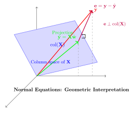
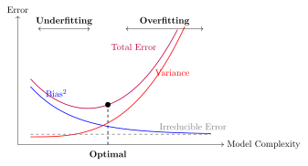

# Linear Regression, the Mother Model {#sec-01-linear-regression}

<!-- lecture-source: m01_lecture-1-from-linear-regression-to-neural-netwo_-bdoWPWjyTc.txt,
     [coding]_m01_lecture-1-2-linear-regression-via-neural-network_WOFb8EKAy7I.txt (fetched 2026-06-14)
     seeds: sources/1_1_lin_Recap.tex -->

The core task of everything we will do in this course is to teach a computer to learn a
function from examples. Before we can appreciate what is *deep* about deep learning, we
need one complete, honest example of learning — a model, a loss, and a way to improve.
Linear regression is that example. It is the smallest model that contains the entire
supervised learning story, and by the end of this chapter we will have built it three
times: once in closed form, once by gradient descent, and once the way you will build
everything else in this book — with PyTorch modules. All three will agree, and you will
know exactly why.

## Learning from examples

We start with a dataset of examples,

$$
\mathcal{D} = \{(\vect{x}_i, y_i)\}_{i=1}^{n},
$$

where each $\vect{x}_i \in \R^d$ is an input with $d$ features and $y_i$ is the desired
output — the *supervision signal*. Stack the inputs as rows and you get the data matrix
$\matr{X} \in \R^{n \times d}$: $n$ samples down, $d$ features across, with the targets
collected in a vector $\vect{y}$.

Our goal is a flexible function $f$ such that

$$
f(\vect{x}_i) \approx y_i \quad \text{and, crucially, } f \text{ generalizes to unseen data.}
$$

That second clause is the whole game. We do not care how well $f$ recites the training
examples; we care how it behaves on a new $\vect{x}$ it has never seen — one drawn from
the same distribution as the training data.

::: {.callout-note}
## Supervised learning, three flavors

The range of $y$ decides the task and, as we will see, the natural loss:

| Task | Range of $y$ | Typical loss |
|---|---|---|
| Regression | $\R$ | Mean squared error |
| Classification | $\{0, \dots, C-1\}$ | Cross-entropy |
| Structured prediction | sequences, images, graphs | task-specific |

This chapter is regression; @sec-02-logistic-softmax handles classification with the
same machinery.
:::

### Why is this hard?

This task sounds simple, but it is fundamentally hard: for any finite set of examples,
there are *infinitely many* functions that fit them perfectly. We want the one that is
most suited to our problem $\rightarrow$ the learning algorithm needs a nudge in the
right direction. That guiding assumption is called its **inductive bias**, and it is a thread
we will pull on for the rest of the book.

- A **linear model** has a *strong* bias: it assumes the world is linear. Simple and
  stable, but systematically wrong when the data is not linear (high bias, low variance).
- A **deep neural network** has a *weak* bias. Its flexibility lets it learn complex
  patterns, but it can memorize the training data instead of the underlying rule
  (low bias, high variance). Some networks can memorize an entire training set — and
  then perform poorly the day you deploy them.

The key to modern deep learning is to use a flexible model and fight overfitting with
data, regularization, and (the deepest idea of all) inductive biases matched to the
task. That last idea gets its own chapter (@sec-06-generalization-inductive-bias).

To make any of this concrete, we parameterize a family of functions $f_{\vect{w}}$ by a
set of tuning parameters $\vect{w}$ — think of each parameter as a knob. *Learning* is
finding a good setting $\hat{\vect{w}}$ of the knobs; *inference* is using
$f_{\hat{\vect{w}}}$ to predict on unseen data. That is the vocabulary we will use all
course.

## The linear model and its geometry

Linear regression assumes a linear relationship:

$$
y = \vect{w}^\top \vect{x} + b .
$$

Geometrically, $\vect{w}$ sets the orientation (the slope) of a hyperplane, and the
bias $b$ shifts it away from the origin. In two dimensions this is the familiar line
through a scatter of points; in $d$ dimensions it is a $d$-dimensional plane, but nothing
about the algebra changes.

<!-- NOVEL (framing surfaced early from the Module 8 kernel-regression bridge): -->
There is a second way to read $\vect{w}^\top\vect{x}$, and it may be the most important
sentence in this chapter: **a dot product is a similarity score.** More precisely,

$$
\vect{w}^\top\vect{x} = \norm{\vect{w}}_2\norm{\vect{x}}_2\cos\theta .
$$

For normalized vectors it measures directional similarity directly: positive when
$\vect{x}$ points along $\vect{w}$, zero when they are orthogonal, and negative when
they oppose. Without normalization, the two norms also control the score, so a large
dot product can mean strong alignment, large magnitude, or both. A linear model is
therefore a learned *pattern scorer*: $\vect{w}$ is a template, and its direction and
scale both matter. Keep this reading close at hand. In Part II, an image filter's
response will be this same dot product slid across an image; in Part IV, *attention*
will be built out of learned similarity scores between queries and keys. Both are this
one primitive, asked the question we will ask all book long: *what if the template were
learnable?*

### The augmentation trick

Carrying $b$ separately clutters the algebra, so we will often fold it into the weights:
append a column of ones to the data matrix, making $\matr{X} \in \R^{n \times (d+1)}$,
and append $b$ to the weight vector, making $\vect{w} \in \R^{d+1}$. Then

$$
y = \vect{w}^\top \vect{x} \qquad \text{(bias included)}.
$$

Whenever *we use this augmented notation*, a missing $b$ is living inside
$\vect{w}$. Do not assume that every bias-free formula or software layer is augmented,
however: a model can deliberately constrain $b=0$ (for example, PyTorch layers created
with `bias=False`).

## The loss: what makes a hyperplane "bad"?

To find the best hyperplane we must first quantify error. The standard choice for
regression is the **mean squared error (MSE)**:

$$
\loss(\vect{w}) \;=\; \frac{1}{n} \sum_{i=1}^{n} \bigl(y_i - \vect{w}^\top\vect{x}_i\bigr)^2
\;=\; \frac{1}{n}\,\norm{\vect{y} - \matr{X}\vect{w}}_2^2 .
$$ {#eq-mse}

The loss is the guiding principle of training: it is how we tell the model *you are a
bad model, and here is by how much*; the model then has to find a way to improve. The
choice of loss is not arbitrary, and we will justify this one honestly at the end of the
chapter.

::: {.callout-tip}
## The first "make it learnable" seed

Look closely at $y = \vect{w}^\top\vect{x} + b$. A single neuron in a neural network
computes *exactly this*, followed by a nonlinear squashing function
$\sigma(\vect{w}^\top\vect{x} + b)$. Linear regression **is** a neuron with the identity
activation. Everything we learn here — loss, gradients, optimization — transfers
directly. The rest of this book is, in a precise sense, the story of what happens when
we take this fixed, simple recipe and progressively let more of it be *learned*.
:::

## Finding the best weights, method 1: solve it exactly

For this one special problem we can find the exact minimizer. Set the gradient of
@eq-mse to zero and you get the **normal equations**:

$$
\hat{\vect{w}}_{\text{OLS}} = (\matr{X}^\top\matr{X})^{-1}\matr{X}^\top\vect{y} .
$$ {#eq-normal}

There is a picture behind this formula worth carrying for the rest of your career. Our
predictions $\hat{\vect{y}} = \matr{X}\vect{w}$ can only ever live in the **column
space** of $\matr{X}$ — the span of its feature columns. If the true $\vect{y}$ lies
outside that space (it almost always does), the best we can do is **project** $\vect{y}$
onto it. The leftover error $\vect{e} = \vect{y} - \hat{\vect{y}}$ is what our model
cannot explain, and at the optimum it is *perpendicular* to the column space — no
adjustment of the knobs can reduce it further.

One more observation to file away: substituting @eq-normal back in gives
$\hat{\vect{y}} = \matr{X}(\matr{X}^\top\matr{X})^{-1}\matr{X}^\top\vect{y}$, so the
fitted predictions are a *weighted combination of the training targets* $\vect{y}$.
Linear regression predicts by mixing the answers it has already seen. Hold that thought:
in Part IV an entire architecture — attention — grows out of choosing such mixing
weights by *similarity*.

{#fig-projection width=62% fig-alt="Geometric projection of y onto the column space of X, with residual e drawn perpendicular to the fitted vector."}

Elegant. So why is this formula almost absent from deep learning? Two reasons. Solving
it costs $O(d^3)$, which is hopeless when $d$ runs to millions or billions. And it only
exists because the model is linear; the moment we add a nonlinearity, there is no closed
form to solve. Our datasets are large and our models are not linear $\rightarrow$ we
have neither luxury. We need another way.

## Finding the best weights, method 2: walk downhill

Here is the geometric intuition. Picture the loss as a landscape over the parameter
space, and imagine standing on it *blindfolded*, trying to find the lowest valley. You
cannot see the valley, but you can feel the slope under your feet. So you feel the
slope, take a small step downhill, and repeat.

The mathematical form of this hill-descending intuition is **gradient descent**:

$$
\vect{w}^{(t+1)} = \vect{w}^{(t)} - \eta \, \nabla_{\vect{w}} \loss\bigl(\vect{w}^{(t)}\bigr),
$$ {#eq-gd}

where the *learning rate* $\eta$ sets the step size. For the MSE loss the gradient has a
clean closed form — with $\matr{X} \in \R^{n\times d}$, $\vect{w} \in \R^{d}$, and
$\vect{y} \in \R^{n}$:

$$
\nabla_{\vect{w}} \loss(\vect{w}) = \frac{2}{n}\,\matr{X}^\top(\matr{X}\vect{w} - \vect{y})
\;\in\; \R^{d}.
$$ {#eq-gd-grad}

```{python}
#| label: fig-gd-path
#| fig-alt: "Nested loss contours over weight and bias surround a minimum marked by a star. A connected descent path starts far away, turns toward the minimum, and takes visibly shorter steps near the valley floor."
#| fig-cap: "The blindfolded walk, made visible: gradient descent on the MSE landscape of a tiny one-feature problem. Each step follows the slope felt at the current point; steps shrink as the valley floor flattens."
#| code-summary: "Code: draw the descent path"
import torch
import numpy as np
import matplotlib.pyplot as plt

torch.manual_seed(6050)
x1 = torch.randn(60)
y1 = 2.5 * x1 - 1.0 + 0.3 * torch.randn(60)          # truth: w = 2.5, b = -1.0

def mse(w, b):                                        # loss surface over (w, b)
    return ((y1 - (w * x1 + b)) ** 2).mean()

w, b, path = -0.5, 2.0, []                            # start far from the valley
for _ in range(20):
    path.append((w, b))
    err = (w * x1 + b) - y1                           # feel the slope...
    w -= 0.25 * float(2 * (err * x1).mean())          # ...step downhill
    b -= 0.25 * float(2 * err.mean())

W, B = np.meshgrid(np.linspace(-1.5, 5.5, 100), np.linspace(-4, 3, 100))
L = np.vectorize(lambda wi, bi: float(mse(wi, bi)))(W, B)

plt.figure(figsize=(5.8, 3.8))
plt.contour(W, B, L, levels=25, cmap="Blues", alpha=0.8)
pw, pb = zip(*path)
plt.plot(pw, pb, "o-", color="#E57200", ms=4, lw=1.5, label="descent path")
plt.plot(2.5, -1.0, "k*", ms=12, label="truth $(w, b)$")
plt.xlabel("$w$"); plt.ylabel("$b$"); plt.legend()
plt.tight_layout()
plt.show()
```

This iterative loop (predict $\rightarrow$ measure the loss $\rightarrow$ feel the
gradient $\rightarrow$ step) is exactly what modern deep learning frameworks automate,
at billion-parameter scale. When the dataset itself is huge we will not even use all of
it per step: a small random *batch* gives a good-enough gradient. That refinement
(stochastic gradient descent) matters enough to get its own treatment in
@sec-04-training-loss-sgd.

## Build it three times

Enough theory: let us implement linear regression, and let us do it in PyTorch. You
have already built this in NumPy in earlier courses, so we will use it as an excuse to
get comfortable with tensors, while still doing everything from scratch.

::: {.callout-tip}
## Coding hygiene

Two habits worth forming from the very first cell: **fix your seeds** so runs are
reproducible, and **annotate your functions with types** — not critical for Python to
run, but it makes code readable and debugging far easier.
:::

```{python}
#| label: setup
import torch
import matplotlib.pyplot as plt

torch.manual_seed(6050)  # reproducible runs, always
```

First, synthetic data. We control the ground truth (the true weights and bias), so we
can check whether each method actually recovers them.

```{python}
#| label: synthetic-data
def make_synthetic_data(
    weights: torch.Tensor, bias: float, n_samples: int, noise: float = 0.1
) -> tuple[torch.Tensor, torch.Tensor]:
    """y = Xw + b + noise.  Returns X: (n, d) and y: (n,)."""
    X = torch.randn(n_samples, len(weights))
    y = X @ weights + bias + noise * torch.randn(n_samples)
    return X, y

true_w, true_b = torch.tensor([2.0, -3.4]), 4.2
X, y = make_synthetic_data(true_w, true_b, n_samples=200)
X.shape, y.shape        # always check your shapes
```

### Take 1: the closed form

The normal equations, @eq-normal, on the *augmented* matrix (the column of ones carries
the bias):

```{python}
#| label: closed-form
X_aug = torch.cat([X, torch.ones(X.shape[0], 1)], dim=1)   # (n, d+1)
w_ols = torch.linalg.solve(X_aug.T @ X_aug, X_aug.T @ y)   # solve, don't invert
print(f"closed form:      w = {w_ols[:2].numpy().round(3)},  b = {w_ols[2]:.3f}")
print(f"ground truth:     w = {true_w.numpy()},  b = {true_b}")
```

Two lines, and we recover the truth up to the noise floor. Remember what this cost us:
$O(d^3)$, and the special grace of a linear model. Now the method that scales.

### Take 2: gradient descent, from scratch

We write the model as a small class: a forward pass, manually derived gradients
(@eq-gd-grad), and an update step. No autograd yet; we want to feel the mechanics once
with our own hands.

```{python}
#| label: gradient-descent
class LinearRegressionScratch:
    """Linear regression trained with manually derived gradients."""

    def __init__(self, input_size: int, lr: float = 0.1):
        self.w = 0.01 * torch.randn(input_size)
        self.b = torch.zeros(1)
        self.lr = lr

    def forward(self, X: torch.Tensor) -> torch.Tensor:
        return X @ self.w + self.b

    def step(self, X: torch.Tensor, y: torch.Tensor) -> float:
        err = self.forward(X) - y            # 1. predict, 2. measure   (n,)
        self.w -= self.lr * 2 * X.T @ err / len(y)   # 3. feel the slope,
        self.b -= self.lr * 2 * err.mean()           # 4. step downhill
        return float((err ** 2).mean())

model = LinearRegressionScratch(input_size=2)
losses = [model.step(X, y) for _ in range(100)]
print(f"gradient descent: w = {model.w.numpy().round(3)},  b = {model.b.item():.3f}")
```

```{python}
#| label: fig-loss-curve
#| fig-alt: "A single log-scale loss curve drops steeply over the first training steps and then levels near a low floor."
#| fig-cap: "The loss falls fast at first — steep slope underfoot — then flattens as we approach the valley floor set by the irreducible noise."
plt.figure(figsize=(5.5, 3.2))
plt.plot(losses)
plt.xlabel("step")
plt.ylabel("MSE loss")
plt.yscale("log")
plt.tight_layout()
plt.show()
```

### Take 3: the framework way

Finally, the idiom you will use for every model from here on: `nn.Linear` holds the
knobs, autograd feels the slope for us, and the optimizer takes the step.

::: {.callout-note}
## A deliberate framework preview

This cell shows the complete PyTorch training loop so you can recognize its shape. We
use the three framework calls as black boxes here: @sec-03-nonlinearity-mlp introduces
modules, @sec-04-training-loss-sgd opens the optimizer, and
@sec-05-backpropagation explains what `backward()` computes. Until then, the manual
implementation above is the chapter's working toolbox.
:::

```{python}
#| label: nn-linear
from torch import nn

net = nn.Linear(in_features=2, out_features=1)
optimizer = torch.optim.SGD(net.parameters(), lr=0.1)
loss_fn = nn.MSELoss()

for _ in range(100):
    optimizer.zero_grad()              # clear old gradients: they accumulate!
    loss = loss_fn(net(X).squeeze(-1), y)   # (n, 1) -> (n)
    loss.backward()                    # autograd feels the slope for us
    optimizer.step()

w_nn = net.weight.detach().squeeze()
b_nn = net.bias.item()
print(f"nn.Linear:        w = {w_nn.numpy().round(3)},  b = {b_nn:.3f}")
```

Three implementations, one answer:

```{python}
#| label: fig-three-fits
#| fig-alt: "A cloud of adjusted observations is crossed by solid, dashed, and dotted fitted lines from the three methods; the lines overlap almost completely across the displayed input range."
#| fig-cap: "All three methods find the same line on the slice $x_2 = \\bar{x}_2$. Because this is synthetic data, the points can be adjusted to that same slice using the known true coefficient; line and points now show the same question."
grid = torch.linspace(X[:, 0].min(), X[:, 0].max(), 50)
x2_mean = X[:, 1].mean()

def prediction_slice(weights: torch.Tensor, bias: float) -> torch.Tensor:
    """Predictions along x1 while x2 is held at its sample mean."""
    return weights[0] * grid + weights[1] * x2_mean + bias

y_on_slice = y - true_w[1] * (X[:, 1] - x2_mean)

plt.figure(figsize=(5.5, 3.6))
plt.scatter(X[:, 0], y_on_slice, s=12, alpha=0.4, label="data adjusted to slice")
plt.plot(grid, prediction_slice(w_ols, float(w_ols[2])), lw=3, label="closed form")
plt.plot(grid, prediction_slice(model.w, model.b.item()), "--", lw=2,
         label="gradient descent")
plt.plot(grid, prediction_slice(w_nn, b_nn), ":", lw=2, label="nn.Linear")
plt.xlabel("$x_1$"); plt.ylabel("$y$"); plt.legend()
plt.tight_layout()
plt.show()
```

## Why squared error? The maximum-likelihood view

The MSE is not an arbitrary choice. Assume the data really is generated by a linear
process plus Gaussian noise:

$$
y = \vect{w}^\top\vect{x} + b + \epsilon, \qquad \epsilon \sim \mathcal{N}(0, \sigma^2).
$$

Then the probability of seeing output $y$ given input $\vect{x}$ is a Gaussian centered
on the model's prediction. **Maximum likelihood estimation** asks: which parameters make
the observed data most likely? Take the log of the likelihood over all $n$ samples and
the Gaussian's exponent comes down:

$$
\log \mathcal{L}(\vect{w}, b)
= C - \frac{1}{2\sigma^2}\sum_{i=1}^{n}\bigl(y_i - (\vect{w}^\top\vect{x}_i + b)\bigr)^2 .
$$

Maximizing the log-likelihood is *exactly* minimizing the sum of squared errors. The
loss encodes an assumption about the noise. This is a pattern to remember: when we meet
cross-entropy in @sec-02-logistic-softmax, it will be the same story with a different
distribution.

## A first look at bias and variance

Our learned predictor $\hat f_{\mathcal D}$ depends on the random training set
$\mathcal D$. Collect a fresh dataset and you get a different prediction at the same
input $\vect{x}$. Let $f^*(\vect{x}) = \E[Y\mid X=\vect{x}]$ be the noise-free
regression function. Then the expected squared error on a fresh outcome at this fixed
input decomposes into three parts:

$$
\E_{\mathcal D,Y}\!\left[(\hat f_{\mathcal D}(\vect{x})-Y)^2
\mid X=\vect{x}\right]
= \underbrace{\left(\E_{\mathcal D}[\hat f_{\mathcal D}(\vect{x})]
-f^*(\vect{x})\right)^2}_{\text{Bias}^2}
+ \underbrace{\E_{\mathcal D}\!\left[
(\hat f_{\mathcal D}(\vect{x})-\E_{\mathcal D}[\hat f_{\mathcal D}(\vect{x})])^2
\right]}_{\text{Variance}}
+ \underbrace{\operatorname{Var}(Y\mid X=\vect{x})}_{\text{Irreducible noise}} .
$$ {#eq-bias-variance}

**Bias** measures how far the *average* prediction is from the truth, because of
limiting assumptions like linearity: a simple model on complex data is systematically
wrong (underfitting). **Variance** measures how much the prediction would change if we
collected a fresh training set (the model's sensitivity to sampling noise); a complex
model can fit the noise itself (overfitting). The **irreducible noise** is inherent to
the data-generating process and cannot be learned away.

{#fig-bias-variance width=70% fig-alt="Bias decreases and variance increases with model complexity, producing a U-shaped total-error curve."}

This is why we split data into training, validation, and test: the model sees the
training set, the validation set referees the bias–variance trade-off, and the test set
stays untouched until the end.

::: {.callout-warning}
## Trap: the U-shaped curve is a cartoon, not a law of nature

The textbook picture, validation error falling then rising as complexity grows, is a
helpful first mental model, and you should have it. But bias and variance are not a
mechanical see-saw. In classical fixed-dimensional, well-specified settings, variance
often falls roughly like $1/n$ as data grows; that rate is not a universal law for
modern models. Regularization and inductive biases matched to the task can buy capacity
without exploding variance. Modern over-parameterized networks live in regimes where
this cartoon bends in surprising ways; we will look at those pictures properly in
@sec-06-generalization-inductive-bias.
:::

### Regularization, briefly

One lever we can pull right now: penalize complexity in the loss itself. **Ridge
regression** adds an $L_2$ penalty,

$$
\loss_\lambda(\vect{w}) = \frac{1}{n}\norm{\vect{y} - \matr{X}\vect{w}}_2^2
+ \lambda \norm{\vect{w}}_2^2,
\qquad
\hat{\vect{w}}_{\text{ridge}} = (\matr{X}^\top\matr{X} + n\lambda I)^{-1}
\matr{X}^\top\vect{y},
$$

nudging the model toward smaller, more stable weights: a little more bias for a lot
less variance. The factor $n$ is there because our data-fit term is a *mean*. This
displayed solution applies when there is no intercept or when features and targets have
been centered so the intercept is recovered separately. We normally do not penalize
that intercept. In augmented-matrix notation, replace $I$ by
$\operatorname{diag}(1,\ldots,1,0)$ so the final bias coordinate remains free.

Let us see that, not just assert it. We build a problem designed to punish an
unregularized model: 20 features of which only 5 matter, noisy targets, and (the cruel
part) barely more samples than parameters. This is exactly the regime where variance
explodes and regularization shines:

```{python}
#| label: ridge-experiment
n, d = 25, 20                            # barely more samples than knobs!
w_true = torch.zeros(d)
w_true[:5] = torch.tensor([3.0, -2.0, 1.5, 2.5, -1.0])   # only 5 real features
Xh, yh = make_synthetic_data(w_true, bias=0.0, n_samples=n, noise=2.0)

w_ols_h = torch.linalg.solve(Xh.T @ Xh, Xh.T @ yh)        # plain OLS
lam = 0.4
w_ridge = torch.linalg.solve(Xh.T @ Xh + n * lam * torch.eye(d), Xh.T @ yh)

def report(name: str, w_hat: torch.Tensor) -> None:
    err = ((w_hat - w_true) ** 2).mean()
    print(f"{name:>6}:  weight MSE = {err:.4f}")

report("OLS", w_ols_h)
report("ridge", w_ridge)
```

OLS, with all its freedom and almost no data to discipline it, assigns large, confident,
*wrong* weights to the 15 noise features — pure variance. Ridge shrinks everything and
cuts the damage several-fold: a little bias, traded for a lot of variance. (Rerun this
cell with `n = 100` and watch OLS become more stable, as classical fixed-dimensional
theory predicts.) Ridge's $L_1$ cousin, **lasso**, can go further and zero out the
irrelevant features entirely; we leave it to the exercises, because on the road ahead
it is weight decay, the $L_2$ idea, that you will meet again and again.

{#fig-regularization width=55% fig-alt="Circular L2 and diamond-shaped L1 constraint regions meet loss contours; the L1 solution lands on an axis."}

## Okay, so — what did we just build?

We taught a computer a function from examples, completely:

1. **A model family** — hyperplanes, parameterized by knobs $\vect{w}, b$ (with the
   augmentation trick to fold $b$ into $\vect{w}$).
2. **A loss** — MSE, which is maximum likelihood under Gaussian noise; the loss is how
   we tell the model how bad it is.
3. **An optimizer** — the exact projection when linearity permits, and gradient descent
   (feel the slope, step downhill) when it does not, which is always from here on.
4. **The generalization lens** — bias vs. variance, the data splits that referee them,
   and regularization as a first counter-measure to overfitting.

And one reframing that will carry the whole book: linear regression is a single neuron
with the identity activation,

$$
\underbrace{y = \vect{w}^\top\vect{x} + b}_{\text{this chapter}}
\quad \xrightarrow{\ \text{add a nonlinearity}\ } \quad
\underbrace{y = \sigma(\vect{w}^\top\vect{x} + b)}_{\text{a neuron}} .
$$

First, in @sec-02-logistic-softmax, that squashing function turns our regressor into a
classifier. Then, in @sec-03-nonlinearity-mlp, we stack neurons — and discover why the
nonlinearity is not optional.

## Sources and further reading {.unnumbered}

- [Hoerl and Kennard, “Ridge Regression: Biased Estimation for Nonorthogonal
  Problems” (1970)](https://doi.org/10.1080/00401706.1970.10488634) introduces the
  biased estimator behind this chapter's stability trade-off and regularization
  geometry.
- [Belkin et al., “Reconciling Modern Machine-Learning Practice and the Classical
  Bias–Variance Trade-Off” (2019)](https://doi.org/10.1073/pnas.1903070116) is the
  promised next picture: why the classical U-curve can become double descent in
  interpolating models.

## Exercises {.unnumbered}

1. **(Pencil.)** Derive the normal equations @eq-normal by expanding
   $\norm{\vect{y}-\matr{X}\vect{w}}_2^2$, taking the gradient with respect to
   $\vect{w}$, and setting it to zero. Where exactly does the assumption that
   $\matr{X}^\top\matr{X}$ is invertible enter?
2. **(Pencil.)** Repeat the derivation with the ridge penalty
   $\lambda\norm{\vect{w}}_2^2$ and show the solution becomes
   $(\matr{X}^\top\matr{X} + n\lambda I)^{-1}\matr{X}^\top\vect{y}$ when the data-fit
   term is the MSE. Why does the $n\lambda I$ term guarantee invertibility for any
   $\lambda > 0$? If you augment $\matr{X}$ with a bias column, which diagonal entry
   should be zero so the intercept is not penalized?
3. **(Code.)** In `make_synthetic_data`, raise `noise` to 1.0 and rerun all three
   implementations 10 times with different seeds. How much do the learned weights vary
   across runs? Which term of @eq-bias-variance are you watching?
4. **(Code.)** Set the learning rate in `LinearRegressionScratch` to 1.0 and rerun.
   Describe what the loss curve does, and explain it using the blindfolded-descent
   picture.
5. **(Code.)** In the ridge experiment, sweep $\lambda \in \{0.01, 0.1, 1, 10, 100\}$
   and plot weight MSE against $\lambda$. Where is the sweet spot, and what happens at
   the extremes? Connect your answer to bias and variance. Then replace ridge with
   `sklearn.linear_model.Lasso` at the best scale you found and count how many weights
   land exactly at zero. Why can an $L_1$ diamond zero coordinates when an $L_2$
   sphere usually only shrinks them?
