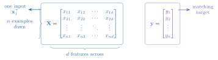
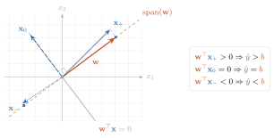
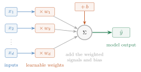
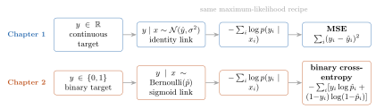

# Linear Regression, the Mother Model {#sec-01-linear-regression}

<!-- lecture-source: m01_lecture-1-from-linear-regression-to-neural-netwo_-bdoWPWjyTc.txt,
     [coding]_m01_lecture-1-2-linear-regression-via-neural-network_WOFb8EKAy7I.txt (fetched 2026-06-14)
     seeds: sources/1_1_lin_Recap.tex -->

The core task of everything we will do in this course is to teach a computer to learn a
function from examples. Before we can appreciate what is *deep* about deep learning, we
need one complete, honest example of learning: a model, a loss, and an update rule.
Linear regression is that example. It is the smallest model that contains the entire
supervised learning story, and by the end of this chapter we will build it three ways:
in closed form, by gradient descent from scratch, and with PyTorch modules. All three
will agree, and you will know exactly why.

## Learning from examples

We start with a dataset of examples,

$$
\mathcal{D} = \{(\vect{x}_i, y_i)\}_{i=1}^{n},
$$

where each $\vect{x}_i \in \R^d$ is an input with $d$ features and $y_i$ is the desired
output, aka the *supervision signal*. Stack the inputs as rows and you get the data matrix
$\matr{X} \in \R^{n \times d}$: $n$ samples down, $d$ features across, with the targets
collected in a vector $\vect{y}$.

{#fig-data-matrix width=82% fig-alt="A blue n by d data matrix has examples down its rows and features across its columns. A purple target vector beside it has one matching target for each row."}

Our goal is a flexible function $f$ such that

$$
f(\vect{x}_i) \approx y_i \quad \text{and, crucially, } f \text{ generalizes to unseen data.}
$$

That second clause is the whole game. We do not care how well $f$ recites the training
examples; we care how it behaves on a new $\vect{x}$ it has never seen, one drawn from
the same distribution as the training data.

In statistical notation, training minimizes the **empirical risk**

$$
\widehat R_{\mathcal D}(\theta)
= \frac{1}{n}\sum_{i=1}^{n}\ell\bigl(f_\theta(\vect{x}_i),y_i\bigr),
$$

while the quantity we ultimately care about is the **population risk**

$$
R_P(\theta)
= \E_{(X,Y)\sim P}\!\left[\ell\bigl(f_\theta(X),Y\bigr)\right].
$$

We will assume this distinction is familiar and use it precisely. An independent
validation set drawn from $P$ estimates performance under $P$; it does not
automatically estimate performance under a transformed or deployment distribution
$Q$. Chapter 6 will make that difference visible; @sec-a5-statistical-learning later
gathers the full statistical contract in one reference.

::: {.callout-note}
## Supervised learning, three flavors

The range of $y$ decides the task and, as we will see, the natural loss:

| Task | Range of $y$ | Typical loss |
|---|---|---|
| Regression | $\R$ | Mean squared error |
| Classification | $\{0, \dots, K-1\}$ | Cross-entropy |
| Structured prediction | sequences, images, graphs | task-specific |

This chapter is regression; @sec-02-logistic-softmax handles classification with the
same machinery.
:::

### Why is this hard?

This task sounds simple, but it is fundamentally hard: for any finite set of examples,
there are *infinitely many* functions that fit them perfectly. We want the one that is
most suited to our problem $\rightarrow$ the learning algorithm needs a nudge in the
right direction. That guiding assumption is called its **inductive bias**, and it is a thread
we will pull on for the rest of the book.

- A **linear model** has a *strong* bias: it assumes the world is linear. Simple and
  stable, but systematically wrong when the data is not linear (high bias, low variance).
- A **deep neural network** has a *weak* bias. Its flexibility lets it learn complex
  patterns, but it can memorize the training data instead of the underlying rule
  (low bias, high variance). Some networks can memorize an entire training set and
  then perform poorly at deployment.

The key to modern deep learning is to use a flexible model and fight overfitting with
data, regularization, and (the deepest idea of all) inductive biases matched to the
task. That last idea gets its own chapter (@sec-06-generalization-inductive-bias).

To make any of this concrete, we parameterize a family of functions $f_{\vect{w}}$ by a
set of tuning parameters $\vect{w}$. Think of each parameter as a knob. *Learning* is
finding a good setting $\hat{\vect{w}}$ of the knobs; *inference* is using
$f_{\hat{\vect{w}}}$ to predict on unseen data. That is the vocabulary we will use all
book.

## The linear model and its geometry

Linear regression assumes a linear relationship:

$$
\predictionpart{\hat y}
= \parameterpart{\vect{w}^\top}\featurepart{\vect{x}} + \parameterpart{b} .
$$

The second term, $\parameterpart{b}$, is the model's default prediction when the input
carries no relevant information. The first term,
$\parameterpart{\vect{w}^\top}\featurepart{\vect{x}}$, adjusts that baseline up or
down based on how the input matches the weight vector.

{#fig-linear-response width=88% fig-alt="A two-dimensional weight vector is shown with aligned, orthogonal, and opposing input vectors. Their dot products are positive, zero, and negative, so their predictions lie above, at, and below the bias baseline."}

Now we can name what the figure shows: **a dot product is a similarity score.** More
precisely,

$$
\parameterpart{\vect{w}^\top}\featurepart{\vect{x}}
= \norm{\parameterpart{\vect{w}}}_2\norm{\featurepart{\vect{x}}}_2\cos\theta .
$$

For normalized vectors it measures directional similarity directly: positive when
$\featurepart{\vect{x}}$ points along $\parameterpart{\vect{w}}$, zero when they are
orthogonal, and negative when they oppose. Without normalization, the two norms also
control the score, so a large dot product can mean strong alignment, large magnitude,
or both. A linear model is therefore a learned *pattern scorer*:
$\parameterpart{\vect{w}}$ is a template whose direction and scale both matter. In
Part II, an image filter will slide this same dot product across an image. In Part IV,
attention will build learned similarities between queries and keys from the same
primitive.

For compact matrix notation, we will absorb $\parameterpart{b}$ into the
weights.\footnote{Append a column of ones to $\featurepart{\matr{X}}$ and append
$\parameterpart{b}$ to $\parameterpart{\vect{w}}$. This is often called \emph{bias
augmentation} or the use of \emph{homogeneous coordinates}. It is bookkeeping, not a
new learning principle. A formula or software layer without an explicit bias may
instead be deliberately constraining $\parameterpart{b}=0$.} Then

$$
\predictionpart{\hat y}
= \parameterpart{\vect{w}^\top}\featurepart{\vect{x}}
\qquad \text{(bias included)}.
$$

## The loss: what makes a hyperplane "bad"?

To find the best hyperplane we must first quantify error. The standard choice for
regression is the **mean squared error (MSE)**:

$$
\loss(\vect{w}) \;=\; \frac{1}{n} \sum_{i=1}^{n} \bigl(y_i - \vect{w}^\top\vect{x}_i\bigr)^2
\;=\; \frac{1}{n}\,\norm{\vect{y} - \matr{X}\vect{w}}_2^2 .
$$ {#eq-mse}

The loss is the guiding principle of training: it translates model error into a scalar
score of failure, giving the optimizer a precise measure of how much corrective work
remains. The choice of loss is not arbitrary, and we will justify this one at the end
of the chapter.

With two parameters, $(w,b)$, this scalar becomes a surface over the parameter plane.
That surface is the **loss landscape**. Learning means finding a low point on it; the
next two methods differ in whether they solve for that point directly or approach it
step by step.

## Finding the best weights, method 1: solve it exactly

For this one special problem we can characterize the exact minimizer. Set the gradient
of @eq-mse to zero and you get the **normal equations**:

$$
\featurepart{\matr{X}^\top\matr{X}}\,
\parameterpart{\hat{\vect{w}}}
=
\featurepart{\matr{X}^\top}\targetpart{\vect{y}} .
$$ {#eq-normal}

Four facts keep this equation honest without detouring into a linear-algebra treatise:

- **Full column rank.** The minimizer is unique, and only then may we write
  $\parameterpart{\hat{\vect{w}}}
  =(\featurepart{\matr{X}}^{\top}\featurepart{\matr{X}})^{-1}
  \featurepart{\matr{X}}^{\top}\targetpart{\vect{y}}$.
- **Rank deficiency.** The fitted prediction is still a unique projection, but the
  parameter vector need not be unique. The minimum-norm choice is
  $\parameterpart{\hat{\vect{w}}_{\min}}
  =\featurepart{\matr{X}^{+}}\targetpart{\vect{y}}$, where
  $\featurepart{\matr{X}^{+}}$ is the Moore--Penrose pseudoinverse. This matters in
  deep learning because $d>n$ is common, not exceptional.
- **Conditioning.** Forming the normal equations squares the spectral condition number:
  $\kappa_2(\featurepart{\matr{X}}^{\top}\featurepart{\matr{X}})
  =\kappa_2(\featurepart{\matr{X}})^2$. QR-, SVD-, or library-based least-squares
  routines are the computational default.
- **Cost.** For a tall dense matrix, forming
  $\featurepart{\matr{X}}^{\top}\featurepart{\matr{X}}$ costs $O(nd^2)$, followed by
  about $O(d^3)$ for factorization. Either term may dominate.

There is a picture behind these facts worth keeping. Every prediction can be written
as a weighted combination of the feature columns:

$$
\predictionpart{\hat{\vect{y}}}
= \featurepart{\matr{X}}\parameterpart{\hat{\vect{w}}}
= \sum_{j=1}^{d}\parameterpart{\hat w_j}\featurepart{\matr{X}_{:j}} .
$$

It must therefore live in the **column space** of $\featurepart{\matr{X}}$. If
$\targetpart{\vect{y}}$ lies outside that space, the best prediction is its projection.
The residual
$\residualpart{\vect{e}}=\targetpart{\vect{y}}-\predictionpart{\hat{\vect{y}}}$ is
perpendicular to the column space, so no adjustment of the weights can reduce it
further.

The same projection can be read from the other side:

$$
\predictionpart{\hat y_i}
= \sum_{j=1}^{n}
\featurepart{\bigl(\matr{X}\matr{X}^{+}\bigr)_{ij}}\,
\targetpart{y_j}.
$$

Each fitted value is a weighted combination of the training targets
$\targetpart{y_j}$. Part IV will turn this same idea into attention by choosing mixing
weights through similarity.

{#fig-projection width=62% fig-alt="Geometric projection of y onto the column space of X, with residual e drawn perpendicular to the fitted vector."}

The exact characterization is elegant, but deep models have millions or billions of
parameters and nonlinear compositions. There is no comparable closed form to solve.
We need another way.

## Finding the best weights, method 2: walk downhill

Here is the geometric intuition. Picture the loss as a landscape over the parameter
space, and imagine standing on it *blindfolded*, trying to find the lowest valley. You
cannot see the valley, but you can feel the slope under your feet. So you feel the
slope, take a small step downhill, and repeat.

The mathematical form of this hill-descending intuition is **gradient descent**:

$$
\vect{w}^{(t+1)} = \vect{w}^{(t)} - \eta \, \nabla_{\vect{w}} \loss\bigl(\vect{w}^{(t)}\bigr),
$$ {#eq-gd}

where the *learning rate* $\eta$ sets the step size. For the MSE loss the gradient has a
clean closed form. With $\matr{X} \in \R^{n\times d}$, $\vect{w} \in \R^{d}$, and
$\vect{y} \in \R^{n}$:

$$
\nabla_{\vect{w}} \loss(\vect{w}) = \frac{2}{n}\,\matr{X}^\top(\matr{X}\vect{w} - \vect{y})
\;\in\; \R^{d}.
$$ {#eq-gd-grad}

:::: {.plan-code .plan-code-wide}
::: {.plan}
1. Create a two-parameter regression problem and its loss surface.
2. Follow the gradient from a deliberately poor starting point.
3. Show the same landscape in perspective and from overhead.
:::

```{python}
#| label: fig-gd-path
#| fig-alt: "Two views show the same bowl-shaped mean-squared-error landscape over weight and bias. A three-dimensional surface makes height visible; a contour view shows a gradient-descent path approaching the minimum with shrinking steps."
#| fig-cap: "One loss landscape, two views. The surface makes the scalar height of MSE visible; the contour view makes the update path legible. Gradient descent needs only the local slope, not a view of the whole bowl."
#| code-summary: "Code: draw the 3-D loss landscape and descent path"
#| code-fold: false
import torch
import numpy as np
import matplotlib.pyplot as plt

# [1]
torch.manual_seed(6050)
x1 = torch.randn(60)
y1 = 2.5 * x1 - 1.0 + 0.3 * torch.randn(60)

def mse(w, b):
    return ((y1 - (w * x1 + b)) ** 2).mean()

W, B = np.meshgrid(
    np.linspace(-1.5, 5.5, 100),
    np.linspace(-4.0, 3.0, 100),
)
L = np.vectorize(lambda wi, bi: float(mse(wi, bi)))(W, B)

# [2]
w, b, path = -0.5, 2.0, []
for _ in range(20):
    path.append((w, b))
    err = (w * x1 + b) - y1
    w -= 0.25 * float(2 * (err * x1).mean())
    b -= 0.25 * float(2 * err.mean())

pw, pb = zip(*path)
path_loss = [float(mse(wi, bi)) for wi, bi in path]

# [3]
fig = plt.figure(figsize=(9.2, 3.8))
ax3d = fig.add_subplot(1, 2, 1, projection="3d")
ax3d.plot_surface(W, B, L, cmap="Blues", alpha=0.78, linewidth=0)
ax3d.plot(pw, pb, path_loss, "o-", color="#E57200", ms=3, lw=1.5)
ax3d.set(xlabel="$w$", ylabel="$b$", zlabel="MSE")
ax3d.view_init(elev=27, azim=-58)

ax2d = fig.add_subplot(1, 2, 2)
ax2d.contour(W, B, L, levels=25, cmap="Blues", alpha=0.85)
ax2d.plot(pw, pb, "o-", color="#E57200", ms=4, lw=1.5,
          label="descent path")
ax2d.plot(2.5, -1.0, "k*", ms=12, label="data-generating parameters")
ax2d.set(xlabel="$w$", ylabel="$b$")
ax2d.legend(fontsize=8)
plt.tight_layout()
plt.show()
```
::::
This iterative loop (predict $\rightarrow$ measure the loss $\rightarrow$ feel the
gradient $\rightarrow$ step) is exactly what modern deep learning frameworks automate,
at billion-parameter scale. When the dataset itself is huge we will not even use all of
it per step: a small random *batch* gives a good-enough gradient. That refinement
(stochastic gradient descent) matters enough to get its own treatment in
@sec-04-training-loss-sgd.

## Build the complete model three ways

The two-parameter loop above was deliberately a one-off drawing instrument: it exposed
the loss landscape and the update path. Now we will fit one reusable, $d$-feature
regression model to the same dataset three complete ways, first with the algebra
exposed and then with the framework abstractions we will reuse.

::: {.callout-tip}
## Coding hygiene

Two habits are worth forming from the first cell: **fix seeds** so runs are
reproducible, and **annotate functions with types** so shapes and interfaces stay
readable. The cells in this book are terse teaching kernels, not production systems;
they expose the mechanism and the checks needed for the claim.
:::

:::: {.plan-code}
::: {.plan}
1. Load the chapter dependencies and establish reproducible state.
:::

```{python}
#| label: setup
#| code-fold: false
import torch
import matplotlib.pyplot as plt

# [1]
torch.manual_seed(6050)
```
::::
First, synthetic data. We control the ground truth (the true weights and bias), so we
can check whether each method actually recovers them.

:::: {.plan-code}
::: {.plan}
1. Define the reusable `make_synthetic_data` helper.
2. Generate noisy targets from known weights, then check the batch shapes.
:::

```{python}
#| label: synthetic-data
#| code-fold: false
# [1]
def make_synthetic_data(
    weights: torch.Tensor, bias: float, n_samples: int, noise: float = 0.1
) -> tuple[torch.Tensor, torch.Tensor]:
    """y = Xw + b + noise.  Returns X: (n, d) and y: (n,)."""
    X = torch.randn(n_samples, len(weights))
    y = X @ weights + bias + noise * torch.randn(n_samples)
    return X, y

# [2]
true_w, true_b = torch.tensor([2.0, -3.4]), 4.2
X, y = make_synthetic_data(true_w, true_b, n_samples=200)
X.shape, y.shape        # always check your shapes
```
::::
### Take 1: the closed form

On the augmented matrix, with a column of ones carrying the bias, use the
rank-aware least-squares routine directly:

:::: {.plan-code}
::: {.plan}
1. Append a constant feature to represent the bias.
2. Solve least squares with a rank-aware library routine.
3. Compare the estimate with the planted parameters.
:::

```{python}
#| label: closed-form
#| code-fold: false
# [1]
X_aug = torch.cat([X, torch.ones(X.shape[0], 1)], dim=1)

# [2]
w_ols = torch.linalg.lstsq(X_aug, y).solution

# [3]
print(f"closed form:      w = {w_ols[:2].numpy().round(3)},  b = {w_ols[2]:.3f}")
print(f"ground truth:     w = {true_w.numpy()},  b = {true_b}")
```
::::
Two lines, and we recover the truth up to the noise floor. `lstsq` handles rank and
conditioning more honestly than explicitly forming $\matr{X}^{\top}\matr{X}$. Now for
the method that extends to nonlinear models.

### Take 2: gradient descent, from scratch

We write the model as a small class: a forward pass, manually derived gradients
(@eq-gd-grad), and an update step. No autograd yet; we want to feel the mechanics once
with our own hands.

:::: {.plan-code}
::: {.plan}
1. Store the parameters and define the linear prediction.
2. Convert batch residuals into the exact MSE update.
3. Repeat that update until the loss settles.
4. Compare the learned parameters with the other solution.
:::

```{python}
#| label: gradient-descent
#| code-fold: false
# [1]
class LinearRegressionScratch:
    """Linear regression trained with manually derived gradients."""

    def __init__(self, input_size: int, lr: float = 0.1):
        self.w = 0.01 * torch.randn(input_size)
        self.b = torch.zeros(1)
        self.lr = lr

    def forward(self, X: torch.Tensor) -> torch.Tensor:
        return X @ self.w + self.b

    def step(self, X: torch.Tensor, y: torch.Tensor) -> float:
        # [2]
        err = self.forward(X) - y            # 1. predict, 2. measure   (n,)
        self.w -= self.lr * 2 * X.T @ err / len(y)   # 3. feel the slope,
        self.b -= self.lr * 2 * err.mean()           # 4. step downhill
        return float((err ** 2).mean())

# [3]
model = LinearRegressionScratch(input_size=2)
losses = [model.step(X, y) for _ in range(100)]

# [4]
print(f"gradient descent: w = {model.w.numpy().round(3)},  b = {model.b.item():.3f}")
```
::::

### Take 3: the framework way

Finally, the idiom you will use for every model from here on: `nn.Linear` holds the
knobs, autograd feels the slope for us, and the optimizer takes the step.

::: {.callout-note}
## A deliberate framework preview

This cell shows the complete PyTorch training loop so you can recognize its shape. We
use the three framework calls as black boxes here: @sec-03-nonlinearity-mlp introduces
modules, @sec-04-training-loss-sgd opens the optimizer, and
@sec-05-backpropagation explains what `backward()` computes. Until then, the manual
implementation above is the chapter's working toolbox.
:::

:::: {.plan-code}
::: {.plan}
1. Pair a linear module with MSE and an SGD optimizer.
2. Repeat the framework forward, backward, and update sequence.
3. Detach and report the learned parameters.
:::

```{python}
#| label: nn-linear
#| code-fold: false
from torch import nn

# [1]
net = nn.Linear(in_features=2, out_features=1)
optimizer = torch.optim.SGD(net.parameters(), lr=0.1)
loss_fn = nn.MSELoss()
nn_losses = []

# [2]
for _ in range(100):
    optimizer.zero_grad()              # clear old gradients: they accumulate!
    loss = loss_fn(net(X).squeeze(-1), y)   # (n, 1) -> (n)
    nn_losses.append(float(loss.detach()))
    loss.backward()                    # autograd feels the slope for us
    optimizer.step()

w_nn = net.weight.detach().squeeze()
b_nn = net.bias.item()
# [3]
print(f"nn.Linear:        w = {w_nn.numpy().round(3)},  b = {b_nn:.3f}")
```
::::

The three methods now support the same diagnostic:

:::: {.plan-code}
::: {.plan}
1. Collect the direct-solve and iterative loss records.
:::

```{python}
#| label: three-loss-records
#| code-summary: "Code: collect three loss records"
#| code-fold: false
# [1]
closed_losses = [
    float((y ** 2).mean()),
    float(((X_aug @ w_ols - y) ** 2).mean()),
]
records = [closed_losses, losses, nn_losses]
titles = ["closed form", "scratch gradient descent", "PyTorch module"]
```
::::

```{python}
#| echo: false
#| label: fig-three-loss-paths
#| fig-alt: "Three small panels compare loss against computational step. The closed-form panel jumps from an initial loss to the solution in one solve. The scratch-gradient and PyTorch panels descend rapidly and level at the same low loss."
#| fig-cap: "Three routes to the same loss floor. The closed form is a before-and-after solve, not an optimization trajectory; both gradient methods expose the sequence of corrective steps."
fig, axes = plt.subplots(1, 3, figsize=(9.2, 2.8), sharey=True)
for ax, record, title in zip(axes, records, titles):
    ax.plot(record, color="#2B6CB0", lw=2)
    ax.set(title=title, yscale="log")
    ax.grid(alpha=0.22)
axes[0].set_xticks([0, 1], ["start", "solve"])
axes[0].set_ylabel("MSE loss")
for ax in axes[1:]:
    ax.set_xlabel("gradient step")
plt.tight_layout()
plt.show()
```

Loss-versus-step plots will recur throughout the book. They reveal whether an
optimization process is descending, stalling, or diverging, and they make competing
update rules comparable. They do not, by themselves, establish generalization.

Three implementations, one answer:

:::: {.plan-code}
::: {.plan}
1. Choose a one-dimensional slice through the two-feature data.
2. Evaluate each learned model along that same slice.
3. Plot the adjusted observations and all three fits.
:::

```{python}
#| label: fig-three-fits
#| fig-alt: "A cloud of adjusted observations is crossed by solid, dashed, and dotted fitted lines from the three methods; the lines overlap almost completely across the displayed input range."
#| fig-cap: "All three methods find the same line on the slice $x_2 = \\bar{x}_2$. Because this is synthetic data, the points can be adjusted to that same slice using the known true coefficient; line and points now show the same question."
#| code-fold: false
# [1]
grid = torch.linspace(X[:, 0].min(), X[:, 0].max(), 50)
x2_mean = X[:, 1].mean()

# [2]
def prediction_slice(weights: torch.Tensor, bias: float) -> torch.Tensor:
    """Predictions along x1 while x2 is held at its sample mean."""
    return weights[0] * grid + weights[1] * x2_mean + bias

y_on_slice = y - true_w[1] * (X[:, 1] - x2_mean)

plt.figure(figsize=(5.5, 3.6))
# [3]
plt.scatter(X[:, 0], y_on_slice, s=12, alpha=0.4, label="data adjusted to slice")
plt.plot(grid, prediction_slice(w_ols, float(w_ols[2])), lw=3, label="closed form")
plt.plot(grid, prediction_slice(model.w, model.b.item()), "--", lw=2,
         label="gradient descent")
plt.plot(grid, prediction_slice(w_nn, b_nn), ":", lw=2, label="nn.Linear")
plt.xlabel("$x_1$"); plt.ylabel("$y$"); plt.legend()
plt.tight_layout()
plt.show()
```
::::

The computation shared by all three implementations can also be drawn as a small
circuit:

{#fig-linear-circuit width=84% fig-alt="Blue input nodes x one through x d feed orange multiplication blocks w one through w d. Their weighted signals and an orange bias enter a summation node, which emits a green prediction y hat."}

The next chapter will keep this entire circuit and add one operation after its output.
That small addition will change what the model can represent without changing the
weighted-sum machinery underneath.

## Why squared error? The maximum-likelihood view

Mean squared error is not an arbitrary penalty. Assume targets are generated by a
linear process with additive Gaussian noise.\footnote{This is more than algebraic
convenience. A residual often aggregates many small, unobserved effects, such as sensor
variation, environmental fluctuations, omitted features, and rounding. Under the
conditions of the central limit theorem, sums of many independent or weakly dependent
finite-variance effects become approximately Gaussian. There is also an informational
argument: among continuous distributions with a fixed mean and variance, the Gaussian
has maximum differential entropy, so it adds no further structure beyond those two
constraints. Neither argument makes every residual Gaussian; the assumption is a
useful model to check, not a law of nature.}

$$
y = \vect{w}^\top\vect{x} + b + \epsilon, \qquad \epsilon \sim \mathcal{N}(0, \sigma^2).
$$

The conditional probability of observing $y$ given $\vect{x}$ is therefore a Gaussian
centered at the deterministic prediction $\hat y=\vect{w}^{\top}\vect{x}+b$:

$$
p(y\mid \vect{x};\vect{w},b)
= \frac{1}{\sqrt{2\pi\sigma^2}}
\exp\!\left(
  -\frac{\bigl(y-(\vect{w}^{\top}\vect{x}+b)\bigr)^2}{2\sigma^2}
\right).
$$

Maximum likelihood asks which $(\vect{w},b)$ make the observed dataset most probable.
Independence turns the dataset likelihood into a product; the logarithm turns that
product into a sum and brings the Gaussian exponent down:

$$
\log \mathcal{L}(\vect{w}, b)
= C - \frac{1}{2\sigma^2}\sum_{i=1}^{n}\bigl(y_i - (\vect{w}^\top\vect{x}_i + b)\bigr)^2 .
$$

Maximizing this log-likelihood is exactly minimizing the sum of squared residuals. A
loss function is a probability model in disguise: it states how targets may vary
around a prediction, then takes the negative log-likelihood.

{#fig-likelihood-loss width=100% fig-alt="Two parallel pipelines apply the same negative-log-likelihood recipe. A continuous target uses a Gaussian model and produces mean squared error. A binary target uses a Bernoulli model with a sigmoid link and produces binary cross-entropy."}

This is the master pattern that continues in @sec-02-logistic-softmax. Continuous
targets suggest a Gaussian likelihood and MSE; binary and categorical targets suggest
Bernoulli and categorical likelihoods and cross-entropy. A Laplace likelihood would
instead produce absolute error. Choosing a loss is therefore a modeling decision, not
memorizing a lookup table.

## A first look at bias and variance

Keep the fitting recipe fixed, but collect the data again. The observed points move,
so the fitted line moves too. At one fixed input, the cloud of green predictions has a
center and a spread. Its center can miss the black data-generating curve, and a fresh
purple outcome still varies around that curve even if the prediction were perfect.

```{python}
#| label: fig-bias-variance
#| echo: false
#| fig-cap: "Bias and variance, shown before they are named. Left: forty fresh noisy datasets produce forty fitted lines under one unchanged linear-regression recipe; one dataset is shown in purple, the mean fitted prediction in green, and the data-generating curve in black. Middle: at one fixed input, the prediction cloud has a systematic offset from the truth and a spread across training sets, while fresh outcomes retain their own noise. Right: the familiar U-curve compresses those three effects into a classical complexity cartoon. The seeded construction reveals the decomposition; it does not claim that every modern model follows one U-shaped path."
#| fig-alt: "Three panels explain bias and variance. Repeated noisy datasets produce different fitted green lines around a black nonlinear truth. At one input, green prediction points have a mean offset from truth and a spread, while purple fresh outcomes show irreducible noise. A final schematic plots falling squared bias, rising variance, constant noise, and their U-shaped total against model flexibility."
#| fig-width: 11
#| fig-height: 4.2
import matplotlib.pyplot as plt
import torch

feature_color = "#2B6CB0"
target_color = "#805AD5"
prediction_color = "#2F855A"
residual_color = "#722F37"
neutral_color = "#333333"
light_neutral = "#8A8A8A"

generator = torch.Generator().manual_seed(6050)
dtype = torch.float64
noise_sd = 0.32
grid = torch.linspace(-1.0, 1.0, 240, dtype=dtype)

def generating_curve(x: torch.Tensor) -> torch.Tensor:
    return 0.25 + 0.75 * x + 0.85 * x.square()

fitted_curves = []
shown_x = shown_y = None
for repeat in range(40):
    x_train = 2.0 * torch.rand(12, generator=generator, dtype=dtype) - 1.0
    y_train = (
        generating_curve(x_train)
        + noise_sd * torch.randn(12, generator=generator, dtype=dtype)
    )
    design = torch.stack([x_train, torch.ones_like(x_train)], dim=1)
    coefficients = torch.linalg.lstsq(design, y_train).solution
    fitted_curves.append(coefficients[0] * grid + coefficients[1])
    if repeat == 0:
        shown_x, shown_y = x_train, y_train

fits = torch.stack(fitted_curves)
mean_fit = fits.mean(dim=0)
anchor = 0.65
anchor_index = int(torch.argmin((grid - anchor).abs()))
anchor_predictions = fits[:, anchor_index]
anchor_truth = generating_curve(torch.tensor(anchor, dtype=dtype))
fresh_outcomes = (
    anchor_truth
    + noise_sd * torch.randn(40, generator=generator, dtype=dtype)
)

fig, axes = plt.subplots(1, 3, figsize=(11, 4.2))

axes[0].plot(grid, generating_curve(grid), color=neutral_color, lw=2.2,
             label="data-generating curve")
for curve in fits:
    axes[0].plot(grid, curve, color=prediction_color, alpha=0.10, lw=0.9)
axes[0].plot(grid, mean_fit, color=prediction_color, lw=2.6,
             label="mean fitted prediction")
axes[0].scatter(shown_x, shown_y, color=target_color, s=22, zorder=4,
                label="one observed dataset")
axes[0].set(xlabel="input $x$", ylabel="output $y$",
            title="A  Fresh data, fresh fit")
axes[0].legend(frameon=False, fontsize=7.5, loc="upper left")

prediction_jitter = torch.linspace(0.91, 1.09, len(anchor_predictions))
outcome_jitter = torch.linspace(0.13, 0.31, len(fresh_outcomes))
axes[1].scatter(anchor_predictions, prediction_jitter, color=prediction_color,
                s=18, alpha=0.58, label="predictions")
axes[1].scatter(fresh_outcomes, outcome_jitter, color=target_color,
                s=18, alpha=0.48, label="fresh outcomes")
prediction_mean = anchor_predictions.mean()
prediction_sd = anchor_predictions.std(unbiased=False)
truth_line = axes[1].axvline(anchor_truth, color=neutral_color, lw=2.0)
mean_line = axes[1].axvline(
    prediction_mean, color=prediction_color, lw=2.0, ls="--",
)
axes[1].annotate(
    "systematic offset",
    xy=(anchor_truth, 0.70), xytext=(prediction_mean, 0.70),
    ha="center", va="bottom", color=residual_color, fontsize=8,
    arrowprops=dict(arrowstyle="<->", color=residual_color, lw=1.4),
)
axes[1].plot(
    [prediction_mean - prediction_sd, prediction_mean + prediction_sd],
    [0.55, 0.55], color=prediction_color, lw=4, solid_capstyle="round",
)
axes[1].text(prediction_mean, 0.47, "spread across datasets", ha="center",
             color=prediction_color, fontsize=8)
axes[1].set_yticks([])
axes[1].set(xlabel=f"prediction or outcome at $x={anchor}$",
            title="B  Hold the input fixed")
axes[1].legend(
    [truth_line, mean_line], ["truth", "mean prediction"],
    frameon=False, fontsize=7.5, loc="center right",
)

complexity = torch.linspace(0.0, 1.0, 200, dtype=dtype)
bias_squared = 0.72 * torch.exp(-4.2 * complexity) + 0.025
variance = 0.045 + 0.52 * complexity.square()
noise = torch.full_like(complexity, 0.12)
total = bias_squared + variance + noise
best = int(total.argmin())
axes[2].plot(complexity, bias_squared, color=residual_color, lw=2,
             label="bias$^2$")
axes[2].plot(complexity, variance, color=light_neutral, lw=2,
             label="variance")
axes[2].plot(complexity, noise, color=target_color, lw=1.7, ls=":",
             label="noise")
axes[2].plot(complexity, total, color=neutral_color, lw=2.7,
             label="total")
axes[2].scatter(complexity[best], total[best], color=feature_color, s=32, zorder=4)
axes[2].text(complexity[best], total[best] + 0.06, "classical sweet spot",
             ha="center", color=feature_color, fontsize=8)
axes[2].set(xlabel="model flexibility", ylabel="expected error",
            title="C  Classical summary")
axes[2].set_yticks([])
axes[2].legend(frameon=False, fontsize=7.5, ncol=2, loc="upper center")

for axis in axes:
    axis.spines[["top", "right"]].set_visible(False)
fig.tight_layout()
plt.show()
```

Now we can name what the picture separated. Our learned predictor
$\hat f_{\mathcal D}$ depends on the random training set $\mathcal D$. Let
$f^*(\vect{x}) = \E[Y\mid X=\vect{x}]$ be the regression function. For a fresh
outcome independent of the training set once $X=\vect{x}$ is fixed, the expected
squared error decomposes into three parts:

$$
\begin{aligned}
&\E_{\mathcal D,Y}\!\left[
  (\hat f_{\mathcal D}(\vect{x})-Y)^2
\right. \\[-2pt]
&\hspace{4.8em}\left.
  {}\mid X=\vect{x}
\right] \\[2pt]
&\quad =
\underbrace{\left(
  \E_{\mathcal D}[\hat f_{\mathcal D}(\vect{x})]-f^*(\vect{x})
\right)^2}_{\text{Bias}^2} \\[2pt]
&\qquad +
\underbrace{
  \begin{aligned}
  \E_{\mathcal D}\!\bigl[\bigl(
    &\hat f_{\mathcal D}(\vect{x}) \\[-2pt]
    &-\E_{\mathcal D}[\hat f_{\mathcal D}(\vect{x})]
  \bigr)^2\bigr]
  \end{aligned}
}_{\text{Variance}} \\[2pt]
&\qquad +
\underbrace{\operatorname{Var}(Y\mid X=\vect{x})}_{\text{Irreducible noise}} .
\end{aligned}
$$ {#eq-bias-variance}

**Bias** measures how far the *average* prediction is from the truth, because of
limiting assumptions like linearity: a simple model on complex data is systematically
wrong (underfitting). **Variance** measures how much the prediction would change if we
collected a fresh training set (the model's sensitivity to sampling noise); a complex
model can fit the noise itself (overfitting). The **irreducible noise** is inherent to
the data-generating process and cannot be learned away.

This is why we split data into training, validation, and test: the model sees the
training set, the validation set referees the bias–variance trade-off, and the test set
stays untouched until the end.

::: {.callout-warning}
## Trap: the U-shaped curve is a cartoon, not a law of nature

The textbook picture, validation error falling then rising as complexity grows, is a
helpful first mental model, and you should have it. But bias and variance are not a
mechanical see-saw. In classical fixed-dimensional, well-specified settings, variance
often falls roughly like $1/n$ as data grows; that rate is not a universal law for
modern models. Regularization and inductive biases matched to the task can buy capacity
without exploding variance. Modern over-parameterized networks can pass an interpolation
threshold and then improve again as capacity grows, producing **double descent** rather
than one U. We will study that regime in @sec-06-generalization-inductive-bias.
:::

### Regularization, briefly

One lever we can pull right now: penalize complexity in the loss itself. **Ridge
regression** adds an $L_2$ penalty,

$$
\loss_\lambda(\vect{w}) = \frac{1}{n}\norm{\vect{y} - \matr{X}\vect{w}}_2^2
+ \lambda \norm{\vect{w}}_2^2,
\qquad
\hat{\vect{w}}_{\text{ridge}} = (\matr{X}^\top\matr{X} + n\lambda I)^{-1}
\matr{X}^\top\vect{y},
$$

nudging the model toward smaller, more stable weights: a little more bias for a lot
less variance.\footnote{For a small update nearly perpendicular to $\vect{w}$,
$\Delta\theta\approx
\norm{\Delta\vect{w}_{\perp}}_2/\norm{\vect{w}}_2$: the same nudge rotates a larger
vector less. Here $L_2$ adds $2\lambda\vect{w}$, so
$\vect{w}\leftarrow(1-2\eta\lambda)\vect{w}
-\eta\nabla\loss_{\mathrm{data}}$. This radial shrink limits scale and can preserve
angular responsiveness in a large layer; it does not by itself explain or cure stalled
training.} The factor $n$ is there because our data-fit term is a *mean*. This displayed
solution applies when there is no intercept or when features and targets have been
centered so the intercept is recovered separately. We normally do not penalize that
intercept. In augmented-matrix notation, replace $I$ by
$\operatorname{diag}(1,\ldots,1,0)$ so the final bias coordinate remains free.

Let us see that, not just assert it. We build a problem designed to punish an
unregularized model: 20 features of which only 5 matter, noisy targets, and (the cruel
part) barely more samples than parameters. This is exactly the regime where variance
explodes and regularization shines:

:::: {.plan-code}
::: {.plan}
1. Create a small-sample problem with many irrelevant features.
2. Solve the same data with unregularized and ridge estimators.
3. Compare both estimates with the planted weights.
:::

```{python}
#| label: ridge-experiment
#| code-fold: false
# [1]
n, d = 25, 20                            # barely more samples than knobs!
w_true = torch.zeros(d)
w_true[:5] = torch.tensor([3.0, -2.0, 1.5, 2.5, -1.0])   # only 5 real features
Xh, yh = make_synthetic_data(w_true, bias=0.0, n_samples=n, noise=2.0)

# [2]
w_ols_h = torch.linalg.lstsq(Xh, yh).solution
lam = 0.4
w_ridge = torch.linalg.solve(Xh.T @ Xh + n * lam * torch.eye(d), Xh.T @ yh)

# [3]
def report(name: str, w_hat: torch.Tensor) -> None:
    err = ((w_hat - w_true) ** 2).mean()
    print(f"{name:>6}:  weight MSE = {err:.4f}")

report("OLS", w_ols_h)
report("ridge", w_ridge)
```
::::
OLS, with all its freedom and almost no data to discipline it, assigns large, confident,
*wrong* weights to the 15 noise features. That is pure variance. Ridge shrinks
everything and
cuts the damage several-fold: a little bias, traded for a lot of variance. (Rerun this
cell with `n = 100` and watch OLS become more stable, as classical fixed-dimensional
theory predicts.) On the road ahead, the same $L_2$ idea will return as weight decay in
large neural networks.

::: {.callout-note}
## Check yourself

Close the book for one minute and retrieve the complete learning story.

- What are the model, loss, and update rule in linear regression?
- Why do fitted predictions live in the column space of the design matrix?
- When do the closed form, scratch loop, and PyTorch module represent the same estimator?
:::

## Okay, so — what did we just build?

We taught a computer a function from examples, completely:

1. **A model family:** hyperplanes parameterized by knobs $\vect{w}, b$, with the bias
   absorbed into the weight vector when compact notation helps.
2. **A loss:** MSE, which is maximum likelihood under Gaussian noise and converts
   prediction error into the scalar signal that guides every update.
3. **An optimizer:** the exact projection when linearity permits, and gradient descent
   (feel the slope, step downhill) when it does not, which is always from here on.
4. **The generalization lens:** bias vs. variance, the data splits that referee them,
   and regularization as a first counter-measure to overfitting.

And one reframing that will carry the whole book: linear regression is a single neuron
with the identity activation,

$$
\underbrace{y = \vect{w}^\top\vect{x} + b}_{\text{this chapter}}
\quad \xrightarrow{\ \text{add a nonlinearity}\ } \quad
\underbrace{y = \sigma(\vect{w}^\top\vect{x} + b)}_{\text{a neuron}} .
$$

First, in @sec-02-logistic-softmax, that squashing function turns our regressor into a
classifier. Then, in @sec-03-nonlinearity-mlp, we stack neurons and discover why the
nonlinearity is not optional.

::: {.callout-tip}
## The first "make it learnable" step

We first saw the geometry of the linear response in @fig-linear-response. Now we can
name its neural-network form. A neuron computes the same weighted response and bias,
then applies $\sigma$. Linear regression is the identity-activation case. Losses,
gradients, and updates carry over unchanged; the nonlinearity is the first ingredient
that expands what the model can learn.
:::

## Sources and further reading {.unnumbered}

- [Hoerl and Kennard, “Ridge Regression: Biased Estimation for Nonorthogonal
  Problems” (1970)](https://doi.org/10.1080/00401706.1970.10488634) introduces the
  biased estimator behind this chapter's stability trade-off and regularization
  geometry.
- [Belkin et al., “Reconciling Modern Machine-Learning Practice and the Classical
  Bias–Variance Trade-Off” (2019)](https://doi.org/10.1073/pnas.1903070116) is the
  promised next picture: why the classical U-curve can become double descent in
  interpolating models.

## Exercises {.unnumbered}

1. **(Pencil.)** Derive the normal equations @eq-normal by expanding
   $\norm{\vect{y}-\matr{X}\vect{w}}_2^2$, taking the gradient with respect to
   $\vect{w}$, and setting it to zero. Notice that this derivation does not require an
   inverse. Then state what becomes unique when $\matr{X}$ has full column rank and
   what remains unique when it is rank deficient.
2. **(Pencil.)** Repeat the derivation with the ridge penalty
   $\lambda\norm{\vect{w}}_2^2$ and show the solution becomes
   $(\matr{X}^\top\matr{X} + n\lambda I)^{-1}\matr{X}^\top\vect{y}$ when the data-fit
   term is the MSE. Why does the $n\lambda I$ term guarantee invertibility for any
   $\lambda > 0$? If you augment $\matr{X}$ with a bias column, which diagonal entry
   should be zero so the intercept is not penalized?
3. **(Code.)** In `make_synthetic_data`, raise `noise` to 1.0 and rerun all three
   implementations 10 times with different seeds. How much do the learned weights vary
   across runs? Which term of @eq-bias-variance are you watching?
4. **(Code.)** Set the learning rate in `LinearRegressionScratch` to 1.0 and rerun.
   Describe what the loss curve does, and explain it using the blindfolded-descent
   picture.
5. **(Code.)** In the ridge experiment, sweep $\lambda \in \{0.01, 0.1, 1, 10, 100\}$
   and plot both weight MSE and $\norm{\vect{w}}_2$ against $\lambda$. Where is the
   sweet spot, and what happens to error and weight scale at the two extremes? Connect
   your answer to bias and variance.
