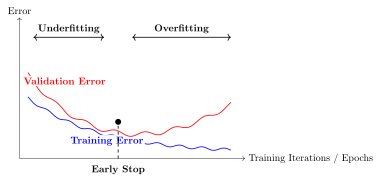

# Training: Loss and Stochastic Gradient Descent {#sec-04-training-loss-sgd}

<!-- lecture-source: m01_lecture-1-from-linear-regression-to-neural-netwo_-bdoWPWjyTc.txt (SGD half),
     [coding]_m03_lecture-3-optimization-foundations-ablation-meth_V0l6b5R6Vkw.txt
     spine: ~/dl-course-code/ds6050_01_foundations/MODULE_NOTES.md (§14–23)
     seeds: sources/1_3_sgd_lecture_notes.tex, sources/1LS-2_loss_SGD.tex, sources/misc_1-SGD.tex -->

We now have models worth training: linear regressors (@sec-01-linear-regression),
classifiers (@sec-02-logistic-softmax), and multilayer perceptrons
(@sec-03-nonlinearity-mlp). We have losses that tell each of them how bad they are, and
we know the direction of improvement is the negative gradient. What remains is the
question every practitioner faces daily: *how, exactly, do you run the descent* when the
dataset has a million examples, the model has millions of knobs, and the loss landscape
is no longer a friendly bowl?

This chapter is about the workhorse answer, stochastic gradient descent, and the small
set of refinements (learning rates, batch sizes, momentum, Adam) that turn it from a
theoretical idea into the algorithm that trains essentially everything in this book.

## Where losses come from, one more time

Before optimizing a loss, remember why it is *that* loss. In
@sec-01-linear-regression we saw that assuming Gaussian noise on a linear process makes
maximum likelihood collapse into least squares; in @sec-02-logistic-softmax the same
argument with a categorical distribution produced cross-entropy. This is the general
pattern: **a loss function is a noise model in disguise.** Choose how you believe the
data deviates from your model, and maximum likelihood hands you the loss. The loss is
how we tell the model it is doing badly $\rightarrow$ choosing it well is not a detail,
it is the supervision itself.

With the loss fixed, training is one line:

$$
\hat{\vect{w}} = \argmin_{\vect{w}} \; \loss(\vect{w})
= \argmin_{\vect{w}} \; \frac{1}{n}\sum_{i=1}^{n} \ell_i(\vect{w}),
$$ {#eq-train-objective}

where $\ell_i$ is the loss on example $i$. Everything that follows is about minimizing
this average when $n$ is enormous.

## The computational bottleneck

Gradient descent, as we left it in @sec-01-linear-regression, updates with the *full*
gradient:

$$
\vect{w}^{(t+1)} = \vect{w}^{(t)} - \alpha \, \frac{1}{n}\sum_{i=1}^{n} \nabla \ell_i(\vect{w}^{(t)}).
$$ {#eq-full-gd}

Look at the cost. One step touches every example; modern datasets have millions to
billions of them, modern models have millions to billions of parameters, and training
needs thousands of steps. One exact gradient per step is a luxury we cannot afford
$\rightarrow$ we need to change strategy to scale up.

## Stochastic gradient descent

The idea is almost cheeky: we do not need the exact gradient. A good approximation is
enough. Instead of the expensive sum over all $n$ examples, average over a small random
**mini-batch** $\mathcal{B}$ — think 32 examples against a million:

$$
\vect{w}^{(t+1)} = \vect{w}^{(t)} - \alpha \, \frac{1}{|\mathcal{B}|}\sum_{i \in \mathcal{B}} \nabla \ell_i(\vect{w}^{(t)}).
$$ {#eq-sgd}

Why does this work? At a *fixed* parameter vector, a uniformly sampled mini-batch
gradient is **unbiased**: the expected contribution of example $i$ to a batch equals
its contribution to the full average, so

$$
\E\bigl[\nabla \loss_{\mathcal{B}}(\vect{w})\bigr] = \nabla \loss(\vect{w}).
$$ {#eq-unbiased}

This statement holds for independent draws with replacement and also for one uniformly
chosen subset without replacement. In expectation, that cheap gradient points where
the expensive gradient points. Each estimate is noisy; its average direction is right.

In practice the algorithm is:

1. Shuffle the training data.
2. Split it into mini-batches of size $B$.
3. For each batch: compute the average gradient, update the parameters.
4. One pass through all batches is an **epoch**; repeat for multiple epochs.

::: {.callout-note}
## Honest fine print

There are two different facts hiding under the word "without replacement." A single
uniform subset, evaluated at a fixed $\vect{w}$, is still unbiased and has *less*
variance than with-replacement sampling. Its variance includes the finite-population
correction $(n-B)/(n-1)$, which reaches zero at $B=n$.

Random reshuffling is subtler. After the first batch changes $\vect{w}$, the next batch
comes from the remaining examples and is statistically tied to the earlier path. It is
not an independent unbiased draw of the full gradient at this *new* iterate. Dedicated
random-reshuffling theory handles that dependence; the one-line proof in
@eq-unbiased does not. Keep the caveat in mind; keep using the shuffle.
:::

## The two zones of SGD

The noise gives SGD a characteristic two-phase behavior, and it is worth seeing rather
than just hearing about. Far from the optimum, almost any batch tells you roughly the
same thing $\rightarrow$ rapid, consistent progress. Close to the optimum, different
batches start to disagree ("go left" — "no, go right"), and the iterate bounces around
in what we will call the **region of confusion**:

```{python}
#| label: fig-sgd-zones
#| fig-alt: "On the same nested loss contours, the full-batch path approaches the optimum smoothly while the mini-batch path jitters and loops around the optimum after making similar early progress."
#| fig-cap: "Full-batch descent (blue) against mini-batch SGD (orange, $B = 4$) on the same landscape. Far out, the noisy steps agree with the true direction; near the optimum they scatter — the region of confusion."
#| code-summary: "Code: GD vs. SGD paths"
import torch
import numpy as np
import matplotlib.pyplot as plt

torch.manual_seed(6050)
x1 = torch.randn(80)
y1 = 2.5 * x1 - 1.0 + 0.4 * torch.randn(80)

def descend(
    batch: int | None, lr: float = 0.12, steps: int = 60
) -> np.ndarray:
    w, b, path = torch.tensor(-0.5), torch.tensor(2.0), []
    for _ in range(steps):
        idx = torch.randperm(80)[:batch] if batch else slice(None)
        err = (w * x1[idx] + b) - y1[idx]
        path.append((float(w), float(b)))
        w = w - lr * 2 * (err * x1[idx]).mean()
        b = b - lr * 2 * err.mean()
    return np.array(path)

W, B = np.meshgrid(np.linspace(-1.5, 5.5, 90), np.linspace(-4, 3, 90))
L = ((y1.numpy()[None, None, :] -
      (W[..., None] * x1.numpy() + B[..., None])) ** 2).mean(-1)

plt.figure(figsize=(6.2, 4))
plt.contour(W, B, L, levels=25, cmap="Blues", alpha=0.7)
for batch, color, label in [(None, "#232D4B", "full batch"),
                            (4, "#E57200", "SGD, B = 4")]:
    p = descend(batch)
    plt.plot(p[:, 0], p[:, 1], "o-", ms=2.5, lw=1.2, color=color, label=label)
plt.plot(2.5, -1.0, "k*", ms=13, label="truth")
plt.xlabel("$w$"); plt.ylabel("$b$"); plt.legend(loc="upper right")
plt.tight_layout(); plt.show()
```

Here is the surprise: the bouncing is not merely tolerable; in some regimes it is a
**feature**. A noisy step may perturb the iterate away from a saddle, a narrow basin, or
a shallow trap that exact descent would follow more predictably. Mini-batch noise can
also bias training toward different solutions, and smaller batches sometimes improve
generalization. None of these outcomes is guaranteed: the effect depends on the model,
data, learning rate, and batch size. We will give that evidence its proper treatment in
@sec-06-generalization-inductive-bias. For now, treat noise as part of the algorithm,
not automatically as a defect or a cure.

## The learning rate

One knob dominates all others. The learning rate $\alpha$ scales every step, and its
failure modes are asymmetric: too small wastes your compute budget crawling; too large
overshoots the valley and diverges.

```{python}
#| label: fig-lr
#| fig-alt: "Three log-loss curves separate by learning rate: the smallest declines slowly, the middle rate falls rapidly to a floor, and the largest oscillates upward instead of converging."
#| fig-cap: "Same problem, same steps, three learning rates. Too small crawls; too large overshoots back and forth and climbs; the middle one converges quickly."
#| code-summary: "Code: the learning-rate triptych"
def losses_for(lr: float, steps: int = 60) -> list[float]:
    w, b, out = torch.tensor(-0.5), torch.tensor(2.0), []
    for _ in range(steps):
        err = (w * x1 + b) - y1
        out.append(float((err ** 2).mean()))
        w = w - lr * 2 * (err * x1).mean()
        b = b - lr * 2 * err.mean()
    return out

plt.figure(figsize=(6.2, 3.4))
for lr, style, color in [(0.005, "-", "#5379AA"), (0.12, "-", "#E57200"),
                         (1.1, "--", "#722F37")]:
    plt.semilogy(losses_for(lr), style, color=color, label=f"$\\alpha = {lr}$")
plt.xlabel("step"); plt.ylabel("loss (log scale)")
plt.legend(); plt.tight_layout(); plt.show()
```

::: {.callout-tip}
## Rule of thumb from the lectures

For the normalized toy problems in these lectures, plain SGD often starts around
$\alpha = 0.1$. That is a scale-calibrated starting point, not a universal constant;
Adam, unnormalized features, and very deep models can require very different values.
Read the training curves: crawling $\rightarrow$ consider raising it; oscillating or
exploding $\rightarrow$ lower it. Later in training it often pays to *decay* the
learning rate so the fine-tuning steps get smaller; that is a **learning-rate
schedule**. One exotic-sounding relative, *warmup* (starting tiny and ramping up), will
matter enormously when we train Transformers in @sec-14-self-attention-transformer.
:::

## The batch size

The batch size $B$ sets where you live on the noise–efficiency trade-off:

| Batch size | Character | Trade-off |
|---|---|---|
| Small (1–32) | Noisy, exploratory | Sometimes a generalization benefit; slow and less hardware-efficient |
| Medium (32–256) | Balanced | The usual default; hardware-efficient |
| Large (256+) | Smooth, high throughput | Less gradient noise; often needs learning-rate and schedule retuning |

With independent sampling, gradient standard deviation scales like $1/\sqrt{B}$:
quadrupling the batch roughly halves the jitter. For a uniform subset without
replacement, multiply by
$\sqrt{(n-B)/(n-1)}$; when $B=n$, the noise is exactly zero. For $B \ll n$ the
correction is near one, which is why the simpler rule is useful. There is no universal
best setting here, only a dial linking statistics and hardware.

### What a batch may estimate — and what it may not {#sec-04-estimator-cases}

<!-- NOVEL: needs sign-off — the three-case estimator discipline (Plan v2, Phase 4). -->

The license behind everything above deserves one paragraph of fine print, because
the rest of the book will lean on it in three different ways.

**Case 1 — decomposable objectives.** When the loss is a mean of per-example terms,
$\loss(\vect{w}) = \E_{x}[\ell(x; \vect{w})]$, a minibatch average is an unbiased
estimator of the full objective, and its gradient an unbiased estimator of the full
gradient. That is the license SGD runs on, and it is why $B$ is a compute-and-noise
dial, not a correctness dial. Cross-entropy, squared error, and every loss in Parts
I–III are Case 1.

**Case 2 — nonlinear functionals of aggregates.** Some quantities are a *nonlinear
function of an expectation*, $R\bigl(\E_x[s(x)]\bigr)$. A batch plug-in estimate
$R(\bar{s}_B)$ is generally **biased** (Jensen's inequality gives the direction when
$R$ is convex or concave), and averaging per-batch values of $R$ does not converge to
the true quantity as training runs longer — only larger batches shrink the bias.
Log-of-mean, KL between *aggregate* distributions, and correlation-style diagnostics
live here. When the book meets one (@sec-19-generative's aggregate-posterior trap is
the flagship), it names the case and either restructures the estimand or declares the
bias.

**Case 3 — batch-defined objectives.** Sometimes the batch is not estimating
anything: it is *part of the objective's definition*. A contrastive loss whose
denominator ranges over the batch's own candidates (@sec-20-multimodal) is a
different objective at $B=64$ than at $B=256$ — neither is a biased version of the
other, and $B$ becomes **protocol**, to be reported like any other design choice.
Decoding-side analogues exist too: beam width in @sec-11-encoder-decoder defines the
search, it does not estimate it.

The audit habit, whenever a loss line reduces over anything: name the target, the
estimator, the reduction axes, the case, and the boundary where the license fails.
Chapters that meet cases 2 and 3 repeat this in one sentence; the full statement
lives only here.

## Momentum: give the ball some mass

Vanilla SGD has exactly one control, $\alpha$, and in narrow, curved valleys that is
not enough: the iterate zigzags across the steep direction while inching along the
shallow one. The fix is to give the update a memory. Keep a running **velocity** that
accumulates gradients, and move along the velocity instead of the raw gradient:

$$
\vect{v}^{(t)} = \beta\,\vect{v}^{(t-1)} + \nabla \loss(\vect{w}^{(t)}), \qquad
\vect{w}^{(t+1)} = \vect{w}^{(t)} - \alpha\,\vect{v}^{(t)},
$$ {#eq-momentum}

with $\beta \in [0.9, 0.99]$. This is the ball rolling downhill: in directions where
gradients keep agreeing, speed builds; in directions where they flip sign every step,
they cancel. The zigzag damps itself, and small bumps in the landscape get rolled
through rather than obeyed.

## Adam: adaptive steps per knob

Momentum treats every parameter alike, but some knobs sit on steep cliffs while others
sit on plains. **Adam** (adaptive moment estimation) combines three ideas from the
lecture: momentum (accumulate past gradients), per-parameter adaptive learning rates
(scale each knob's step by its own gradient history), and bias correction (account for
both accumulators starting at zero). Formally, with elementwise operations:

$$
\vect{m}^{(t)} = \beta_1 \vect{m}^{(t-1)} + (1-\beta_1)\,\vect{g}^{(t)}, \quad
\vect{s}^{(t)} = \beta_2 \vect{s}^{(t-1)} + (1-\beta_2)\,\vect{g}^{(t)\,2}, \quad
\vect{w}^{(t+1)} = \vect{w}^{(t)} - \alpha\,\frac{\hat{\vect{m}}^{(t)}}{\sqrt{\hat{\vect{s}}^{(t)}} + \epsilon},
$$ {#eq-adam}

where $\hat{\vect{m}}, \hat{\vect{s}}$ are the bias-corrected accumulators. When to use
what, per the lecture: **SGD with momentum** is simple, reliable, and strong for large
models; **Adam** is the good default that works out of the box.

## The race, on a problem where we know the truth

Claims about optimizers deserve a test you can rerun. We build a least-squares problem
with a deliberately *ill-conditioned* landscape; the second feature is ten times the
scale of the first, so the loss surface is a long narrow valley. We give all three
optimizers the same 120-step, 16-example-batch budget, while using learning rates chosen
for this toy: $0.003$ for SGD and momentum, $0.1$ for Adam. This is a mechanism
comparison, not a controlled claim that one optimizer wins at a shared learning rate.

The cell also uses `backward()` as the framework instrument previewed in Chapter 1. It
supplies gradients for the race; @sec-05-backpropagation opens that box next.

```{python}
#| label: fig-race
#| fig-alt: "On a logarithmic loss axis over the same step budget, Adam falls quickly toward the floor, momentum damps its early oscillation and outruns plain SGD, and plain SGD decreases most slowly."
#| fig-cap: "The optimizer race on an ill-conditioned valley (feature scales 1 and 10), with an equal step budget and optimizer-appropriate learning rates ($0.003$ for SGD/momentum, $0.1$ for Adam). Plain SGD crawls along the shallow direction; momentum damps the zigzag; Adam's per-parameter scaling largely neutralizes the conditioning."
#| code-summary: "Code: the optimizer race"
torch.manual_seed(6050)
n = 256
Xr = torch.randn(n, 2) * torch.tensor([1.0, 10.0])   # ill-conditioned by design
w_true = torch.tensor([3.0, 0.3])
yr = Xr @ w_true + 0.1 * torch.randn(n)

def race(kind: str, steps: int = 120, B: int = 16) -> list[float]:
    torch.manual_seed(1)                             # same batches for everyone
    w = torch.zeros(2, requires_grad=True)
    opt = {"SGD":      torch.optim.SGD([w], lr=3e-3),
           "momentum": torch.optim.SGD([w], lr=3e-3, momentum=0.9),
           "Adam":     torch.optim.Adam([w], lr=0.1)}[kind]
    hist = []
    for _ in range(steps):
        idx = torch.randint(0, n, (B,))
        opt.zero_grad()
        ((Xr[idx] @ w - yr[idx]) ** 2).mean().backward()
        opt.step()
        hist.append(((Xr @ w.detach() - yr) ** 2).mean().item())
    return hist

plt.figure(figsize=(6.2, 3.6))
for kind, color in [("SGD", "#5379AA"), ("momentum", "#232D4B"),
                    ("Adam", "#E57200")]:
    plt.semilogy(race(kind), color=color, label=kind)
plt.xlabel("step"); plt.ylabel("full-batch loss (log scale)")
plt.legend(); plt.tight_layout(); plt.show()
```

Read the result honestly. This is one problem, chosen to expose conditioning; it is not
proof that Adam always wins (it does not — plain SGD with momentum, well tuned, still
trains many of the best vision models). What the race does show is *mechanism*: when
different directions of the landscape have wildly different steepness, per-direction
memory (momentum) and per-parameter scaling (Adam) buy you orders of magnitude. It also
whispers a practical lesson from the live session: much of this valley's narrowness came
from unscaled features $\rightarrow$ *normalize your inputs* and you fight the optimizer
less (Exercise 5).

<!-- NOVEL: needs sign-off -->
## Three regularizers that live inside training

Regularization can act on the update, the hidden computation, or the duration of
training. Ridge from @sec-01-linear-regression returns as a training-loop citizen; the
other two mechanisms make their contracts explicit here.

**Weight decay.** Under plain SGD, adding an $L_2$ penalty is equivalent (up to whether
the coefficient is written as $\lambda$ or $\lambda/2$) to one extra shrinkage term:
$\vect{w} \leftarrow (1 - \alpha\lambda)\vect{w} - \alpha\nabla\loss$. This is the
ridge connection from @sec-01-linear-regression. Many PyTorch optimizers expose a
`weight_decay` argument, but the equivalence needs a boundary: coupled $L_2$ inside an
adaptive optimizer such as Adam is rescaled by that optimizer and is not the same
trajectory as multiplicative shrinkage. **AdamW** decouples the decay step explicitly.
Also, training recipes often exempt bias and normalization parameters rather than
shrinking every parameter indiscriminately.

<!-- NOVEL: needs sign-off -->
**Dropout.** Weight decay changes the update. Dropout changes the network that receives
the update. Let $h_i$ be one hidden activation, let $p$ be its drop probability, and
write $q=1-p$ for the probability that it survives. During training, **inverted
dropout** draws an independent mask $r_i\sim\operatorname{Bernoulli}(q)$ and sends

$$
\widetilde{h}_i = \frac{r_i}{q}h_i
$$ {#eq-inverted-dropout}

to the next layer. A dropped activation becomes zero; a surviving activation is scaled
by $1/q$. The scaling is not cosmetic. Conditional on the unmasked activation,

$$
\E[\widetilde{h}_i\mid h_i]
= \frac{\E[r_i]}{q}h_i
= h_i.
$$ {#eq-dropout-expectation}

The training-time signal therefore has the same first moment as the full signal, while
each step sees a different thinned network. At evaluation time we remove the masks and
use $h_i$ itself. PyTorch's `nn.Dropout(p)` implements exactly this convention;
`model.train()` turns masking on and `model.eval()` turns it off throughout the model.
This train/evaluation asymmetry is part of dropout's definition, not an optional
speed setting.

Here is the mechanism written directly, followed by a small seeded check. The empirical
training mean is close to the input, while evaluation is deterministic and leaves the
input unchanged:

```{python}
#| label: dropout-check
#| code-summary: "Code: implement inverted dropout and verify its scale"
def inverted_dropout(
    h: torch.Tensor, p: float, training: bool = True
) -> torch.Tensor:
    if not training:
        return h
    if not 0.0 <= p < 1.0:
        raise ValueError("p must satisfy 0 <= p < 1")
    q = 1.0 - p
    mask = (torch.rand_like(h) < q).to(h.dtype)
    return mask * h / q

torch.manual_seed(6050)
h = torch.tensor([1.0, -2.0, 4.0, 0.5])
draws = torch.stack([inverted_dropout(h, p=0.25) for _ in range(20_000)])
mean_output = draws.mean(0)
print("training mean:", [round(v, 4) for v in mean_output.tolist()])
print(f"max |mean - h|: {(mean_output - h).abs().max():.4f}")
print("evaluation:", inverted_dropout(h, p=0.25, training=False).tolist())
```

There is a useful **ensemble intuition** here, with an important calibration. Training
shares weights across many masked subnetworks; evaluation uses one full network whose
activation scale matches their mean. That can resemble averaging many related
predictors. It is not an exact ensemble identity, because nonlinear layers and shared
weights prevent the output of the full network from being the literal average of all
masked-network outputs.

**Early stopping.** Track the validation loss during training and stop when it turns
upward, even though the training loss is still falling:

{#fig-early-stop width=70% fig-alt="Training error falls continuously while validation error turns upward; the stopping point is at the validation minimum."}

<!-- NOVEL: needs sign-off -->
All three are common, inexpensive relative to training the model, and previews: the
full story of *why* constraining or randomizing training can improve generalization is
the business of @sec-06-generalization-inductive-bias.

## Okay, so — the training loop

<!-- NOVEL: needs sign-off -->
Assemble the chapter into the loop you will run, in some form, for the rest of the book:

1. Start from (well-initialized) random parameters.
2. For each epoch: shuffle, split into mini-batches of size $B$.
3. For each batch: training-mode forward pass (including dropout, if used)
   $\rightarrow$ loss (your noise model in disguise)
   $\rightarrow$ backward pass for the gradients $\rightarrow$ optimizer step
   ($\alpha$, momentum or Adam, weight decay).
4. Switch to evaluation mode for validation; watch the curve, schedule the learning
   rate, and stop early when it turns.

That recipe, as code. The book keeps it as a tested function — **Listing 4.1**
— printed here once and imported by later chapters, which then show only what
they change (their model builder and their budget):

```{.python include="../../code/dlbook/supervised.py"}
```

Two reading notes. Seeding *precedes* construction, so one `(model_fn, seed)`
pair always trains from the same starting tensors — later chapters' paired
comparisons lean on that. And the loss line is the estimator licensed earlier in
this chapter: a per-example objective averaged over a shuffled minibatch is an
unbiased estimate of the full-data loss, which is precisely why the minibatch
size is a compute knob rather than a correctness knob (@sec-04-estimator-cases).

One box in that loop is still magic: "backward pass for the gradients." Computing
millions of partial derivatives at the cost of roughly one extra forward pass is the
subject of @sec-05-backpropagation.

## Sources and further reading {.unnumbered}

- [Robbins and Monro, “A Stochastic Approximation Method”
  (1951)](https://doi.org/10.1214/aoms/1177729586) is the classical starting point for
  replacing exact quantities with noisy observations in an iterative procedure.
- [Sutskever et al., “On the Importance of Initialization and Momentum in Deep
  Learning” (2013)](https://proceedings.mlr.press/v28/sutskever13.html) shows how
  initialization and momentum interact with curvature in deep-network training.
- [Kingma and Ba, “Adam: A Method for Stochastic Optimization”
  (2015)](https://arxiv.org/abs/1412.6980) gives the algorithm, bias corrections, and
  motivation for adaptive moment estimates.
- [Loshchilov and Hutter, “Decoupled Weight Decay Regularization”
  (2019)](https://openreview.net/forum?id=Bkg6RiCqY7) explains precisely why coupled
  $L_2$ regularization and weight decay separate under adaptive optimizers.
- [Srivastava et al., “Dropout: A Simple Way to Prevent Neural Networks from
  Overfitting” (2014)](https://www.jmlr.org/papers/v15/srivastava14a.html) introduces
  dropout and its model-averaging motivation.

## Exercises {.unnumbered}

1. **(Pencil.)** Prove @eq-unbiased for sampling with replacement: if $i$ is drawn
   uniformly from $\{1,\dots,n\}$, show
   $\E[\nabla \ell_i(\vect{w})] = \frac{1}{n}\sum_j \nabla \ell_j(\vect{w})$. Where
   exactly does the argument use uniformity?
2. **(Code.)** In the two-zones figure, sweep $B \in \{1, 4, 16, 80\}$ and plot the
   final 30 steps of each path. How does the radius of the region of confusion scale
   with $B$? Compare against $1/\sqrt{B}$ first, then include the finite-population
   correction. Why must the noise vanish at $B=80$?
3. **(Code.)** Add a learning-rate schedule to the race: halve $\alpha$ every 30 steps
   for plain SGD. How much of the gap to momentum does scheduling close? What does that
   tell you about what momentum is *really* fixing here?
4. **(Code.)** Sweep momentum's $\beta \in \{0, 0.5, 0.9, 0.99\}$ in the race. Explain
   the failure mode at the top end using the ball analogy.
5. **(Code.)** Standardize the race's features (divide each column of `Xr` by its
   standard deviation) and rerun all three optimizers. How much of Adam's advantage
   evaporates? State the practical moral in one sentence.
6. **(Pencil and code.)** From @eq-inverted-dropout, show that
   $\operatorname{Var}(\widetilde{h}_i\mid h_i)=p h_i^2/(1-p)$. Estimate that variance
   for $p\in\{0.1,0.5,0.9\}$ using the seeded check. What happens to signal noise as
   $p$ approaches one, and what evaluation bug appears if masking is left on?
