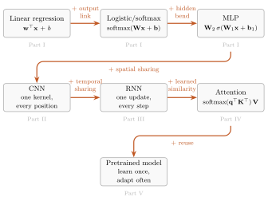
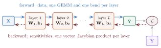

---
citation:
  type: book
  title: "Deep Learning: Making It Learnable"
  author:
    - given: Heman
      family: Shakeri
  issued: 2026-09-02
  version: 1.3
  publisher: School of Data Science, University of Virginia
  url: https://shakeri-lab.github.io/dl-book/
dlbook-edition-status: rolling
dlbook-html-edition-status: rolling
---

# Preface {.unnumbered}

*A first-principles course in Python and PyTorch.*

Much of modern deep learning can be understood as familiar machinery, made learnable,
placed inside the right structure, and run on hardware that makes matrix multiplication
absurdly fast.

::: {.book-thesis-line}
**What to learn. What to build in. What to reuse.**
:::

## Why now {.unnumbered}

The ingredients of this book are decades old: linear maps, nonlinear bends, gradient
descent, and likelihood-based losses. Three things changed around them.

1. **Scale became a design decision.** Across the regimes measured so far, the same
   architecture given more parameters, data, and compute improves predictably, and it
   sometimes acquires behaviors nobody programmed. Engineered systems rarely behave
   that way, which is why scaling laws are an architectural topic in this book rather
   than an operational footnote.
2. **We stopped training from scratch.** A representation is pretrained once on broad
   data and then adapted cheaply, many times.
3. **One representation space serves many senses.** Text, images, and audio are mapped
   into shared vector spaces and compared with the same geometric operations.

None of this required a new kind of mathematics. It required a small set of moves, and
hardware that makes one of them very fast: the batched general matrix multiplication
(GEMM). A dense layer applied to a batch of $B$ examples is one GEMM followed by an
elementwise bend:

$$
\matr{Z} = \featurepart{\matr{X}}\,\parameterpart{\matr{W}}^{\top}
+ \vect{1}\,\parameterpart{\vect{b}}^{\top},
\qquad
\matr{H} = \sigma(\matr{Z}),
$$

where $\featurepart{\matr{X}}\in\R^{B\times D_{\mathrm{in}}}$ holds one example per row
and $\parameterpart{\matr{W}}\in\R^{D_{\mathrm{out}}\times D_{\mathrm{in}}}$ is stored the
way PyTorch stores it. From convolution to attention, most of the arithmetic in this
book's models is spent in products like this one. The systems in the headlines are not
an adjacent subject: they are this subject, scaled.

## What the mechanics explain, and what they do not {.unnumbered}

Building, wiring, and running these models takes familiar mathematics: the chain rule,
matrix products, vector–Jacobian products, and probability for the losses. Explaining
why they work so well at scale is a different matter. Networks with far more parameters
than training examples can fit random labels, yet on real data they generalize; the
double descent met in [Chapter 6](chapters/part1/06-generalization-inductive-bias.qmd)
is one face of this. Gradient descent on a nonconvex loss in millions or billions of
dimensions routinely finds solutions that generalize. Over wide ranges of scale, loss
falls roughly as a power law in parameters, data, and compute, a regularity that
[Chapter 16](chapters/part4/16-vit-scaling.qmd) fits and then qualifies. Accounting for
these facts draws on high-dimensional probability, random matrix theory, dynamical
systems, and statistical physics, and much of it is still active research.

This book neither pretends those questions are settled nor waits for them. It is a
builder's and auditor's manual: fluency in the mechanics and the inductive biases lets
you read that theory, and the claims made in its name, with clear eyes.

## A continuation, not a fresh start {.unnumbered}

You own more of this subject than you think. If you know linear regression, empirical
risk minimization, gradient descent, and why squared error is the maximum-likelihood
loss for Gaussian noise, you are not starting over. Each architecture in this book keeps
the model before it and makes one more piece learnable, shared, or reused.

{width=100% fig-alt="Seven rounded boxes connected by orange arrows. Linear regression leads to logistic or softmax regression by adding an output link, then to an MLP by adding a hidden bend, then to a CNN by adding spatial sharing. A connector adds temporal sharing to reach an RNN, which leads to attention by adding learned similarity and to a pretrained model by adding reuse. Grey tags mark Parts I through V."}

::: {.preface-figure-note}
*Each rung keeps the model below it and adds one move, shown in orange. The grey tags name the Part of the book where each move is made.*
:::

Take a linear model and let it learn its own nonlinear features: the core of a
multilayer perceptron. Take fixed convolutional filters and learn them from data: the
core of a convolutional network. Take a one-shot summary and learn how to update it step
by step: recurrence. Take similarity-weighted averaging and learn how to compare and mix:
the core of attention. Learn a representation once and adapt it many times: the
pretrained era.

The underlying mathematical move, in its simplest instance:

$$
\underbrace{f_{\vect{w}}(x) = \vect{w}^\top \phi(x)}_{\text{linear model on fixed features}}
\qquad\longrightarrow\qquad
\underbrace{f_{\vect{w},\theta}(x) = \vect{w}^\top \phi_\theta(x)}_{\text{linear readout on learned nonlinear features}}.
$$

What we build in, through architecture, objectives, data, or training, is **inductive
bias**: regularities the model should not have to rediscover from scratch. Three
questions organize everything that follows:

$$
\begin{aligned}
\textbf{What is learned?} &\quad \text{features, filters, comparisons, representations} \\
\textbf{What is built in?} &\quad \text{locality, sharing, order, invariance, visibility} \\
\textbf{What is reused?} &\quad \text{pretrained representations and models}
\end{aligned}
$$

With these questions in hand, architectures stop looking like a zoo of named models and
start reading as a short sequence of design moves. When an idea feels half-familiar, it
usually is. Follow your nose backward: the cross-references first, then
[Appendix A](chapters/appendices/a1-linear-algebra.qmd) for linear algebra and the SVD,
[Appendix B](chapters/appendices/a2-tensors.qmd) for tensors, and
[Appendix E](chapters/appendices/a5-statistical-learning.qmd) for the statistical
contracts.

## Open the hood {.unnumbered}

This book spends little time persuading you that deep learning matters. It spends its
time on how learning works. Treat a network as an engine to assemble, tune, and repair:

{width=100% fig-alt="An input matrix X passes left to right through layers 1, 2, and L, each holding a weight matrix and bias, to a prediction Y hat. The prediction and the target Y feed the loss. Solid blue arrows along the top carry data forward; dashed dark red arrows along the bottom carry blame backward from the loss to every layer."}

::: {.preface-figure-note}
*Forward, data flows left to right; backward, blame flows right to left. Every layer holds learnable parameters (orange), and the loss compares the prediction (green) with the target (purple).*
:::

- **Forward, left to right.** Data flows through linear maps, one batched GEMM per
  layer, each followed by a nonlinear bend.
- **Backward, right to left.** Reverse-mode differentiation hands the loss's blame back
  to every parameter, one vector–Jacobian product per layer.
- **The design goal.** As much representational power as possible from as few
  parameters as possible, obtained by building the data's known structure into the
  architecture.

When training stalls, we do not guess. We check shapes and strides, gradient norms layer
by layer, what each position is allowed to see, and whether the numbers are well
conditioned.

## How to read this book {.unnumbered}

Every chapter follows one loop: **read → predict → run → audit**. Before running a cell,
write down the direction, shape, or trend you expect. After running it, audit the code
and its output the way you would review a colleague's pull request, or an AI
assistant's. Assistants now write plausible PyTorch in seconds, so syntax is no longer
the bottleneck; auditing is. Five questions cover most audits:

1. **Function class.** What family of functions does the code implement, and what
   structure does it build in: locality, weight sharing, order, causality?
2. **Objective.** What does the loss reward? When it is a negative log-likelihood, what
   noise model does it assume: Gaussian, Bernoulli, or categorical?
3. **Estimator.** What does each batch estimate? [Chapter 4](chapters/part1/04-training-loss-sgd.qmd#sec-04-estimator-cases)
   separates three cases: a decomposable per-example mean, a nonlinear functional of an
   aggregate, and a batch-defined objective.
4. **Visibility.** What can the model see? Check padding, causal masks, and leakage
   across data splits.
5. **Claim.** What does the output actually support, and which tempting conclusion does
   it leave unproven?

An assistant that writes code you cannot audit has cost you the competence you came here
for. The standard throughout is that you own every line you run. The code is plain
Python and PyTorch and runs on an ordinary laptop CPU: small data, honest experiments.
If you are taking the course, the
[lecture videos](https://www.youtube.com/playlist?list=PLwZv_wzaKu3vzW88m6ASKemCTb70ukycH)
and [course-site self-checks](https://shakeri-lab.github.io/dl-course-site/)
complement this loop.

### Why this book {.unnumbered}

[Goodfellow, Bengio, and Courville's *Deep
Learning*](https://www.deeplearningbook.org/) is the encyclopedic reference;
[Prince's *Understanding Deep Learning*](https://udlbook.github.io/udlbook/) emphasizes
visual explanation; [*Dive into Deep Learning*](https://d2l.ai/) ranges broadly across
frameworks and tools; [Bach's *Learning Theory from First
Principles*](https://www.di.ens.fr/~fbach/ltfp/) develops generalization theory from the
ground up. This book is narrower on purpose. It follows one question through every
architecture, *what if we made this learnable?*, and makes every printed snippet the
executed artifact, so reading, predicting, running, and auditing form one loop.

This book is complete on its own terms. It tells the architecture story as one arc, from
linear regression to the pretrained era, and teaches exactly the training mechanics its
experiments need: loss and stochastic gradient descent, backpropagation, and numerical
precision. It also leaves you ready for the research literature. With these mechanics in
hand, current papers on test-time learning, state-space sequence models, diffusion, and
preference optimization become readable.

Readers who want the theory of training can continue with [*Deep Learning: Making It
Trainable*](https://shakeri-lab.github.io/opt-book/), a separate, self-contained
treatment of initialization, optimization dynamics, numerical contracts, and the spectra
of high-dimensional data that shares this book's notation.

**Make the right parts learnable. Build in the structure you trust. Reuse what
transfers.**

::: {.callout-note collapse="true"}
## About this edition

This is the free, open book for
[DS 6050 Deep Learning](https://shakeri-lab.github.io/dl-course-site/) at UVA's School of
Data Science. The course arc is published, and the book continues to receive corrections
and teaching improvements. The current stable edition is **v1.3 (September 2, 2026)**;
its [archived release and PDFs](https://github.com/Shakeri-Lab/dl-book/releases/tag/v1.3)
preserve a fixed version. The live book is a rolling post-v1.3 manuscript.
The HTML edition is canonical; the PDF is a derived print conversion.
Executable figures and numerical results are produced by code in the book's source:
experiments carry their executable code, revealed step by step or all at once, and
concept diagrams fold theirs. Every printed snippet is the executed artifact; nothing on
the page is retyped, and the repository's checks re-execute the book's notebooks.
Source, provenance, and licenses remain visible in the repository.

**Suggested citation:** Shakeri, Heman. 2026. *Deep Learning: Making It Learnable*.
Version 1.3. [https://shakeri-lab.github.io/dl-book/](https://shakeri-lab.github.io/dl-book/).
:::

### The route at a glance {.unnumbered}

| Part | What was fixed | What becomes learnable | The failure that opens the next part |
|---|---|---|---|
| [I · From Lines to Networks](chapters/parts/p1-lines-to-networks.qmd) | the input features | intermediate representations | global templates span the whole frame, producing the shift cliff |
| [II · Vision: Learning the Filters](chapters/parts/p2-vision.qmd) | hand-designed local filters | detector weights | a one-shot fixed-width code cannot process an arbitrary-length stream |
| [III · Sequences: Learning the Summary](chapters/parts/p3-sequences.qmd) | a one-shot summary | the carried state update | one fixed-size encoder–decoder bridge must carry every source fact |
| [IV · Attention: Learning the Similarity](chapters/parts/p4-attention.qmd) | the similarity rule | the comparison rule | full fine-tuning copies or updates the whole pretrained backbone per task |
| [V · The Pretrained Era: Learning What to Reuse](chapters/parts/p5-pretrained-era.qmd) | the reuse rule or sampler | adaptation, a learned judge, and generation | objectives, data, and evaluation remain choices no architecture makes |

### Course route and dependencies {.unnumbered}

The route is cumulative. Modules sometimes revisit a chapter because the course uses the
same idea first as a mechanism and later as evidence. The appendices are just-in-time
support, not a separate prerequisite block: **A** is linear algebra and the SVD,
**B** is tensors in practice, **C** is numerical precision and hardware efficiency,
**D** is notation, and **E** is statistical learning contracts.

| Course module | Primary book route | Supporting appendices |
|---|---|---|
| 1 · foundations and MLPs | [1](chapters/part1/01-linear-regression.qmd) → [2](chapters/part1/02-logistic-softmax.qmd) → [3](chapters/part1/03-nonlinearity-mlp.qmd) → [4](chapters/part1/04-training-loss-sgd.qmd) | [A](chapters/appendices/a1-linear-algebra.qmd) · [B](chapters/appendices/a2-tensors.qmd) · [D](chapters/appendices/a4-notation.qmd) · [E](chapters/appendices/a5-statistical-learning.qmd) |
| 2 · backpropagation | [5](chapters/part1/05-backpropagation.qmd) | [B](chapters/appendices/a2-tensors.qmd) · [D](chapters/appendices/a4-notation.qmd) |
| 3 · optimization and ablation | [4](chapters/part1/04-training-loss-sgd.qmd) → [6](chapters/part1/06-generalization-inductive-bias.qmd) → [experiment interlude](chapters/interludes/learning-by-experiment.qmd) | [B](chapters/appendices/a2-tensors.qmd) · [D](chapters/appendices/a4-notation.qmd) · [E](chapters/appendices/a5-statistical-learning.qmd) |
| 4 · convolutional networks | [6](chapters/part1/06-generalization-inductive-bias.qmd) → [7](chapters/part2/07-filters-convolution.qmd) → [8](chapters/part2/08-cnn.qmd) | [B](chapters/appendices/a2-tensors.qmd) · [D](chapters/appendices/a4-notation.qmd) · [E](chapters/appendices/a5-statistical-learning.qmd) |
| 5 · modern CNNs and transfer | [9](chapters/part2/09-modern-cnns-transfer.qmd) | [B](chapters/appendices/a2-tensors.qmd) · [C](chapters/appendices/a3-precision-performance.qmd) · [D](chapters/appendices/a4-notation.qmd) |
| 6 · PCA and autoencoders | [PCA → autoencoder interlude](chapters/interludes/making-pca-learnable.qmd) | [A](chapters/appendices/a1-linear-algebra.qmd) · [B](chapters/appendices/a2-tensors.qmd) · [D](chapters/appendices/a4-notation.qmd) |
| 7 · recurrent sequences | [10](chapters/part3/10-sequences-rnn.qmd) → [11](chapters/part3/11-encoder-decoder.qmd) | [B](chapters/appendices/a2-tensors.qmd) · [D](chapters/appendices/a4-notation.qmd) |
| 8 · attention | [12](chapters/part4/12-kernel-regression.qmd) → [13](chapters/part4/13-attention.qmd) | [A](chapters/appendices/a1-linear-algebra.qmd) · [B](chapters/appendices/a2-tensors.qmd) · [D](chapters/appendices/a4-notation.qmd) |
| 9 · Transformers | [14](chapters/part4/14-self-attention-transformer.qmd) → [test-time-regression interlude](chapters/interludes/attention-as-test-time-regression.qmd) | [B](chapters/appendices/a2-tensors.qmd) · [C](chapters/appendices/a3-precision-performance.qmd) · [D](chapters/appendices/a4-notation.qmd) |
| 10 · pretrained models, ViTs, scaling | [15](chapters/part4/15-bert-pretraining.qmd) → [16](chapters/part4/16-vit-scaling.qmd) | [B](chapters/appendices/a2-tensors.qmd) · [C](chapters/appendices/a3-precision-performance.qmd) · [D](chapters/appendices/a4-notation.qmd) |
| 11 · adaptation and alignment | [17](chapters/part5/17-peft-quantization.qmd) → [18](chapters/part5/18-alignment.qmd) | [B](chapters/appendices/a2-tensors.qmd) · [C](chapters/appendices/a3-precision-performance.qmd) · [D](chapters/appendices/a4-notation.qmd) · [E](chapters/appendices/a5-statistical-learning.qmd) |
| 12 · generative and multimodal models | [19](chapters/part5/19-generative.qmd) → [20](chapters/part5/20-multimodal.qmd) | [A](chapters/appendices/a1-linear-algebra.qmd) · [B](chapters/appendices/a2-tensors.qmd) · [C](chapters/appendices/a3-precision-performance.qmd) · [D](chapters/appendices/a4-notation.qmd) · [E](chapters/appendices/a5-statistical-learning.qmd) |

### Plan a reading session {.unnumbered}

Time depends more on whether you stop to derive and run than on page count. As a planning
range, allow roughly **45–90 minutes for a careful first read** of most chapters, with
the experiment-heavy later chapters often taking the longer end or a second sitting.
Once the environment and data are ready, reproducing a few key cells commonly adds
**20–45 minutes**; rerunning every training cell from scratch can take substantially
longer and varies by machine. Exercises are best treated as their own work session.
These are orientation bands, not completion-time promises.

If you have one short sitting, read the opening problem, study the figures, run one cell
that tests the main claim, and answer any closing **Check yourself** prompts without
looking back. Return for the derivations and exercises when you can explain what failed,
what changed, and what evidence supports the repair.

### Exercises, hints, and solutions {.unnumbered}

The book supports both enrolled and self-paced readers. For-credit assignment rules on
the course site and in the syllabus take precedence. To protect those assignments, the
public book does not publish full worked solutions to overlapping graded work. Public
**Check yourself** prompts are retrieval practice, not answer banks; the chapter recap
and course-site self-check feedback provide the first layer of hints.

For self-paced work, use these acceptance criteria:

- A **conceptual answer** names the mechanism, predicts a direction or limiting case,
  and states one condition under which the claim could fail.
- A **shape derivation** labels every axis before the operation and checks the resulting
  shape against the code.
- A **code exercise** runs from a fresh session, fixes its seed, prints or asserts the
  important shapes, and reproduces the requested qualitative relationship. Small
  machine-dependent numerical differences are not failures unless the exercise sets a
  tolerance.
- An **experiment** states the question before the run, separates tuning from final
  evaluation, keeps the comparison recipe fixed, reports seed variation when requested,
  and ends with a limitation rather than a universal claim.

When stuck, inspect the nearest `Trap:` or tip callout, write the expected shape or trend before
running anything, and reduce the code to one batch or one example. Enrolled students
should use the course's approved help channels for assignment-specific hints; complete
graded solutions stay there rather than in the public text.

## Acknowledgments {.unnumbered}

To the students of DS 6050 at the University of Virginia School of Data Science,
whose questions and debugging pauses shaped every explanation here.

::: {.support-project}
##  Support this open book {.unnumbered #support-this-open-book}

This book is free to read and download at **$0**, and no contribution unlocks
additional content. Reading it, sharing it, or reporting a correction is already
meaningful support. If it has been useful and you would like to help sustain ongoing
corrections, new figures, and open releases, you may make an optional contribution
here:

[Support the open book: buymeacoffee.com/hshakeri](https://buymeacoffee.com/hshakeri){.support-project-link}
:::

---

*Text and figures licensed [CC BY-NC-SA 4.0](https://creativecommons.org/licenses/by-nc-sa/4.0/);
all code [MIT](https://github.com/Shakeri-Lab/dl-book/blob/main/LICENSE-code). Source on
[GitHub](https://github.com/Shakeri-Lab/dl-book). The graduate companion is
[*Deep Learning: Making It Trainable*](https://shakeri-lab.github.io/opt-book/).*

:::: {.content-visible when-format="html"}
::: {#revision-notes .callout-note collapse="true"}
## Revision notes {.unnumbered}

A release is a fixed place to point a syllabus, assignment, or citation. The live book
may continue to receive corrections, but a tagged release keeps its source and attached
PDF stable. When page numbers matter, name the version.

### Rolling build · September 25, 2026 · Preface, Chapters 1 to 4, and references {.unnumbered .unlisted}

The Preface now says why this moment in deep learning rewards study, separates the
mechanics this book teaches from the open theory of why they work at scale, draws the
learnability ladder and the forward and backward passes as two new figures, and states
the five audit questions explicitly. Chapter 1 shows the gradient behind the normal
equations and reads the projection from both sides; Chapter 2 names the classification
head, adds an input-space view of the sigmoid's boundary, and names the KL divergence;
Chapter 3 reframes XOR's history around credit assignment and shows how depth folds
space; Chapter 4 opens the two zones of SGD on their mechanism and derives momentum from
a ball with friction.
A full reference audit corrected two dead links, one table number, three title–link
mismatches, three attributions, one year, and two wording slips; no cited work was
found to be fabricated. A
punctuation pass removed nearly every em dash. Printed experimental outputs are unchanged,
except that Chapter 14's training printout again matches the numbers its text reports;
the archived v1.3 release is unchanged.

### Rolling build · September 13, 2026 · Search and mechanism replays {.unnumbered .unlisted}

Chapter 11 now includes a small probability tree showing how the best next token
can miss the best complete sequence. Both PDF editions carry the example; the
optional HTML replay contrasts greedy and beam search on the same fixed tree.
It joins the book's lightweight mechanism replays, with supplied histories kept
distinct from candidate continuations. Existing experimental outputs and the
archived v1.3 release remain unchanged.

### Rolling build · September 2, 2026 · Phase F {.unnumbered .unlisted}

The code path now continues beyond reading. Twenty-six chapter, interlude, and
foundational-appendix pages provide a downloadable notebook and an Open in Colab
route. Each notebook is generated from the canonical manuscript, preserves its
learner-visible Plan → Code sequence, omits hidden plotting harnesses, and begins with
a commit-pinned bootstrap for exact runtime versions and SHA-256-verified artifacts.

Before publication, six clean CI shards execute every compact notebook beside a full
Quarto-derived reference from the same manuscript. Their learner-visible stdout must
agree byte for byte on that runner; a reviewed portability ledger then checks it
against the frozen HTML evidence, with exact comparison as the default. Only the
unexecuted source notebooks that pass both gates are published. The Preface, Epilogue,
and two reference appendices say plainly that no executable notebook is available;
Part pages remain quiet. This pipeline changes neither manuscript content nor the
tagged v1.3 PDFs.

### Rolling build · September 2, 2026 · Phase E {.unnumbered .unlisted}

Four remaining web-reading details now travel as one audited pass. Collapsed
Plan → Code source remains searchable: finding a token opens the panel and selects
the plan step that owns its bracketed code region. MathJax typesets inline and
unnumbered mathematics near the viewport while keeping numbered citation targets eager;
the first content image remains eager while later images load and decode lazily, and
the download page prefers a 230 KB WebP cover with the original PNG as its fallback.

These are HTML-only presentation and delivery changes. Equation numbers, equation
links, source alternatives, and the existing Show-all path remain intact; the tagged
v1.3 PDFs and their page counts are unchanged.

### v1.3 · September 2, 2026 {.unnumbered .unlisted}

Version 1.3 makes the five-part argument visible in the reading path. Each Part now
opens with a concise transition that names the fixed object, the learnable move, the
structure built in, and the failure that motivates what follows. Part III becomes
**Sequences: Learning the Summary**, and Part V becomes **The Pretrained Era: Learning
What to Reuse**; the sidebar, route table, HTML pages, PDF openers, and outline agree.

This release also fixes the post-v1.2.1 front door and publication work: the canonical
HTML states the book's independent scope, exposes a deterministic edition stamp, and
keeps both derived PDFs free behind a cover-led download page. The two 0.85-inch PDF
profiles are fixed at 548 print pages and 519 continuous-screen pages. All 390 outline
destinations land on their rendered headings, all 133 frozen stdout blocks remain
unchanged, and the structural, accessibility, text-layer, glyph, and geometry audits
pass in both formats.

### Rolling build · September 2, 2026 {.unnumbered .unlisted}

Every manuscript page now carries a direct link to its source, without adding a
second global code-visibility control. Thirty non-Part reading pages also carry a
compact HTML-only chapter-tools strip: the most specific public DS 6050 lecture
resources available, plus a reserved notebook slot for the next publication phase.
Twenty-seven pages have a specific video, slide deck, or course segment; three honest
whole-book surfaces use the course playlist. The five Part transitions stay quiet.
These web affordances begin the rolling manuscript after v1.3; the two released v1.3
PDFs remain fixed.

### Rolling build · September 1, 2026 {.unnumbered .unlisted}

The canonical HTML repairs Chapter 14's Sources heading and gives every figure an
accessible description. Every rendered page now carries a canonical URL and a
source-derived rolling/stable edition stamp; book pages also begin with a keyboard-first
skip link. The publication audit rejects raw Markdown leaks, unresolved cross-references,
and missing image alternatives before deployment.

### Rolling build · August 20, 2026 {.unnumbered .unlisted}

The canonical HTML now keeps ancillary material quiet until a reader asks for it:
**About this edition**, **Revision notes**, and the left-sidebar chapter groups begin
closed, while the active chapter's own Part remains available for orientation. The
sidebar also opens a cover-led download page directly under the book title. That page
keeps both PDF editions free and links its suggested $20 contribution directly to the
external support page, without inserting a redundant local amount picker. The support
heading gains one small decorative coffee mark. Narrative tips, traps, and retrieval
checks remain open so the reading momentum is unchanged.

### Rolling build · August 19, 2026 {.unnumbered .unlisted}

Both derived PDFs now open with the author-supplied cover while retaining their
searchable title pages and title verso. The shared Preface also closes with one
optional support invitation: the complete book remains free at $0, no contribution
unlocks additional content, and readers may help sustain corrections, new figures,
and open releases through one stable link.

### Rolling build · August 8, 2026 {.unnumbered .unlisted}

The canonical HTML now carries book-level description, favicon, social-card, and
machine-readable citation metadata; MathJax is pinned to the exact renderer used by
this build. Interlude tables complete the `EX.` namespace, Plan → Code panels add an
explicit **Show all code** path, the link palette clears WCAG AA, selected prose-like
outputs wrap on narrow screens, and the two softest executed figures are regenerated
at high density. A book-specific 404 page keeps stale links inside the reading path.

### Rolling build · August 6, 2026 {.unnumbered .unlisted}

The live post-v1.2.1 book adds Appendix E as an optional statistical-contract
reference, replaces Chapter 1's bias--variance cartoon with a seeded show-then-name
experiment, separates representation, optimization, and generalization evidence in
Chapter 6, and bounds Chapter 18's alignment contract within a broader sociotechnical
assessment. The stable v1.2.1 release remains unchanged.

### v1.2.1 · August 2, 2026 {.unnumbered .unlisted}

Version 1.2.1 establishes the reciprocal interface with the graduate companion
volume. Ten chapter anchors are now protected as public interfaces in source and
rendered-HTML audits; five bounded forward pointers separate mechanics owned here
from the diagnostic extensions in *Deep Learning: Making It Trainable*. The two
books also point to each other from their colophons.

### v1.2 · July 29, 2026 {.unnumbered .unlisted}

Version 1.2 is the comprehensive audit and convention-parity release. It gives all
three interludes independent figure namespaces and retrieval checks, completes the
book-wide Plan → Code and exercise-taxonomy contracts, strengthens estimator and
evidence discipline, adds the attention-as-test-time-regression interlude, and closes
the temperature thread from kernel bandwidth through training-time scale and post-hoc
calibration. The epilogue now has its own `E.` figure namespace and primary-source
receipts. Its attached 552-page PDF is the stable page-reference target; the canonical
HTML and derived PDF passed the complete manuscript, frozen-output, glyph, and
cross-reference audits at release.

### v1.1 · July 24, 2026 {.unnumbered .unlisted}

Version 1.1 is the readable-code and estimator-discipline release. It establishes the
equation/kernel/harness visibility rule, transcludes canonical executable listings,
adds the learned-feature and forget-gate diagnostics, strengthens batch-estimator
discipline, and adds a weekly from-scratch execution audit. Its attached 502-page PDF
is the v1.1 page-reference target.

### v1.0 · July 16, 2026 {.unnumbered .unlisted}

Version 1.0 is the first stable, citable edition. It closes the July 2026 structural and
research-frontier revision with the complete twenty-chapter course arc, both bridge
interludes, the epilogue, and four just-in-time appendices. It also pins the Chapter 1–9
corpus used by the Chapter 10/14 language-model rematch, completes the figure-description
audit, and applies one presentation rule consistently: experiments expose their code,
while pure concept diagrams keep executable drawing source in the repository without
printing pages of coordinates.

Pre-v1.0 builds moved page numbers while the middle of the book was restructured and the
final chapters were added. Migrate old page references to the PDF attached to the
[v1.0 release](https://github.com/Shakeri-Lab/dl-book/releases/tag/v1.0). Later notes
will describe any page-reference changes relative to this baseline. Machine-readable
citation metadata lives in
[`CITATION.cff`](https://github.com/Shakeri-Lab/dl-book/blob/v1.3/CITATION.cff).
:::
::::
